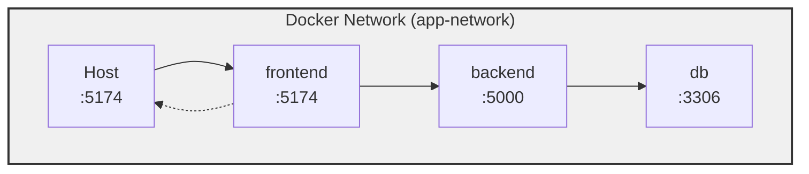
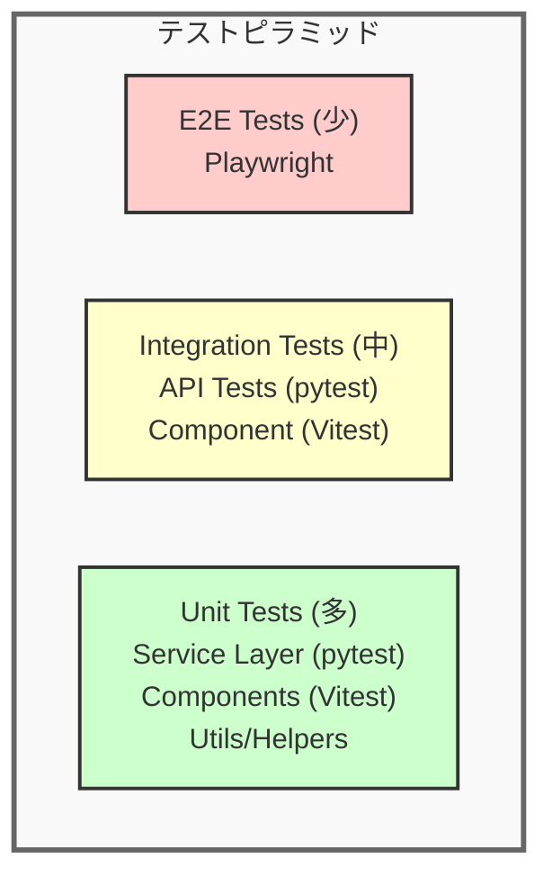
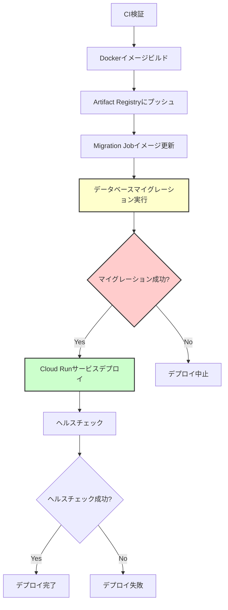

# システム構成設計書

**作成日:** 2025-10-28
**最終更新:** 2025-11-23
**バージョン:** 1.1
**対象システム:** フルスタックWebアプリケーション

---

## 1. システム概要

### 1.1 システムの目的

本システムは、ユーザー認証機能を備えたWebアプリケーションです。ユーザーは安全に認証され、個人のデータを管理できます。

### 1.2 システムの特徴

- **フルスタックモノレポ構成**: フロントエンドとバックエンドを単一リポジトリで管理
- **モダンな技術スタック**: React + TypeScript (フロントエンド)、Flask + SQLAlchemy (バックエンド)
- **セキュアな認証**: JWT トークンによる認証（httpOnly Cookie）
- **Docker による開発環境**: 環境構築を簡素化し、開発者間の環境差異を最小化
- **包括的なロギング**: リクエストトレーシング、パフォーマンス測定、センシティブデータマスキング

**関連ドキュメント:**
- [認証・認可設計書](./02_authentication-authorization.md) - 認証フロー、トークン仕様、セキュリティ対策
- [データベース設計書](./04_database-design.md) - データベーススキーマ、ER図、テーブル定義
- [機能一覧](./03_feature-list.md) - 実装済み機能の一覧
- [ドキュメント構成ガイド](./07_documentation-guide.md) - プロジェクト全体のドキュメント構成

---

## 2. システムアーキテクチャ

### 2.1 全体構成


### 2.2 レイヤー構成

#### フロントエンド層

```
src/
├── pages/              # ページコンポーネント
│   ├── LoginPage.tsx
│   ├── SettingsPage.tsx
│   ├── admin/          # Admin関連ページ
│   │   └── UserManagementPage.tsx
│   └── ...
├── components/         # 再利用可能なUIコンポーネント
│   ├── ui/             # 共有UIコンポーネントライブラリ
│   │   ├── Button.tsx  # 汎用ボタンコンポーネント
│   │   ├── Input.tsx   # フォーム入力コンポーネント
│   │   ├── Alert.tsx   # 通知・エラー表示コンポーネント
│   │   ├── Modal.tsx   # モーダルダイアログコンポーネント
│   │   └── index.ts    # 共通エクスポート (各コンポーネントの再エクスポート)
│   ├── admin/          # Admin固有コンポーネント
│   │   ├── UserCreateForm.tsx
│   │   └── UserList.tsx
│   ├── settings/       # Settings固有コンポーネント
│   │   ├── PasswordChangeForm.tsx
│   │   └── ProfileUpdateForm.tsx
│   ├── TodoForm.tsx
│   ├── TodoList.tsx
│   ├── TodoItem.tsx
│   └── ...
├── contexts/           # React Context (グローバル状態管理)
│   └── AuthContext.tsx
├── hooks/              # カスタムフック
├── lib/                # ユーティリティライブラリ
│   ├── logger.ts       # ロギング
│   └── ...
├── types/              # TypeScript型定義
├── styles/             # CSSファイル
├── App.tsx             # ルートコンポーネント
└── main.tsx            # エントリーポイント
```

#### バックエンド層

```
app/
├── routes/             # APIエンドポイント定義
│   ├── __init__.py     # Blueprintの統合
│   ├── auth_routes.py  # 認証関連エンドポイント
│   └── health.py       # ヘルスチェックエンドポイント
├── services/           # ビジネスロジック
│   └── auth_service.py
├── repositories/       # データアクセス層
│   ├── user_repository.py
│   └── refresh_token_repository.py
├── models/             # SQLAlchemy ORM モデル
│   ├── user.py
│   └── refresh_token.py
├── schemas/            # Pydantic スキーマ (バリデーション)
│   └── auth.py
├── utils/              # ユーティリティ
│   ├── auth_decorator.py  # 認証デコレータ
│   └── password.py        # パスワードハッシュ化
├── database.py         # データベース接続管理
├── logger.py           # ロギング設定
├── limiter.py          # レート制限設定
├── config.py           # 設定管理
└── main.py             # Flaskアプリケーションエントリーポイント
```

### 2.3 フロントエンド デザインシステム

本プロジェクトでは、**Tailwind CSS**ベースの共有UIコンポーネントライブラリを採用しています。

#### コンポーネント一覧

**Button コンポーネント** (`components/ui/Button.tsx`)
- 4種類のvariant: `primary`, `secondary`, `danger`, `success`
- 3種類のsize: `sm`, `md` (44px tap target), `lg`
- loading状態のサポート (スピナー表示)
- fullWidth オプション

**Input コンポーネント** (`components/ui/Input.tsx`)
- ラベル、エラー表示、ヘルパーテキストの統合
- パスワード表示/非表示トグル機能 (アイコン付き)
- Caps Lock 検出と警告表示
- エラー状態の視覚的フィードバック
- 必須フィールドインジケーター (*)

**Alert コンポーネント** (`components/ui/Alert.tsx`)
- 4種類のvariant: `success`, `error`, `warning`, `info`
- カラーコード化されたアイコンと背景
- オプションの閉じるボタン
- オプションの再試行ボタン
- 自動クローズタイマー機能

**Modal コンポーネント** (`components/ui/Modal.tsx`)
- 3種類のsize: `sm`, `md`, `lg`
- 背景ブラー効果
- Escキーで閉じる
- 外側クリックで閉じる (設定可能)
- スクロールロック機能

#### デザイン原則

**アクセシビリティ優先:**
- 最小タップターゲット: 44px (W3C推奨)
- ARIA属性によるスクリーンリーダー対応
- キーボードナビゲーション対応
- フォーカスインジケーター (focus ring)

**カラーパレット:**
- **Primary**: Blue (blue-500, blue-600, blue-700)
- **Danger**: Red (red-500, red-600, red-700)
- **Success**: Emerald (emerald-500, emerald-600)
- **Warning**: Amber (amber-500, amber-600)
- **Neutral**: Slate (slate-50 ~ slate-900)

**レスポンシブデザイン:**
- Tailwindのブレークポイントを使用 (sm, md, lg, xl)
- モバイルファーストアプローチ
- タッチフレンドリーなUI (44px tap target)

**詳細な使用方法とAPI仕様については、[frontend/CLAUDE.md - UI Component Library](../frontend/CLAUDE.md#ui-component-library) を参照してください。**

---

## 3. 技術スタック

### 3.1 フロントエンド

| カテゴリ               | 技術/ライブラリ          | バージョン | 用途                          |
|----------------------|-------------------------|-----------|-------------------------------|
| UI フレームワーク      | React                   | 18.x      | ユーザーインターフェース構築    |
| 言語                  | TypeScript              | 5.x       | 型安全な開発                   |
| ビルドツール          | Vite                    | 7.x       | 高速な開発サーバー・ビルド      |
| ルーティング          | React Router            | 7.x       | SPAのページ遷移管理             |
| 状態管理              | React Context + Hooks   | -         | グローバル状態管理              |
| スタイリング          | Tailwind CSS            | 4.x       | コンポーネントスタイリング       |
| テスト                | Vitest + Testing Library| -         | ユニット・統合テスト            |
| リンター              | ESLint                  | -         | コード品質管理                  |
| フォーマッター        | Prettier                | -         | コード整形                      |

### 3.2 バックエンド

| カテゴリ               | 技術/ライブラリ          | バージョン | 用途                          |
|----------------------|-------------------------|-----------|-------------------------------|
| Web フレームワーク     | Flask                   | 2.3.x     | RESTful API サーバー          |
| 言語                  | Python                  | 3.12      | バックエンドロジック            |
| ORM                   | SQLAlchemy              | 2.x       | データベース操作                |
| バリデーション        | Pydantic                | 2.x       | リクエスト/レスポンス検証       |
| 認証                  | Flask + JWT             | -         | トークンベース認証              |
| パスワードハッシュ    | bcrypt                  | -         | パスワードの安全な保存          |
| テスト                | pytest                  | -         | ユニット・統合テスト            |
| リンター              | flake8 + mypy           | -         | コード品質・型チェック          |
| フォーマッター        | black + isort           | -         | コード整形                      |
| レート制限            | Flask-Limiter           | 3.x       | APIレート制限                  |
| キャッシュ            | Redis                   | 7.x       | レート制限バックエンド          |

### 3.3 データベース

| カテゴリ               | 技術                    | バージョン | 用途                          |
|----------------------|-------------------------|-----------|-------------------------------|
| RDBMS                 | MySQL                   | 8.0       | データ永続化                    |
| ストレージエンジン    | InnoDB                  | -         | トランザクション管理            |
| 文字セット            | UTF8MB4                 | -         | 多言語サポート                  |
| クラウド接続          | Cloud SQL Python Connector | 1.x    | Google Cloud SQL 接続（オプション）|

#### データベース接続方式

バックエンドは2つのデータベース接続方式をサポートしています:

**1. 標準接続（ローカル開発）**
- 直接TCP/IP接続（`mysql+pymysql://` URI）
- ローカルMySQLやDocker環境での開発に使用
- `DATABASE_URL` 環境変数で接続文字列を指定

**2. Cloud SQL Connector（本番環境）**
- Google Cloud SQL 専用の接続ライブラリ
- 以下の機能を提供:
  - **自動SSL/TLS暗号化**: 証明書管理不要
  - **IAM認証サポート**: パスワードなしで認証可能
  - **自動接続プール管理**: 最適な接続管理
  - **自動再接続**: 一時的な障害からの復旧
- Cloud Run、Cloud Functions、GKE での利用を推奨
- `USE_CLOUD_SQL_CONNECTOR=true` で有効化

**接続方式の選択基準:**

| 環境 | 推奨方式 | 理由 |
|------|---------|------|
| ローカル開発 | 標準接続 | シンプルで設定が容易 |
| Docker Compose | 標準接続 | コンテナ間通信が直接的 |
| Cloud Run/Functions | Cloud SQL Connector | IAM認証、自動暗号化 |
| GKE | Cloud SQL Connector | Workload Identity連携 |
| オンプレミス/他クラウド | 標準接続 | Cloud SQL以外のMySQLに対応 |

詳細な設定方法は [開発環境ガイド](./00_development.md#cloud-sql-接続設定本番環境向け) を参照してください。

### 3.4 インフラ・開発環境

| カテゴリ               | 技術/ツール              | バージョン | 用途                          |
|----------------------|-------------------------|-----------|-------------------------------|
| コンテナ化            | Docker                  | -         | 開発環境の標準化                |
| オーケストレーション  | Docker Compose          | -         | マルチコンテナ管理              |
| パッケージマネージャ  | pnpm (frontend)         | -         | フロントエンド依存管理          |
|                      | Poetry (backend)        | -         | バックエンド依存管理            |
| タスクランナー        | GNU Make                | -         | 開発タスクの自動化              |
| バージョン管理        | Git                     | -         | ソースコード管理                |
| CI/CD                 | GitHub Actions          | -         | 自動テスト・デプロイ            |

---

## 4. 開発環境構成

### 4.1 Docker Compose 構成

```yaml
services:
  frontend:
    - Image: node:20-alpine
    - Port: 5174
    - Environment: VITE_API_PROXY=http://backend:5000

  backend:
    - Image: python:3.12-slim
    - Port: 5000
    - Environment: DATABASE_URL, FLASK_ENV

  db:
    - Image: mysql:8.0
    - Port: 3306
    - Volume: mysql-data (永続化)
    - Healthcheck: mysqladmin ping

  redis:
    - Image: redis:7-alpine
    - Port: 6379
    - Volume: redis-data (永続化)
    - Healthcheck: redis-cli ping
    - Purpose: レート制限用キャッシュストア

networks:
  app-network (bridge)
```

### 4.2 ネットワーク構成



**通信フロー:**

1. クライアント → フロントエンド (http://localhost:5174)
2. フロントエンド → バックエンド (http://backend:5000/api/*)
3. バックエンド → データベース (mysql://db:3306/app_db)

### 4.3 環境変数

#### フロントエンド (.env)

```env
VITE_API_PROXY=http://localhost:5000
VITE_LOG_LEVEL=DEBUG
VITE_ENABLE_API_LOGGING=true
```

#### バックエンド (.env)

```env
FLASK_ENV=development
DATABASE_URL=mysql+pymysql://user:password@db:3306/app_db
LOG_LEVEL=DEBUG
LOG_DIR=backend/logs
```

#### Docker Compose (infra/.env.development)

```env
# MySQL（データベース）
MYSQL_ROOT_PASSWORD=example-root-password
MYSQL_DATABASE=app_db
MYSQL_USER=app_user
MYSQL_PASSWORD=example-password

# Redis（レート制限用）
REDIS_HOST=redis
REDIS_PORT=6379
REDIS_PASSWORD=dev-password
RATE_LIMIT_ENABLED=true
```

---

## 5. セキュリティ設計概要

本システムでは複数のセキュリティ対策を実装しています:

- **認証・認可**: JWT トークンベース認証、httpOnly Cookie、トークンローテーション
- **データ保護**: HTTPS通信、CSRF/XSS対策、SQLインジェクション対策、入力バリデーション
- **センシティブデータ管理**: ログマスキング、環境変数による機密情報管理

**詳細仕様:**
認証フロー、トークン仕様、セキュリティ対策の詳細については [認証・認可設計書](./02_authentication-authorization.md) を参照してください。

---

## 6. ログ設計

### 6.1 バックエンドログ

**ロギングシステム:**

- **リクエストトレーシング**: UUID ベースのリクエストID
- **パフォーマンス測定**: リクエスト処理時間の自動記録
- **センシティブデータマスキング**: 自動フィルタリング
- **ログローテーション**: 日次ローテーション、5日間保持

**ログレベル:**

- **DEBUG**: 詳細な実行フロー (開発環境)
- **INFO**: 重要な操作完了、リクエストサマリー
- **WARNING**: バリデーションエラー、ビジネスルール違反
- **ERROR**: 例外、予期しないエラー (スタックトレース付き)

**ログファイル:**

- 場所: `backend/logs/app-YYYY-MM-DD.log`
- フォーマット: 開発環境=テキスト、本番環境=JSON

### 6.2 フロントエンドログ

**ロギングシステム:**

- **環境ベース設定**: 開発=DEBUG、本番=WARN
- **API ロギング**: リクエスト/レスポンスの自動記録（タイミング情報付き）
- **センシティブデータマスキング**: バックエンドと同様のフィルタリング
- **グローバルエラーハンドリング**: 未処理エラーのキャッチとログ記録

**ログレベル:**

- **DEBUG**: API詳細、実行フロー (開発環境のみ)
- **INFO**: ユーザーアクション、状態変更
- **WARN**: 非クリティカルなエラー
- **ERROR**: 致命的なエラー (スタックトレース付き)

---

## 7. 保守性・拡張性

### 7.1 コード品質管理

- **リンター**: ESLint (frontend)、flake8 (backend)
- **型チェック**: TypeScript、mypy
- **フォーマッター**: Prettier (frontend)、black + isort (backend)
- **pre-commit フック**: 自動フォーマット、軽量チェック

### 7.2 テスト戦略



**テストインフラ:**
テスト戦略とインフラの詳細については、[テスト戦略書](./06_testing-strategy.md) を参照してください。

---

## 8. CI/CDパイプライン

本プロジェクトは GitHub Actions を使用した自動化されたCI/CDパイプラインを実装しています。

### 8.1 ワークフロー構成

プロジェクトには4つのGitHub Actionsワークフローがあります:

#### 1. CI Workflow (`.github/workflows/ci.yml`)

**トリガー:**
- Pull Request作成・更新時
- 手動実行（workflow_dispatch）
- 他のワークフローから呼び出し可能（workflow_call）

**ジョブ:**
1. **Setup**: 依存関係のキャッシュウォームアップ
2. **Lint**: コード品質チェック（ESLint, flake8, mypy）- 並列実行
3. **Test**: ユニット・統合テスト（Vitest, pytest）- 並列実行、カバレッジレポート付き

**目的**: プルリクエストの品質を自動検証し、マージ前に問題を検出

#### 2. Terraform Workflow (`.github/workflows/terraform.yml`)

**トリガー:**
- `main`ブランチへのプッシュ（`infra/terraform/**`変更時）
- Pull Request（Terraform変更時）
- 手動実行

**プロビジョニングリソース:**
- Cloud SQL（MySQL 8.0インスタンス）
- Cloud Run（アプリケーションサービス + マイグレーションジョブ）
- VPC・ネットワーク設定
- Redis（Memorystore）
- Artifact Registry

**機能:**
- Pull Request時: `terraform plan`の結果をPRにコメント
- `main`へのマージ時: `terraform apply`を自動実行

#### 3. Deploy Workflow (`.github/workflows/deploy.yml`)

**トリガー:**
- `main`ブランチへのプッシュ
- 手動実行

**デプロイフロー:**



**ジョブ詳細:**

1. **CI検証** (reusable workflow)
   - Lint・テストを再実行してコードの健全性を確認

2. **Terraformアウトプット取得**
   - インフラ情報（Cloud SQL接続名、Cloud Runサービス名など）を取得

3. **バックエンドデプロイ** ⭐ **マイグレーション自動化**
   ```yaml
   # Dockerイメージビルド・プッシュ
   - Build and push Docker image

   # マイグレーションジョブ更新
   - Update Migration Job Image
     → 新しいイメージをマイグレーションジョブに設定

   # マイグレーション実行（ブロッキング）
   - Run Database Migrations
     → gcloud run jobs execute --wait
     → 失敗時はデプロイ中止

   # アプリケーションデプロイ
   - Deploy to Cloud Run
     → マイグレーション成功後のみ実行

   # ヘルスチェック
   - Health check validation
   ```

#### 4. Terraform Unlock Workflow (`.github/workflows/terraform-unlock.yml`)

**目的**: Terraformステートロックの手動解除用ユーティリティ

### 8.2 データベースマイグレーション自動化

#### マイグレーションインフラ

**Cloud Run Job** (`infra/terraform/cloud-run-job.tf`):
```hcl
resource "google_cloud_run_v2_job" "db_migrate" {
  name     = "${var.app_name}-db-migrate"
  location = var.gcp_region

  template {
    containers {
      command = ["/bin/bash"]
      args    = ["scripts/run_migrations.sh"]
      # Cloud SQL接続用の環境変数
    }
  }
}
```

**特徴:**
- 専用のCloud Run Jobとして実行
- パスワードベースの管理ユーザーで接続（全権限）
- Cloud SQL Connectorによる安全な接続
- プライベートVPCアクセス
- タイムアウト: 5分
- リソース: 1 CPU, 512Mi メモリ

#### マイグレーション実行フロー

**スクリプト**: `backend/scripts/run_migrations.sh`

```bash
# Step 1: テーブル作成
python scripts/create_tables.py
  → SQLAlchemy Base.metadata.create_all()
  → 存在しないテーブルのみ作成（べき等）

# Step 2: SQLマイグレーション適用 ⭐
python scripts/apply_sql_migrations.py
  → infra/mysql/migrations/*.sql を読み込み
  → schema_migrations テーブルで適用履歴を追跡
  → 未適用のマイグレーションを順番に実行
  → チェックサム検証で整合性を保証

# Step 3: IAM権限付与
  → Cloud Run サービスアカウントに権限付与
  → IAM認証を有効化
```

#### マイグレーション追跡

**テーブル**: `schema_migrations`

| カラム | 型 | 説明 |
|--------|-----|------|
| id | BIGINT | 主キー |
| filename | VARCHAR(255) | マイグレーションファイル名 |
| checksum | VARCHAR(64) | SHA256ハッシュ（整合性検証用） |
| applied_at | TIMESTAMP | 適用日時 |

**機能:**
- 適用済みマイグレーションを記録
- 重複実行を防止（べき等性）
- ファイル変更を検出（チェックサム比較）

#### デプロイ順序の重要性

マイグレーションは**アプリケーションデプロイより前**に実行されます:

1. **マイグレーション実行** (`--wait`フラグでブロック)
2. **マイグレーション成功** → アプリケーションデプロイ
3. **マイグレーション失敗** → **デプロイ中止**

これにより、スキーマとアプリケーションの不整合を防ぎます。

### 8.3 マイグレーション管理のベストプラクティス

#### ローカル開発

```bash
# マイグレーションファイル作成
vim infra/mysql/migrations/002_add_new_column.sql

# ローカルでテスト
poetry -C backend run python scripts/apply_sql_migrations.py

# 動作確認
poetry -C backend run pytest
```

#### CI/CD環境

- **自動適用**: `main`へのマージ時に自動実行
- **失敗時の挙動**: デプロイが中止され、アプリケーションは変更されない
- **ロールバック**: 手動で実施（ダウンマイグレーションスクリプトは未実装）

#### 注意事項

1. **マイグレーションファイルは不変**
   - 一度適用したファイルは変更しない
   - 新しい変更は新しいファイルとして作成

2. **連番管理**
   - ファイル名に連番を使用（`001_`, `002_`, ...）
   - アルファベット順で実行される

3. **破壊的変更**
   - ALTER TABLE DROP COLUMNなどは慎重に
   - バックアップ取得を推奨

4. **テスト**
   - ローカル環境で必ずテスト
   - ステージング環境があればそこでも検証

### 8.4 CI/CD環境変数

デプロイワークフローで使用される主な環境変数:

| 環境変数 | 説明 | ソース |
|---------|------|--------|
| `CLOUDSQL_INSTANCE` | Cloud SQLインスタンス名 | Terraform outputs |
| `DB_USER` | データベース管理ユーザー | GitHub Secrets |
| `DB_PASS` | データベースパスワード | GitHub Secrets |
| `DB_NAME` | データベース名 | Terraform outputs |
| `IAM_USER_EMAIL` | IAMサービスアカウント | Terraform outputs |
| `CLOUDSQL_IP_TYPE` | 接続タイプ（PRIVATE/PUBLIC） | 固定値: PRIVATE |

### 8.5 セキュリティ

**マイグレーションジョブ:**
- プライベートVPC経由でCloud SQLに接続
- Cloud SQL Connectorによる自動SSL/TLS暗号化
- 管理者パスワードはGitHub Secretsで管理
- 実行ログにセンシティブ情報をマスキング

**アプリケーションサービス:**
- IAM認証を使用（パスワード不要）
- Cloud SQL Proxyは使用せず、Connectorを利用
- サービスアカウントに最小限の権限

---

## 9. 付録

### 9.1 開発コマンド一覧

```bash
# 環境構築
make install              # 依存関係インストール
make setup                # 完全セットアップ

# 開発
make up                   # Docker コンテナ起動
make down                 # Docker コンテナ停止

# テスト
make test                 # 全テスト実行

# コード品質
make lint                 # リンター実行
make format               # フォーマッター実行
make pre-commit-run       # pre-commit 実行

# データベース
make db-init              # テーブル作成
make db-reset             # データベースリセット
make db-create-user       # テストユーザー作成
```

### 9.2 参考資料

- [React Documentation](https://react.dev/)
- [Flask Documentation](https://flask.palletsprojects.com/)
- [SQLAlchemy Documentation](https://docs.sqlalchemy.org/)
- [Pydantic Documentation](https://docs.pydantic.dev/)
- [MySQL Documentation](https://dev.mysql.com/doc/)
- [Docker Documentation](https://docs.docker.com/)

---

**END OF DOCUMENT**
