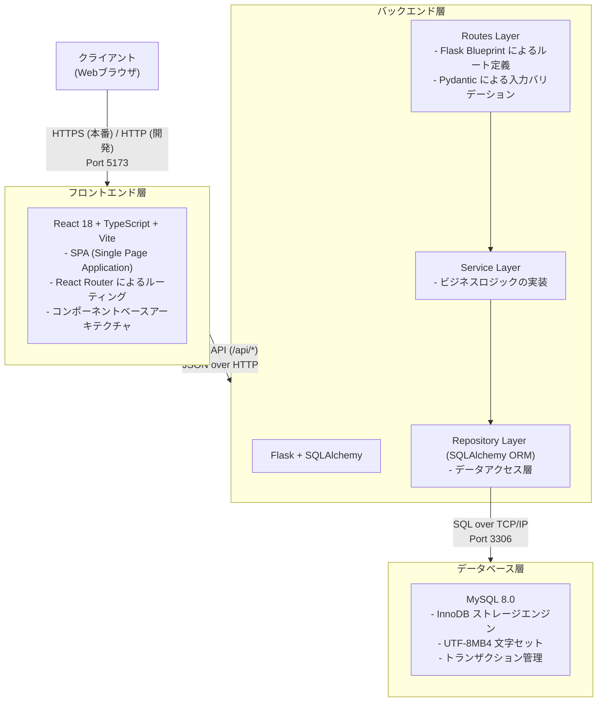
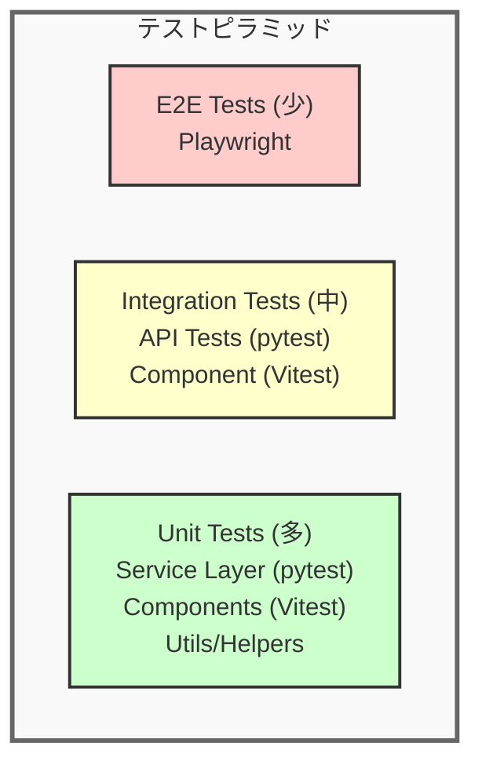

# システム構成設計書

**作成日:** 2025-10-28
**バージョン:** 1.0
**対象システム:** TODO アプリケーション

---

## 1. システム概要

### 1.1 システムの目的

本システムは、ユーザー認証機能を備えたTODO管理アプリケーションです。ユーザーは個人のTODOリストを作成・管理でき、期限設定や完了状態の管理が可能です。

### 1.2 システムの特徴

- **フルスタックモノレポ構成**: フロントエンドとバックエンドを単一リポジトリで管理
- **モダンな技術スタック**: React + TypeScript (フロントエンド)、Flask + SQLAlchemy (バックエンド)
- **セキュアな認証**: JWT トークンによる認証（httpOnly Cookie）
- **Docker による開発環境**: 環境構築を簡素化し、開発者間の環境差異を最小化
- **包括的なロギング**: リクエストトレーシング、パフォーマンス測定、センシティブデータマスキング

**関連ドキュメント:**
- [認証・認可設計書](./02_authentication-authorization.md) - 認証フロー、トークン仕様、セキュリティ対策
- [データベース設計書](./04_database-design.md) - データベーススキーマ、ER図、テーブル定義
- [機能一覧](./03_feature-list.md) - 実装済み機能の一覧
- [ドキュメント構成ガイド](./07_documentation-guide.md) - プロジェクト全体のドキュメント構成

---

## 2. システムアーキテクチャ

### 2.1 全体構成



### 2.2 レイヤー構成

#### フロントエンド層

```
src/
├── pages/              # ページコンポーネント
│   ├── LoginPage.tsx
│   ├── TodoListPage.tsx
│   └── ...
├── components/         # 再利用可能なUIコンポーネント
│   ├── TodoForm.tsx
│   ├── TodoList.tsx
│   ├── TodoItem.tsx
│   └── ...
├── contexts/           # React Context (グローバル状態管理)
│   └── AuthContext.tsx
├── hooks/              # カスタムフック
├── lib/                # ユーティリティライブラリ
│   ├── logger.ts       # ロギング
│   └── ...
├── types/              # TypeScript型定義
├── styles/             # CSSファイル
├── App.tsx             # ルートコンポーネント
└── main.tsx            # エントリーポイント
```

#### バックエンド層

```
app/
├── routes/             # APIエンドポイント定義
│   ├── __init__.py     # Blueprintの統合
│   ├── auth_routes.py  # 認証関連エンドポイント
│   ├── todo_routes.py  # TODO関連エンドポイント
│   └── health.py       # ヘルスチェックエンドポイント
├── services/           # ビジネスロジック
│   ├── auth_service.py
│   └── todo_service.py
├── repositories/       # データアクセス層
│   ├── user_repository.py
│   ├── todo_repository.py
│   └── refresh_token_repository.py
├── models/             # SQLAlchemy ORM モデル
│   ├── user.py
│   ├── todo.py
│   └── refresh_token.py
├── schemas/            # Pydantic スキーマ (バリデーション)
│   ├── auth.py
│   └── todo.py
├── utils/              # ユーティリティ
│   ├── auth_decorator.py  # 認証デコレータ
│   └── password.py        # パスワードハッシュ化
├── database.py         # データベース接続管理
├── logger.py           # ロギング設定
├── limiter.py          # レート制限設定
├── config.py           # 設定管理
└── main.py             # Flaskアプリケーションエントリーポイント
```

---

## 3. 技術スタック

### 3.1 フロントエンド

| カテゴリ               | 技術/ライブラリ          | バージョン | 用途                          |
|----------------------|-------------------------|-----------|-------------------------------|
| UI フレームワーク      | React                   | 18.x      | ユーザーインターフェース構築    |
| 言語                  | TypeScript              | 5.x       | 型安全な開発                   |
| ビルドツール          | Vite                    | 7.x       | 高速な開発サーバー・ビルド      |
| ルーティング          | React Router            | 7.x       | SPAのページ遷移管理             |
| 状態管理              | React Context + Hooks   | -         | グローバル状態管理              |
| スタイリング          | CSS                     | -         | コンポーネントスタイリング       |
| テスト                | Vitest + Testing Library| -         | ユニット・統合テスト            |
| リンター              | ESLint                  | -         | コード品質管理                  |
| フォーマッター        | Prettier                | -         | コード整形                      |

### 3.2 バックエンド

| カテゴリ               | 技術/ライブラリ          | バージョン | 用途                          |
|----------------------|-------------------------|-----------|-------------------------------|
| Web フレームワーク     | Flask                   | 2.3.x     | RESTful API サーバー          |
| 言語                  | Python                  | 3.12      | バックエンドロジック            |
| ORM                   | SQLAlchemy              | 2.x       | データベース操作                |
| バリデーション        | Pydantic                | 2.x       | リクエスト/レスポンス検証       |
| 認証                  | Flask + JWT             | -         | トークンベース認証              |
| パスワードハッシュ    | bcrypt                  | -         | パスワードの安全な保存          |
| テスト                | pytest                  | -         | ユニット・統合テスト            |
| リンター              | flake8 + mypy           | -         | コード品質・型チェック          |
| フォーマッター        | black + isort           | -         | コード整形                      |
| レート制限            | Flask-Limiter           | 3.x       | APIレート制限                  |
| キャッシュ            | Redis                   | 7.x       | レート制限バックエンド          |

### 3.3 データベース

| カテゴリ               | 技術                    | バージョン | 用途                          |
|----------------------|-------------------------|-----------|-------------------------------|
| RDBMS                 | MySQL                   | 8.0       | データ永続化                    |
| ストレージエンジン    | InnoDB                  | -         | トランザクション管理            |
| 文字セット            | UTF8MB4                 | -         | 多言語サポート                  |
| クラウド接続          | Cloud SQL Python Connector | 1.x    | Google Cloud SQL 接続（オプション）|

#### データベース接続方式

バックエンドは2つのデータベース接続方式をサポートしています:

**1. 標準接続（ローカル開発）**
- 直接TCP/IP接続（`mysql+pymysql://` URI）
- ローカルMySQLやDocker環境での開発に使用
- `DATABASE_URL` 環境変数で接続文字列を指定

**2. Cloud SQL Connector（本番環境）**
- Google Cloud SQL 専用の接続ライブラリ
- 以下の機能を提供:
  - **自動SSL/TLS暗号化**: 証明書管理不要
  - **IAM認証サポート**: パスワードなしで認証可能
  - **自動接続プール管理**: 最適な接続管理
  - **自動再接続**: 一時的な障害からの復旧
- Cloud Run、Cloud Functions、GKE での利用を推奨
- `USE_CLOUD_SQL_CONNECTOR=true` で有効化

**接続方式の選択基準:**

| 環境 | 推奨方式 | 理由 |
|------|---------|------|
| ローカル開発 | 標準接続 | シンプルで設定が容易 |
| Docker Compose | 標準接続 | コンテナ間通信が直接的 |
| Cloud Run/Functions | Cloud SQL Connector | IAM認証、自動暗号化 |
| GKE | Cloud SQL Connector | Workload Identity連携 |
| オンプレミス/他クラウド | 標準接続 | Cloud SQL以外のMySQLに対応 |

詳細な設定方法は [開発環境ガイド](./00_development.md#cloud-sql-接続設定本番環境向け) を参照してください。

### 3.4 インフラ・開発環境

| カテゴリ               | 技術/ツール              | バージョン | 用途                          |
|----------------------|-------------------------|-----------|-------------------------------|
| コンテナ化            | Docker                  | -         | 開発環境の標準化                |
| オーケストレーション  | Docker Compose          | -         | マルチコンテナ管理              |
| パッケージマネージャ  | pnpm (frontend)         | -         | フロントエンド依存管理          |
|                      | Poetry (backend)        | -         | バックエンド依存管理            |
| タスクランナー        | GNU Make                | -         | 開発タスクの自動化              |
| バージョン管理        | Git                     | -         | ソースコード管理                |
| CI/CD                 | GitHub Actions          | -         | 自動テスト・デプロイ            |

---

## 4. 開発環境構成

### 4.1 Docker Compose 構成

```yaml
services:
  frontend:
    - Image: node:20-alpine
    - Port: 5173
    - Environment: VITE_API_PROXY=http://backend:5000

  backend:
    - Image: python:3.12-slim
    - Port: 5000
    - Environment: DATABASE_URL, FLASK_ENV

  db:
    - Image: mysql:8.0
    - Port: 3306
    - Volume: mysql-data (永続化)
    - Healthcheck: mysqladmin ping

  redis:
    - Image: redis:7-alpine
    - Port: 6379
    - Volume: redis-data (永続化)
    - Healthcheck: redis-cli ping
    - Purpose: レート制限用キャッシュストア

networks:
  app-network (bridge)
```

### 4.2 ネットワーク構成


**通信フロー:**

1. クライアント → フロントエンド (http://localhost:5173)
2. フロントエンド → バックエンド (http://backend:5000/api/*)
3. バックエンド → データベース (mysql://db:3306/app_db)

### 4.3 環境変数

#### フロントエンド (.env)

```env
VITE_API_PROXY=http://localhost:5000
VITE_LOG_LEVEL=DEBUG
VITE_ENABLE_API_LOGGING=true
```

#### バックエンド (.env)

```env
FLASK_ENV=development
DATABASE_URL=mysql+pymysql://user:password@db:3306/app_db
LOG_LEVEL=DEBUG
LOG_DIR=backend/logs
```

#### Docker Compose (infra/.env.development)

```env
# MySQL（データベース）
MYSQL_ROOT_PASSWORD=example-root-password
MYSQL_DATABASE=app_db
MYSQL_USER=app_user
MYSQL_PASSWORD=example-password

# Redis（レート制限用）
REDIS_HOST=redis
REDIS_PORT=6379
REDIS_PASSWORD=dev-password
RATE_LIMIT_ENABLED=true
```

---

## 5. セキュリティ設計概要

本システムでは複数のセキュリティ対策を実装しています:

- **認証・認可**: JWT トークンベース認証、httpOnly Cookie、トークンローテーション
- **データ保護**: HTTPS通信、CSRF/XSS対策、SQLインジェクション対策、入力バリデーション
- **センシティブデータ管理**: ログマスキング、環境変数による機密情報管理

**詳細仕様:**
認証フロー、トークン仕様、セキュリティ対策の詳細については [認証・認可設計書](./02_authentication-authorization.md) を参照してください。

---

## 6. ログ設計

### 6.1 バックエンドログ

**ロギングシステム:**

- **リクエストトレーシング**: UUID ベースのリクエストID
- **パフォーマンス測定**: リクエスト処理時間の自動記録
- **センシティブデータマスキング**: 自動フィルタリング
- **ログローテーション**: 日次ローテーション、5日間保持

**ログレベル:**

- **DEBUG**: 詳細な実行フロー (開発環境)
- **INFO**: 重要な操作完了、リクエストサマリー
- **WARNING**: バリデーションエラー、ビジネスルール違反
- **ERROR**: 例外、予期しないエラー (スタックトレース付き)

**ログファイル:**

- 場所: `backend/logs/app-YYYY-MM-DD.log`
- フォーマット: 開発環境=テキスト、本番環境=JSON

### 6.2 フロントエンドログ

**ロギングシステム:**

- **環境ベース設定**: 開発=DEBUG、本番=WARN
- **API ロギング**: リクエスト/レスポンスの自動記録（タイミング情報付き）
- **センシティブデータマスキング**: バックエンドと同様のフィルタリング
- **グローバルエラーハンドリング**: 未処理エラーのキャッチとログ記録

**ログレベル:**

- **DEBUG**: API詳細、実行フロー (開発環境のみ)
- **INFO**: ユーザーアクション、状態変更
- **WARN**: 非クリティカルなエラー
- **ERROR**: 致命的なエラー (スタックトレース付き)

---

## 7. 保守性・拡張性

### 7.1 コード品質管理

- **リンター**: ESLint (frontend)、flake8 (backend)
- **型チェック**: TypeScript、mypy
- **フォーマッター**: Prettier (frontend)、black + isort (backend)
- **pre-commit フック**: 自動フォーマット、軽量チェック

### 7.2 テスト戦略



**テストインフラ:**
テスト戦略とインフラの詳細については、[テスト戦略書](./06_testing-strategy.md) を参照してください。

---

## 8. 付録

### 8.1 開発コマンド一覧

```bash
# 環境構築
make install              # 依存関係インストール
make setup                # 完全セットアップ

# 開発
make up                   # Docker コンテナ起動
make down                 # Docker コンテナ停止

# テスト
make test                 # 全テスト実行

# コード品質
make lint                 # リンター実行
make format               # フォーマッター実行
make pre-commit-run       # pre-commit 実行

# データベース
make db-init              # テーブル作成
make db-reset             # データベースリセット
make db-create-user       # テストユーザー作成
```

### 8.2 参考資料

- [React Documentation](https://react.dev/)
- [Flask Documentation](https://flask.palletsprojects.com/)
- [SQLAlchemy Documentation](https://docs.sqlalchemy.org/)
- [Pydantic Documentation](https://docs.pydantic.dev/)
- [MySQL Documentation](https://dev.mysql.com/doc/)
- [Docker Documentation](https://docs.docker.com/)

---

**END OF DOCUMENT**
