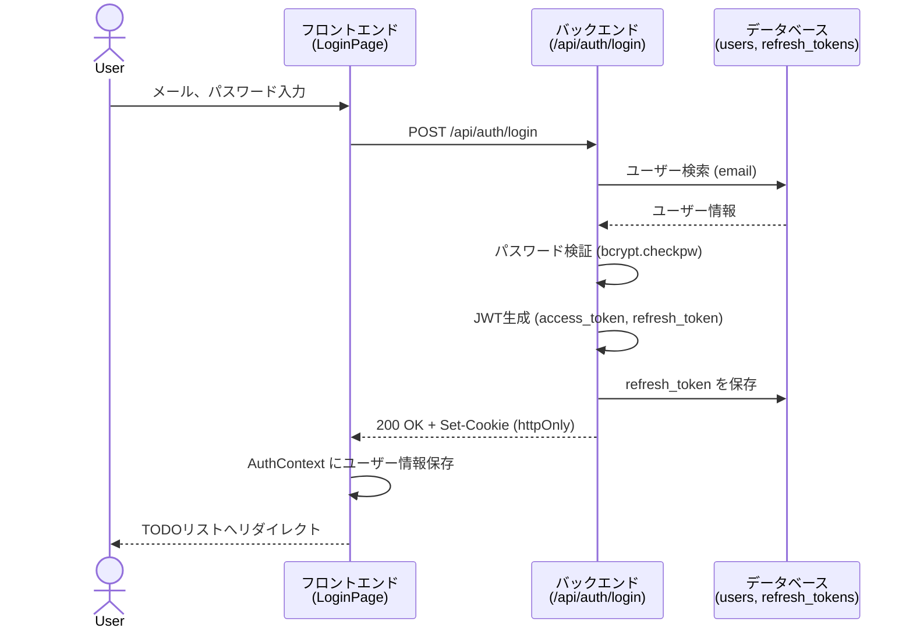
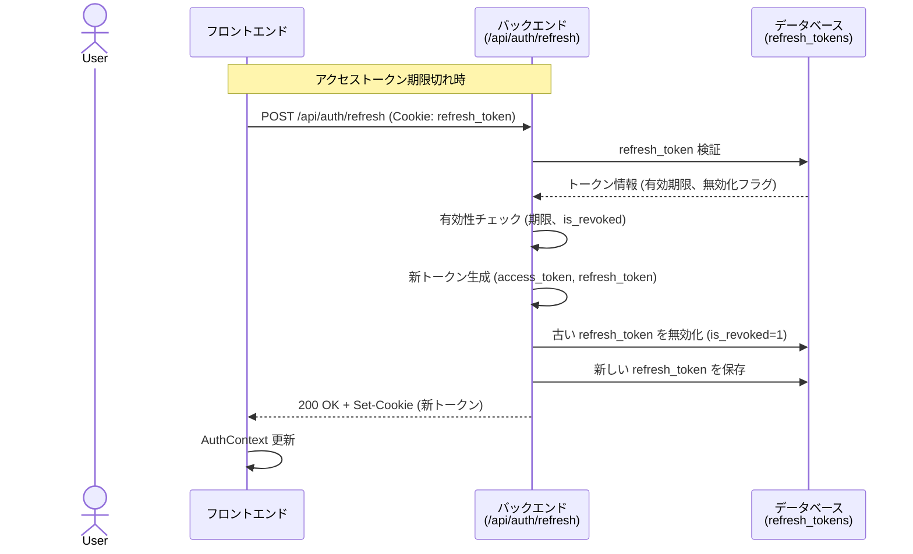
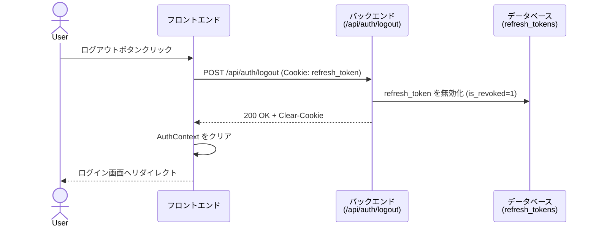

# 認証・認可設計書

**作成日:** 2025-10-28
**最終更新:** 2025-11-23
**バージョン:** 1.1
**対象システム:** フルスタックWebアプリケーション

---

## 1. 概要

本ドキュメントでは、フルスタックWebアプリケーションにおける認証・認可の仕組みを説明します。

### 1.1 認証方式

| 項目 | 内容 |
|------|------|
| **認証方式** | JWT (JSON Web Token) ベース認証 |
| **トークン管理** | httpOnly Cookie によるセキュアな管理 |
| **トークン種類** | アクセストークン + リフレッシュトークン |
| **パスワード管理** | bcrypt によるハッシュ化 (コスト係数: デフォルト 12) |

### 1.2 主要な特徴

- **セキュア**: httpOnly Cookie により XSS 攻撃を防止
- **ステートレス**: JWT による状態を持たない認証
- **トークンローテーション**: リフレッシュトークンによる定期的なトークン更新
- **トークン無効化**: ログアウト時のリフレッシュトークン無効化

**関連ドキュメント:**
- [機能一覧](./03_feature-list.md) - 全機能の概要
- [データベース設計書](./04_database-design.md) - users, refresh_tokens テーブル定義

---

## 2. 認証フロー

### 2.1 ログインフロー



**処理ステップ:**

| ステップ | 処理内容 |
|---------|---------|
| 1. 入力検証 | - メールアドレス形式チェック<br/>- パスワード検証:<br/>  - 最低8文字<br/>  - 英字と数字の両方を含む必要あり |
| 2. ユーザー検索 | データベースから email でユーザーを検索 |
| 3. パスワード検証 | bcrypt.checkpw でハッシュと比較 |
| 4. トークン生成 | access_token (1日), refresh_token (7日) を生成 |
| 5. トークン保存 | refresh_token をデータベースに保存 |
| 6. Cookie設定 | httpOnly Cookie に両トークンを設定 |

---

### 2.2 トークン更新フロー



**トークンローテーション:**

| ステップ | 処理内容 |
|---------|---------|
| 1. トークン取得 | Cookie から refresh_token を取得 |
| 2. 検証 | 期限チェック、無効化フラグチェック |
| 3. 新トークン生成 | 新しい access_token と refresh_token を生成 |
| 4. 旧トークン無効化 | 古い refresh_token の is_revoked を 1 に設定 |
| 5. 新トークン保存 | 新しい refresh_token をデータベースに保存 |
| 6. Cookie更新 | 新トークンを httpOnly Cookie に設定 |

---

### 2.3 ログアウトフロー



**処理ステップ:**

| ステップ | 処理内容 |
|---------|---------|
| 1. トークン取得 | Cookie から refresh_token を取得 |
| 2. トークン無効化 | データベースの is_revoked を 1 に設定 |
| 3. Cookie削除 | access_token と refresh_token の Cookie を削除 (max_age=0) |
| 4. 状態クリア | フロントエンドの AuthContext をクリア |

---

## 3. トークン仕様

### 3.1 アクセストークン (access_token)

| 項目 | 内容 |
|------|------|
| **有効期限** | 1日 (1440分) |
| **保存場所** | httpOnly Cookie (path: /api) |
| **用途** | API リクエストの認証 |
| **ペイロード** | `{user_id: number, email: string, role: string, exp: timestamp}` |
| **検証方法** | `@require_auth` デコレータで自動検証 |

### 3.2 リフレッシュトークン (refresh_token)

| 項目 | 内容 |
|------|------|
| **有効期限** | 7日 (168時間) |
| **保存場所** | httpOnly Cookie (path: /api) + データベース (refresh_tokens テーブル) |
| **用途** | アクセストークンの更新 |
| **ペイロード** | `{user_id: number, jti: string, exp: timestamp}` |
| **無効化** | ログアウト時またはトークン更新時 (is_revoked=1) |

### 3.3 Cookie 設定

| 属性 | 開発環境 | 本番環境 | 説明 |
|------|---------|---------|------|
| **httpOnly** | ✓ | ✓ | JavaScript からアクセス不可 (XSS 対策) |
| **secure** | ✗ | ✓ | HTTPS のみ送信 |
| **sameSite** | Lax | Lax | CSRF 攻撃緩和 |
| **path** | /api | /api | API エンドポイントのみ送信 |
| **domain** | (未設定) | (設定可能) | Cookie の有効ドメイン |

**環境変数:**
- `JWT_SECRET_KEY`: JWT 署名用の秘密鍵（本番環境では必ず変更すること）
- `JWT_ALGORITHM`: JWT アルゴリズム（デフォルト: HS256）
- `ACCESS_TOKEN_EXPIRE_MINUTES`: アクセストークン有効期限 (分、デフォルト: 1440)
- `REFRESH_TOKEN_EXPIRE_DAYS`: リフレッシュトークン有効期限 (日、デフォルト: 7)
- `COOKIE_SECURE`: "true" で secure 属性を有効化（本番環境推奨）
- `COOKIE_DOMAIN`: Cookie のドメイン指定

---

## 4. セキュリティ対策

### 4.1 攻撃対策一覧

| 攻撃種類 | 対策 | 実装箇所 |
|---------|------|---------|
| **XSS (Cross-Site Scripting)** | - httpOnly Cookie (JavaScript アクセス不可)<br/>- 入力サニタイズ | BE: `auth_routes.py`<br/>FE: React自動エスケープ |
| **CSRF (Cross-Site Request Forgery)** | - SameSite=Lax Cookie 属性<br/>- Origin/Referer チェック (将来的) | BE: Cookie設定 |
| **SQL インジェクション** | - SQLAlchemy ORM のパラメータ化クエリ<br/>- プリペアドステートメント | BE: `repositories/` |
| **ブルートフォース攻撃** | - bcrypt による遅いハッシュ化 (コスト: デフォルト 12)<br/>- レート制限 (実装済み: Flask-Limiter + Redis) | BE: `utils/password.py`, `limiter.py` |
| **トークン盗聴** | - HTTPS による通信暗号化 (本番環境)<br/>- Secure Cookie 属性 | Infra設定 |
| **トークン再利用** | - トークンローテーション<br/>- 使用済みトークンの無効化 | BE: `auth_service.py` |

### 4.2 パスワードセキュリティ

| 項目 | 仕様 |
|------|------|
| **ハッシュアルゴリズム** | bcrypt |
| **コスト係数** | デフォルト 12 (2^12 = 4096 ラウンド) |
| **ソルト** | bcrypt が自動生成 (ハッシュに含まれる) |
| **検証方法** | `bcrypt.checkpw(password, hashed_password)` |
| **実装箇所** | `backend/app/utils/password.py` |

**ハッシュ化例:**
```
入力: password123
出力: $2b$12$KIXxWj3YbZ8l.7vQJ5P7E.M5VZqN8p3xQl1nJ8W2hK9rL4mO6pT7u
```

### 4.3 センシティブデータ保護

| データ種類 | 保護方法 |
|-----------|---------|
| **パスワード** | - データベースにはハッシュのみ保存<br/>- ログからマスキング (`***`) |
| **トークン** | - httpOnly Cookie で保存<br/>- ログからマスキング (`***`) |
| **API キー** | - 環境変数で管理 (`.env` ファイル)<br/>- `.gitignore` でバージョン管理除外 |
| **データベース接続情報** | - 環境変数で管理<br/>- ログでURIマスキング (`user:***@host`) |

**ログマスキング実装:**
- バックエンド: `backend/app/logger.py` - `SensitiveDataFilter`
- フロントエンド: `frontend/src/lib/logger.ts` - `maskSensitiveData()`

---

## 5. 認証 API 仕様

### 5.1 エンドポイント一覧

| メソッド | エンドポイント | 認証 | 説明 | 実装箇所 |
|---------|--------------|------|------|---------|
| POST | `/api/auth/login` | 不要 | ログイン | BE: `auth_routes.py` |
| POST | `/api/auth/logout` | 不要 | ログアウト | BE: `auth_routes.py` |
| POST | `/api/auth/refresh` | 不要 | トークン更新 | BE: `auth_routes.py` |

### 5.2 ログイン API

**リクエスト:**
```json
POST /api/auth/login
Content-Type: application/json

{
  "email": "user@example.com",
  "password": "password123"
}
```

**パスワード要件:**
- 最低8文字
- 英字（a-z, A-Z）と数字（0-9）の両方を含むこと

**実装箇所:** `backend/app/schemas/auth.py`

**レスポンス:**
```json
200 OK
Set-Cookie: access_token=...; HttpOnly; SameSite=Lax; Path=/api; Max-Age=86400
Set-Cookie: refresh_token=...; HttpOnly; SameSite=Lax; Path=/api; Max-Age=604800

{
  "user": {
    "id": 1,
    "email": "user@example.com",
    "role": "user",
    "name": null,
    "created_at": "2025-10-28T12:34:56.789012"
  }
}
```

**エラー:**
- `400`: バリデーションエラー (メール形式不正、パスワード未入力)
- `401`: 認証失敗 (ユーザー不存在、パスワード不一致)
- `500`: サーバーエラー

### 5.3 トークン更新 API

**リクエスト:**
```json
POST /api/auth/refresh
Cookie: refresh_token=...
```

**レスポンス:**
```json
200 OK
Set-Cookie: access_token=...; HttpOnly; SameSite=Lax; Path=/api; Max-Age=86400
Set-Cookie: refresh_token=...; HttpOnly; SameSite=Lax; Path=/api; Max-Age=604800

{
  "message": "トークンを更新しました",
  "user": {
    "id": 1,
    "email": "user@example.com",
    "role": "user",
    "name": null,
    "created_at": "2025-10-28T12:34:56.789012"
  }
}
```

**エラー:**
- `401`: トークン未提供、期限切れ、無効化済み
- `500`: サーバーエラー

### 5.4 ログアウト API

**リクエスト:**
```json
POST /api/auth/logout
Cookie: refresh_token=...
```

**レスポンス:**
```json
200 OK
Set-Cookie: access_token=; HttpOnly; SameSite=Lax; Path=/api; Max-Age=0
Set-Cookie: refresh_token=; HttpOnly; SameSite=Lax; Path=/api; Max-Age=0

{
  "message": "ログアウトしました"
}
```

### 5.5 レート制限

全ての認証エンドポイントにレート制限が適用されています。

| エンドポイント | 制限 | 超過時のレスポンス |
|--------------|------|------------------|
| `POST /api/auth/login` | 10リクエスト/分 | 429 Too Many Requests |
| `POST /api/auth/refresh` | 30リクエスト/分 | 429 Too Many Requests |
| `POST /api/auth/logout` | 20リクエスト/分 | 429 Too Many Requests |

**レート制限超過時のレスポンス例:**
```json
429 Too Many Requests

{
  "error": "Too Many Requests"
}
```

**実装:** `backend/app/limiter.py` でFlask-Limiterを使用してRedisバックエンドで制限を管理しています。

---

## 6. 認可 (Authorization)

### 6.1 ユーザーロール別機能アクセス

| 機能 | 未認証ユーザー | 認証済みユーザー |
|------|-------------|---------------|
| ログイン | ✓ | - |
| ログアウト | - | ✓ |
| TODO一覧閲覧 | - | ✓ (自分のTODOのみ) |
| TODO作成 | - | ✓ |
| TODO編集 | - | ✓ (自分のTODOのみ) |
| TODO削除 | - | ✓ (自分のTODOのみ) |
| TODO完了トグル | - | ✓ (自分のTODOのみ) |

**注:** 未認証ユーザーが保護されたルートにアクセスすると、自動的にログインページにリダイレクトされます。

### 6.2 認可の実装

**バックエンド:**
- `@require_auth` デコレータで認証必須チェック (`backend/app/utils/auth_decorator.py`)
- ユーザーID は JWT トークンから取得 (`g.user_id`)
- ユーザー別データ取得時に `user_id` でフィルタ

**フロントエンド:**
- `ProtectedRoute` コンポーネントで認証チェック (`frontend/src/components/ProtectedRoute.tsx`)
- 未認証時は `/login` へリダイレクト
- `AuthContext` でユーザー情報を管理

### 6.3 セキュリティテストカバレッジ

認証・認可機能の包括的なテストカバレッジについては、[テスト戦略書 - 5. 認証・認可の包括的なテストカバレッジ](./06_testing-strategy.md#5-認証認可の包括的なテストカバレッジ) を参照してください。

**主なテストカテゴリ:**
- クロスユーザーアクセス制御テスト（ユーザー間データ隔離）
- 認証要件テスト（未認証アクセス拒否）
- トークンセキュリティテスト（JWT改ざん検出、有効期限検証）
- 認証フローテスト（ログイン、トークンリフレッシュ、ログアウト）
- 認証サービス層テスト（トークン生成・検証ロジック）

---

## 7. データベーススキーマ

認証・認可に関連するテーブル定義（users、refresh_tokens）の詳細については [データベース設計書](./04_database-design.md) を参照してください。

**関連テーブル:**
- `users` テーブル: ユーザー情報、パスワードハッシュ
- `refresh_tokens` テーブル: リフレッシュトークン管理、有効期限、無効化フラグ

---

## 8. 実装箇所リファレンス

### 8.1 バックエンド

| 機能 | ファイル | 説明 |
|------|---------|------|
| 認証ルート | `app/routes/auth_routes.py` | ログイン、ログアウト、トークン更新エンドポイント |
| 認証サービス | `app/services/auth_service.py` | 認証ロジック、トークン生成・検証 |
| パスワードユーティリティ | `app/utils/password.py` | bcrypt ハッシュ化・検証 |
| 認証デコレータ | `app/utils/auth_decorator.py` | `@require_auth` デコレータ |
| ユーザーリポジトリ | `app/repositories/user_repository.py` | ユーザーデータアクセス |
| トークンリポジトリ | `app/repositories/refresh_token_repository.py` | トークンデータアクセス |
| ユーザーモデル | `app/models/user.py` | User テーブル定義 |
| トークンモデル | `app/models/refresh_token.py` | RefreshToken テーブル定義 |
| スキーマ定義 | `app/schemas/auth.py` | Pydantic スキーマ (バリデーション) |

### 8.2 フロントエンド

| 機能 | ファイル | 説明 |
|------|---------|------|
| 認証コンテキスト | `src/contexts/AuthContext.tsx` | グローバル認証状態管理、ログイン・ログアウト処理 |
| ログイン画面 | `src/pages/LoginPage.tsx` | ログインフォームとUI |
| 保護ルート | `src/components/ProtectedRoute.tsx` | 認証必須ルートのガード |
| API クライアント | `src/lib/api/auth.ts` | 認証API呼び出し (fetch ラッパー) |

---

## 9. 関連ドキュメント

- [機能一覧](./03_feature-list.md) - 全機能の概要、実装状況
- [システム構成設計書](./01_system-architecture.md) - アーキテクチャ、技術スタック
- [データベース設計書](./04_database-design.md) - データベーススキーマ、ER図
- [バックエンドガイド](../backend/CLAUDE.md) - バックエンド実装ガイド
- [フロントエンドガイド](../frontend/CLAUDE.md) - フロントエンド実装ガイド

---

**END OF DOCUMENT**
