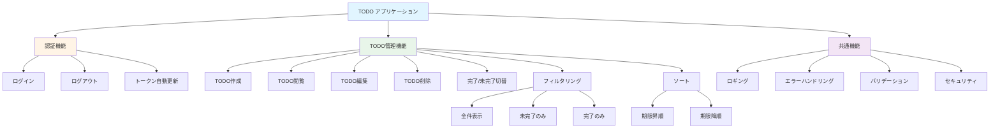
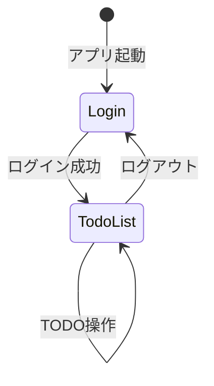

# 機能一覧

**作成日:** 2025-10-28
**バージョン:** 1.0
**対象システム:** TODO アプリケーション

---

## 1. 概要

本ドキュメントでは、TODO アプリケーションに実装されている全機能を一覧化します。

**関連ドキュメント:**
- [システム構成設計書](./01_system-architecture.md) - アーキテクチャ、技術スタック
- [データベース設計書](./04_database-design.md) - データベーススキーマ、ER図

---

## 2. 機能マップ

---

## 3. 機能詳細

### 3.1 認証機能

| 機能 | エンドポイント | 実装箇所 | 主な仕様 |
|------|--------------|---------|---------|
| **ログイン** | `POST /api/auth/login` | FE: `LoginPage.tsx` BE: `auth_routes.py` | - メール/パスワード認証 - httpOnly Cookie (access_token, refresh_token) - bcrypt パスワードハッシュ化 |
| **ログアウト** | `POST /api/auth/logout` | FE: `TodoListPage.tsx` BE: `auth_routes.py` | - リフレッシュトークン無効化 - Cookie クリア |
| **トークン更新** | `POST /api/auth/refresh` | FE: `AuthContext.tsx` BE: `auth_routes.py` | - 自動トークンリフレッシュ - トークンローテーション |

---

### 3.2 TODO管理機能

| 機能 | エンドポイント | 実装箇所 | 主な仕様 |
|------|--------------|---------|---------|
| **一覧取得** | `GET /api/todos` | FE: `useTodos.ts` BE: `todo_routes.py` | - クエリパラメータ: `status=all\|active\|completed` - 認証必須 (自分のTODOのみ) - FEでソート (期限昇順/降順) |
| **作成** | `POST /api/todos` | FE: `TodoForm.tsx` BE: `todo_routes.py` | - バリデーション: title必須(1-120文字), detail(最大1000文字), due_date(今日以降) - Pydanticによる検証 |
| **編集** | `PATCH /api/todos/{id}` | FE: `TodoForm.tsx` BE: `todo_routes.py` | - 作成と同じバリデーション - 他ユーザーのTODO編集不可 |
| **削除** | `DELETE /api/todos/{id}` | FE: `TodoList.tsx` BE: `todo_routes.py` | - レスポンス: 204 No Content - 他ユーザーのTODO削除不可 |
| **完了トグル** | `PATCH /api/todos/{id}/complete` | FE: `TodoList.tsx` BE: `todo_routes.py` | - リクエスト: `{is_completed: boolean}` - チェックボックスで操作 |
| **フィルタリング** | `GET /api/todos?status=...` | FE: `TodoFilterToggle.tsx` BE: `todo_routes.py` | - オプション: すべて/未完了/完了 - 件数表示付き |
| **ソート** | - (クライアント側) | FE: `useTodos.ts` | - 期限日で昇順/降順 - 期限未設定は末尾 |

---

### 3.3 共通機能

| 機能 | 実装箇所 | 主な仕様 |
|------|---------|---------|
| **ロギング** | BE: `logger.py` FE: `lib/logger.ts` | - リクエストトレーシング (UUID) - センシティブデータマスキング - 環境別ログレベル設定 - 詳細は [システム構成設計書](./01_system-architecture.md) セクション6参照 |
| **エラーハンドリング** | BE: `main.py` FE: `ErrorBoundary.tsx` | **バックエンド:** HTTP例外の統一処理 (400/401/403/404/500) **フロントエンド:** React Error Boundary、フォールバックUI |
| **バリデーション** | BE: `schemas/` FE: `hooks/useTodoForm.ts` | **バックエンド:** Pydantic による厳格な入力検証 **フロントエンド:** リアルタイムバリデーション、HTML5属性 |
| **セキュリティ** | BE: `utils/`, `auth_routes.py` FE: `AuthContext.tsx` | - JWT認証 (httpOnly Cookie) - bcryptハッシュ化 - トークンローテーション - 詳細は [認証・認可設計書](./02_authentication-authorization.md) 参照 |

---

## 4. 機能マトリクス

### 4.1 実装状況

| 機能カテゴリ | 機能名 | バックエンド | フロントエンド | テスト |
|------------|-------|------------|-------------|-------|
| 認証 | ログイン | ✓ | ✓ | BE: ✓ |
| 認証 | ログアウト | ✓ | ✓ | BE: ✓ |
| 認証 | トークン自動更新 | ✓ | ✓ | BE: ✓ |
| TODO管理 | TODO一覧取得 | ✓ | ✓ | BE: ✓, FE: API層 |
| TODO管理 | TODO作成 | ✓ | ✓ | BE: ✓, FE: API層 |
| TODO管理 | TODO編集 | ✓ | ✓ | BE: ✓, FE: API層 |
| TODO管理 | TODO削除 | ✓ | ✓ | BE: ✓, FE: API層 |
| TODO管理 | 完了/未完了切替 | ✓ | ✓ | BE: ✓, FE: API層 |
| TODO管理 | フィルタリング | ✓ | ✓ | BE: ✓, FE: ✓ |
| TODO管理 | ソート | - | ✓ | FE: ✓ |
| 共通 | ロギング | ✓ | ✓ | - |
| 共通 | エラーハンドリング | ✓ | ✓ | BE: ✓ |
| 共通 | バリデーション | ✓ | ✓ | BE: ✓, FE: ✓ |
| 共通 | セキュリティ | ✓ | ✓ | BE: ✓ |

**凡例:**
- BE: バックエンドテスト（pytest）
- FE: フロントエンドテスト（Vitest）
- FE「API層」: API関数のユニットテストのみ実装、コンポーネント・フックのテストなし
- FE「✓」: ユーティリティ層またはバリデーション層のテストが実装済み

### 4.2 共通機能詳細

| 機能 | 実装箇所 | 詳細 |
|------|---------|------|
| **レート制限** | BE: `limiter.py` BE: `routes/auth_routes.py` | - Flask-Limiter + Redis による実装 - 認証エンドポイントに制限適用   - ログイン: 10req/分   - トークン更新: 30req/分   - ログアウト: 20req/分 - 429エラーレスポンス |

---

## 5. API エンドポイント一覧

### 5.1 システム監視

| 機能 | エンドポイント | 実装箇所 | 詳細 |
|------|--------------|---------|------|
| **ヘルスチェック** | `GET /health` | FE: なし BE: `health.py` | アプリケーションとデータベースの状態確認。200 OK（正常）または 503 Service Unavailable（異常）を返す |

### 5.2 認証 API

| メソッド | エンドポイント | 認証 | 説明 |
|---------|--------------|------|------|
| POST | `/api/auth/login` | 不要 | ログイン |
| POST | `/api/auth/logout` | 不要 | ログアウト |
| POST | `/api/auth/refresh` | 不要 | トークン更新 |

### 5.3 TODO API

| メソッド | エンドポイント | 認証 | 説明 |
|---------|--------------|------|------|
| GET | `/api/todos` | 必要 | TODO一覧取得 |
| POST | `/api/todos` | 必要 | TODO作成 |
| PATCH | `/api/todos/{id}` | 必要 | TODO更新 |
| DELETE | `/api/todos/{id}` | 必要 | TODO削除 |
| PATCH | `/api/todos/{id}/complete` | 必要 | 完了状態トグル |

**認証方法:** Cookie ベース (httpOnly Cookie に JWT トークンを含む)

---

## 6. 画面一覧

### 6.1 画面構成

| 画面名 | パス | 認証 | 説明 | ファイル |
|-------|------|------|------|---------|
| ログイン画面 | `/login` | 不要 | ユーザー認証 | `LoginPage.tsx` |
| TODOリスト画面 | `/todos` | 必要 | TODO管理メイン画面 | `TodoListPage.tsx` |

### 6.2 画面遷移図

---

## 7. 関連ドキュメント

- [認証・認可設計書](./02_authentication-authorization.md) - 認証フロー、トークン仕様、セキュリティ対策
- [システム構成設計書](./01_system-architecture.md) - アーキテクチャ、技術スタック、開発環境
- [データベース設計書](./04_database-design.md) - データベーススキーマ、ER図、テーブル定義
- [バックエンドガイド](../backend/CLAUDE.md) - バックエンド実装ガイド
- [フロントエンドガイド](../frontend/CLAUDE.md) - フロントエンド実装ガイド

---

**END OF DOCUMENT**
