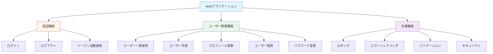
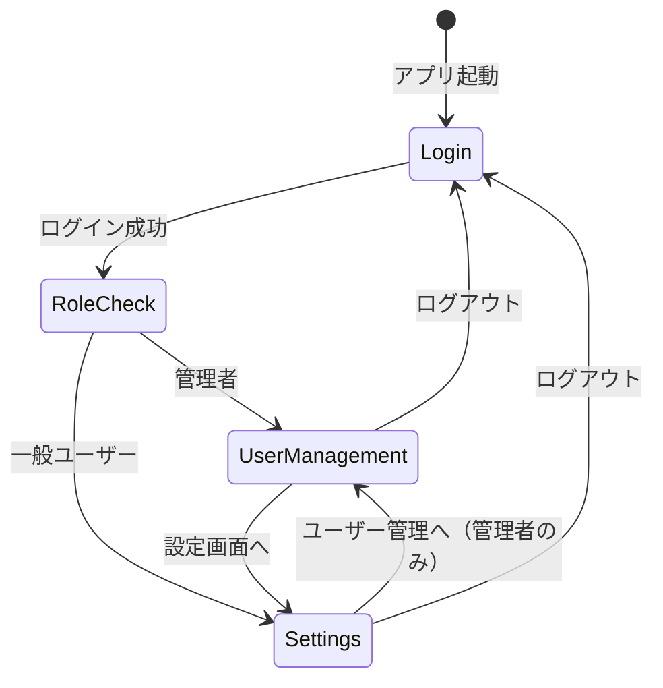

# 機能一覧

**作成日:** 2025-10-28
**最終更新:** 2025-11-23
**バージョン:** 1.1
**対象システム:** フルスタックWebアプリケーション

---

## 1. 概要

本ドキュメントでは、Webアプリケーションに実装されている全機能を一覧化します。

**関連ドキュメント:**
- [システム構成設計書](./01_system-architecture.md) - アーキテクチャ、技術スタック
- [データベース設計書](./04_database-design.md) - データベーススキーマ、ER図

---

## 2. 機能マップ

---

## 3. 機能詳細

### 3.1 認証機能

| 機能 | エンドポイント | 実装箇所 | 主な仕様 |
|------|--------------|---------|---------|
| **ログイン** | `POST /api/auth/login` | FE: `LoginPage.tsx` BE: `auth_routes.py` | - メール/パスワード認証 - httpOnly Cookie (access_token, refresh_token) - bcrypt パスワードハッシュ化 |
| **ログアウト** | `POST /api/auth/logout` | FE: `AuthContext.tsx` BE: `auth_routes.py` | - リフレッシュトークン無効化 - Cookie クリア |
| **トークン更新** | `POST /api/auth/refresh` | FE: `AuthContext.tsx` BE: `auth_routes.py` | - 自動トークンリフレッシュ - トークンローテーション |

---

### 3.2 ユーザー管理機能

| 機能 | エンドポイント | 実装箇所 | 主な仕様 |
|------|--------------|---------|---------|
| **ユーザー一覧取得** | `GET /api/users` | FE: `UserManagementPage.tsx` BE: `user_routes.py` | - 管理者のみアクセス可能 - 全ユーザーの情報を取得 |
| **ユーザー作成** | `POST /api/users` | FE: `UserCreateForm.tsx` BE: `user_routes.py` | - 管理者のみアクセス可能 - ランダムな初期パスワードを生成 - 作成後に初期パスワードを表示 |
| **プロフィール更新** | `PATCH /api/users/me` | FE: `SettingsPage.tsx` BE: `user_routes.py` | - 認証済みユーザーが自身のプロフィールを更新 - メールアドレスと名前の変更 |
| **ユーザー削除** | `DELETE /api/users/{id}` | FE: `UserList.tsx` BE: `user_routes.py` | - 管理者のみアクセス可能 - 指定したユーザーを削除 |
| **パスワード変更** | `POST /api/password/change` | FE: `SettingsPage.tsx` BE: `password_routes.py` | - 認証済みユーザーが自身のパスワードを変更 - 現在のパスワード確認が必要 - 新パスワードのバリデーション（8文字以上、英数字） |

---

### 3.3 共通機能

| 機能 | 実装箇所 | 主な仕様 |
|------|---------|---------|
| **UIコンポーネントライブラリ** | FE: `components/ui/` | - Tailwind CSSベースの共有コンポーネント - Button, Input, Alert, Modalの4種類 - アクセシビリティ対応 (44px tap target, ARIA) - 一貫したデザインシステム - 詳細は [フロントエンドガイド](../frontend/CLAUDE.md#ui-component-library) 参照 |
| **ロギング** | BE: `logger.py` FE: `lib/logger.ts` | - リクエストトレーシング (UUID) - センシティブデータマスキング - 環境別ログレベル設定 - 詳細は [システム構成設計書](./01_system-architecture.md) セクション6参照 |
| **エラーハンドリング** | BE: `main.py` FE: `ErrorBoundary.tsx` | **バックエンド:** HTTP例外の統一処理 (400/401/403/404/500) **フロントエンド:** React Error Boundary、フォールバックUI |
| **バリデーション** | BE: `schemas/` FE: 各フォームコンポーネント | **バックエンド:** Pydantic による厳格な入力検証 **フロントエンド:** リアルタイムバリデーション、HTML5属性 |
| **セキュリティ** | BE: `utils/`, `auth_routes.py` FE: `AuthContext.tsx` | - JWT認証 (httpOnly Cookie) - bcryptハッシュ化 - トークンローテーション - 詳細は [認証・認可設計書](./02_authentication-authorization.md) 参照 |

---

## 4. 機能マトリクス

### 4.1 実装状況

| 機能カテゴリ | 機能名 | バックエンド | フロントエンド | テスト |
|------------|-------|------------|-------------|-------|
| 認証 | ログイン | ✓ | ✓ | BE: ✓, FE: ✓ |
| 認証 | ログアウト | ✓ | ✓ | BE: ✓, FE: ✓ |
| 認証 | トークン自動更新 | ✓ | ✓ | BE: ✓, FE: ✓ |
| ユーザー管理 | ユーザー一覧取得 | ✓ | ✓ | BE: ✓, FE: ✓ |
| ユーザー管理 | ユーザー作成 | ✓ | ✓ | BE: ✓, FE: ✓ |
| ユーザー管理 | プロフィール更新 | ✓ | ✓ | BE: ✓, FE: ✓ |
| ユーザー管理 | ユーザー削除 | ✓ | ✓ | BE: ✓, FE: ✓ |
| ユーザー管理 | パスワード変更 | ✓ | ✓ | BE: ✓, FE: ✓ |
| 共通 | UIコンポーネントライブラリ | - | ✓ | FE: ✓ |
| 共通 | ロギング | ✓ | ✓ | - |
| 共通 | エラーハンドリング | ✓ | ✓ | BE: ✓, FE: ✓ |
| 共通 | バリデーション | ✓ | ✓ | BE: ✓, FE: ✓ |
| 共通 | セキュリティ | ✓ | ✓ | BE: ✓ |

**凡例:**
- BE: バックエンドテスト（pytest）
- FE: フロントエンドテスト（Vitest）

### 4.2 共通機能詳細

| 機能 | 実装箇所 | 詳細 |
|------|---------|------|
| **レート制限** | BE: `limiter.py` BE: `routes/auth_routes.py` | - Flask-Limiter + Redis による実装 - 認証エンドポイントに制限適用   - ログイン: 10req/分   - トークン更新: 30req/分   - ログアウト: 20req/分 - 429エラーレスポンス |

---

## 5. API エンドポイント一覧

### 5.1 システム監視

| 機能 | エンドポイント | 実装箇所 | 詳細 |
|------|--------------|---------|------|
| **ヘルスチェック** | `GET /api/health` | FE: `useVersion.ts` BE: `health.py` | アプリケーションとデータベースの状態確認。 **レスポンス例**: `{"status": "healthy", "database": "connected", "version": "v1.0.0"}` **ステータスコード**: 200 OK（正常）/ 503 Service Unavailable（異常） |
| **バージョン表示** | - | FE: `PageHeader.tsx` FE: `useVersion.ts` | ヘッダー右上にアプリケーションバージョンを表示。 `/api/health` から取得した `APP_VERSION` 環境変数の値を表示。 **デスクトップ**: 表示 **モバイル**: 非表示 |

### 5.2 認証 API

| メソッド | エンドポイント | 認証 | 説明 |
|---------|--------------|------|------|
| POST | `/api/auth/login` | 不要 | ログイン |
| POST | `/api/auth/logout` | 不要 | ログアウト |
| POST | `/api/auth/refresh` | 不要 | トークン更新 |

**認証方法:** Cookie ベース (httpOnly Cookie に JWT トークンを含む)

### 5.3 ユーザー管理 API

| メソッド | エンドポイント | 認証 | 権限 | 説明 |
|---------|--------------|------|------|------|
| GET | `/api/users` | 必要 | 管理者のみ | ユーザー一覧取得 |
| POST | `/api/users` | 必要 | 管理者のみ | ユーザー作成 |
| PATCH | `/api/users/me` | 必要 | 全ユーザー | プロフィール更新 |
| DELETE | `/api/users/{id}` | 必要 | 管理者のみ | ユーザー削除 |

### 5.4 パスワード管理 API

| メソッド | エンドポイント | 認証 | 権限 | 説明 |
|---------|--------------|------|------|------|
| POST | `/api/password/change` | 必要 | 全ユーザー | パスワード変更 |

---

## 6. 画面一覧

### 6.1 画面構成

| 画面名 | パス | 認証 | 権限 | 説明 | ファイル |
|-------|------|------|------|------|---------|
| ログイン画面 | `/login` | 不要 | - | ユーザー認証 | `LoginPage.tsx` |
| 設定画面 | `/settings` | 必要 | 全ユーザー | プロフィール編集、パスワード変更 | `SettingsPage.tsx` |
| ユーザー管理画面 | `/admin/users` | 必要 | 管理者のみ | ユーザー一覧表示、作成、削除 | `UserManagementPage.tsx` |

### 6.2 画面遷移図

---

## 7. 関連ドキュメント

- [認証・認可設計書](./02_authentication-authorization.md) - 認証フロー、トークン仕様、セキュリティ対策
- [システム構成設計書](./01_system-architecture.md) - アーキテクチャ、技術スタック、開発環境
- [データベース設計書](./04_database-design.md) - データベーススキーマ、ER図、テーブル定義
- [バックエンドガイド](../backend/CLAUDE.md) - バックエンド実装ガイド
- [フロントエンドガイド](../frontend/CLAUDE.md) - フロントエンド実装ガイド

---

**END OF DOCUMENT**
