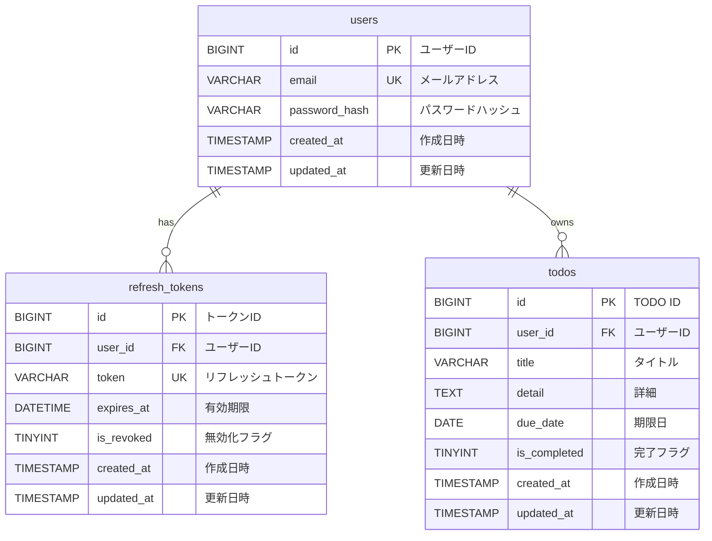

# データベース設計書

**作成日:** 2025-10-28
**最終更新:** 2025-11-06
**バージョン:** 1.0
**対象システム:** TODO アプリケーション

---

## 1. データベース概要

**関連ドキュメント:**
- [認証・認可設計書](./02_authentication-authorization.md) - 認証フロー、users/refresh_tokensテーブル詳細
- [システム構成設計書](./01_system-architecture.md) - アーキテクチャ、技術スタック
- [機能一覧](./03_feature-list.md) - 実装済み機能の一覧

### 1.1 データベース管理システム

| 項目               | 内容                          |
|-------------------|------------------------------|
| RDBMS             | MySQL 8.0                    |
| ストレージエンジン | InnoDB                       |
| 文字セット         | UTF8MB4                      |
| 照合順序           | utf8mb4_general_ci           |

### 1.2 テーブル一覧

| テーブル名         | 説明                          |
|-------------------|------------------------------|
| users             | ユーザー情報管理              |
| refresh_tokens    | JWT リフレッシュトークン管理  |
| todos             | TODO アイテム管理             |

---

## 2. ER図



---

## 3. テーブル定義

### 3.1 users テーブル

ユーザー情報を管理するテーブル。

| カラム名        | データ型           | 制約                     | 説明                        |
|----------------|-------------------|-------------------------|----------------------------|
| id             | BIGINT UNSIGNED   | PRIMARY KEY, AUTO_INC   | ユーザーID                  |
| email          | VARCHAR(255)      | NOT NULL, UNIQUE        | メールアドレス（ログインID） |
| password_hash  | VARCHAR(255)      | NOT NULL                | bcryptハッシュ化パスワード   |
| created_at     | TIMESTAMP         | NOT NULL, DEFAULT NOW   | レコード作成日時             |
| updated_at     | TIMESTAMP         | NOT NULL, ON UPDATE NOW | レコード更新日時             |

**インデックス:**
- `idx_users_email` on `email` (ログイン検索の高速化)

**ビジネスルール:**
- email は一意である必要がある
- password_hash は bcrypt でハッシュ化された値を保存

---

### 3.2 refresh_tokens テーブル

JWT リフレッシュトークンを管理するテーブル。

| カラム名        | データ型           | 制約                     | 説明                        |
|----------------|-------------------|-------------------------|----------------------------|
| id             | BIGINT UNSIGNED   | PRIMARY KEY, AUTO_INC   | トークンID                  |
| token          | VARCHAR(500)      | NOT NULL, UNIQUE        | リフレッシュトークン         |
| user_id        | BIGINT UNSIGNED   | NOT NULL, FOREIGN KEY   | ユーザーID (users.id)       |
| expires_at     | DATETIME          | NOT NULL                | トークン有効期限             |
| is_revoked     | TINYINT(1)        | NOT NULL, DEFAULT 0     | 無効化フラグ                 |
| created_at     | TIMESTAMP         | NOT NULL, DEFAULT NOW   | レコード作成日時             |
| updated_at     | TIMESTAMP         | NOT NULL, ON UPDATE NOW | レコード更新日時             |

**インデックス:**
- `idx_refresh_tokens_token` on `token` (トークン検証の高速化)
- `idx_refresh_tokens_user_id` on `user_id` (ユーザー別検索)
- `idx_refresh_tokens_expires_at` on `expires_at` (期限切れトークンクリーンアップ)

**外部キー:**
- `user_id` → `users.id` (ON DELETE CASCADE)

**ビジネスルール:**
- token は一意である必要がある
- is_revoked が 1 の場合、トークンは無効化されている
- expires_at を過ぎたトークンは無効

---

### 3.3 todos テーブル

TODO アイテムを管理するテーブル。

| カラム名        | データ型           | 制約                     | 説明                        |
|----------------|-------------------|-------------------------|----------------------------|
| id             | BIGINT UNSIGNED   | PRIMARY KEY, AUTO_INC   | TODO ID                    |
| user_id        | BIGINT UNSIGNED   | NOT NULL, FOREIGN KEY   | ユーザーID (users.id)       |
| title          | VARCHAR(120)      | NOT NULL                | TODOタイトル                |
| detail         | TEXT              | NULL                    | TODO詳細                    |
| due_date       | DATE              | NULL                    | 期限日                      |
| is_completed   | TINYINT(1)        | NOT NULL, DEFAULT 0     | 完了フラグ                   |
| created_at     | TIMESTAMP         | NOT NULL, DEFAULT NOW   | レコード作成日時             |
| updated_at     | TIMESTAMP         | NOT NULL, ON UPDATE NOW | レコード更新日時             |

**インデックス:**
- `idx_todos_user_id` on `user_id` (ユーザー別TODO取得の高速化)
- `idx_todos_due_date` on `due_date` (期限別ソート)
- `idx_todos_completed` on `is_completed` (完了状態フィルタ)

**外部キー:**
- `user_id` → `users.id` (ON DELETE CASCADE)

**ビジネスルール:**
- title は必須項目
- detail と due_date はオプション
- is_completed は 0 (未完了) または 1 (完了)

---

## 4. データベーススキーマ管理

### 4.1 スキーマファイル

- **初期化スクリプト**: `infra/mysql/init/001_init.sql`
  - Docker コンテナ初回起動時に自動実行
  - 全テーブルの作成とインデックス設定

- **SQLAlchemy モデル**: `backend/app/models/`
  - `user.py` - User モデル
  - `refresh_token.py` - RefreshToken モデル
  - `todo.py` - Todo モデル

### 4.2 マイグレーション

現在、スキーマ変更は以下の手順で行う:

1. SQLAlchemy モデルを更新
2. `infra/mysql/init/001_init.sql` を更新
3. 既存環境では `make db-init` でテーブル再作成

```bash
# テーブルを再作成（既存データは削除される）
make db-init

# または直接実行
poetry -C backend run python scripts/create_tables.py
```

**注意:** データベースリセットは既存データを削除します。本番環境では使用しないでください。

### 4.3 テストデータ

開発環境用のテストユーザーを作成:

```bash
make db-create-user EMAIL=test@example.com PASSWORD=password123

# または直接実行
poetry -C backend run python scripts/create_user.py test@example.com password123
```

---

## 5. パフォーマンス最適化

### 5.1 インデックス設計

**users テーブル:**
- `email` にインデックス（ログイン時の高速検索）

**refresh_tokens テーブル:**
- `token` にインデックス（トークン検証の高速化）
- `user_id` にインデックス（ユーザー別トークン取得）
- `expires_at` にインデックス（期限切れトークンのクリーンアップ）

**todos テーブル:**
- `user_id` にインデックス（ユーザー別TODO取得）
- `due_date` にインデックス（期限別ソート）
- `is_completed` にインデックス（完了状態フィルタ）

### 5.2 クエリ最適化

- **N+1 問題の回避**: SQLAlchemy の `joinedload` を使用
- **コネクションプーリング**: SQLAlchemy のコネクションプール機能を活用
- **トランザクション管理**: 適切なトランザクションスコープの設定

---

## 6. データ保護とセキュリティ

### 6.1 データ暗号化

- **パスワード**: bcrypt によるハッシュ化（コスト係数: デフォルト 12）
- **トークン**: JWT 署名による改ざん検知
- **通信**: HTTPS による暗号化（本番環境）

### 6.2 データ整合性

- **外部キー制約**: CASCADE DELETE によるリレーションシップの整合性維持
- **NOT NULL 制約**: 必須項目の保証
- **UNIQUE 制約**: 一意性の保証（email, token）

### 6.3 バックアップ戦略（将来的）

- 定期的なデータベースバックアップ
- ポイントインタイムリカバリ
- レプリケーションによる冗長性確保

---

## 7. 付録

### 7.1 データベース管理コマンド

```bash
# データベース初期化
make db-init              # テーブル作成（SQLAlchemy モデルから）

# データベースリセット
make db-reset             # 全データ削除＋再作成

# テストユーザー作成
make db-create-user EMAIL=user@example.com PASSWORD=password123

# MySQL コンソール接続
docker compose -f infra/docker-compose.yml exec db mysql -u app_user -p app_db
```

### 7.2 SQLAlchemy モデルとSQL定義の同期

スキーマの信頼できる情報源（Source of Truth）は **SQLAlchemy モデル** です:

1. モデル定義を更新: `backend/app/models/*.py`
2. 初期化SQLを更新: `infra/mysql/init/001_init.sql`
3. 変更を適用: `make db-init`

### 7.3 SQLAlchemy型マッピング

SQLAlchemyの型とMySQLの型の対応関係:

| SQLAlchemy型 | MySQL型 | 備考 |
|-------------|---------|------|
| `BigInteger` | `BIGINT` | UNSIGNED制約はクロスDB互換性のため省略 |
| `Boolean` | `TINYINT(1)` | MySQLには真偽型がないため |
| `DateTime` | `DATETIME` | TIMESTAMPとは異なる（タイムゾーン非対応） |
| `String(length)` | `VARCHAR(length)` | |
| `Text` | `TEXT` | |

**注意**: `created_at` / `updated_at` カラムは、SQLAlchemyモデルでは `DateTime` 型を使用していますが、MySQL初期化スクリプト（`infra/mysql/init/001_init.sql`）では `TIMESTAMP` 型を使用しています。これは互換性のための設計判断で、どちらも日時を正しく扱えます。

---

**END OF DOCUMENT**
