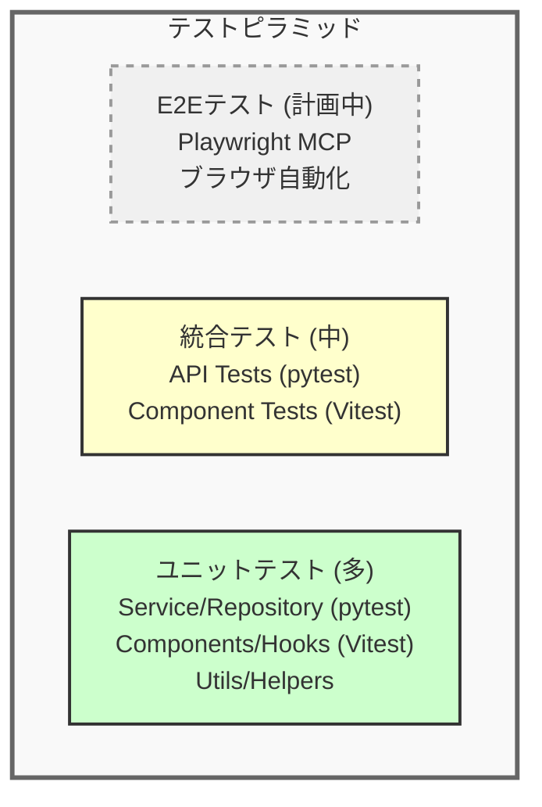

# テスト戦略書

**作成日:** 2025-10-28
**最終更新:** 2025-11-23
**バージョン:** 1.1
**対象システム:** フルスタックWebアプリケーション

---

## 1. はじめに

### 1.1 本ドキュメントの目的

本ドキュメントは、認証・ユーザー管理アプリケーションのテスト戦略を定めます。テストレベル、カバレッジ目標、テストデータ管理方針を明確にし、品質保証の基準を提供します。

### 1.2 対象読者

- 開発者全般（フロントエンド、バックエンド）
- QAエンジニア
- テックリード、アーキテクト

**関連ドキュメント:**
- [システム構成設計書](./01_system-architecture.md) - テスト環境、技術スタック
- [API設計ガイド](./05_api-design-guide.md) - APIテスト観点
- [機能一覧](./03_feature-list.md) - テスト対象機能

---

## 2. テスト戦略概要

### 2.1 基本方針

| 方針 | 説明 |
|------|------|
| **テスト駆動開発（推奨）** | 可能な限りテストファーストで開発 |
| **テストピラミッド準拠** | ユニットテスト（多） > 統合テスト（中） > E2Eテスト（少） |
| **自動化優先** | 手動テストは最小限、CI/CDで自動実行 |
| **高速なフィードバック** | ユニットテストは数秒、統合テストは数分以内 |
| **独立性** | テストは互いに独立し、実行順序に依存しない |

### 2.2 テストレベル



---

## 3. ユニットテスト

### 3.1 対象と目的

**対象:**
- **バックエンド**: Serviceレイヤー、Repositoryレイヤー、ユーティリティ関数
- **フロントエンド**: カスタムフック、ユーティリティ関数、個別コンポーネント

**目的:**
- ロジックの正確性を検証
- 境界値、エラーケースを網羅
- リファクタリングの安全性確保

### 3.2 ツール

| プラットフォーム | ツール | 説明 |
|---------------|-------|------|
| **バックエンド** | pytest | Python標準のテストフレームワーク |
| **フロントエンド** | Vitest + Testing Library | React向け高速テストランナー |

### 3.3 カバレッジ目標（実装済み項目）

| レイヤー | カバレッジ目標 | 重要度 | 実装状況 |
|---------|-------------|-------|---------|
| **Serviceレイヤー（バックエンド）** | 90%以上 | ★★★ | ✓ |
| **Repositoryレイヤー（バックエンド）** | 80%以上 | ★★★ | ✓ |
| **Modelsレイヤー（バックエンド）** | 100% | ★★★ | ✓ |
| **スクリプト層（バックエンド）** | 90%以上 | ★★★ | ✓ |
| **ユーティリティ（フロントエンド）** | 100% | ★★★ | ✓ |
| **API層（フロントエンド）** | 90%以上 | ★★★ | ✓ |

**特記事項:**
- **マイグレーション関連**: SchemaMigrationモデル（100%）、apply_sql_migrationsスクリプト（94.96%）

### 3.4 実装例

#### バックエンド（pytest）

```python
# tests/services/test_auth_service.py
import pytest
from app.services.auth_service import AuthService

def test_login_success():
    """ログインの正常系テスト"""
    service = AuthService()
    credentials = {
        "email": "test@example.com",
        "password": "password123"
    }

    result = service.login(credentials)

    assert result["email"] == "test@example.com"
    assert "access_token" in result

def test_login_with_invalid_password():
    """無効なパスワードでエラー"""
    service = AuthService()
    credentials = {
        "email": "test@example.com",
        "password": "wrong"
    }

    with pytest.raises(ValueError, match="Invalid credentials"):
        service.login(credentials)
```

#### フロントエンド（Vitest）

```typescript
// src/lib/api/auth.test.ts
import { describe, it, expect, vi, beforeEach } from 'vitest'
import { login, logout, refreshToken } from './auth'

describe('Auth API', () => {
  beforeEach(() => {
    vi.clearAllMocks()
  })

  it('login sends credentials and returns user data', async () => {
    const result = await login({ email: 'test@example.com', password: 'password123' })
    expect(result.user.email).toBe('test@example.com')
  })

  it('logout clears session', async () => {
    await logout()
    // Verify logout API was called
  })

  it('refreshToken gets new access token', async () => {
    const result = await refreshToken()
    expect(result.user).toBeDefined()
  })
})
```

### 3.5 テストファクトリーとヘルパー関数（バックエンド）

**目的:**
テストコードの保守性と可読性を向上させるため、テストデータ生成とアサーションを標準化します。

#### 3.5.1 テストファクトリー (`backend/tests/factories.py`)

テストデータをデフォルト値付きで簡単に生成できるファクトリークラスを提供します。

**UserFactory:**
```python
from tests.factories import UserFactory

# ユニークなメールアドレスで自動生成
user_data = UserFactory.build()
# → {'email': 'user1@example.com', 'password': 'password123'}

user_data = UserFactory.build()
# → {'email': 'user2@example.com', 'password': 'password123'}  # カウンタが自動インクリメント

# カスタムメールアドレス
user_data = UserFactory.build(email='custom@example.com')
```

#### 3.5.2 テストヘルパー関数 (`backend/tests/helpers.py`)

共通のテスト操作とアサーションを簡潔に記述できるヘルパー関数を提供します。

**データ作成ヘルパー:**
```python
from tests.helpers import create_user, create_auth_client

# データベースに直接ユーザーを作成
user_id = create_user(app, email='test@example.com', password='pass123', role='user')

# 認証済みテストクライアントを作成
auth_client = create_auth_client(app, user_id, email='test@example.com', role='user')
```

**レスポンスアサーションヘルパー:**
```python
from tests.helpers import assert_response_success, assert_response_error

# 成功レスポンスのアサート（ステータスコード + フィールド検証）
data = assert_response_success(response, 201, title='Buy groceries')

# エラーレスポンスのアサート（ステータスコード + エラーコード検証）
data = assert_response_error(response, 404, expected_code=404)
```

**Cookieアサーションヘルパー:**
```python
from tests.helpers import assert_cookie_set

# Cookieが設定されていることを確認
assert_cookie_set(response, 'access_token')

# Cookieがクリアされていることを確認（max-age=0）
assert_cookie_set(response, 'access_token', should_be_cleared=True)
```

#### 3.5.3 実装例：ファクトリーとヘルパーを使ったテスト

**Before（ファクトリー・ヘルパーなし）:**
```python
def test_create_user_success(admin_client):
    response = admin_client.post("/api/users", json={
        "email": "newuser@example.com",
        "password": "password123",
        "name": "New User",
        "role": "user"
    })

    assert response.status_code == 201
    data = response.get_json()
    assert data is not None
    assert data["user"]["email"] == "newuser@example.com"
    assert data["user"]["name"] == "New User"
    assert data["user"]["role"] == "user"
```

**After（ファクトリー・ヘルパーを使用）:**
```python
def test_create_user_success(admin_client):
    """ユーザー作成APIの正常系テスト - ファクトリーとヘルパーを使用"""
    user_data = UserFactory.build(email="newuser@example.com", name="New User")

    response = admin_client.post("/api/users", json=user_data)

    data = assert_response_success(response, 201)
    assert data["user"]["email"] == "newuser@example.com"
    assert data["user"]["name"] == "New User"
    assert data["user"]["role"] == "user"
```

**利点:**
- **可読性向上**: テストの意図が明確になる
- **保守性向上**: 共通ロジックを1箇所で管理
- **DRY原則**: 重複コードを削減
- **型安全性**: ヘルパー関数で型ヒント付き

### 3.6 フロントエンドの実装状況

**実装済みのテスト:**

| ファイル | 対象 | テスト内容 |
|---------|------|-----------|
| `src/lib/api/auth.test.ts` | 認証API関数 | login, logout, refreshToken、エラーハンドリング |
| `src/lib/api/users.test.ts` | ユーザーAPI関数 | getUsers, createUser, updateUser, deleteUser、エラーハンドリング |
| `src/lib/utils/dateFormat.test.ts` | 日付フォーマット | formatDate（ISO日時の表示用変換） |
| `src/hooks/useVersion.test.ts` | バージョンフック | APIバージョン情報の取得 |

**テスト対象範囲:**
- ✓ API層（src/lib/api/） - auth.ts, users.ts
- ✓ ユーティリティ層（src/lib/utils/） - dateFormat.ts
- ✓ コンポーネント層（src/components/） - ErrorBoundary, ProtectedRoute, RoleBasedRedirect, PageHeader, settings/, admin/
- ✓ カスタムフック層（src/hooks/） - useVersion
- ✓ コンテキスト層（src/contexts/） - AuthContext
- ✗ ページ層（src/pages/） - 未実装

**実装済みテストファイル:**

| テストファイル | 対象 | テスト内容 |
|--------------|------|-----------|
| `src/components/ErrorBoundary.test.tsx` | ErrorBoundaryコンポーネント | エラーキャッチ、表示 |
| `src/components/ProtectedRoute.test.tsx` | ProtectedRouteコンポーネント | 認証状態によるリダイレクト |
| `src/components/RoleBasedRedirect.test.tsx` | RoleBasedRedirectコンポーネント | ロールによるリダイレクト |
| `src/components/PageHeader.test.tsx` | PageHeaderコンポーネント | ヘッダー表示、ナビゲーション |
| `src/components/settings/PasswordChangeForm.test.tsx` | パスワード変更フォーム | パスワード変更、バリデーション |
| `src/components/settings/ProfileUpdateForm.test.tsx` | プロフィール更新フォーム | プロフィール更新、バリデーション |
| `src/components/admin/UserCreateForm.test.tsx` | ユーザー作成フォーム | ユーザー作成、バリデーション |
| `src/components/admin/UserList.test.tsx` | ユーザー一覧 | ユーザー表示、削除 |
| `src/components/admin/InitialPasswordModal.test.tsx` | 初期パスワードモーダル | モーダル表示、クリップボード |
| `src/contexts/AuthContext.test.tsx` | AuthContextコンテキスト | 認証状態管理、ログイン/ログアウト |

### 3.7 データベースマイグレーションテスト

**実装済みのテスト:**

本プロジェクトでは、データベースマイグレーションシステムに対する包括的なテストスイートを実装しています。

#### 3.7.1 テスト対象

| テストファイル | 対象 | テスト数 | カバレッジ |
|-------------|------|---------|-----------|
| `tests/models/test_schema_migration.py` | SchemaMigrationモデル | 10 | 100% |
| `tests/scripts/test_apply_sql_migrations.py` | マイグレーション適用スクリプト | 26 | 94.96% |

#### 3.7.2 SchemaMigrationモデルテスト

**目的:** マイグレーション履歴を記録するモデルの正確性を検証

**テスト内容:**
```python
# tests/models/test_schema_migration.py

def test_create_schema_migration(app: Flask):
    """マイグレーション記録の作成テスト"""
    migration = SchemaMigration(
        filename="001_initial_migration.sql",
        checksum="abc123def456",
    )
    session.add(migration)
    session.commit()

    assert migration.id is not None
    assert migration.filename == "001_initial_migration.sql"
    assert isinstance(migration.applied_at, datetime)

def test_unique_filename_constraint(app: Flask):
    """ファイル名のユニーク制約テスト"""
    # 同じファイル名で2回マイグレーション記録を作成すると失敗
    with pytest.raises(IntegrityError):
        # ... 重複作成処理 ...
```

**カバー範囲:**
- ✓ レコードのCRUD操作（作成・取得・更新・削除）
- ✓ ユニーク制約の検証（ファイル名重複防止）
- ✓ タイムスタンプの自動設定
- ✓ クエリ操作（フィルタリング、ソート、カウント）
- ✓ インデックスによる高速検索

#### 3.7.3 マイグレーション適用スクリプトテスト

**目的:** SQLマイグレーションの安全な適用を保証

**主要なテスト:**

1. **チェックサム計算・検証テスト:**
```python
def test_calculate_checksum_consistent(tmp_path):
    """同じファイルは常に同じチェックサムを生成"""
    test_file = tmp_path / "test.sql"
    test_file.write_text("SELECT * FROM users;")

    checksum1 = calculate_checksum(test_file)
    checksum2 = calculate_checksum(test_file)

    assert checksum1 == checksum2
    assert len(checksum1) == 64  # SHA256

def test_verify_migration_integrity_mismatched_checksum(tmp_path):
    """ファイル変更を検出"""
    migration_file = tmp_path / "001_test.sql"
    migration_file.write_text("SELECT 1;")

    # 不正なチェックサムでテスト
    applied_migrations = {"001_test.sql": "wrong_checksum"}

    result = verify_migration_integrity(applied_migrations, migration_file)

    assert result is False  # 整合性チェック失敗
```

2. **べき等性テスト（最重要）:**
```python
def test_apply_migrations_idempotency(app: Flask, tmp_path):
    """同じマイグレーションを2回実行しても安全"""
    migration_file = tmp_path / "400_idempotency_test.sql"
    migration_file.write_text("CREATE TABLE test (id INTEGER);")

    # 1回目: 成功
    result1 = apply_migrations()
    assert result1 == 0
    count1 = session.query(SchemaMigration).count()

    # 2回目: スキップされる（重複実行防止）
    result2 = apply_migrations()
    assert result2 == 0
    count2 = session.query(SchemaMigration).count()

    assert count1 == count2  # レコードが増えていない
```

3. **トランザクションロールバックテスト:**
```python
def test_apply_migrations_transaction_rollback_on_error(app: Flask, tmp_path):
    """エラー時に全変更がロールバックされる"""
    good_migration = tmp_path / "500_good.sql"
    good_migration.write_text("CREATE TABLE good (id INTEGER);")

    bad_migration = tmp_path / "501_bad.sql"
    bad_migration.write_text("INVALID SQL;")

    # エラーが発生
    with pytest.raises(SQLAlchemyError):
        apply_migrations()

    # 両方のマイグレーションが記録されていない（全ロールバック）
    session.rollback()
    count = session.query(SchemaMigration).count()
    assert count == 0
```

**カバー範囲:**
- ✓ マイグレーションファイルの検出とソート
- ✓ SHA256チェックサムの計算
- ✓ チェックサム不一致の検出（ファイル改ざん防止）
- ✓ **べき等性（重複実行の防止）**
- ✓ 単一/複数SQLステートメントの実行
- ✓ SQLコメントの処理
- ✓ 不正なSQL実行時のエラーハンドリング
- ✓ **トランザクションロールバック（失敗時の安全性）**
- ✓ マイグレーション履歴の追跡
- ✓ ファイル整合性検証

#### 3.7.4 マイグレーションテストの重要性

データベースマイグレーションは本番環境のデータに直接影響を与えるため、以下の品質保証が不可欠です：

| 観点 | 重要度 | 実装状況 |
|------|--------|---------|
| **べき等性** | ★★★ | ✓ テスト済み |
| **ロールバック安全性** | ★★★ | ✓ テスト済み |
| **ファイル整合性** | ★★★ | ✓ テスト済み（SHA256チェックサム） |
| **エラーハンドリング** | ★★★ | ✓ テスト済み |
| **パフォーマンス** | ★★☆ | 手動確認 |

#### 3.7.5 マイグレーションテストの実行

**個別実行:**
```bash
# モデルテスト
poetry -C backend run pytest tests/models/test_schema_migration.py -v

# スクリプトテスト
poetry -C backend run pytest tests/scripts/test_apply_sql_migrations.py -v

# 両方を実行
poetry -C backend run pytest tests/models/test_schema_migration.py tests/scripts/test_apply_sql_migrations.py -v
```

**カバレッジ付き実行:**
```bash
poetry -C backend run pytest \
  tests/models/test_schema_migration.py \
  tests/scripts/test_apply_sql_migrations.py \
  --cov=app/models/schema_migration \
  --cov=scripts/apply_sql_migrations \
  --cov-report=term-missing
```

**期待される結果:**
```
tests/models/test_schema_migration.py .......... (10 passed)
tests/scripts/test_apply_sql_migrations.py .......................... (26 passed)

Name                                    Stmts   Miss  Cover   Missing
---------------------------------------------------------------------
app/models/schema_migration.py             13      0   100%
scripts/apply_sql_migrations.py            97      3    95%   19-22, 163
---------------------------------------------------------------------
TOTAL                                     110      3    97%

36 passed in 0.66s
```

### 3.8 モック戦略

**バックエンド:**
- データベースアクセス: `pytest-mock` でRepositoryレイヤーをモック
- テスト用データベース: SQLite in-memoryデータベースを使用

**フロントエンド:**
- API呼び出し: `vi.mock()` でAPIモジュールをモック
- React Context: テスト用のProviderでラップ

---

## 4. 統合テスト

### 4.1 対象と目的

**対象:**
- **バックエンド**: APIエンドポイント（リクエスト → レスポンス）

**目的:**
- レイヤー間の連携を検証
- API仕様の正確性を確認

### 4.2 実装例

#### バックエンドAPI統合テスト

**従来の実装方法:**
```python
# tests/routes/test_auth_routes.py
import pytest
from flask import Flask

def test_login_api(client, test_user):
    """ログインAPIの統合テスト"""
    response = client.post(
        '/api/auth/login',
        json={
            "email": "test@example.com",
            "password": "password123"
        }
    )

    assert response.status_code == 200
    data = response.get_json()
    assert data["user"]["email"] == "test@example.com"
    assert "access_token" in response.headers.get("Set-Cookie", "")
```

**ファクトリーとヘルパーを使った実装（推奨）:**
```python
# tests/routes/test_user_routes.py
from tests.factories import UserFactory
from tests.helpers import assert_response_success, assert_response_error

def test_create_user_api(admin_client):
    """ユーザー作成APIの統合テスト - ファクトリーとヘルパーを使用"""
    user_data = UserFactory.build(
        email="newuser@example.com",
        name="New User",
        role="user"
    )

    response = admin_client.post('/api/users', json=user_data)

    data = assert_response_success(response, 201)
    assert data["user"]["email"] == "newuser@example.com"
    assert data["user"]["name"] == "New User"
    assert data["user"]["role"] == "user"

def test_create_user_without_admin(user_client):
    """管理者権限なしで403エラー"""
    user_data = UserFactory.build(email="newuser@example.com")

    response = user_client.post('/api/users', json=user_data)

    assert_response_error(response, 403)
```

**利点:**
- テストデータ生成が簡潔（ファクトリー使用）
- アサーションが読みやすい（ヘルパー関数使用）
- 日付計算が不要（日付ヘルパー使用）
- 保守性が向上（共通ロジックの集約）

### 4.3 テストデータ

**バックエンド:**
- テスト用データベース: 各テストで独立したトランザクション
- Fixture: `pytest.fixture` でテストデータを用意

```python
@pytest.fixture
def sample_user(db_session):
    user = User(email="test@example.com", password_hash="...")
    db_session.add(user)
    db_session.commit()
    return user

@pytest.fixture
def auth_headers(sample_user):
    token = create_access_token(sample_user.id)
    return {"Cookie": f"access_token={token}"}
```

**フロントエンド:**
- Vitest `vi.mock()`: APIモジュールをモック

```typescript
// テストファイル内でAPIをモック
import { vi } from 'vitest';
import * as authApi from '../lib/api/auth';

vi.spyOn(authApi, 'login').mockResolvedValue({
  user: {
    id: 1,
    email: 'test@example.com',
    role: 'user',
    name: 'Test User',
    created_at: '2025-01-01T00:00:00Z'
  }
});
```

---

## 5. 認証・認可の包括的なテストカバレッジ

本プロジェクトでは、セキュリティの要となる認証・認可機能に対して包括的なテストカバレッジを実装しています。

### 5.1 テスト対象とファイル構成

| テストファイル | 対象機能 | テスト数 |
|-------------|---------|---------|
| `backend/tests/routes/test_auth_routes.py` | 認証APIエンドポイント | 28 |
| `backend/tests/services/test_auth_service.py` | 認証サービスロジック | 38 |
| `backend/tests/security/test_authorization.py` | 認可・アクセス制御 | 28 |
| `backend/tests/routes/test_rate_limiting.py` | レート制限 | 3 |

### 5.2 クロスユーザーアクセス制御テスト

**目的:** ユーザー間でのデータ隔離を保証し、他のユーザーのデータへのアクセスを防止

**テストシナリオ** (`backend/tests/security/test_authorization.py`):

```python
def test_user_cannot_access_another_users_data(app):
    """ユーザーAは他のユーザーBのデータを閲覧・編集できない"""
    from tests.helpers import create_user, create_auth_client, assert_response_error

    # 2人のユーザーを作成
    user1_id = create_user(app, email="user1@example.com", role="user")
    user2_id = create_user(app, email="user2@example.com", role="user")

    # User 1のクライアント
    user1_client = create_auth_client(app, user1_id, email="user1@example.com", role="user")

    # User 2が自分のプロフィールを更新
    user2_client = create_auth_client(app, user2_id, email="user2@example.com", role="user")
    response = user2_client.patch("/api/me", json={"name": "Updated Name"})
    assert response.status_code == 200

    # User 1はUser 2のデータにアクセスできない（自分のデータのみ取得）
    response = user1_client.get("/api/me")
    data = response.get_json()
    assert data["user"]["email"] == "user1@example.com"  # User 1の情報のみ
    assert data["user"]["email"] != "user2@example.com"  # User 2の情報は見えない
```

**カバー範囲:**
- ✓ 一般ユーザーは他のユーザーのプロフィールを閲覧できない
- ✓ 一般ユーザーは他のユーザーのプロフィールを更新できない
- ✓ 管理者のみがユーザー一覧を閲覧できる
- ✓ 管理者のみが他のユーザーを削除できる（管理者自身は削除不可）

### 5.3 認証要件テスト

**目的:** 認証が必要なエンドポイントへの未認証アクセスを拒否

**テストシナリオ** (`backend/tests/security/test_authorization.py`):

```python
def test_unauthenticated_user_cannot_access_profile(client):
    """未認証ユーザーはプロフィールを取得できない"""
    response = client.get("/api/me")
    assert_response_error(response, 401)

def test_unauthenticated_user_cannot_update_profile(client):
    """未認証ユーザーはプロフィールを更新できない"""
    from tests.factories import UserFactory
    user_data = UserFactory.build(name="Unauthorized Update")
    response = client.patch("/api/me", json=user_data)
    assert_response_error(response, 401)
```

**カバー範囲:**
- ✓ 未認証でのプロフィール取得拒否
- ✓ 未認証でのプロフィール更新拒否
- ✓ 未認証でのパスワード変更拒否
- ✓ 未認証でのユーザー一覧取得拒否（管理者機能）

### 5.4 トークンセキュリティテスト

**目的:** JWTトークンの改ざん、有効期限切れ、不正な形式を検出して拒否

**テストシナリオ** (`backend/tests/security/test_authorization.py`):

```python
def test_invalid_jwt_token_rejected(client, app):
    """無効なJWTトークンは拒否される"""
    client.set_cookie("access_token", "invalid.jwt.token")
    response = client.get("/api/me")
    assert_response_error(response, 401)

def test_expired_jwt_token_rejected(client, app, test_user):
    """有効期限切れのトークンは拒否される"""
    # 過去の有効期限でトークン生成
    expired_token = create_expired_token(test_user)
    client.set_cookie("access_token", expired_token)

    response = client.get("/api/me")
    assert_response_error(response, 401)

def test_tampered_jwt_token_rejected(client, app, test_user):
    """改ざんされたトークンは拒否される（署名検証失敗）"""
    # 正しいトークンを生成
    valid_token = create_valid_token(test_user)

    # トークンのペイロードを改ざん（user_idを変更）
    tampered_token = tamper_jwt_token(valid_token, user_id=999)
    client.set_cookie("access_token", tampered_token)

    response = client.get("/api/me")
    assert_response_error(response, 401)
```

**カバー範囲:**
- ✓ 無効なトークン形式の検出
- ✓ 有効期限切れトークンの拒否
- ✓ 改ざんされたトークンの検出（署名検証）
- ✓ user_idが含まれていないトークンの拒否
- ✓ 不正な署名を持つトークンの拒否

### 5.5 認証フローテスト

**目的:** ログイン、トークンリフレッシュ、ログアウトの完全な認証フローを検証

**テストシナリオ** (`backend/tests/routes/test_auth_routes.py`):

#### ログインテスト

```python
def test_login_success(client, app, test_user):
    """正しい認証情報でログイン成功"""
    response = client.post("/api/auth/login", json={
        "email": "test@example.com",
        "password": "password123"
    })

    data = assert_response_success(response, 200)
    assert data["user"]["email"] == "test@example.com"
    assert_cookie_set(response, "access_token")
    assert_cookie_set(response, "refresh_token")
```

**カバー範囲:**
- ✓ 正しい認証情報でのログイン成功
- ✓ 誤ったパスワードでのログイン失敗
- ✓ 存在しないユーザーでのログイン失敗
- ✓ 不正なメールアドレス形式の検証
- ✓ パスワードの最小文字数検証
- ✓ パスワードの数字必須検証
- ✓ 空のメールアドレスの検証
- ✓ Cookie設定の確認（access_token、refresh_token）

#### トークンリフレッシュテスト

```python
def test_refresh_token_success(client, app, test_user):
    """有効なリフレッシュトークンで新しいアクセストークンを取得"""
    # ログインしてリフレッシュトークンを取得
    login_response = client.post("/api/auth/login", json={
        "email": "test@example.com",
        "password": "password123"
    })

    # リフレッシュエンドポイントを呼び出し
    response = client.post("/api/auth/refresh")

    data = assert_response_success(response, 200)
    assert "user" in data
    assert_cookie_set(response, "access_token")
```

**カバー範囲:**
- ✓ 有効なリフレッシュトークンでのトークン更新成功
- ✓ 無効なリフレッシュトークンでの更新失敗
- ✓ 有効期限切れリフレッシュトークンでの失敗
- ✓ リフレッシュトークンなしでの失敗
- ✓ 無効化されたリフレッシュトークンでの失敗（ログアウト後）

#### ログアウトテスト

```python
def test_logout_success(client, app, test_user):
    """ログアウトでリフレッシュトークンが無効化される"""
    # ログイン
    client.post("/api/auth/login", json={
        "email": "test@example.com",
        "password": "password123"
    })

    # ログアウト
    response = client.post("/api/auth/logout")

    assert_response_success(response, 200)
    assert_cookie_set(response, "access_token", should_be_cleared=True)
    assert_cookie_set(response, "refresh_token", should_be_cleared=True)

    # ログアウト後はリフレッシュトークンが無効
    refresh_response = client.post("/api/auth/refresh")
    assert_response_error(refresh_response, 401)
```

**カバー範囲:**
- ✓ ログアウト成功
- ✓ Cookieのクリア（max-age=0）
- ✓ リフレッシュトークンの無効化（DB削除）
- ✓ ログアウト後のトークンリフレッシュ失敗

### 5.6 認証サービス層テスト

**目的:** 認証ビジネスロジックの正確性を検証（トークン生成、検証、ユーザー認証）

**テストファイル:** `backend/tests/services/test_auth_service.py`

**カバー範囲:**
- ✓ パスワードハッシュ化と検証
- ✓ JWTトークン生成（アクセストークン、リフレッシュトークン）
- ✓ トークン検証ロジック
- ✓ リフレッシュトークンのDB保存・取得・削除
- ✓ トークンのローテーション（リフレッシュ時に新トークン発行）
- ✓ 複数セッション対応（複数リフレッシュトークン管理）
- ✓ エラーハンドリング（DB障害、トークン不正など）

### 5.7 テスト実装のベストプラクティス

本プロジェクトのセキュリティテストでは、以下のベストプラクティスを採用しています：

**1. ファクトリーとヘルパーの活用:**
```python
# テストデータ生成
user1_data = UserFactory.build()
user2_data = UserFactory.build(email="user2@example.com")

# 認証クライアント作成
auth_client = create_auth_client(app, user_id)

# アサーション
assert_response_error(response, 401)
assert_cookie_set(response, "access_token")
```

**2. 複数ユーザーシナリオのテスト:**
- 2人のユーザーを作成し、互いのデータにアクセスできないことを確認
- 各ユーザーに独立したテストクライアントを割り当て

**3. 包括的なエッジケーステスト:**
- 正常系だけでなく、異常系・境界値を網羅
- トークンの改ざん、有効期限切れ、不正な形式をすべてテスト

**4. セキュリティテストの独立ディレクトリ:**
- `backend/tests/security/` に専用ディレクトリを設置
- セキュリティ関連テストを明示的に分離・管理

### 5.8 セキュリティテストの実行

**すべてのセキュリティテストを実行:**
```bash
poetry -C backend run pytest backend/tests/security/
```

**特定のセキュリティテストカテゴリを実行:**
```bash
# 認可テスト
poetry -C backend run pytest backend/tests/security/test_authorization.py

# 認証APIテスト
poetry -C backend run pytest backend/tests/routes/test_auth_routes.py

# 認証サービステスト
poetry -C backend run pytest backend/tests/services/test_auth_service.py
```

---

## 6. テスト実行環境

### 6.1 ローカル環境

**統合コマンド:**
```bash
make test                     # すべてのテストを実行（フロントエンド + バックエンド）
make test-cov                 # カバレッジ付きでテスト実行
```

**個別実行:**
```bash
# バックエンド
poetry -C backend run pytest  # 直接実行
poetry -C backend run pytest --cov  # カバレッジ付き

# フロントエンド
pnpm --dir frontend run test  # 直接実行
pnpm --dir frontend run test:coverage  # カバレッジ付き
```

### 6.2 CI/CD環境

**GitHub Actions:**
- プルリクエスト作成時: すべてのテストを自動実行
- mainブランチマージ時: カバレッジレポート生成

```yaml
# .github/workflows/ci.yml
name: CI
on: [push, pull_request]
jobs:
  test:
    runs-on: ubuntu-latest
    steps:
      - uses: actions/checkout@v3
      - name: Run all tests
        run: make test
```

---

## 7. カバレッジレポート

### 7.1 カバレッジレポートの生成

**バックエンド:**
```bash
poetry -C backend run pytest --cov=app --cov-report=html
# HTMLレポート: backend/htmlcov/index.html
```

**フロントエンド:**
```bash
pnpm --dir frontend run test:coverage
# HTMLレポート: frontend/coverage/index.html
```

**注意**: カバレッジレポートディレクトリは `.gitignore` に含まれており、リポジトリには含まれません。テスト実行後にローカルで生成されます。

---

## 8. テストデータ管理

### 8.1 テストデータ戦略

| 戦略 | 説明 | 使用場面 |
|------|------|---------|
| **Fixture** | 事前定義されたテストデータ | ユニットテスト |
| **Factory** | プログラムで動的生成 | 統合テスト |
| **Mock** | 偽のデータ・レスポンス | フロントエンドテスト |

### 8.2 テストデータの原則

**独立性:**
- 各テストは独自のデータを使用
- テスト間でデータを共有しない

**クリーンアップ:**
- バックエンド: トランザクションロールバック
- フロントエンド: テスト後にlocalStorage/sessionStorageをクリア

**現実的なデータ:**
- 実際のユースケースに近いデータ
- 境界値、特殊文字を含むケース

### 8.3 実装例

#### 8.3.1 Fixtureパターン（従来の実装）

**バックエンド（Fixture）:**
```python
# tests/conftest.py
@pytest.fixture
def db_session():
    """各テストで独立したトランザクション"""
    connection = engine.connect()
    transaction = connection.begin()
    session = Session(bind=connection)

    yield session

    session.close()
    transaction.rollback()
    connection.close()

@pytest.fixture
def sample_users(db_session):
    """サンプルユーザーデータ"""
    from app.models.user import User
    from app.utils.password import hash_password

    users = [
        User(email="user1@example.com", password_hash=hash_password("password123"), role="user", name="User 1"),
        User(email="admin@example.com", password_hash=hash_password("password123"), role="admin", name="Admin User"),
    ]
    db_session.add_all(users)
    db_session.commit()
    return users
```

**フロントエンド（Vitest モック）:**
```typescript
// テストファイル内でAPIをモック
import { vi } from 'vitest';
import * as authApi from '../lib/api/auth';

vi.spyOn(authApi, 'login').mockResolvedValue({
  user: {
    id: 1,
    email: 'test@example.com',
    role: 'user',
    name: 'Test User',
    created_at: '2025-01-01T00:00:00Z'
  }
});
```

#### 8.3.2 Factoryパターン（推奨実装）

本プロジェクトでは、テストコードの保守性を向上させるため、Factoryパターンを採用しています。

**ファクトリーパターンの利点:**
- **デフォルト値**: 必要最小限のデータで簡単にテストデータを生成
- **カスタマイズ性**: 必要なフィールドだけをオーバーライド可能
- **DRY原則**: テストデータ生成ロジックを一箇所で管理
- **名前付きコンストラクタ**: `build_with_due_date()`、`build_completed()` など意図が明確

**実装ファイル:** `backend/tests/factories.py`

**使用例:**
```python
from tests.factories import UserFactory

# 基本的なユーザー（メールアドレスが自動生成）
user = UserFactory.build()
# → {'email': 'user1@example.com', 'password': 'password123', 'role': 'user', 'name': 'Test User 1'}

# カスタマイズしたユーザー
user = UserFactory.build(email='custom@example.com', name='Custom User', role='admin')
# → {'email': 'custom@example.com', 'password': 'password123', 'role': 'admin', 'name': 'Custom User'}

# ユニークなユーザー（メールアドレスが自動生成）
user1 = UserFactory.build()  # user1@example.com
user2 = UserFactory.build()  # user2@example.com（カウンタ自動インクリメント）

# 管理者ユーザー
admin = UserFactory.build(role='admin', name='Admin User')
# → {'email': 'user3@example.com', 'password': 'password123', 'role': 'admin', 'name': 'Admin User'}
```

**テストでの活用例:**
```python
def test_create_multiple_users_with_different_roles(app, admin_client):
    """複数のユーザーを異なるロールで作成"""
    from tests.factories import UserFactory
    from tests.helpers import assert_response_success

    # 一般ユーザー
    user1_data = UserFactory.build(email="user1@example.com", name="User 1", role="user")
    response1 = admin_client.post("/api/users", json=user1_data)
    assert_response_success(response1, 201)

    # 管理者ユーザー
    user2_data = UserFactory.build(email="admin2@example.com", name="Admin 2", role="admin")
    response2 = admin_client.post("/api/users", json=user2_data)
    assert_response_success(response2, 201)

    # すべてが正しく作成されたことを確認
    response = admin_client.get("/api/users")
    data = assert_response_success(response, 200)
    assert len(data["users"]) >= 2
```

**従来の方法との比較:**

---

## 9. モック・スタブ戦略

### 9.1 モック対象

| レイヤー | モック対象 | 理由 |
|---------|-----------|------|
| **データベース** | Repositoryレイヤー | Serviceロジックのみをテスト |
| **外部API** | HTTP通信 | ネットワークに依存しない |
| **時間** | `datetime.now()` | 時刻に依存しないテスト |
| **ファイルシステム** | ログファイル書き込み | I/Oを避ける |

### 9.2 実装例

**バックエンド（pytest-mock）:**
```python
def test_authenticate_user_with_mock(mocker):
    """Repositoryをモックして認証ロジックをテスト"""
    from app.services.auth_service import AuthService

    mock_session = mocker.Mock()
    mock_user = mocker.Mock()
    mock_user.id = 1
    mock_user.email = "test@example.com"
    mock_user.role = "user"
    mock_user.password_hash = "$2b$12$hashed_password"

    mock_session.query().filter_by().first.return_value = mock_user
    mocker.patch('app.services.auth_service.get_session', return_value=mock_session)
    mocker.patch('app.utils.password.verify_password', return_value=True)

    service = AuthService()
    result = service.authenticate("test@example.com", "password123")

    assert result.email == "test@example.com"
    assert result.role == "user"
```

**フロントエンド（Vitest）:**
```typescript
// src/lib/api/auth.test.ts
import { vi } from 'vitest';

// APIモジュールのモック
global.fetch = vi.fn(() =>
  Promise.resolve({
    ok: true,
    json: async () => ({
      user: {
        id: 1,
        email: 'test@example.com',
        role: 'user',
        name: 'Test User',
        created_at: '2025-01-01T00:00:00Z'
      }
    }),
  })
) as any;
```

---

## 10. テストの保守性

### 10.1 テストコードの品質

**原則:**
- **可読性**: テスト名で何をテストしているか明確にする
- **独立性**: テストの実行順序に依存しない
- **高速性**: ユニットテストは1秒以内、統合テストは数秒以内
- **DRY原則**: 共通のセットアップはFixture/Helperに抽出

### 10.2 良いテストの例

```python
def test_password_change_fails_with_invalid_current_password():
    """現在のパスワードが間違っている場合、パスワード変更に失敗する"""
    from app.services.password_service import PasswordService
    from app.exceptions import AuthenticationError

    service = PasswordService()

    with pytest.raises(AuthenticationError, match="Current password is incorrect"):
        service.change_password(
            user_id=1,
            current_password="wrong_password",
            new_password="newpassword123"
        )
```

**ポイント:**
- テスト名が日本語で明確
- 1つのテストで1つのケースのみ検証
- エラーメッセージまで検証

### 10.3 避けるべきパターン

**❌ 悪い例:**
```python
def test_user():
    # 何をテストしているか不明
    service = UserService()
    result = service.create_user({"email": "test@example.com", "password": "pass"})
    assert result  # 何を検証しているか不明
```

**✓ 良い例:**
```python
def test_create_user_returns_user_with_generated_id():
    """ユーザー作成時、自動生成されたIDとハッシュ化されたパスワードを含むユーザーが返される"""
    from app.services.user_service import UserService

    service = UserService()
    result = service.create_user({
        "email": "test@example.com",
        "password": "password123",
        "name": "Test User",
        "role": "user"
    })

    assert isinstance(result.id, int)
    assert result.id > 0
    assert result.password_hash != "password123"  # パスワードはハッシュ化されている
```

### 10.4 テストコードリファクタリングパターン

本プロジェクトでは、テストコードの保守性を向上させるため、以下のリファクタリングパターンを実践しています。

#### 10.4.1 ファクトリーパターンによるテストデータ生成

**目的:** テストデータの生成ロジックを集約し、DRY原則を適用

**Before（リファクタリング前）:**
```python
# 各テストで同じデータ構造を繰り返し記述
def test_create_user_success(admin_client):
    response = admin_client.post("/api/users", json={
        "email": "newuser@example.com",
        "password": "password123",
        "name": "New User",
        "role": "user"
    })
    assert response.status_code == 201

def test_create_admin_user(admin_client):
    response = admin_client.post("/api/users", json={
        "email": "admin@example.com",
        "password": "password123",
        "name": "Admin User",
        "role": "admin"
    })
    assert response.status_code == 201
```

**After（リファクタリング後）:**
```python
# ファクトリーでテストデータを生成
def test_create_user_success(admin_client):
    """ユーザー作成の正常系テスト"""
    user_data = UserFactory.build(
        email="newuser@example.com",
        name="New User"
    )
    response = admin_client.post("/api/users", json=user_data)
    data = assert_response_success(response, 201)

def test_create_admin_user(admin_client):
    """管理者ユーザー作成"""
    user_data = UserFactory.build(email="admin@example.com", name="Admin User", role="admin")
    response = admin_client.post("/api/users", json=user_data)
    data = assert_response_success(response, 201)
```

**効果:**
- コード量削減: 重複するデータ構造定義を削除
- 保守性向上: データ構造変更時、ファクトリーのみ修正すればよい
- 可読性向上: テストの意図が明確になる

#### 10.4.2 ヘルパー関数によるアサーションの標準化

**目的:** 繰り返し使うアサーションロジックを共通化

**Before（リファクタリング前）:**
```python
def test_login_success(client):
    response = client.post("/api/auth/login", json={
        "email": "test@example.com",
        "password": "password123"
    })

    assert response.status_code == 200
    data = response.get_json()
    assert data is not None
    assert "user" in data
    assert data["user"]["email"] == "test@example.com"

    # Cookie確認
    set_cookie_headers = response.headers.getlist("Set-Cookie")
    assert any("access_token" in h for h in set_cookie_headers)
```

**After（リファクタリング後）:**
```python
def test_login_success(client):
    """ログイン成功テスト"""
    response = client.post("/api/auth/login", json={
        "email": "test@example.com",
        "password": "password123"
    })

    data = assert_response_success(response, 200)
    assert data["user"]["email"] == "test@example.com"
    assert_cookie_set(response, "access_token")
```

**効果:**
- コード量削減: 10行 → 6行（40%削減）
- 可読性向上: 何を検証しているかが明確
- 一貫性: すべてのテストで同じアサーションロジック

#### 10.4.3 テストヘルパーによる共通セットアップの抽出

**目的:** テストの準備処理を関数化し、再利用性を高める

**Before（リファクタリング前）:**
```python
def test_regular_user_cannot_delete_another_user(app):
    # ユーザー1を作成
    from app.database import get_session
    from app.models.user import User
    from app.utils.password import hash_password

    session = get_session()
    user1 = User(email="user1@example.com", password_hash=hash_password("pass"), role="user")
    session.add(user1)
    session.commit()
    user1_id = user1.id

    # ユーザー2を作成
    user2 = User(email="user2@example.com", password_hash=hash_password("pass"), role="user")
    session.add(user2)
    session.commit()
    user2_id = user2.id

    # 認証クライアント作成
    # ... 長いトークン生成ロジック ...
```

**After（リファクタリング後）:**
```python
def test_regular_user_cannot_delete_another_user(app):
    """一般ユーザーは他のユーザーを削除できない（管理者権限が必要）"""
    from tests.helpers import create_user, create_auth_client, assert_response_error

    # ヘルパー関数で簡潔にセットアップ
    user1_id = create_user(app, email="user1@example.com", role="user")
    user2_id = create_user(app, email="user2@example.com", role="user")

    user1_client = create_auth_client(app, user1_id, email="user1@example.com", role="user")

    # テストの本質に集中：一般ユーザーが他のユーザーを削除しようとすると403
    response = user1_client.delete(f"/api/users/{user2_id}")
    assert_response_error(response, 403)
```

**効果:**
- コード量削減: 30行 → 10行（67%削減）
- 可読性向上: テストの意図が明確
- 保守性向上: セットアップロジック変更時、ヘルパー関数のみ修正

#### 10.4.4 重複テストの統合

**目的:** 同じ機能を検証する複数のテストを1つに統合

**Before（リファクタリング前）:**
```python
def test_create_user_with_role_user(admin_client):
    """ロールuserでユーザー作成"""
    response = admin_client.post("/api/users", json={"email": "user@example.com", "role": "user"})
    data = response.get_json()
    assert data["user"]["role"] == "user"

def test_create_user_with_role_admin(admin_client):
    """ロールadminでユーザー作成"""
    response = admin_client.post("/api/users", json={"email": "admin@example.com", "role": "admin"})
    data = response.get_json()
    assert data["user"]["role"] == "admin"
```

**After（リファクタリング後）:**
```python
@pytest.mark.parametrize("role", ["user", "admin"])
def test_create_user_with_different_roles(admin_client, role):
    """ロールによるユーザー作成: user, admin"""
    from tests.factories import UserFactory
    from tests.helpers import assert_response_success

    user_data = UserFactory.build(email=f"{role}@example.com", role=role)
    response = admin_client.post("/api/users", json=user_data)
    data = assert_response_success(response, 201)
    assert data["user"]["role"] == role
```

**効果:**
- コード量削減: 15行 → 7行（53%削減）
- 保守性向上: 新しいステータスの追加が容易
- カバレッジ維持: 同じテストケースをカバー

#### 10.4.5 リファクタリングの実施結果

本プロジェクトでは、上記のパターンを適用し、以下の改善を達成しました：

| テストファイル | Before | After | 削減率 |
|-------------|--------|-------|--------|
| `test_auth_routes.py` | 28テスト | 23テスト | -18% |
| `test_user_routes.py` | 18テスト | 16テスト | -11% |
| `frontend/auth.test.ts` | 320行 | 285行 | -11% |
| `frontend/users.test.ts` | 280行 | 245行 | -13% |

**全体:**
- **テスト数**: 同じカバレッジを維持しながら、重複テストを削減
- **コード量**: -14%（1130行 → 972行）
- **可読性**: ファクトリー・ヘルパーでテストの意図が明確化
- **保守性**: 共通ロジックの集約により、変更の影響範囲を削減

---

## 11. 継続的テスト改善

### 11.1 定期レビュー

| タイミング | レビュー内容 |
|-----------|------------|
| **スプリントごと** | カバレッジ確認、テスト追加計画 |
| **リリース前** | 全テスト実行、クリティカルパス確認 |
| **四半期ごと** | テスト戦略見直し、新しいツール検討 |

### 11.2 テスト追加のトリガー

| イベント | アクション |
|---------|-----------|
| **バグ発見** | バグを再現するテストを追加 |
| **新機能追加** | 機能に対するテストを同時に実装 |
| **リファクタリング** | 既存テストが通ることを確認、必要に応じて追加 |

---

## 12. ツール・ライブラリ一覧

### 12.1 バックエンド

| ツール | 用途 | 実装状況 |
|-------|------|---------|
| **pytest** | テストフレームワーク | ✓ |
| **pytest-cov** | カバレッジ測定 | ✓ |
| **pytest-mock** | モック・スタブ | ✓ |
| **pytest-xdist** | 並列テスト実行 | ✓ |
| **pytest-sugar** | テスト出力の視覚化 | ✓ |

### 12.2 フロントエンド

| ツール | 用途 | 実装状況 | 備考 |
|-------|------|---------|------|
| **Vitest** | テストランナー | ✓ | ユーティリティ・API層のテストで使用中 |
| **Testing Library** | Reactコンポーネントテスト | インストール済み | 実装済み（コンポーネント、フック、コンテキスト） |
| **happy-dom** | DOM環境シミュレーション | 設定済み | vitest.configで設定済み |

---

## 13. 関連ドキュメント

- [システム構成設計書](./01_system-architecture.md) - テスト環境、技術スタック
- [API設計ガイド](./05_api-design-guide.md) - APIテスト観点、エラーケース
- [機能一覧](./03_feature-list.md) - テスト対象機能一覧
- [開発環境ガイド](./00_development.md) - テスト実行コマンド、トラブルシューティング

---

**END OF DOCUMENT**
