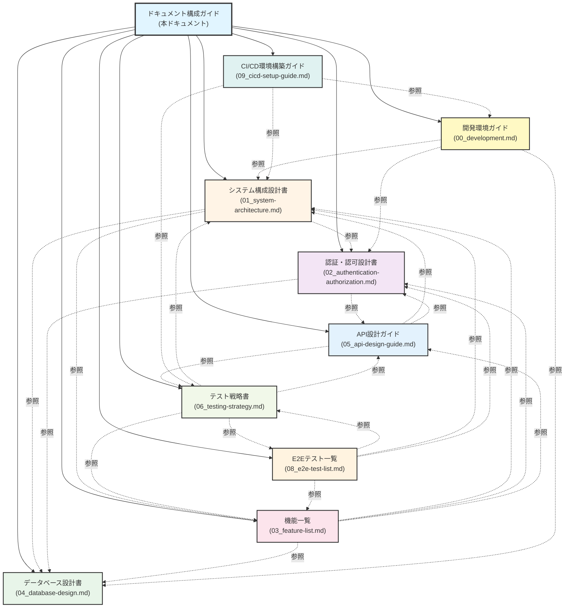

# ドキュメント構成ガイド

**作成日:** 2025-10-28
**最終更新:** 2025-11-23
**バージョン:** 1.3
**対象システム:** フルスタックWebアプリケーション

**更新履歴:**
- v1.3 (2025-11-23): ドキュメント全体の最終更新日を統一
- v1.2 (2025-11-10): CI/CD環境構築ガイド追加
- v1.1 (2025-10-28): MECE化対応 - API設計ガイド、テスト戦略書を追加、重複コンテンツを削減
- v1.0 (2025-10-28): 初版作成

---

## 1. はじめに

### 1.1 本ドキュメントの目的

このドキュメントは、プロジェクト内の技術ドキュメント全体の構成を説明するメタドキュメントです。各ドキュメントの役割、対象読者、カバー範囲を明確にし、開発者が必要な情報に迅速にアクセスできるようにすることを目的としています。

### 1.2 ドキュメント構成方針

本プロジェクトのドキュメントは以下の方針で構成されています：

- **関心の分離**: 各ドキュメントは特定の技術領域に焦点を当てる
- **階層的構成**: 概要から詳細へ、抽象から具体へと段階的に深掘りする
- **相互参照**: 関連情報は他ドキュメントへの明示的なリンクで補完
- **保守性**: 開発が進んでも構造自体は変わらない設計

---

## 2. ドキュメント一覧

### 2.1 ドキュメントマップ



### 2.2 ドキュメント分類

| カテゴリ | ドキュメント | 更新頻度 |
|---------|------------|---------|
| **アーキテクチャ** | システム構成設計書 | 低（技術スタック変更時） |
| **データ設計** | データベース設計書 | 中（スキーマ変更時） |
| **セキュリティ設計** | 認証・認可設計書 | 低（認証方式変更時） |
| **API設計** | API設計ガイド | 中（エンドポイント追加時） |
| **機能仕様** | 機能一覧 | 高（機能追加・変更時） |
| **テスト戦略** | テスト戦略書 | 低（テスト方針変更時） |
| **テスト詳細** | E2Eテスト一覧 | 中（機能追加・変更時） |
| **開発ガイド** | 開発環境ガイド | 中（開発フロー変更時） |
| **CI/CDガイド** | CI/CD環境構築ガイド | 低（CI/CD設定変更時） |

---

## 3. 各ドキュメントの詳細

### 3.1 システム構成設計書 (01_system-architecture.md)

**目的:**
- システム全体のアーキテクチャと技術スタックを俯瞰的に理解する
- レイヤー構成と技術選定の背景を明確にする

**対象読者:**
- 新規参画者（プロジェクト全体像の把握）
- アーキテクト（技術選定の評価・見直し）
- 外部レビュアー（システム理解）

**カバー範囲:**
- システム概要（目的、特徴）
- システムアーキテクチャ（全体構成、レイヤー構成）
- フロントエンド デザインシステム（UIコンポーネントライブラリ、デザイン原則）
- 技術スタック（フロントエンド、バックエンド、インフラ）
- 開発環境構成（Docker、ネットワーク、環境変数）
- 横断的関心事（セキュリティ、ログ、テスト戦略）

**主要セクション構成:**
1. システム概要 - システムの目的と特徴
2. システムアーキテクチャ - 全体構成図とレイヤー構成、デザインシステム
3. 技術スタック - 採用技術の一覧と用途
4. 開発環境構成 - Docker構成とネットワーク設計
5. 横断的関心事 - セキュリティ、ログ、テスト戦略
6. 付録 - コマンド一覧、参考資料

**他ドキュメントとの関係:**
- データベース設計書へ詳細を委譲
- 認証・認可設計書でセキュリティ詳細を補完
- 機能一覧で実装機能を列挙
- frontend/CLAUDE.mdでUIコンポーネントライブラリの詳細を説明

---

### 3.2 データベース設計書 (04_database-design.md)

**目的:**
- データモデルとテーブル構造を明確にする
- データ整合性とパフォーマンス最適化の方針を示す

**対象読者:**
- バックエンド開発者（データアクセス実装）
- データベース管理者（スキーマ管理）
- アーキテクト（データ設計評価）

**カバー範囲:**
- データベース概要（RDBMS、ストレージエンジン、文字セット）
- ER図（エンティティ関連図）
- テーブル定義（カラム、制約、インデックス）
- スキーマ管理（マイグレーション方針）
- パフォーマンス最適化（インデックス設計、クエリ最適化）
- データ保護（暗号化、整合性、バックアップ）

**主要セクション構成:**
1. データベース概要 - RDBMS仕様とテーブル一覧
2. ER図 - エンティティ関連図
3. テーブル定義 - 各テーブルの詳細仕様
4. スキーマ管理 - マイグレーション方針と管理コマンド
5. パフォーマンス最適化 - インデックス設計とクエリ戦略
6. データ保護とセキュリティ - 暗号化、整合性、バックアップ
7. 付録 - データベース管理コマンド

**他ドキュメントとの関係:**
- 認証・認可設計書で users/refresh_tokens テーブルの詳細を共有
- システム構成設計書でデータベース層の位置づけを説明
- 機能一覧でテーブルがどの機能で使われるかを示す

---

### 3.3 認証・認可設計書 (02_authentication-authorization.md)

**目的:**
- 認証・認可の仕組みとセキュリティ対策を詳細に説明する
- トークン管理とセキュリティベストプラクティスを示す

**対象読者:**
- セキュリティエンジニア（セキュリティ評価）
- バックエンド開発者（認証機能実装）
- フロントエンド開発者（認証フロー統合）

**カバー範囲:**
- 認証方式（JWT、Cookie管理）
- 認証フロー（ログイン、トークン更新、ログアウト）
- トークン仕様（アクセストークン、リフレッシュトークン）
- セキュリティ対策（XSS、CSRF、SQLインジェクション等）
- 認証API仕様
- 認可モデル（ユーザーロール、アクセス制御）
- 実装箇所リファレンス

**主要セクション構成:**
1. 概要 - 認証方式と主要な特徴
2. 認証フロー - シーケンス図を用いた処理フロー
3. トークン仕様 - アクセストークンとリフレッシュトークンの詳細
4. セキュリティ対策 - 各種攻撃への対策一覧
5. 認証API仕様 - エンドポイント詳細とリクエスト/レスポンス例
6. 認可 - ユーザーロール別アクセス権限
7. データベーススキーマ - 認証関連テーブル
8. 実装箇所リファレンス - コードファイルの場所

**他ドキュメントとの関係:**
- データベース設計書で users/refresh_tokens テーブルのスキーマを共有
- システム構成設計書でセキュリティ設計の概要を説明
- 機能一覧で認証機能の実装状況を示す

---

### 3.4 機能一覧 (03_feature-list.md)

**目的:**
- 実装済み機能を一覧化し、実装状況を可視化する
- API仕様と画面構成を整理する

**対象読者:**
- プロダクトマネージャー（機能把握）
- 開発者全般（実装範囲の確認）
- QAエンジニア（テスト範囲の確認）

**カバー範囲:**
- 機能マップ（機能の階層構造）
- 機能詳細（各機能の仕様と実装箇所）
- 実装状況マトリクス（実装済み/未実装）
- APIエンドポイント一覧
- 画面一覧と画面遷移図

**主要セクション構成:**
1. 概要 - ドキュメントの目的
2. 機能マップ - 機能の階層構造図
3. 機能詳細 - カテゴリ別の機能説明
4. 機能マトリクス - 実装状況の表形式まとめ
5. APIエンドポイント一覧 - REST API仕様
6. 画面一覧 - 画面構成と遷移図
7. 関連ドキュメント - 他ドキュメントへのリンク

**他ドキュメントとの関係:**
- システム構成設計書とデータベース設計書の内容を具体的な機能に結びつける
- 認証・認可設計書の認証機能を機能一覧に含める
- 開発環境ガイドで機能の動作確認方法を説明

---

### 3.5 開発環境ガイド (00_development.md)

**目的:**
- 開発環境のセットアップと日常的な開発フローを案内する
- よくある問題のトラブルシューティング方法を提供する

**対象読者:**
- 新規参画者（環境構築）
- 開発者全般（日常的な開発作業）
- DevOpsエンジニア（環境管理）

**カバー範囲:**
- 初期セットアップ手順
- 環境変数の設定方法
- よく使うコマンド一覧
- データベース管理方法
- Pre-commitフックの設定
- 開発フロー
- トラブルシューティング

**主要セクション構成:**
1. プロジェクトドキュメント - ドキュメント構成の概要
2. 初期セットアップ - 環境構築手順
3. 環境変数 - 設定ファイルと環境変数の説明
4. Redis - レート制限のためのRedis設定とトラブルシューティング
5. よく使うコマンド - 日常的な開発コマンド
6. データベース管理 - スキーマ管理とマイグレーション
7. Pre-commitフック - コード品質管理ツール
8. CI/CD ワークフロー - GitHub ActionsによるCI/CDパイプライン
9. 認証システム - 認証機能の概要
10. 開発フロー - 典型的な開発作業の流れ
11. トラブルシューティング - よくある問題と解決方法

**他ドキュメントとの関係:**
- システム構成設計書の開発環境構成を実践的に説明
- データベース設計書のスキーマ管理を実運用レベルで解説
- 認証・認可設計書の認証機能を開発者視点で要約
- すべてのドキュメントへの入り口として機能

---

### 3.6 API設計ガイド (05_api-design-guide.md)

**目的:**
- RESTful API設計の原則と命名規約を統一する
- エラーハンドリングの標準化を図る
- API開発時の設計指針を提供する

**対象読者:**
- バックエンド開発者（APIエンドポイント実装）
- フロントエンド開発者（API呼び出し実装）
- アーキテクト（API設計レビュー）

**カバー範囲:**
- RESTful API設計原則（リソース指向、HTTPメソッドの使い分け）
- エンドポイント命名規約（URL構造、命名ルール）
- リクエスト・レスポンス形式（JSON、ステータスコード）
- エラーハンドリング統一仕様
- クエリパラメータ設計（フィルタリング、ソート、ページネーション）
- バージョニング戦略
- 認証・認可方式
- API開発ベストプラクティス

**主要セクション構成:**
1. RESTful API設計原則 - 基本原則、HTTPメソッドの使い分け
2. エンドポイント命名規約 - URL構造、命名ルール、実装例
3. リクエスト・レスポンス形式 - JSON形式、クエリパラメータ
4. エラーハンドリング - ステータスコード、エラーレスポンス形式
5. クエリパラメータ設計 - フィルタリング、ソート、ページネーション
6. バージョニング戦略 - URLバージョニング vs ヘッダーバージョニング
7. 認証・認可 - Cookie ベース JWT 認証
8. 開発ベストプラクティス - バリデーション、セキュリティ、パフォーマンス

**他ドキュメントとの関係:**
- システム構成設計書で技術スタックの位置づけを説明
- 認証・認可設計書で認証APIの詳細を補完
- 機能一覧でAPIエンドポイント一覧を提供
- テスト戦略書でAPIテスト方針を説明

---

### 3.7 テスト戦略書 (06_testing-strategy.md)

**目的:**
- テストレベルとカバレッジ目標を明確にする
- テストデータ管理とモック戦略を標準化する
- 品質保証の基準を提供する

**対象読者:**
- 開発者全般（フロントエンド、バックエンド）
- QAエンジニア（テスト計画）
- テックリード、アーキテクト（品質管理）

**カバー範囲:**
- テスト戦略概要（テストピラミッド、基本方針）
- ユニットテスト（対象、ツール、カバレッジ目標、モック戦略）
- 統合テスト（APIテスト、コンポーネントテスト）
- E2Eテスト（ブラウザ自動化、クリティカルシナリオ）
- テストデータ管理（Fixture、Factory、Seed Data）
- テスト実行環境（ローカル、CI/CD）
- カバレッジ目標と測定方法

**主要セクション構成:**
1. テスト戦略概要 - 基本方針、テストピラミッド
2. ユニットテスト - 対象、ツール、カバレッジ目標、実装例
3. 統合テスト - APIテスト、コンポーネントテスト
4. E2Eテスト - Playwright、対象シナリオ
5. テストデータ管理 - Fixture、Factory、モック戦略
6. テスト実行環境 - ローカル、CI/CD統合
7. カバレッジ目標 - レイヤー別目標、測定方法
8. テストの保守性 - コード品質、ベストプラクティス

**他ドキュメントとの関係:**
- システム構成設計書でテスト環境の技術スタックを説明
- API設計ガイドでAPIテスト観点を提供
- 機能一覧でテスト対象機能を列挙
- 開発環境ガイドでテスト実行コマンドを説明
- E2Eテスト一覧で具体的なE2Eテストシナリオを詳細化

---

### 3.8 E2Eテスト一覧 (08_e2e-test-list.md)

**目的:**
- E2E（End-to-End）テストシナリオを具体的に一覧化する
- 各テストケースの実装ガイドラインを提供する
- テスト優先度とテストデータ管理方針を明確にする

**対象読者:**
- QAエンジニア（E2Eテスト実装）
- 開発者全般（機能追加時のE2Eテスト追加）
- テックリード、アーキテクト（テスト計画）

**カバー範囲:**
- E2Eテスト概要（目的、ツール、実行タイミング）
- テスト環境構成（テスト環境、テストデータ）
- E2Eテストシナリオ一覧（認証、TODO管理、セキュリティ等）
- テスト優先度マトリクス（クリティカル/重要/通常）
- テスト実装ガイド（Playwright実装例）
- テストデータ管理（セットアップ、クリーンアップ）
- CI/CD統合（GitHub Actions設定例）

**主要セクション構成:**
1. はじめに - ドキュメントの目的と対象読者
2. E2Eテスト概要 - テストツール、実行タイミング
3. テスト環境 - 環境構成、テストデータ
4. E2Eテストシナリオ一覧 - 全8テストケース（カテゴリ別）
5. テスト優先度マトリクス - 優先度別・機能別集計
6. テスト実装ガイド - Playwright実装例、コマンド
7. テストデータ管理 - セットアップスクリプト、クリーンアップ
8. CI/CD統合 - GitHub Actions設定例
9. 今後の拡張予定 - 未実装シナリオ
10. 関連ドキュメント - 他ドキュメントへのリンク

**他ドキュメントとの関係:**
- テスト戦略書でE2Eテストの位置づけと基本方針を説明
- 機能一覧でテスト対象機能を確認
- システム構成設計書でテスト環境の技術スタックを確認
- 認証・認可設計書で認証関連テストシナリオの詳細を補完

---

### 3.9 CI/CD環境構築ガイド (09_cicd-setup-guide.md)

**目的:**
- プロジェクトをフォークした後、CI/CD環境を構築する手順を提供する
- 初心者でも理解できる詳細な設定手順を提示する
- CI のみの最小構成から、デプロイを含むフル構成までをカバーする

**対象読者:**
- 新規参画者（プロジェクトをフォークして独自に運用する開発者）
- DevOps エンジニア（CI/CD パイプライン構築）
- インフラエンジニア（GCP 環境セットアップ）
- すべての開発者（CI/CD の理解）

**カバー範囲:**
- CI/CD パイプライン概要（ワークフロー構成、実行タイミング）
- 最小構成（CI のみ）の設定手順
- フル構成（デプロイ含む）の設定手順
- GCP プロジェクトの準備（API 有効化、サービスアカウント、Workload Identity）
- GitHub Secrets の設定
- Terraform 環境の構築
- トラブルシューティング
- ワークフローのカスタマイズ
- ベストプラクティス

**主要セクション構成:**
1. はじめに - ドキュメントの目的、前提知識、達成できること
2. CI/CD パイプライン概要 - ワークフロー構成、各ジョブの詳細
3. 最小構成（CI のみ）- 追加設定不要、動作確認手順、トラブルシューティング
4. フル構成（デプロイ含む）- GCP 準備、Secrets 設定、Terraform 実行
5. Terraform ワークフローの使用 - インフラ変更手順、ステートロック解除
6. ワークフローのカスタマイズ - タイムアウト、承認フロー、セキュリティチェック
7. ベストプラクティス - 運用、コスト最適化、セキュリティ
8. まとめ - 最小構成とフル構成の違い、次のステップ
9. よくある質問（FAQ）
10. 参考リソース

**他ドキュメントとの関係:**
- 開発環境ガイドでローカル環境の構築手順を説明（CI/CD は本番環境向け）
- テスト戦略書でテストの基本方針を説明（CI で実行されるテスト）
- システム構成設計書で技術スタックと環境構成を説明

---

## 4. ユースケース別参照ガイド

### 4.1 新規参画者向け

**推奨読み順:**

1. **開発環境ガイド** (00_development.md) - まず環境を構築
2. **システム構成設計書** (01_system-architecture.md) - システム全体を俯瞰
3. **認証・認可設計書** (02_authentication-authorization.md) - セキュリティの基礎理解
4. **機能一覧** (03_feature-list.md) - 現在の機能を把握
5. **API設計ガイド** (05_api-design-guide.md) - API設計の原則理解
6. **データベース設計書** (04_database-design.md) - データモデルの詳細理解
7. **テスト戦略書** (06_testing-strategy.md) - テスト方針の理解
8. **E2Eテスト一覧** (08_e2e-test-list.md) - E2Eテストシナリオの詳細
9. **CI/CD環境構築ガイド** (09_cicd-setup-guide.md) - CI/CD環境のセットアップ（プロジェクトをフォークする場合）

**必須ドキュメント:** 1, 2, 4
**役割別追加読解:**
- フロントエンド開発者: 3, 5, 7, 8
- バックエンド開発者: 3, 5, 6, 7, 8
- QAエンジニア: 7, 8
- インフラエンジニア: 1, 2, 9
- DevOpsエンジニア: 1, 2, 9

---

### 4.2 機能追加・変更時

**参照・更新が必要なドキュメント:**

| 変更内容 | 参照ドキュメント | 更新ドキュメント |
|---------|--------------|--------------|
| **新機能追加** | システム構成設計書、データベース設計書、API設計ガイド | 機能一覧、テスト戦略書、E2Eテスト一覧 |
| **UI変更** | システム構成設計書 | 機能一覧（画面一覧）、E2Eテスト一覧 |
| **API追加・変更** | API設計ガイド | 機能一覧（APIエンドポイント一覧） |
| **データベーススキーマ変更** | データベース設計書 | データベース設計書（テーブル定義） |
| **認証方式変更** | 認証・認可設計書、API設計ガイド | 認証・認可設計書、API設計ガイド、E2Eテスト一覧 |
| **技術スタック変更** | システム構成設計書 | システム構成設計書、開発環境ガイド |
| **開発フロー変更** | 開発環境ガイド | 開発環境ガイド |
| **テスト方針変更** | テスト戦略書 | テスト戦略書、E2Eテスト一覧 |
| **CI/CD設定変更** | CI/CD環境構築ガイド | CI/CD環境構築ガイド |

---

### 4.3 トラブルシューティング時

**問題種別ごとの参照先:**

| 問題カテゴリ | 参照ドキュメント | 参照セクション |
|------------|--------------|--------------|
| **環境構築エラー** | 開発環境ガイド | トラブルシューティング、初期セットアップ |
| **データベース接続エラー** | 開発環境ガイド、データベース設計書 | トラブルシューティング、データベース概要 |
| **認証エラー** | 開発環境ガイド、認証・認可設計書 | トラブルシューティング、認証フロー |
| **API エラー** | API設計ガイド、機能一覧 | エラーハンドリング、APIエンドポイント一覧 |
| **テストエラー** | テスト戦略書、開発環境ガイド | テスト実行環境、トラブルシューティング |
| **CI/CD エラー** | CI/CD環境構築ガイド | トラブルシューティング、GitHub Secrets設定、GCP設定 |
| **パフォーマンス問題** | データベース設計書、システム構成設計書 | パフォーマンス最適化、ログ設計 |
| **セキュリティ問題** | 認証・認可設計書、API設計ガイド | セキュリティ対策、開発ベストプラクティス |

---

### 4.4 レビュー・監査時

**ステークホルダー別推奨ドキュメント:**

| ステークホルダー | 参照ドキュメント | 確認ポイント |
|---------------|--------------|------------|
| **セキュリティ監査** | 認証・認可設計書、システム構成設計書 | セキュリティ対策、センシティブデータ管理 |
| **アーキテクチャレビュー** | システム構成設計書、データベース設計書 | レイヤー構成、技術選定、データモデル |
| **機能レビュー** | 機能一覧、システム構成設計書 | 実装機能、API仕様、画面構成 |
| **コンプライアンス監査** | 認証・認可設計書、データベース設計書 | データ保護、アクセス制御、ログ管理 |

---

## 5. ドキュメント管理方針

### 5.1 ドキュメント更新のタイミング

| トリガー | 更新対象ドキュメント | 更新タイミング |
|---------|------------------|--------------|
| **アーキテクチャ変更** | システム構成設計書 | 設計確定時 |
| **データベーススキーマ変更** | データベース設計書 | マイグレーション実装時 |
| **機能追加・変更** | 機能一覧 | 機能実装完了時 |
| **認証方式変更** | 認証・認可設計書 | 設計確定時 |
| **開発フロー変更** | 開発環境ガイド | フロー確定時 |
| **環境変数追加・変更** | 開発環境ガイド | 環境変数導入時 |
| **CI/CD設定変更** | CI/CD環境構築ガイド | ワークフロー変更時 |

### 5.2 ドキュメントのバージョン管理

**バージョニングルール:**
- メジャーバージョン（X.0）: アーキテクチャや技術スタックの大幅変更
- マイナーバージョン（X.Y）: 機能追加、セクション追加
- パッチバージョン（記載なし）: 誤字修正、小さな更新

**バージョン更新タイミング:**
- システム構成設計書: 技術スタック変更時
- データベース設計書: テーブル追加・削除時
- 認証・認可設計書: 認証方式変更時
- 機能一覧: 主要機能追加時
- 開発環境ガイド: 開発フロー大幅変更時

### 5.3 ドキュメントの品質保証

**レビュープロセス:**
1. 作成者によるセルフレビュー
2. 関連する領域の開発者によるピアレビュー
3. アーキテクトまたはテックリードによる最終確認

**レビュー観点:**
- 他ドキュメントとの整合性
- 情報の正確性
- 図表の明瞭性
- 相互参照の正しさ

### 5.4 ドキュメントの保守性

**保守性を高めるための原則:**

1. **DRY原則（Don't Repeat Yourself）**
   - 同じ情報を複数箇所に記載しない
   - 詳細は一箇所にまとめ、他は参照リンクで対応

2. **関心の分離**
   - 各ドキュメントは明確な責務を持つ
   - 領域をまたぐ情報は適切なドキュメントへ委譲

3. **抽象度の統一**
   - 同一ドキュメント内では抽象度を揃える
   - 詳細が必要な場合は別ドキュメントへ分離

4. **図表の活用**
   - 複雑な関係性は図表で表現
   - Mermaid記法で保守しやすい図を作成

---

## 6. 関連リソース

### 6.1 プロジェクト固有ドキュメント

| ドキュメント | パス | 対象 |
|------------|------|------|
| **バックエンド実装ガイド** | `backend/CLAUDE.md` | バックエンド開発者 |
| **フロントエンド実装ガイド** | `frontend/CLAUDE.md` | フロントエンド開発者 |
| **プロジェクト共通ガイド** | `CLAUDE.md` | 全開発者 |

**注記:**
- `frontend/CLAUDE.md` には、**UIコンポーネントライブラリ**（Button, Input, Alert, Modal）の詳細なドキュメントが含まれています。各コンポーネントのAPI仕様、使用例、デザイン原則、アクセシビリティ対応などが記載されており、フロントエンド開発者にとって重要なリファレンスとなります。

### 6.2 言語規約

プロジェクトのドキュメントは、対象読者と用途によって言語を使い分けています:

| ドキュメント種別 | 言語 | 理由 |
|----------------|------|------|
| **docs/*.md** | 日本語 | エンドユーザー向けの詳細ドキュメント |
| **CLAUDE.md** | 英語 | Claude Codeとの統合のため |
| **README.md** | 英語 | 国際的な開発者向け |
| **specs/*.md** | 日本語 | プロジェクト仕様書 |

この規約により、適切な読者が適切な言語でドキュメントにアクセスできます。

### 6.3 外部リファレンス

技術スタックの公式ドキュメントについては、システム構成設計書の「付録 > 参考資料」セクションを参照してください。

---

## 7. まとめ

### 7.1 ドキュメント階層構造

```
ドキュメント構成ガイド（本ドキュメント）
├── システム構成設計書（アーキテクチャ全体）
│   ├── データベース設計書（データ層の詳細）
│   ├── 認証・認可設計書（セキュリティの詳細）
│   ├── API設計ガイド（API設計原則）
│   └── 機能一覧（機能の詳細）
├── テスト戦略書（テスト方針）
│   └── E2Eテスト一覧（E2Eテストシナリオ詳細）
├── 開発環境ガイド（実践的な開発手順）
│   ├── システム構成設計書を参照
│   ├── データベース設計書を参照
│   ├── 認証・認可設計書を参照
│   ├── API設計ガイドを参照
│   └── テスト戦略書を参照
└── CI/CD環境構築ガイド（CI/CD環境セットアップ）
    ├── 開発環境ガイドを参照
    ├── テスト戦略書を参照
    └── システム構成設計書を参照
```

### 7.2 ドキュメントの役割分担

| ドキュメント | 主な視点 | 抽象度 |
|------------|---------|-------|
| **ドキュメント構成ガイド** | メタ | 最高 |
| **システム構成設計書** | アーキテクチャ | 高 |
| **データベース設計書** | データ設計 | 中 |
| **認証・認可設計書** | セキュリティ設計 | 中 |
| **API設計ガイド** | API設計 | 中 |
| **機能一覧** | 機能仕様 | 中 |
| **テスト戦略書** | テスト設計 | 中 |
| **E2Eテスト一覧** | テスト詳細 | 低 |
| **開発環境ガイド** | 実践 | 低 |
| **CI/CD環境構築ガイド** | CI/CD実践 | 低 |

### 7.3 最後に

本ドキュメントは、プロジェクトのドキュメント全体を俯瞰し、各ドキュメントの位置づけを明確にするためのガイドです。開発が進むにつれて各ドキュメントの内容は更新されますが、このドキュメント構成ガイド自体の構造は比較的安定しています。

新しいドキュメントの追加や既存ドキュメントの大幅な再編成を行う場合は、本ドキュメントも併せて更新してください。

---

**END OF DOCUMENT**
