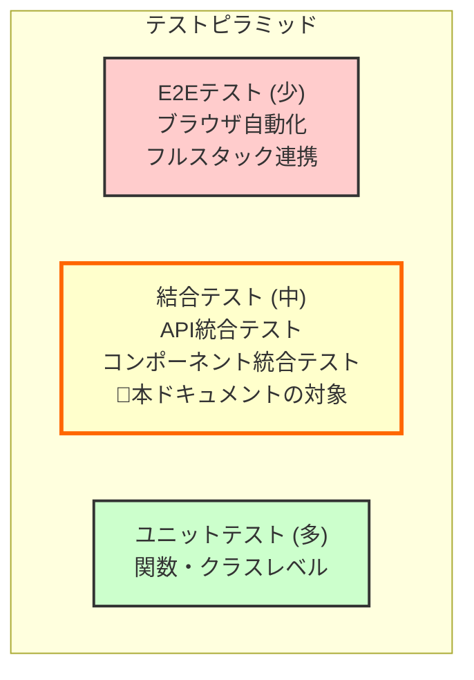

# 結合テスト一覧

**作成日:** 2025-10-29
**バージョン:** 1.0
**対象システム:** TODO アプリケーション

---

## 1. はじめに

### 1.1 本ドキュメントの目的

本ドキュメントは、TODOアプリケーションの結合テスト（統合テスト）を体系的に整理し、テストの網羅性と保守性を確保することを目的としています。結合テストは、複数のコンポーネントやレイヤーが統合された状態での動作を検証します。

### 1.2 対象読者

- 開発者全般（フロントエンド、バックエンド）
- QAエンジニア
- テックリード、アーキテクト

**関連ドキュメント:**
- [テスト戦略書](./testing-strategy.md) - テスト全体戦略、テストレベル
- [システム構成設計書](./system-architecture.md) - システムアーキテクチャ、技術スタック
- [API設計ガイド](./api-design-guide.md) - API仕様、エンドポイント定義

---

## 2. 結合テストの定義と範囲

### 2.1 結合テストとは

結合テスト（Integration Test）は、複数のモジュールやコンポーネントが統合された状態で正しく動作することを検証するテストです。単体テストが個々の関数やクラスをテストするのに対し、結合テストは以下のような連携を検証します：

- **バックエンド**: APIエンドポイント → サービス層 → リポジトリ層 → データベース
- **フロントエンド**: コンポーネント → Context/Hooks → API呼び出し
- **E2E**: ブラウザ → フロントエンド → バックエンド → データベース

### 2.2 テストレベルの位置づけ



### 2.3 本ドキュメントの対象範囲

| テストカテゴリ | 対象 | 実装状況 |
|-------------|------|---------|
| **バックエンドAPI統合テスト** | API routes → services → repositories → DB | ✓ 実装済み |
| **フロントエンド統合テスト** | Component → Context/Hooks → (モックAPI) | ✓ 実装済み |
| **E2Eテスト** | ブラウザ → Frontend → Backend → DB | ✗ 未実装（将来対応） |

---

## 3. バックエンド結合テスト一覧

バックエンドの結合テストは、APIエンドポイント（routes）からデータベースまでの全レイヤーを統合した状態でテストします。

### 3.1 テスト構成

| テストファイル | 対象機能 | テスト数 | 実装状況 |
|-------------|---------|---------|---------|
| `backend/tests/routes/test_todo_routes.py` | TODO CRUD操作 | 10+ | ✓ |
| `backend/tests/routes/test_auth_routes.py` | 認証フロー（ログイン、ログアウト、リフレッシュ） | 18+ | ✓ |
| `backend/tests/security/test_authorization.py` | 認可・アクセス制御 | 12+ | ✓ |

### 3.2 TODO CRUD 統合テスト

**ファイル:** `backend/tests/routes/test_todo_routes.py`

**対象:** TODO作成、取得、更新、削除の各APIエンドポイント

#### 3.2.1 TODO取得（GET）

| # | テストケース | テスト関数名 | 目的 |
|---|------------|-------------|------|
| 1 | 初回アクセス時に空のリストを返す | `test_get_todos_returns_empty_list` | 初期状態の確認 |
| 2 | ステータスフィルター（active） | `test_get_todos_with_status_filter` | アクティブなTODOのみ取得 |
| 3 | ステータスフィルター（completed） | `test_get_todos_with_status_filter` | 完了済みTODOのみ取得 |
| 4 | ステータスフィルター（all） | `test_get_todos_with_status_filter` | すべてのTODOを取得 |

**検証項目:**
- レスポンスステータスコード（200）
- レスポンスボディの構造（`items`, `meta`）
- フィルター条件に応じた適切なデータ返却
- ユーザー単位でのデータ隔離（他ユーザーのTODOは取得できない）

#### 3.2.2 TODO作成（POST）

| # | テストケース | テスト関数名 | 目的 |
|---|------------|-------------|------|
| 1 | 正常系: すべてのフィールドを指定 | `test_create_todo_success` | TODO作成の基本動作確認 |
| 2 | 異常系: 過去の期限日 | `test_create_todo_with_past_due_date_returns_error` | 期限日のバリデーション |
| 3 | 正常系: オプション項目なし（titleのみ） | *(実装推奨)* | 最小限のフィールドでの作成 |
| 4 | 異常系: titleが空文字列 | *(実装推奨)* | 必須項目のバリデーション |

**検証項目:**
- レスポンスステータスコード（201: 成功、400: バリデーションエラー）
- 作成されたTODOのフィールド値（title, detail, due_date, is_completed）
- 自動生成されるフィールド（id, user_id, created_at）
- データベースへの永続化確認

#### 3.2.3 TODO更新（PATCH）

| # | テストケース | テスト関数名 | 目的 |
|---|------------|-------------|------|
| 1 | 正常系: 特定フィールドのみ更新（title） | `test_update_todo_updates_selected_fields` | 部分更新の動作確認 |
| 2 | 正常系: 複数フィールド更新（detail, due_date） | `test_update_todo_updates_selected_fields` | 複数項目の同時更新 |
| 3 | 異常系: リクエストボディなし | `test_update_todo_missing_body_returns_error` | バリデーションエラー処理 |
| 4 | 異常系: 存在しないTODO ID | *(実装推奨)* | 404エラーの確認 |
| 5 | 異常系: 他ユーザーのTODO更新 | `backend/tests/security/test_authorization.py::test_user_cannot_update_another_users_todo` | 認可制御の確認 |

**検証項目:**
- レスポンスステータスコード（200: 成功、400: バリデーションエラー、404: 存在しないリソース）
- 更新されたフィールドの値
- 更新されていないフィールドの保持
- データベースの更新確認

#### 3.2.4 TODO完了切替（PATCH）

| # | テストケース | テスト関数名 | 目的 |
|---|------------|-------------|------|
| 1 | 正常系: 完了マーク切替（false → true） | `test_toggle_todo_completion` | 完了状態の切替 |
| 2 | 正常系: 完了マーク切替（true → false） | *(実装推奨)* | 完了解除の動作確認 |
| 3 | 異常系: boolean以外の値 | `test_toggle_todo_requires_boolean` | 型バリデーション |
| 4 | 異常系: 他ユーザーのTODO完了切替 | `backend/tests/security/test_authorization.py::test_user_cannot_complete_another_users_todo` | 認可制御の確認 |

**検証項目:**
- レスポンスステータスコード（200: 成功、400: バリデーションエラー）
- is_completedフィールドの更新
- データベースの更新確認

#### 3.2.5 TODO削除（DELETE）

| # | テストケース | テスト関数名 | 目的 |
|---|------------|-------------|------|
| 1 | 正常系: TODO削除 | `test_delete_todo_success` | 削除の基本動作確認 |
| 2 | 削除後に取得できないことを確認 | `test_delete_todo_success` | 削除の永続化確認 |
| 3 | 異常系: 存在しないTODO ID | *(実装推奨)* | 404エラーの確認 |
| 4 | 異常系: 他ユーザーのTODO削除 | `backend/tests/security/test_authorization.py::test_user_cannot_delete_another_users_todo` | 認可制御の確認 |

**検証項目:**
- レスポンスステータスコード（204: 成功、404: 存在しないリソース）
- データベースからの削除確認
- 削除後のGETリクエストで取得できないことの確認

---

### 3.3 認証・認可 統合テスト

**ファイル:** `backend/tests/routes/test_auth_routes.py`

**対象:** ユーザー認証フロー（ログイン、ログアウト、トークンリフレッシュ）

#### 3.3.1 ログイン（POST /api/auth/login）

| # | テストケース | テスト関数名 | 目的 |
|---|------------|-------------|------|
| 1 | 正常系: 正しい認証情報でログイン | `test_login_success` | ログインの基本動作確認 |
| 2 | Cookieの設定確認（access_token, refresh_token） | `test_login_sets_cookies` | セッション管理の確認 |
| 3 | 異常系: 誤ったパスワード | `test_login_invalid_password` | 認証失敗の処理 |
| 4 | 異常系: 存在しないユーザー | `test_login_user_not_found` | ユーザー不在時の処理 |
| 5 | 異常系: リクエストボディなし | `test_login_missing_body` | バリデーションエラー |
| 6 | 異常系: 不正なメールアドレス形式 | `test_login_invalid_email_format` | メール形式のバリデーション |
| 7 | 異常系: パスワードが短すぎる | `test_login_invalid_password_too_short` | パスワード長のバリデーション |
| 8 | 異常系: パスワードに数字が含まれていない | `test_login_invalid_password_no_number` | パスワード複雑さのバリデーション |
| 9 | 異常系: メールアドレスが空 | `test_login_empty_email` | 必須項目のバリデーション |
| 10 | 異常系: メールアドレスフィールドなし | `test_login_missing_email_field` | 必須項目のバリデーション |

**検証項目:**
- レスポンスステータスコード（200: 成功、400: バリデーションエラー、401: 認証失敗）
- レスポンスボディにユーザー情報が含まれる
- Cookie（access_token, refresh_token）の設定
- JWTトークンの有効性

#### 3.3.2 トークンリフレッシュ（POST /api/auth/refresh）

| # | テストケース | テスト関数名 | 目的 |
|---|------------|-------------|------|
| 1 | 正常系: 有効なリフレッシュトークンで更新 | `test_refresh_token_success` | トークン更新の基本動作 |
| 2 | 新しいアクセストークンの取得 | `test_refresh_token_success` | 新トークン発行の確認 |
| 3 | 異常系: 無効なリフレッシュトークン | `test_refresh_invalid_token` | トークン検証 |
| 4 | 異常系: 有効期限切れのトークン | `test_refresh_expired_token` | 有効期限チェック |
| 5 | 異常系: リフレッシュトークンなし | `test_refresh_missing_token` | 必須トークンのチェック |
| 6 | 異常系: ログアウト後の無効化されたトークン | `test_logout_invalidates_refresh_token` | トークン無効化の確認 |

**検証項目:**
- レスポンスステータスコード（200: 成功、401: 認証失敗）
- 新しいアクセストークンの発行
- ユーザー情報の返却
- トークンのローテーション

#### 3.3.3 ログアウト（POST /api/auth/logout）

| # | テストケース | テスト関数名 | 目的 |
|---|------------|-------------|------|
| 1 | 正常系: ログアウト成功 | `test_logout_success` | ログアウトの基本動作 |
| 2 | Cookieのクリア確認 | `test_logout_success` | セッション破棄の確認 |
| 3 | リフレッシュトークンの無効化 | `test_logout_invalidates_refresh_token` | DBからのトークン削除 |
| 4 | ログアウト後のトークンリフレッシュ失敗 | `test_logout_invalidates_refresh_token` | 無効化されたトークンの拒否 |

**検証項目:**
- レスポンスステータスコード（200: 成功）
- Cookie（access_token, refresh_token）のクリア（max-age=0）
- データベースからのリフレッシュトークン削除
- ログアウト後のトークンリフレッシュが失敗すること

---

### 3.4 セキュリティ・認可 統合テスト

**ファイル:** `backend/tests/security/test_authorization.py`

**対象:** クロスユーザーアクセス制御、認証要件、トークンセキュリティ

#### 3.4.1 クロスユーザーアクセス制御テスト

| # | テストケース | テスト関数名 | 目的 |
|---|------------|-------------|------|
| 1 | 他ユーザーのTODO閲覧防止 | `test_user_cannot_access_another_users_todo` | データ隔離の確認 |
| 2 | 他ユーザーのTODO更新防止 | `test_user_cannot_update_another_users_todo` | 更新権限の確認 |
| 3 | 他ユーザーのTODO削除防止 | `test_user_cannot_delete_another_users_todo` | 削除権限の確認 |
| 4 | 他ユーザーのTODO完了切替防止 | `test_user_cannot_complete_another_users_todo` | 操作権限の確認 |

**検証項目:**
- ユーザーAが作成したTODOをユーザーBが操作できないこと
- 不正アクセス時のHTTPステータスコード（404: リソースが見つからない）
- ユーザーAのデータは影響を受けないこと
- データベースレベルでのユーザー単位の隔離

#### 3.4.2 認証要件テスト

| # | テストケース | テスト関数名 | 目的 |
|---|------------|-------------|------|
| 1 | 未認証: TODO一覧取得の拒否 | `test_unauthenticated_user_cannot_access_todos` | 認証必須エンドポイントの保護 |
| 2 | 未認証: TODO作成の拒否 | `test_unauthenticated_user_cannot_create_todo` | 認証必須エンドポイントの保護 |
| 3 | 未認証: TODO更新の拒否 | *(実装推奨)* | 認証必須エンドポイントの保護 |
| 4 | 未認証: TODO削除の拒否 | *(実装推奨)* | 認証必須エンドポイントの保護 |

**検証項目:**
- 未認証リクエストのHTTPステータスコード（401: 認証が必要）
- エラーレスポンスの構造
- 認証トークンなしでのアクセス拒否

#### 3.4.3 トークンセキュリティテスト

| # | テストケース | テスト関数名 | 目的 |
|---|------------|-------------|------|
| 1 | 無効なJWTトークンの拒否 | `test_invalid_jwt_token_rejected` | トークン形式の検証 |
| 2 | 有効期限切れトークンの拒否 | `test_expired_jwt_token_rejected` | 有効期限チェック |
| 3 | 改ざんされたトークンの拒否 | `test_tampered_jwt_token_rejected` | 署名検証 |
| 4 | user_idが含まれないトークンの拒否 | *(実装推奨)* | ペイロードの必須項目検証 |

**検証項目:**
- 不正なトークンのHTTPステータスコード（401: 認証失敗）
- トークン署名の検証
- トークン有効期限の検証
- トークンペイロードの必須項目検証

---

## 4. フロントエンド結合テスト一覧

フロントエンドの結合テストは、複数のコンポーネント、Context、Hooksが統合された状態で正しく動作することを検証します。

### 4.1 テスト構成

| テストファイル | 対象機能 | テスト数 | 実装状況 |
|-------------|---------|---------|---------|
| `frontend/src/components/TodoList.test.tsx` | TODOリストコンポーネント | 15+ | ✓ |
| `frontend/src/components/TodoForm.test.tsx` | TODOフォームコンポーネント | 10+ | ✓ |
| `frontend/src/contexts/AuthContext.test.tsx` | 認証Context | 15+ | ✓ |
| `frontend/src/components/ProtectedRoute.test.tsx` | ルートガード | 5+ | ✓ |

### 4.2 TodoList コンポーネント統合テスト

**ファイル:** `frontend/src/components/TodoList.test.tsx`

**対象:** TODOリストの表示、ローディング状態、空状態、ユーザーインタラクション

#### 4.2.1 ローディング状態

| # | テストケース | テスト名 | 目的 |
|---|------------|---------|------|
| 1 | ローディング中のメッセージ表示 | `shows loading message when isLoading is true` | ローディングUI確認 |
| 2 | ローディング中はTODOリスト非表示 | `does not show todo list when loading` | UIの競合回避 |

**検証項目:**
- ローディングメッセージの表示
- ローディング中はTODOリストが表示されないこと

#### 4.2.2 空状態

| # | テストケース | テスト名 | 目的 |
|---|------------|---------|------|
| 1 | TODOが0件時の空メッセージ表示 | `shows empty message when no todos` | 空状態UI確認 |
| 2 | ローディング中は空メッセージ非表示 | `does not show empty message when loading` | UIの優先度確認 |

**検証項目:**
- TODOが0件時の空メッセージ表示
- ローディング状態と空状態の排他制御

#### 4.2.3 TODOリスト表示

| # | テストケース | テスト名 | 目的 |
|---|------------|---------|------|
| 1 | 複数TODOのレンダリング | `renders a list of todos` | リストの基本表示 |
| 2 | TODOの詳細表示 | `renders todo with detail` | 詳細フィールドの表示 |
| 3 | 詳細がnullの場合は非表示 | `does not render detail when null` | 条件付きレンダリング |
| 4 | 期限日の表示 | *(実装推奨)* | 日付フォーマット確認 |
| 5 | 完了済みTODOの視覚的表現 | *(実装推奨)* | 完了状態のスタイリング |

**検証項目:**
- 各TODOのタイトル、詳細、期限日の表示
- 完了状態に応じたスタイリング
- オプション項目の条件付き表示

#### 4.2.4 ユーザーインタラクション

| # | テストケース | テスト名 | 目的 |
|---|------------|---------|------|
| 1 | 完了チェックボックスのクリック | `calls onToggle when checkbox is clicked` | 完了切替イベント |
| 2 | 編集ボタンのクリック | `calls onEdit when edit button is clicked` | 編集イベント |
| 3 | 削除ボタンのクリック | `calls onDelete when delete button is clicked` | 削除イベント |

**検証項目:**
- 各ボタン/チェックボックスのクリックイベント発火
- 正しいTODO IDが引数として渡されること
- イベントハンドラーの呼び出し回数

---

### 4.3 TodoForm コンポーネント統合テスト

**ファイル:** `frontend/src/components/TodoForm.test.tsx`

**対象:** TODOフォームの入力、バリデーション、送信処理

#### 4.3.1 フォーム入力

| # | テストケース | テスト名 | 目的 |
|---|------------|---------|------|
| 1 | タイトル入力フィールド | `allows entering title` | テキスト入力 |
| 2 | 詳細入力フィールド | `allows entering detail` | テキストエリア入力 |
| 3 | 期限日選択 | `allows selecting due date` | 日付ピッカー |
| 4 | 初期値の表示（編集モード） | `displays initial values in edit mode` | 編集時の初期化 |

**検証項目:**
- 各入力フィールドへの入力
- 入力値の保持
- 編集モード時の初期値表示

#### 4.3.2 バリデーション

| # | テストケース | テスト名 | 目的 |
|---|------------|---------|------|
| 1 | タイトル必須チェック | `shows error when title is empty` | 必須項目バリデーション |
| 2 | タイトル最大文字数チェック | `shows error when title exceeds max length` | 文字数制限 |
| 3 | 過去の期限日エラー | `shows error when due date is in the past` | 日付バリデーション |
| 4 | バリデーションエラー時の送信防止 | `does not submit when validation fails` | 送信制御 |

**検証項目:**
- バリデーションエラーメッセージの表示
- エラー時の送信処理の抑制
- エラー解消後のメッセージクリア

#### 4.3.3 フォーム送信

| # | テストケース | テスト名 | 目的 |
|---|------------|---------|------|
| 1 | 正常な送信処理 | `calls onSubmit with form data` | 送信イベント |
| 2 | 送信後のフォームクリア | `clears form after successful submit` | フォームリセット |
| 3 | 送信中のボタン無効化 | `disables submit button during submission` | 二重送信防止 |
| 4 | 送信エラー時の処理 | `shows error message on submit failure` | エラーハンドリング |

**検証項目:**
- フォームデータの正しい送信
- 送信後のフォーム状態
- ローディング状態の制御
- エラーハンドリング

---

### 4.4 AuthContext 統合テスト

**ファイル:** `frontend/src/contexts/AuthContext.test.tsx`

**対象:** 認証状態管理、ログイン、ログアウト、トークンリフレッシュ

#### 4.4.1 初期ロード

| # | テストケース | テスト名 | 目的 |
|---|------------|---------|------|
| 1 | マウント時のトークンリフレッシュ試行 | `attempts to refresh token on mount` | 自動ログイン |
| 2 | トークンリフレッシュ成功時のユーザー設定 | `sets user when refresh token succeeds` | 認証状態の復元 |
| 3 | トークンリフレッシュ失敗時の未認証状態 | `stays unauthenticated when refresh token fails` | ログアウト状態維持 |
| 4 | 初期ローディング状態 | `sets isLoading to true initially` | ローディングUI制御 |
| 5 | ローディング完了後の状態 | `sets isLoading to false after refresh attempt` | ローディングUI制御 |

**検証項目:**
- 自動トークンリフレッシュの実行
- 認証状態の復元
- ローディング状態の遷移

#### 4.4.2 ログイン

| # | テストケース | テスト名 | 目的 |
|---|------------|---------|------|
| 1 | 正常なログイン処理 | `logs in successfully with valid credentials` | ログイン成功 |
| 2 | ログイン後のユーザー設定 | `logs in successfully with valid credentials` | 認証状態の更新 |
| 3 | ログイン失敗時のエラー | `shows error on login failure` | エラーハンドリング |
| 4 | ログイン中のローディング状態 | `sets isLoading during login` | ローディングUI制御 |

**検証項目:**
- ログイン処理の正常動作
- 認証状態の更新
- エラーハンドリング
- ローディング状態の制御

#### 4.4.3 ログアウト

| # | テストケース | テスト名 | 目的 |
|---|------------|---------|------|
| 1 | ログアウト処理 | `logs out successfully` | ログアウト実行 |
| 2 | ログアウト後のユーザークリア | `logs out successfully` | 認証状態のクリア |
| 3 | ログアウト後の未認証状態 | `logs out successfully` | isAuthenticatedの更新 |

**検証項目:**
- ログアウト処理の実行
- ユーザー情報のクリア
- 認証状態のリセット

---

### 4.5 ProtectedRoute コンポーネント統合テスト

**ファイル:** `frontend/src/components/ProtectedRoute.test.tsx`

**対象:** ルートガード、認証状態に応じたリダイレクト

#### 4.5.1 認証状態によるルート制御

| # | テストケース | テスト名 | 目的 |
|---|------------|---------|------|
| 1 | 認証済み: コンテンツ表示 | `renders children when authenticated` | 認証済みルート表示 |
| 2 | 未認証: ログインページへリダイレクト | `redirects to login when not authenticated` | 認証ガード |
| 3 | ローディング中: ローディング表示 | `shows loading during auth check` | ローディングUI |
| 4 | ローディング完了後の適切な表示 | `shows content after loading completes` | 遷移制御 |

**検証項目:**
- 認証状態に応じた表示制御
- 未認証時のリダイレクト
- ローディング状態の適切な処理

---

## 5. E2Eテスト一覧（将来実装予定）

E2Eテストは、ブラウザ自動化ツールを使用してフルスタック全体を統合的にテストします。

### 5.1 実装予定のツール

| ツール | 用途 | 選定理由 |
|-------|------|---------|
| **Playwright** | ブラウザ自動化 | 複数ブラウザ対応、高速、信頼性が高い |

### 5.2 E2Eテストシナリオ（実装予定）

#### 5.2.1 認証フロー E2E

| # | テストシナリオ | 対象機能 | 優先度 |
|---|-------------|---------|--------|
| 1 | ユーザーログイン → TODOリスト表示 | 認証 + データ取得 | 高 |
| 2 | ログアウト → ログインページへリダイレクト | 認証解除 | 高 |
| 3 | 未認証アクセス → ログインページへリダイレクト | ルートガード | 高 |
| 4 | ログイン状態の永続化（ページリロード） | トークンリフレッシュ | 中 |

#### 5.2.2 TODO操作 E2E

| # | テストシナリオ | 対象機能 | 優先度 |
|---|-------------|---------|--------|
| 1 | TODO作成 → リストに表示 | 作成 + 一覧取得 | 高 |
| 2 | TODO編集 → 変更内容が反映 | 更新 + 一覧取得 | 高 |
| 3 | TODO削除 → リストから削除 | 削除 + 一覧取得 | 高 |
| 4 | TODO完了切替 → 完了状態の変更 | 完了切替 + 一覧取得 | 中 |
| 5 | フィルター切替（active/completed/all） | フィルタリング | 中 |

#### 5.2.3 複雑なユーザーフロー E2E

| # | テストシナリオ | 対象機能 | 優先度 |
|---|-------------|---------|--------|
| 1 | ログイン → TODO作成 → ログアウト → ログイン → TODO確認 | 認証 + データ永続化 | 高 |
| 2 | 複数TODO作成 → フィルター切替 → 一部削除 | CRUD + フィルタリング | 中 |
| 3 | バリデーションエラー時のフィードバック | エラーハンドリング | 中 |
| 4 | ネットワークエラー時のエラー表示 | エラーハンドリング | 低 |

---

## 6. テスト実行方法

### 6.1 バックエンド結合テスト実行

```bash
# すべての結合テストを実行
poetry -C backend run pytest backend/tests/routes/ backend/tests/security/

# 特定のテストファイルを実行
poetry -C backend run pytest backend/tests/routes/test_todo_routes.py

# 特定のテスト関数を実行
poetry -C backend run pytest backend/tests/routes/test_todo_routes.py::test_create_todo_success

# カバレッジ付きで実行
poetry -C backend run pytest backend/tests/routes/ backend/tests/security/ --cov=app --cov-report=html
```

### 6.2 フロントエンド結合テスト実行

```bash
# すべての結合テストを実行
pnpm --dir frontend run test

# 特定のテストファイルを実行
pnpm --dir frontend run test src/components/TodoList.test.tsx

# カバレッジ付きで実行
pnpm --dir frontend run test:coverage

# ウォッチモードで実行（開発時）
pnpm --dir frontend run test --watch
```

### 6.3 統合コマンド

```bash
# すべてのテストを実行（フロントエンド + バックエンド）
make test

# カバレッジ付きで実行
make test-cov

# 高速実行（カバレッジなし）
make test-fast
```

---

## 7. テスト追加のガイドライン

### 7.1 新規結合テスト追加時のチェックリスト

新しい結合テストを追加する際は、以下を確認してください：

- [ ] テストの目的が明確である
- [ ] テスト名がテストケースを説明している（日本語またはスネークケース）
- [ ] 正常系と異常系の両方をカバーしている
- [ ] テストデータはFactoryまたはHelperを使用している
- [ ] アサーションが適切である（レスポンスコード、データ構造、エラーメッセージ）
- [ ] テストが独立している（他のテストに依存しない）
- [ ] テスト実行後のクリーンアップが適切である
- [ ] 本ドキュメントのテスト一覧に追記している

### 7.2 テストケース設計の原則

**FIRST原則:**
- **Fast**: 高速に実行できる
- **Independent**: 独立している（他のテストに依存しない）
- **Repeatable**: 繰り返し実行可能（毎回同じ結果）
- **Self-validating**: 自己検証可能（手動確認不要）
- **Timely**: 適切なタイミングで作成（実装と同時）

**AAA（Arrange-Act-Assert）パターン:**
```python
def test_create_todo_success(auth_client):
    # Arrange: テストデータの準備
    todo_data = TodoFactory.build(title="Test Todo")

    # Act: テスト対象の実行
    response = auth_client.post("/api/todos", json=todo_data)

    # Assert: 結果の検証
    data = assert_response_success(response, 201)
    assert_todo_matches(data, title="Test Todo")
```

### 7.3 実装推奨テストケース

以下のテストケースは現在未実装ですが、実装を推奨します：

**バックエンド:**
- [ ] TODO作成: 最小限のフィールドでの作成（titleのみ）
- [ ] TODO作成: titleが空文字列の場合のエラー
- [ ] TODO更新: 存在しないTODO IDでの404エラー
- [ ] TODO削除: 存在しないTODO IDでの404エラー
- [ ] 未認証: TODO更新の拒否
- [ ] 未認証: TODO削除の拒否
- [ ] トークンセキュリティ: user_idが含まれないトークンの拒否

**フロントエンド:**
- [ ] TodoList: 期限日の表示
- [ ] TodoList: 完了済みTODOの視覚的表現

---

## 8. トラブルシューティング

### 8.1 テスト失敗時の確認ポイント

| 症状 | 原因 | 対処方法 |
|-----|------|---------|
| テストが失敗する（偶発的） | テストの独立性がない | 各テストが独自のデータを使用しているか確認 |
| データベースエラー | トランザクションのロールバック失敗 | Fixtureの`db_session`を正しく使用しているか確認 |
| 認証エラー | トークンの有効期限切れ | テスト用のトークン生成ヘルパーを使用 |
| フロントエンドテスト失敗 | モックの設定不備 | `vi.mock()`が正しく設定されているか確認 |

### 8.2 デバッグ方法

**バックエンド:**
```bash
# 詳細ログ付きでテスト実行
poetry -C backend run pytest -vv backend/tests/routes/test_todo_routes.py

# 失敗したテストのみ再実行
poetry -C backend run pytest --lf

# 特定のテストでデバッガを起動
poetry -C backend run pytest --pdb backend/tests/routes/test_todo_routes.py::test_create_todo_success
```

**フロントエンド:**
```bash
# UIモードでテスト実行（ブラウザで確認）
pnpm --dir frontend run test --ui

# 詳細ログ付きでテスト実行
pnpm --dir frontend run test --reporter=verbose
```

---

## 9. 関連ドキュメント

- [テスト戦略書](./testing-strategy.md) - テスト全体戦略、テストレベル、カバレッジ目標
- [システム構成設計書](./system-architecture.md) - システムアーキテクチャ、技術スタック
- [API設計ガイド](./api-design-guide.md) - API仕様、エンドポイント定義
- [開発環境ガイド](./development.md) - 開発環境セットアップ、コマンド一覧

---

**END OF DOCUMENT**
