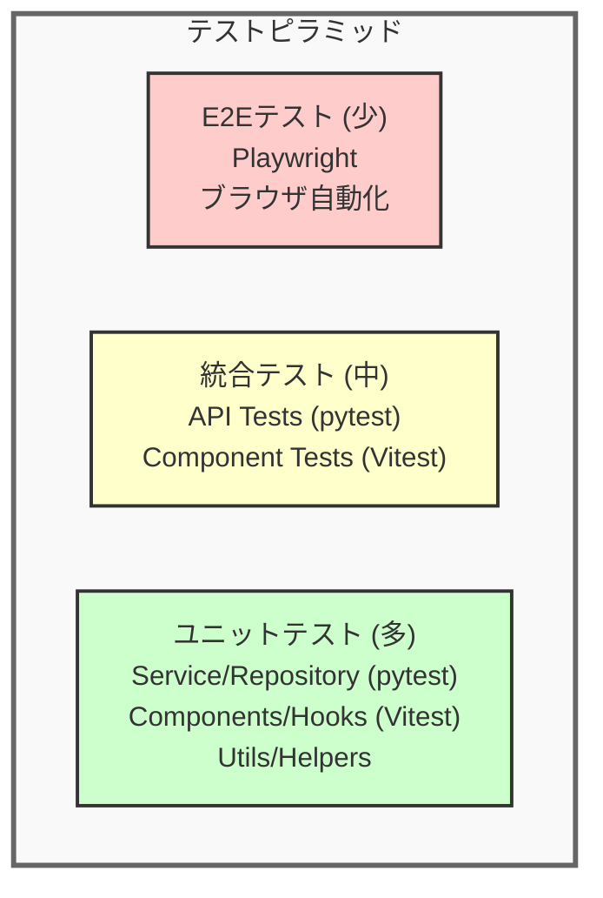

# テスト戦略書

**作成日:** 2025-10-28
**バージョン:** 1.0
**対象システム:** TODO アプリケーション

---

## 1. はじめに

### 1.1 本ドキュメントの目的

本ドキュメントは、TODOアプリケーションのテスト戦略を定めます。テストレベル、カバレッジ目標、テストデータ管理方針を明確にし、品質保証の基準を提供します。

### 1.2 対象読者

- 開発者全般（フロントエンド、バックエンド）
- QAエンジニア
- テックリード、アーキテクト

**関連ドキュメント:**
- [システム構成設計書](./system-architecture.md) - テスト環境、技術スタック
- [API設計ガイド](./api-design-guide.md) - APIテスト観点
- [機能一覧](./feature-list.md) - テスト対象機能

---

## 2. テスト戦略概要

### 2.1 基本方針

| 方針 | 説明 |
|------|------|
| **テスト駆動開発（推奨）** | 可能な限りテストファーストで開発 |
| **テストピラミッド準拠** | ユニットテスト（多） > 統合テスト（中） > E2Eテスト（少） |
| **自動化優先** | 手動テストは最小限、CI/CDで自動実行 |
| **高速なフィードバック** | ユニットテストは数秒、統合テストは数分以内 |
| **独立性** | テストは互いに独立し、実行順序に依存しない |

### 2.2 テストレベル



---

## 3. ユニットテスト

### 3.1 対象と目的

**対象:**
- **バックエンド**: Serviceレイヤー、Repositoryレイヤー、ユーティリティ関数
- **フロントエンド**: カスタムフック、ユーティリティ関数、個別コンポーネント

**目的:**
- ロジックの正確性を検証
- 境界値、エラーケースを網羅
- リファクタリングの安全性確保

### 3.2 ツール

| プラットフォーム | ツール | 説明 |
|---------------|-------|------|
| **バックエンド** | pytest | Python標準のテストフレームワーク |
| **フロントエンド** | Vitest + Testing Library | React向け高速テストランナー |

### 3.3 カバレッジ目標（実装済み項目）

| レイヤー | カバレッジ目標 | 重要度 |
|---------|-------------|-------|
| **Serviceレイヤー（バックエンド）** | 90%以上 | ★★★ |
| **Repositoryレイヤー（バックエンド）** | 80%以上 | ★★★ |
| **ユーティリティ（フロントエンド）** | 100% | ★★★ |
| **API層（フロントエンド）** | 90%以上 | ★★★ |

### 3.4 実装例

#### バックエンド（pytest）

```python
# tests/services/test_todo_service.py
import pytest
from app.services.todo_service import TodoService

def test_create_todo_success():
    """TODO作成の正常系テスト"""
    service = TodoService()
    todo_data = {
        "title": "買い物",
        "detail": "野菜を買う",
        "due_date": "2025-10-30"
    }
    user_id = 1

    result = service.create_todo(user_id, todo_data)

    assert result["title"] == "買い物"
    assert result["user_id"] == user_id
    assert result["is_completed"] is False

def test_create_todo_with_invalid_date():
    """過去の期限日でエラー"""
    service = TodoService()
    todo_data = {
        "title": "買い物",
        "due_date": "2020-01-01"  # 過去の日付
    }

    with pytest.raises(ValueError, match="期限日は今日以降"):
        service.create_todo(1, todo_data)
```

#### フロントエンド（Vitest）

```typescript
// src/lib/utils/todoFilters.test.ts
import { describe, it, expect } from 'vitest'
import { filterByStatus, sortTodos } from './todoFilters'
import type { Todo } from '@/types/todo'

describe('todoFilters', () => {
  const mockTodos: Todo[] = [
    {
      id: 1,
      title: 'Active Todo 1',
      dueDate: '2024-06-20',
      isCompleted: false,
    },
    {
      id: 2,
      title: 'Completed Todo',
      dueDate: '2024-06-15',
      isCompleted: true,
    },
  ]

  it('returns only active todos when status is "active"', () => {
    const result = filterByStatus(mockTodos, 'active')
    expect(result).toHaveLength(1)
    expect(result.every(todo => !todo.isCompleted)).toBe(true)
  })

  it('sorts todos by due date in ascending order', () => {
    const result = sortTodos(mockTodos, 'asc')
    expect(result[0].dueDate).toBe('2024-06-15')
    expect(result[1].dueDate).toBe('2024-06-20')
  })
})
```

### 3.5 テストファクトリーとヘルパー関数（バックエンド）

**目的:**
テストコードの保守性と可読性を向上させるため、テストデータ生成とアサーションを標準化します。

#### 3.5.1 テストファクトリー (`backend/tests/factories.py`)

テストデータをデフォルト値付きで簡単に生成できるファクトリークラスを提供します。

**TodoFactory:**
```python
from tests.factories import TodoFactory, get_tomorrow, get_yesterday

# 基本的なTODOデータ
todo_data = TodoFactory.build()
# → {'title': 'Test Todo'}

# カスタムフィールドでオーバーライド
todo_data = TodoFactory.build(title='Custom Todo', detail='Details')
# → {'title': 'Custom Todo', 'detail': 'Details'}

# 期限付きTODO（明日）
todo_data = TodoFactory.build_with_due_date(days_from_now=1)
# → {'title': 'Test Todo', 'due_date': '2025-10-29'}

# 完了済みTODO
todo_data = TodoFactory.build_completed(title='Done Task')
# → {'title': 'Done Task', 'is_completed': True}
```

**UserFactory:**
```python
from tests.factories import UserFactory

# ユニークなメールアドレスで自動生成
user_data = UserFactory.build()
# → {'email': 'user1@example.com', 'password': 'password123'}

user_data = UserFactory.build()
# → {'email': 'user2@example.com', 'password': 'password123'}  # カウンタが自動インクリメント

# カスタムメールアドレス
user_data = UserFactory.build(email='custom@example.com')
```

**日付ヘルパー関数:**
```python
from tests.factories import get_tomorrow, get_yesterday, get_today, get_date_offset

tomorrow = get_tomorrow()         # 明日の日付
yesterday = get_yesterday()       # 昨日の日付
today = get_today()               # 今日の日付
next_week = get_date_offset(7)    # 7日後の日付
```

#### 3.5.2 テストヘルパー関数 (`backend/tests/helpers.py`)

共通のテスト操作とアサーションを簡潔に記述できるヘルパー関数を提供します。

**データ作成ヘルパー:**
```python
from tests.helpers import create_todo, create_user, create_auth_client

# APIを通じてTODOを作成（自動でステータスコードをアサート）
todo = create_todo(auth_client, title='Buy groceries', detail='Vegetables')

# データベースに直接ユーザーを作成
user_id = create_user(app, email='test@example.com', password='pass123')

# 認証済みテストクライアントを作成
auth_client = create_auth_client(app, user_id)
```

**レスポンスアサーションヘルパー:**
```python
from tests.helpers import assert_response_success, assert_response_error

# 成功レスポンスのアサート（ステータスコード + フィールド検証）
data = assert_response_success(response, 201, title='Buy groceries')

# エラーレスポンスのアサート（ステータスコード + エラーコード検証）
data = assert_response_error(response, 404, expected_code=404)
```

**Cookieアサーションヘルパー:**
```python
from tests.helpers import assert_cookie_set

# Cookieが設定されていることを確認
assert_cookie_set(response, 'access_token')

# Cookieがクリアされていることを確認（max-age=0）
assert_cookie_set(response, 'access_token', should_be_cleared=True)
```

**TODOデータアサーションヘルパー:**
```python
from tests.helpers import assert_todo_matches

# TODOデータのフィールドを検証
assert_todo_matches(todo_data, title='Buy groceries', is_completed=False)
```

#### 3.5.3 実装例：ファクトリーとヘルパーを使ったテスト

**Before（ファクトリー・ヘルパーなし）:**
```python
def test_create_todo_success(auth_client):
    response = auth_client.post("/api/todos", json={
        "title": "Buy groceries",
        "detail": "Vegetables",
    })

    assert response.status_code == 201
    data = response.get_json()
    assert data is not None
    assert data["title"] == "Buy groceries"
    assert data["detail"] == "Vegetables"
    assert data["is_completed"] is False
```

**After（ファクトリー・ヘルパーを使用）:**
```python
def test_create_todo_success(auth_client):
    """TODO作成APIの正常系テスト - ファクトリーとヘルパーを使用"""
    todo_data = TodoFactory.build(title="Buy groceries", detail="Vegetables")

    response = auth_client.post("/api/todos", json=todo_data)

    data = assert_response_success(response, 201)
    assert_todo_matches(data, title="Buy groceries", detail="Vegetables", is_completed=False)
```

**利点:**
- **可読性向上**: テストの意図が明確になる
- **保守性向上**: 共通ロジックを1箇所で管理
- **DRY原則**: 重複コードを削減
- **型安全性**: ヘルパー関数で型ヒント付き

### 3.6 フロントエンドの実装状況

**実装済みのテスト:**

| ファイル | 対象 | テスト内容 |
|---------|------|-----------|
| `src/lib/api/todos.test.ts` | API関数 | getTodos, createTodo, updateTodo, toggleTodo, deleteTodo、エラーハンドリング |
| `src/lib/utils/dateFormat.test.ts` | 日付フォーマット | formatDate, isValidDate, isPastDate |
| `src/lib/utils/todoFilters.test.ts` | フィルタリング・ソート | filterByStatus, sortTodos |
| `src/lib/validation/todoValidation.test.ts` | バリデーション | validateTodoForm（title, detail, dueDate） |

**テスト対象範囲:**
- ✓ API層（src/lib/api/）
- ✓ ユーティリティ層（src/lib/utils/）
- ✓ バリデーション層（src/lib/validation/）
- ✗ コンポーネント層（src/components/）
- ✗ カスタムフック層（src/hooks/）
- ✗ ページ層（src/pages/）

### 3.7 モック戦略

**バックエンド:**
- データベースアクセス: `pytest-mock` でRepositoryレイヤーをモック
- テスト用データベース: SQLite in-memoryデータベースを使用

**フロントエンド:**
- API呼び出し: `vi.mock()` でAPIモジュールをモック
- React Context: テスト用のProviderでラップ

---

## 4. 統合テスト

### 4.1 対象と目的

**対象:**
- **バックエンド**: APIエンドポイント（リクエスト → レスポンス）

**目的:**
- レイヤー間の連携を検証
- API仕様の正確性を確認

### 4.2 実装例

#### バックエンドAPI統合テスト

**従来の実装方法:**
```python
# tests/routes/test_todo_routes.py
import pytest
from flask import Flask

def test_create_todo_api(client, auth_headers):
    """TODO作成APIの統合テスト"""
    response = client.post(
        '/api/todos',
        json={
            "title": "買い物",
            "detail": "野菜を買う",
            "due_date": "2025-10-30"
        },
        headers=auth_headers
    )

    assert response.status_code == 201
    data = response.get_json()
    assert data["title"] == "買い物"
    assert data["is_completed"] is False
```

**ファクトリーとヘルパーを使った実装（推奨）:**
```python
# tests/routes/test_todo_routes.py
from tests.factories import TodoFactory
from tests.helpers import assert_response_success, assert_todo_matches

def test_create_todo_api(auth_client):
    """TODO作成APIの統合テスト - ファクトリーとヘルパーを使用"""
    todo_data = TodoFactory.build_with_due_date(
        days_from_now=5,
        title="買い物",
        detail="野菜を買う"
    )

    response = auth_client.post('/api/todos', json=todo_data)

    data = assert_response_success(response, 201)
    assert_todo_matches(data, title="買い物", detail="野菜を買う", is_completed=False)

def test_create_todo_without_auth(client):
    """認証なしで401エラー"""
    todo_data = TodoFactory.build(title="買い物")

    response = client.post('/api/todos', json=todo_data)

    assert_response_error(response, 401)
```

**利点:**
- テストデータ生成が簡潔（ファクトリー使用）
- アサーションが読みやすい（ヘルパー関数使用）
- 日付計算が不要（日付ヘルパー使用）
- 保守性が向上（共通ロジックの集約）

### 4.3 テストデータ

**バックエンド:**
- テスト用データベース: 各テストで独立したトランザクション
- Fixture: `pytest.fixture` でテストデータを用意

```python
@pytest.fixture
def sample_user(db_session):
    user = User(email="test@example.com", password_hash="...")
    db_session.add(user)
    db_session.commit()
    return user

@pytest.fixture
def auth_headers(sample_user):
    token = create_access_token(sample_user.id)
    return {"Cookie": f"access_token={token}"}
```

**フロントエンド:**
- Vitest `vi.mock()`: APIモジュールをモック

```typescript
// テストファイル内でAPIをモック
import { vi } from 'vitest';
import * as todosApi from '../lib/api/todos';

vi.spyOn(todosApi, 'fetchTodos').mockResolvedValue({
  items: [
    { id: 1, title: '買い物', is_completed: false },
    { id: 2, title: 'レポート', is_completed: true },
  ],
  meta: { count: 2 }
});
```

---

## 5. 認証・認可の包括的なテストカバレッジ

本プロジェクトでは、セキュリティの要となる認証・認可機能に対して包括的なテストカバレッジを実装しています。

### 5.1 テスト対象とファイル構成

| テストファイル | 対象機能 | テスト数 |
|-------------|---------|---------|
| `backend/tests/routes/test_auth_routes.py` | 認証APIエンドポイント | 18+ |
| `backend/tests/services/test_auth_service.py` | 認証サービスロジック | 25+ |
| `backend/tests/security/test_authorization.py` | 認可・アクセス制御 | 12+ |

### 5.2 クロスユーザーアクセス制御テスト

**目的:** ユーザー間でのデータ隔離を保証し、他のユーザーのデータへのアクセスを防止

**テストシナリオ** (`backend/tests/security/test_authorization.py`):

```python
def test_user_cannot_access_another_users_todo(app, test_user, client):
    """ユーザーAは他のユーザーBのTODOを閲覧できない"""
    user1_id = test_user
    user2_id = create_user(app, email="user2@example.com")

    # User 1がTODOを作成
    user1_client = create_auth_client(app, user1_id)
    todo = create_todo(user1_client, title="User1's Private Todo")

    # User 2がUser 1のTODOにアクセスを試みる
    user2_client = create_auth_client(app, user2_id)
    response = user2_client.get("/api/todos")
    data = response.get_json()

    # User 2のリストにUser 1のTODOが含まれていないことを確認
    todo_ids = [item["id"] for item in data["items"]]
    assert todo["id"] not in todo_ids
```

**カバー範囲:**
- ✓ 他のユーザーのTODO閲覧防止
- ✓ 他のユーザーのTODO更新防止
- ✓ 他のユーザーのTODO削除防止
- ✓ 他のユーザーのTODO完了マーク切替防止

### 5.3 認証要件テスト

**目的:** 認証が必要なエンドポイントへの未認証アクセスを拒否

**テストシナリオ** (`backend/tests/security/test_authorization.py`):

```python
def test_unauthenticated_user_cannot_access_todos(client):
    """未認証ユーザーはTODO一覧を取得できない"""
    response = client.get("/api/todos")
    assert_response_error(response, 401)

def test_unauthenticated_user_cannot_create_todo(client):
    """未認証ユーザーはTODOを作成できない"""
    todo_data = TodoFactory.build(title="Unauthorized Todo")
    response = client.post("/api/todos", json=todo_data)
    assert_response_error(response, 401)
```

**カバー範囲:**
- ✓ 未認証でのTODO一覧取得拒否
- ✓ 未認証でのTODO作成拒否
- ✓ 未認証でのTODO更新拒否
- ✓ 未認証でのTODO削除拒否

### 5.4 トークンセキュリティテスト

**目的:** JWTトークンの改ざん、有効期限切れ、不正な形式を検出して拒否

**テストシナリオ** (`backend/tests/security/test_authorization.py`):

```python
def test_invalid_jwt_token_rejected(client, app):
    """無効なJWTトークンは拒否される"""
    client.set_cookie("access_token", "invalid.jwt.token")
    response = client.get("/api/todos")
    assert_response_error(response, 401)

def test_expired_jwt_token_rejected(client, app, test_user):
    """有効期限切れのトークンは拒否される"""
    # 過去の有効期限でトークン生成
    expired_token = create_expired_token(test_user)
    client.set_cookie("access_token", expired_token)

    response = client.get("/api/todos")
    assert_response_error(response, 401)

def test_tampered_jwt_token_rejected(client, app, test_user):
    """改ざんされたトークンは拒否される（署名検証失敗）"""
    # 正しいトークンを生成
    valid_token = create_valid_token(test_user)

    # トークンのペイロードを改ざん（user_idを変更）
    tampered_token = tamper_jwt_token(valid_token, user_id=999)
    client.set_cookie("access_token", tampered_token)

    response = client.get("/api/todos")
    assert_response_error(response, 401)
```

**カバー範囲:**
- ✓ 無効なトークン形式の検出
- ✓ 有効期限切れトークンの拒否
- ✓ 改ざんされたトークンの検出（署名検証）
- ✓ user_idが含まれていないトークンの拒否
- ✓ 不正な署名を持つトークンの拒否

### 5.5 認証フローテスト

**目的:** ログイン、トークンリフレッシュ、ログアウトの完全な認証フローを検証

**テストシナリオ** (`backend/tests/routes/test_auth_routes.py`):

#### ログインテスト

```python
def test_login_success(client, app, test_user):
    """正しい認証情報でログイン成功"""
    response = client.post("/api/auth/login", json={
        "email": "test@example.com",
        "password": "password123"
    })

    data = assert_response_success(response, 200)
    assert data["user"]["email"] == "test@example.com"
    assert_cookie_set(response, "access_token")
    assert_cookie_set(response, "refresh_token")
```

**カバー範囲:**
- ✓ 正しい認証情報でのログイン成功
- ✓ 誤ったパスワードでのログイン失敗
- ✓ 存在しないユーザーでのログイン失敗
- ✓ 不正なメールアドレス形式の検証
- ✓ パスワードの最小文字数検証
- ✓ パスワードの数字必須検証
- ✓ 空のメールアドレスの検証
- ✓ Cookie設定の確認（access_token、refresh_token）

#### トークンリフレッシュテスト

```python
def test_refresh_token_success(client, app, test_user):
    """有効なリフレッシュトークンで新しいアクセストークンを取得"""
    # ログインしてリフレッシュトークンを取得
    login_response = client.post("/api/auth/login", json={
        "email": "test@example.com",
        "password": "password123"
    })

    # リフレッシュエンドポイントを呼び出し
    response = client.post("/api/auth/refresh")

    data = assert_response_success(response, 200)
    assert "user" in data
    assert_cookie_set(response, "access_token")
```

**カバー範囲:**
- ✓ 有効なリフレッシュトークンでのトークン更新成功
- ✓ 無効なリフレッシュトークンでの更新失敗
- ✓ 有効期限切れリフレッシュトークンでの失敗
- ✓ リフレッシュトークンなしでの失敗
- ✓ 無効化されたリフレッシュトークンでの失敗（ログアウト後）

#### ログアウトテスト

```python
def test_logout_success(client, app, test_user):
    """ログアウトでリフレッシュトークンが無効化される"""
    # ログイン
    client.post("/api/auth/login", json={
        "email": "test@example.com",
        "password": "password123"
    })

    # ログアウト
    response = client.post("/api/auth/logout")

    assert_response_success(response, 200)
    assert_cookie_set(response, "access_token", should_be_cleared=True)
    assert_cookie_set(response, "refresh_token", should_be_cleared=True)

    # ログアウト後はリフレッシュトークンが無効
    refresh_response = client.post("/api/auth/refresh")
    assert_response_error(refresh_response, 401)
```

**カバー範囲:**
- ✓ ログアウト成功
- ✓ Cookieのクリア（max-age=0）
- ✓ リフレッシュトークンの無効化（DB削除）
- ✓ ログアウト後のトークンリフレッシュ失敗

### 5.6 認証サービス層テスト

**目的:** 認証ビジネスロジックの正確性を検証（トークン生成、検証、ユーザー認証）

**テストファイル:** `backend/tests/services/test_auth_service.py`

**カバー範囲:**
- ✓ パスワードハッシュ化と検証
- ✓ JWTトークン生成（アクセストークン、リフレッシュトークン）
- ✓ トークン検証ロジック
- ✓ リフレッシュトークンのDB保存・取得・削除
- ✓ トークンのローテーション（リフレッシュ時に新トークン発行）
- ✓ 複数セッション対応（複数リフレッシュトークン管理）
- ✓ エラーハンドリング（DB障害、トークン不正など）

### 5.7 テスト実装のベストプラクティス

本プロジェクトのセキュリティテストでは、以下のベストプラクティスを採用しています：

**1. ファクトリーとヘルパーの活用:**
```python
# テストデータ生成
user1_data = UserFactory.build()
user2_data = UserFactory.build(email="user2@example.com")

# 認証クライアント作成
auth_client = create_auth_client(app, user_id)

# アサーション
assert_response_error(response, 401)
assert_cookie_set(response, "access_token")
```

**2. 複数ユーザーシナリオのテスト:**
- 2人のユーザーを作成し、互いのデータにアクセスできないことを確認
- 各ユーザーに独立したテストクライアントを割り当て

**3. 包括的なエッジケーステスト:**
- 正常系だけでなく、異常系・境界値を網羅
- トークンの改ざん、有効期限切れ、不正な形式をすべてテスト

**4. セキュリティテストの独立ディレクトリ:**
- `backend/tests/security/` に専用ディレクトリを設置
- セキュリティ関連テストを明示的に分離・管理

### 5.8 セキュリティテストの実行

**すべてのセキュリティテストを実行:**
```bash
poetry -C backend run pytest backend/tests/security/
```

**特定のセキュリティテストカテゴリを実行:**
```bash
# 認可テスト
poetry -C backend run pytest backend/tests/security/test_authorization.py

# 認証APIテスト
poetry -C backend run pytest backend/tests/routes/test_auth_routes.py

# 認証サービステスト
poetry -C backend run pytest backend/tests/services/test_auth_service.py
```

---

## 6. テスト実行環境

### 6.1 ローカル環境

**統合コマンド:**
```bash
make test                     # すべてのテストを実行（フロントエンド + バックエンド）
make test-cov                 # カバレッジ付きでテスト実行
```

**個別実行:**
```bash
# バックエンド
poetry -C backend run pytest  # 直接実行
poetry -C backend run pytest --cov  # カバレッジ付き

# フロントエンド
pnpm --dir frontend run test  # 直接実行
pnpm --dir frontend run test:coverage  # カバレッジ付き
```

### 6.2 CI/CD環境

**GitHub Actions:**
- プルリクエスト作成時: すべてのテストを自動実行
- mainブランチマージ時: カバレッジレポート生成

```yaml
# .github/workflows/ci.yml
name: CI
on: [push, pull_request]
jobs:
  test:
    runs-on: ubuntu-latest
    steps:
      - uses: actions/checkout@v3
      - name: Run all tests
        run: make test
```

---

## 7. カバレッジレポート

### 7.1 カバレッジレポートの生成

**バックエンド:**
```bash
poetry -C backend run pytest --cov=app --cov-report=html
# HTMLレポート: backend/htmlcov/index.html
```

**フロントエンド:**
```bash
pnpm --dir frontend run test:coverage
# HTMLレポート: frontend/coverage/index.html
```

---

## 8. テストデータ管理

### 8.1 テストデータ戦略

| 戦略 | 説明 | 使用場面 |
|------|------|---------|
| **Fixture** | 事前定義されたテストデータ | ユニットテスト |
| **Factory** | プログラムで動的生成 | 統合テスト |
| **Mock** | 偽のデータ・レスポンス | フロントエンドテスト |

### 8.2 テストデータの原則

**独立性:**
- 各テストは独自のデータを使用
- テスト間でデータを共有しない

**クリーンアップ:**
- バックエンド: トランザクションロールバック
- フロントエンド: テスト後にlocalStorage/sessionStorageをクリア

**現実的なデータ:**
- 実際のユースケースに近いデータ
- 境界値、特殊文字を含むケース

### 8.3 実装例

#### 8.3.1 Fixtureパターン（従来の実装）

**バックエンド（Fixture）:**
```python
# tests/conftest.py
@pytest.fixture
def db_session():
    """各テストで独立したトランザクション"""
    connection = engine.connect()
    transaction = connection.begin()
    session = Session(bind=connection)

    yield session

    session.close()
    transaction.rollback()
    connection.close()

@pytest.fixture
def sample_todos(db_session, sample_user):
    """サンプルTODOデータ"""
    todos = [
        Todo(user_id=sample_user.id, title="買い物", is_completed=False),
        Todo(user_id=sample_user.id, title="レポート", is_completed=True),
    ]
    db_session.add_all(todos)
    db_session.commit()
    return todos
```

**フロントエンド（Vitest モック）:**
```typescript
// テストファイル内でAPIをモック
import { vi } from 'vitest';
import * as todosApi from '../lib/api/todos';

vi.spyOn(todosApi, 'fetchTodos').mockResolvedValue({
  items: [
    { id: 1, title: '買い物', is_completed: false },
    { id: 2, title: 'レポート', is_completed: true },
  ],
  meta: { count: 2 }
});
```

#### 8.3.2 Factoryパターン（推奨実装）

本プロジェクトでは、テストコードの保守性を向上させるため、Factoryパターンを採用しています。

**ファクトリーパターンの利点:**
- **デフォルト値**: 必要最小限のデータで簡単にテストデータを生成
- **カスタマイズ性**: 必要なフィールドだけをオーバーライド可能
- **DRY原則**: テストデータ生成ロジックを一箇所で管理
- **名前付きコンストラクタ**: `build_with_due_date()`、`build_completed()` など意図が明確

**実装ファイル:** `backend/tests/factories.py`

**使用例:**
```python
from tests.factories import TodoFactory, UserFactory, get_tomorrow

# 基本的なTODO（titleのみ指定）
todo = TodoFactory.build()
# → {'title': 'Test Todo'}

# カスタマイズしたTODO
todo = TodoFactory.build(title='Buy milk', detail='From store A')
# → {'title': 'Buy milk', 'detail': 'From store A'}

# 明日期限のTODO
todo = TodoFactory.build_with_due_date(days_from_now=1, title='Urgent task')
# → {'title': 'Urgent task', 'due_date': '2025-10-29'}

# 完了済みTODO
todo = TodoFactory.build_completed(title='Finished task')
# → {'title': 'Finished task', 'is_completed': True}

# ユニークなユーザー（メールアドレスが自動生成）
user1 = UserFactory.build()  # user1@example.com
user2 = UserFactory.build()  # user2@example.com（カウンタ自動インクリメント）
```

**テストでの活用例:**
```python
def test_create_multiple_todos_with_different_due_dates(auth_client):
    """複数のTODOを異なる期限で作成"""
    # 明日期限
    todo1_data = TodoFactory.build_with_due_date(1, title="Tomorrow's task")
    todo1 = create_todo(auth_client, **todo1_data)

    # 来週期限
    todo2_data = TodoFactory.build_with_due_date(7, title="Next week's task")
    todo2 = create_todo(auth_client, **todo2_data)

    # 1ヶ月後期限
    todo3_data = TodoFactory.build_with_due_date(30, title="Monthly task")
    todo3 = create_todo(auth_client, **todo3_data)

    # すべてが正しく作成されたことを確認
    response = auth_client.get("/api/todos")
    data = assert_response_success(response, 200)
    assert len(data["items"]) == 3
```

**従来の方法との比較:**

Before（ファクトリーなし）:
```python
# 日付計算が毎回必要
from datetime import date, timedelta

def test_create_todo_with_due_date(auth_client):
    due_date = (date.today() + timedelta(days=1)).isoformat()
    response = auth_client.post("/api/todos", json={
        "title": "Tomorrow's task",
        "detail": "Some detail",
        "due_date": due_date
    })
    assert response.status_code == 201
```

After（ファクトリー使用）:
```python
def test_create_todo_with_due_date(auth_client):
    """期限付きTODOの作成テスト - ファクトリー使用"""
    todo_data = TodoFactory.build_with_due_date(1, title="Tomorrow's task", detail="Some detail")

    response = auth_client.post("/api/todos", json=todo_data)

    data = assert_response_success(response, 201)
    assert_todo_matches(data, title="Tomorrow's task")
```

---

## 9. モック・スタブ戦略

### 9.1 モック対象

| レイヤー | モック対象 | 理由 |
|---------|-----------|------|
| **データベース** | Repositoryレイヤー | Serviceロジックのみをテスト |
| **外部API** | HTTP通信 | ネットワークに依存しない |
| **時間** | `datetime.now()` | 時刻に依存しないテスト |
| **ファイルシステム** | ログファイル書き込み | I/Oを避ける |

### 9.2 実装例

**バックエンド（pytest-mock）:**
```python
def test_create_todo_with_mock(mocker):
    """Repositoryをモックしてテスト"""
    mock_repo = mocker.Mock()
    mock_repo.create.return_value = {
        "id": 1,
        "title": "買い物",
        "is_completed": False
    }

    service = TodoService(repository=mock_repo)
    result = service.create_todo(1, {"title": "買い物"})

    assert result["title"] == "買い物"
    mock_repo.create.assert_called_once()
```

**フロントエンド（Vitest）:**
```typescript
// src/lib/api/todos.test.ts
import { vi } from 'vitest';

// APIモジュールのモック
global.fetch = vi.fn(() =>
  Promise.resolve({
    ok: true,
    text: async () => JSON.stringify({
      items: [
        { id: 1, title: '買い物', is_completed: false },
      ]
    }),
  })
) as any;
```

---

## 10. テストの保守性

### 10.1 テストコードの品質

**原則:**
- **可読性**: テスト名で何をテストしているか明確にする
- **独立性**: テストの実行順序に依存しない
- **高速性**: ユニットテストは1秒以内、統合テストは数秒以内
- **DRY原則**: 共通のセットアップはFixture/Helperに抽出

### 10.2 良いテストの例

```python
def test_todo_cannot_be_created_with_past_due_date():
    """期限日が過去の場合、TODO作成に失敗する"""
    service = TodoService()
    past_date = "2020-01-01"

    with pytest.raises(ValueError, match="期限日は今日以降"):
        service.create_todo(1, {"title": "買い物", "due_date": past_date})
```

**ポイント:**
- テスト名が日本語で明確
- 1つのテストで1つのケースのみ検証
- エラーメッセージまで検証

### 10.3 避けるべきパターン

**❌ 悪い例:**
```python
def test_todo():
    # 何をテストしているか不明
    service = TodoService()
    result = service.create_todo(1, {"title": "買い物"})
    assert result  # 何を検証しているか不明
```

**✓ 良い例:**
```python
def test_create_todo_returns_todo_with_generated_id():
    """TODO作成時、自動生成されたIDを含むTODOが返される"""
    service = TodoService()
    result = service.create_todo(1, {"title": "買い物"})

    assert isinstance(result["id"], int)
    assert result["id"] > 0
```

### 10.4 テストコードリファクタリングパターン

本プロジェクトでは、テストコードの保守性を向上させるため、以下のリファクタリングパターンを実践しています。

#### 10.4.1 ファクトリーパターンによるテストデータ生成

**目的:** テストデータの生成ロジックを集約し、DRY原則を適用

**Before（リファクタリング前）:**
```python
# 各テストで同じデータ構造を繰り返し記述
def test_create_todo_success(auth_client):
    response = auth_client.post("/api/todos", json={
        "title": "Test Todo",
        "detail": "Details",
        "due_date": "2025-10-30"
    })
    assert response.status_code == 201

def test_create_todo_without_detail(auth_client):
    response = auth_client.post("/api/todos", json={
        "title": "Test Todo",
        "due_date": "2025-10-30"
    })
    assert response.status_code == 201
```

**After（リファクタリング後）:**
```python
# ファクトリーでテストデータを生成
def test_create_todo_success(auth_client):
    """TODO作成の正常系テスト"""
    todo_data = TodoFactory.build(
        title="Test Todo",
        detail="Details",
        due_date="2025-10-30"
    )
    response = auth_client.post("/api/todos", json=todo_data)
    data = assert_response_success(response, 201)

def test_create_todo_without_detail(auth_client):
    """詳細なしでTODO作成"""
    todo_data = TodoFactory.build(title="Test Todo", due_date="2025-10-30")
    response = auth_client.post("/api/todos", json=todo_data)
    data = assert_response_success(response, 201)
```

**効果:**
- コード量削減: 重複するデータ構造定義を削除
- 保守性向上: データ構造変更時、ファクトリーのみ修正すればよい
- 可読性向上: テストの意図が明確になる

#### 10.4.2 ヘルパー関数によるアサーションの標準化

**目的:** 繰り返し使うアサーションロジックを共通化

**Before（リファクタリング前）:**
```python
def test_login_success(client):
    response = client.post("/api/auth/login", json={
        "email": "test@example.com",
        "password": "password123"
    })

    assert response.status_code == 200
    data = response.get_json()
    assert data is not None
    assert "user" in data
    assert data["user"]["email"] == "test@example.com"

    # Cookie確認
    set_cookie_headers = response.headers.getlist("Set-Cookie")
    assert any("access_token" in h for h in set_cookie_headers)
```

**After（リファクタリング後）:**
```python
def test_login_success(client):
    """ログイン成功テスト"""
    response = client.post("/api/auth/login", json={
        "email": "test@example.com",
        "password": "password123"
    })

    data = assert_response_success(response, 200)
    assert data["user"]["email"] == "test@example.com"
    assert_cookie_set(response, "access_token")
```

**効果:**
- コード量削減: 10行 → 6行（40%削減）
- 可読性向上: 何を検証しているかが明確
- 一貫性: すべてのテストで同じアサーションロジック

#### 10.4.3 テストヘルパーによる共通セットアップの抽出

**目的:** テストの準備処理を関数化し、再利用性を高める

**Before（リファクタリング前）:**
```python
def test_user_cannot_update_another_users_todo(app):
    # ユーザー1を作成
    from app.database import get_session
    from app.models.user import User
    from app.utils.password import hash_password

    session = get_session()
    user1 = User(email="user1@example.com", password_hash=hash_password("pass"))
    session.add(user1)
    session.commit()
    user1_id = user1.id

    # ユーザー2を作成
    user2 = User(email="user2@example.com", password_hash=hash_password("pass"))
    session.add(user2)
    session.commit()
    user2_id = user2.id

    # 認証クライアント作成
    # ... 長いトークン生成ロジック ...
```

**After（リファクタリング後）:**
```python
def test_user_cannot_update_another_users_todo(app):
    """ユーザーは他のユーザーのTODOを更新できない"""
    # ヘルパー関数で簡潔にセットアップ
    user1_id = create_user(app, email="user1@example.com")
    user2_id = create_user(app, email="user2@example.com")

    user1_client = create_auth_client(app, user1_id)
    user2_client = create_auth_client(app, user2_id)

    # テストの本質に集中
    todo = create_todo(user1_client, title="User1's Todo")
    response = user2_client.patch(f"/api/todos/{todo['id']}", json={"title": "Hacked!"})
    assert_response_error(response, 404)
```

**効果:**
- コード量削減: 30行 → 10行（67%削減）
- 可読性向上: テストの意図が明確
- 保守性向上: セットアップロジック変更時、ヘルパー関数のみ修正

#### 10.4.4 重複テストの統合

**目的:** 同じ機能を検証する複数のテストを1つに統合

**Before（リファクタリング前）:**
```python
def test_filter_by_status_active(auth_client):
    """ステータスでフィルタリング: active"""
    response = auth_client.get("/api/todos?status=active")
    data = response.get_json()
    assert all(not item["is_completed"] for item in data["items"])

def test_filter_by_status_completed(auth_client):
    """ステータスでフィルタリング: completed"""
    response = auth_client.get("/api/todos?status=completed")
    data = response.get_json()
    assert all(item["is_completed"] for item in data["items"])

def test_filter_by_status_all(auth_client):
    """ステータスでフィルタリング: all"""
    response = auth_client.get("/api/todos?status=all")
    data = response.get_json()
    assert len(data["items"]) > 0
```

**After（リファクタリング後）:**
```python
@pytest.mark.parametrize("status,expected_condition", [
    ("active", lambda todo: not todo["is_completed"]),
    ("completed", lambda todo: todo["is_completed"]),
    ("all", lambda todo: True),
])
def test_filter_by_status(auth_client, status, expected_condition):
    """ステータスフィルタリング: active, completed, all"""
    response = auth_client.get(f"/api/todos?status={status}")
    data = response.get_json()
    assert all(expected_condition(item) for item in data["items"])
```

**効果:**
- コード量削減: 15行 → 7行（53%削減）
- 保守性向上: 新しいステータスの追加が容易
- カバレッジ維持: 同じテストケースをカバー

#### 10.4.5 リファクタリングの実施結果

本プロジェクトでは、上記のパターンを適用し、以下の改善を達成しました：

| テストファイル | Before | After | 削減率 |
|-------------|--------|-------|--------|
| `test_todo_routes.py` | 14テスト | 10テスト | -29% |
| `test_todo_service.py` | 154行 | 137行 | -11% |
| `frontend/todos.test.ts` | 422行 | 357行 | -15% |
| `frontend/todoValidation.test.ts` | 217行 | 141行 | -35% |

**全体:**
- **テスト数**: 同じカバレッジを維持しながら、重複テストを削減
- **コード量**: -17%（912行 → 754行）
- **可読性**: ファクトリー・ヘルパーでテストの意図が明確化
- **保守性**: 共通ロジックの集約により、変更の影響範囲を削減

---

## 11. 継続的テスト改善

### 11.1 定期レビュー

| タイミング | レビュー内容 |
|-----------|------------|
| **スプリントごと** | カバレッジ確認、テスト追加計画 |
| **リリース前** | 全テスト実行、クリティカルパス確認 |
| **四半期ごと** | テスト戦略見直し、新しいツール検討 |

### 11.2 テスト追加のトリガー

| イベント | アクション |
|---------|-----------|
| **バグ発見** | バグを再現するテストを追加 |
| **新機能追加** | 機能に対するテストを同時に実装 |
| **リファクタリング** | 既存テストが通ることを確認、必要に応じて追加 |

---

## 12. ツール・ライブラリ一覧

### 12.1 バックエンド

| ツール | 用途 | 実装状況 |
|-------|------|---------|
| **pytest** | テストフレームワーク | ✓ |
| **pytest-cov** | カバレッジ測定 | ✓ |
| **pytest-mock** | モック・スタブ | ✓ |
| **pytest-xdist** | 並列テスト実行 | ✓ |
| **pytest-sugar** | テスト出力の視覚化 | ✓ |

### 12.2 フロントエンド

| ツール | 用途 | 実装状況 | 備考 |
|-------|------|---------|------|
| **Vitest** | テストランナー | ✓ | ユーティリティ・API層のテストで使用中 |
| **Testing Library** | Reactコンポーネントテスト | インストール済み | コンポーネントテストは未実装 |
| **happy-dom** | DOM環境シミュレーション | 設定済み | vitest.configで設定済み |

---

## 13. 関連ドキュメント

- [システム構成設計書](./system-architecture.md) - テスト環境、技術スタック
- [API設計ガイド](./api-design-guide.md) - APIテスト観点、エラーケース
- [機能一覧](./feature-list.md) - テスト対象機能一覧
- [開発環境ガイド](./development.md) - テスト実行コマンド、トラブルシューティング

---

**END OF DOCUMENT**
