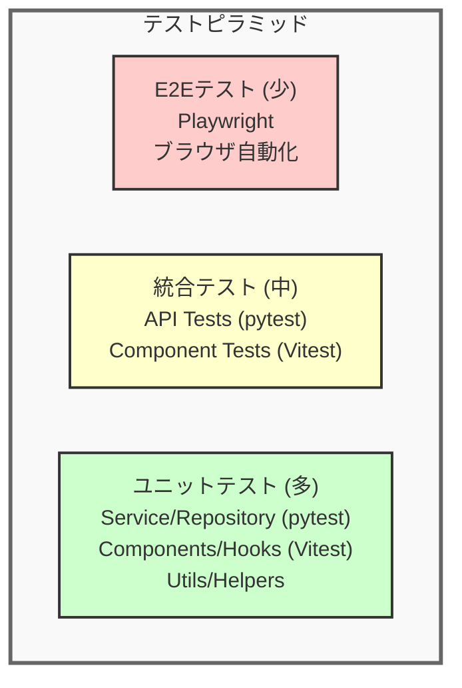

# テスト戦略書

**作成日:** 2025-10-28
**バージョン:** 1.0
**対象システム:** TODO アプリケーション

---

## 1. はじめに

### 1.1 本ドキュメントの目的

本ドキュメントは、TODOアプリケーションのテスト戦略を定めます。テストレベル、カバレッジ目標、テストデータ管理方針を明確にし、品質保証の基準を提供します。

### 1.2 対象読者

- 開発者全般（フロントエンド、バックエンド）
- QAエンジニア
- テックリード、アーキテクト

**関連ドキュメント:**
- [システム構成設計書](./system-architecture.md) - テスト環境、技術スタック
- [API設計ガイド](./api-design-guide.md) - APIテスト観点
- [機能一覧](./feature-list.md) - テスト対象機能

---

## 2. テスト戦略概要

### 2.1 基本方針

| 方針 | 説明 |
|------|------|
| **テスト駆動開発（推奨）** | 可能な限りテストファーストで開発 |
| **テストピラミッド準拠** | ユニットテスト（多） > 統合テスト（中） > E2Eテスト（少） |
| **自動化優先** | 手動テストは最小限、CI/CDで自動実行 |
| **高速なフィードバック** | ユニットテストは数秒、統合テストは数分以内 |
| **独立性** | テストは互いに独立し、実行順序に依存しない |

### 2.2 テストレベル



---

## 3. ユニットテスト

### 3.1 対象と目的

**対象:**
- **バックエンド**: Serviceレイヤー、Repositoryレイヤー、ユーティリティ関数
- **フロントエンド**: カスタムフック、ユーティリティ関数、個別コンポーネント

**目的:**
- ロジックの正確性を検証
- 境界値、エラーケースを網羅
- リファクタリングの安全性確保

### 3.2 ツール

| プラットフォーム | ツール | 説明 |
|---------------|-------|------|
| **バックエンド** | pytest | Python標準のテストフレームワーク |
| **フロントエンド** | Vitest + Testing Library | React向け高速テストランナー |

### 3.3 カバレッジ目標（実装済み項目）

| レイヤー | カバレッジ目標 | 重要度 |
|---------|-------------|-------|
| **Serviceレイヤー（バックエンド）** | 90%以上 | ★★★ |
| **Repositoryレイヤー（バックエンド）** | 80%以上 | ★★★ |
| **ユーティリティ（フロントエンド）** | 100% | ★★★ |
| **API層（フロントエンド）** | 90%以上 | ★★★ |

### 3.4 実装例

#### バックエンド（pytest）

```python
# tests/services/test_todo_service.py
import pytest
from app.services.todo_service import TodoService

def test_create_todo_success():
    """TODO作成の正常系テスト"""
    service = TodoService()
    todo_data = {
        "title": "買い物",
        "detail": "野菜を買う",
        "due_date": "2025-10-30"
    }
    user_id = 1

    result = service.create_todo(user_id, todo_data)

    assert result["title"] == "買い物"
    assert result["user_id"] == user_id
    assert result["is_completed"] is False

def test_create_todo_with_invalid_date():
    """過去の期限日でエラー"""
    service = TodoService()
    todo_data = {
        "title": "買い物",
        "due_date": "2020-01-01"  # 過去の日付
    }

    with pytest.raises(ValueError, match="期限日は今日以降"):
        service.create_todo(1, todo_data)
```

#### フロントエンド（Vitest）

```typescript
// src/lib/utils/todoFilters.test.ts
import { describe, it, expect } from 'vitest'
import { filterByStatus, sortTodos } from './todoFilters'
import type { Todo } from '@/types/todo'

describe('todoFilters', () => {
  const mockTodos: Todo[] = [
    {
      id: 1,
      title: 'Active Todo 1',
      dueDate: '2024-06-20',
      isCompleted: false,
    },
    {
      id: 2,
      title: 'Completed Todo',
      dueDate: '2024-06-15',
      isCompleted: true,
    },
  ]

  it('returns only active todos when status is "active"', () => {
    const result = filterByStatus(mockTodos, 'active')
    expect(result).toHaveLength(1)
    expect(result.every(todo => !todo.isCompleted)).toBe(true)
  })

  it('sorts todos by due date in ascending order', () => {
    const result = sortTodos(mockTodos, 'asc')
    expect(result[0].dueDate).toBe('2024-06-15')
    expect(result[1].dueDate).toBe('2024-06-20')
  })
})
```

### 3.5 フロントエンドの実装状況

**実装済みのテスト:**

| ファイル | 対象 | テスト内容 |
|---------|------|-----------|
| `src/lib/api/todos.test.ts` | API関数 | getTodos, createTodo, updateTodo, toggleTodo, deleteTodo, エラーハンドリング |
| `src/lib/utils/dateFormat.test.ts` | 日付フォーマット | formatDate, isValidDate, isPastDate |
| `src/lib/utils/todoFilters.test.ts` | フィルタリング・ソート | filterByStatus, sortTodos |
| `src/lib/validation/todoValidation.test.ts` | バリデーション | validateTodoForm（title, detail, dueDate） |

**テスト対象範囲:**
- ✓ API層（src/lib/api/）
- ✓ ユーティリティ層（src/lib/utils/）
- ✓ バリデーション層（src/lib/validation/）
- ✗ コンポーネント層（src/components/）
- ✗ カスタムフック層（src/hooks/）
- ✗ ページ層（src/pages/）

### 3.6 モック戦略

**バックエンド:**
- データベースアクセス: `pytest-mock` でRepositoryレイヤーをモック
- テスト用データベース: SQLite in-memoryデータベースを使用

**フロントエンド:**
- API呼び出し: `vi.mock()` でAPIモジュールをモック
- React Context: テスト用のProviderでラップ

---

## 4. 統合テスト

### 4.1 対象と目的

**対象:**
- **バックエンド**: APIエンドポイント（リクエスト → レスポンス）

**目的:**
- レイヤー間の連携を検証
- API仕様の正確性を確認

### 4.2 実装例

#### バックエンドAPI統合テスト

```python
# tests/routes/test_todo_routes.py
import pytest
from flask import Flask

def test_create_todo_api(client, auth_headers):
    """TODO作成APIの統合テスト"""
    response = client.post(
        '/api/todos',
        json={
            "title": "買い物",
            "detail": "野菜を買う",
            "due_date": "2025-10-30"
        },
        headers=auth_headers
    )

    assert response.status_code == 201
    data = response.get_json()
    assert data["title"] == "買い物"
    assert data["is_completed"] is False

def test_create_todo_without_auth(client):
    """認証なしで401エラー"""
    response = client.post(
        '/api/todos',
        json={"title": "買い物"}
    )

    assert response.status_code == 401
    assert "認証が必要" in response.get_json()["message"]
```

### 4.3 テストデータ

**バックエンド:**
- テスト用データベース: 各テストで独立したトランザクション
- Fixture: `pytest.fixture` でテストデータを用意

```python
@pytest.fixture
def sample_user(db_session):
    user = User(email="test@example.com", password_hash="...")
    db_session.add(user)
    db_session.commit()
    return user

@pytest.fixture
def auth_headers(sample_user):
    token = create_access_token(sample_user.id)
    return {"Cookie": f"access_token={token}"}
```

**フロントエンド:**
- Vitest `vi.mock()`: APIモジュールをモック

```typescript
// テストファイル内でAPIをモック
import { vi } from 'vitest';
import * as todosApi from '../lib/api/todos';

vi.spyOn(todosApi, 'fetchTodos').mockResolvedValue({
  items: [
    { id: 1, title: '買い物', is_completed: false },
    { id: 2, title: 'レポート', is_completed: true },
  ],
  meta: { count: 2 }
});
```

---

## 5. テスト実行環境

### 5.1 ローカル環境

**統合コマンド:**
```bash
make test                     # すべてのテストを実行（フロントエンド + バックエンド）
make test-cov                 # カバレッジ付きでテスト実行
```

**個別実行:**
```bash
# バックエンド
poetry -C backend run pytest  # 直接実行
poetry -C backend run pytest --cov  # カバレッジ付き

# フロントエンド
pnpm --dir frontend run test  # 直接実行
pnpm --dir frontend run test:coverage  # カバレッジ付き
```

### 5.2 CI/CD環境

**GitHub Actions:**
- プルリクエスト作成時: すべてのテストを自動実行
- mainブランチマージ時: カバレッジレポート生成

```yaml
# .github/workflows/ci.yml
name: CI
on: [push, pull_request]
jobs:
  test:
    runs-on: ubuntu-latest
    steps:
      - uses: actions/checkout@v3
      - name: Run all tests
        run: make test
```

---

## 6. カバレッジレポート

### 6.1 カバレッジレポートの生成

**バックエンド:**
```bash
poetry -C backend run pytest --cov=app --cov-report=html
# HTMLレポート: backend/htmlcov/index.html
```

**フロントエンド:**
```bash
pnpm --dir frontend run test:coverage
# HTMLレポート: frontend/coverage/index.html
```

---

## 7. テストデータ管理

### 7.1 テストデータ戦略

| 戦略 | 説明 | 使用場面 |
|------|------|---------|
| **Fixture** | 事前定義されたテストデータ | ユニットテスト |
| **Factory** | プログラムで動的生成 | 統合テスト |
| **Mock** | 偽のデータ・レスポンス | フロントエンドテスト |

### 7.2 テストデータの原則

**独立性:**
- 各テストは独自のデータを使用
- テスト間でデータを共有しない

**クリーンアップ:**
- バックエンド: トランザクションロールバック
- フロントエンド: テスト後にlocalStorage/sessionStorageをクリア

**現実的なデータ:**
- 実際のユースケースに近いデータ
- 境界値、特殊文字を含むケース

### 7.3 実装例

**バックエンド（Fixture）:**
```python
# tests/conftest.py
@pytest.fixture
def db_session():
    """各テストで独立したトランザクション"""
    connection = engine.connect()
    transaction = connection.begin()
    session = Session(bind=connection)

    yield session

    session.close()
    transaction.rollback()
    connection.close()

@pytest.fixture
def sample_todos(db_session, sample_user):
    """サンプルTODOデータ"""
    todos = [
        Todo(user_id=sample_user.id, title="買い物", is_completed=False),
        Todo(user_id=sample_user.id, title="レポート", is_completed=True),
    ]
    db_session.add_all(todos)
    db_session.commit()
    return todos
```

**フロントエンド（Vitest モック）:**
```typescript
// テストファイル内でAPIをモック
import { vi } from 'vitest';
import * as todosApi from '../lib/api/todos';

vi.spyOn(todosApi, 'fetchTodos').mockResolvedValue({
  items: [
    { id: 1, title: '買い物', is_completed: false },
    { id: 2, title: 'レポート', is_completed: true },
  ],
  meta: { count: 2 }
});
```

---

## 8. モック・スタブ戦略

### 8.1 モック対象

| レイヤー | モック対象 | 理由 |
|---------|-----------|------|
| **データベース** | Repositoryレイヤー | Serviceロジックのみをテスト |
| **外部API** | HTTP通信 | ネットワークに依存しない |
| **時間** | `datetime.now()` | 時刻に依存しないテスト |
| **ファイルシステム** | ログファイル書き込み | I/Oを避ける |

### 8.2 実装例

**バックエンド（pytest-mock）:**
```python
def test_create_todo_with_mock(mocker):
    """Repositoryをモックしてテスト"""
    mock_repo = mocker.Mock()
    mock_repo.create.return_value = {
        "id": 1,
        "title": "買い物",
        "is_completed": False
    }

    service = TodoService(repository=mock_repo)
    result = service.create_todo(1, {"title": "買い物"})

    assert result["title"] == "買い物"
    mock_repo.create.assert_called_once()
```

**フロントエンド（Vitest）:**
```typescript
// src/lib/api/todos.test.ts
import { vi } from 'vitest';

// APIモジュールのモック
global.fetch = vi.fn(() =>
  Promise.resolve({
    ok: true,
    text: async () => JSON.stringify({
      items: [
        { id: 1, title: '買い物', is_completed: false },
      ]
    }),
  })
) as any;
```

---

## 9. テストの保守性

### 9.1 テストコードの品質

**原則:**
- **可読性**: テスト名で何をテストしているか明確にする
- **独立性**: テストの実行順序に依存しない
- **高速性**: ユニットテストは1秒以内、統合テストは数秒以内
- **DRY原則**: 共通のセットアップはFixture/Helperに抽出

### 9.2 良いテストの例

```python
def test_todo_cannot_be_created_with_past_due_date():
    """期限日が過去の場合、TODO作成に失敗する"""
    service = TodoService()
    past_date = "2020-01-01"

    with pytest.raises(ValueError, match="期限日は今日以降"):
        service.create_todo(1, {"title": "買い物", "due_date": past_date})
```

**ポイント:**
- テスト名が日本語で明確
- 1つのテストで1つのケースのみ検証
- エラーメッセージまで検証

### 9.3 避けるべきパターン

**❌ 悪い例:**
```python
def test_todo():
    # 何をテストしているか不明
    service = TodoService()
    result = service.create_todo(1, {"title": "買い物"})
    assert result  # 何を検証しているか不明
```

**✓ 良い例:**
```python
def test_create_todo_returns_todo_with_generated_id():
    """TODO作成時、自動生成されたIDを含むTODOが返される"""
    service = TodoService()
    result = service.create_todo(1, {"title": "買い物"})

    assert isinstance(result["id"], int)
    assert result["id"] > 0
```

---

## 10. 継続的テスト改善

### 10.1 定期レビュー

| タイミング | レビュー内容 |
|-----------|------------|
| **スプリントごと** | カバレッジ確認、テスト追加計画 |
| **リリース前** | 全テスト実行、クリティカルパス確認 |
| **四半期ごと** | テスト戦略見直し、新しいツール検討 |

### 10.2 テスト追加のトリガー

| イベント | アクション |
|---------|-----------|
| **バグ発見** | バグを再現するテストを追加 |
| **新機能追加** | 機能に対するテストを同時に実装 |
| **リファクタリング** | 既存テストが通ることを確認、必要に応じて追加 |

---

## 11. ツール・ライブラリ一覧

### 11.1 バックエンド

| ツール | 用途 | 実装状況 |
|-------|------|---------|
| **pytest** | テストフレームワーク | ✓ |
| **pytest-cov** | カバレッジ測定 | ✓ |
| **pytest-mock** | モック・スタブ | ✓ |
| **pytest-xdist** | 並列テスト実行 | ✓ |
| **pytest-sugar** | テスト出力の視覚化 | ✓ |

### 11.2 フロントエンド

| ツール | 用途 | 実装状況 | 備考 |
|-------|------|---------|------|
| **Vitest** | テストランナー | ✓ | ユーティリティ・API層のテストで使用中 |
| **Testing Library** | Reactコンポーネントテスト | インストール済み | コンポーネントテストは未実装 |
| **happy-dom** | DOM環境シミュレーション | 設定済み | vitest.configで設定済み |

---

## 12. 関連ドキュメント

- [システム構成設計書](./system-architecture.md) - テスト環境、技術スタック
- [API設計ガイド](./api-design-guide.md) - APIテスト観点、エラーケース
- [機能一覧](./feature-list.md) - テスト対象機能一覧
- [開発環境ガイド](./development.md) - テスト実行コマンド、トラブルシューティング

---

**END OF DOCUMENT**
