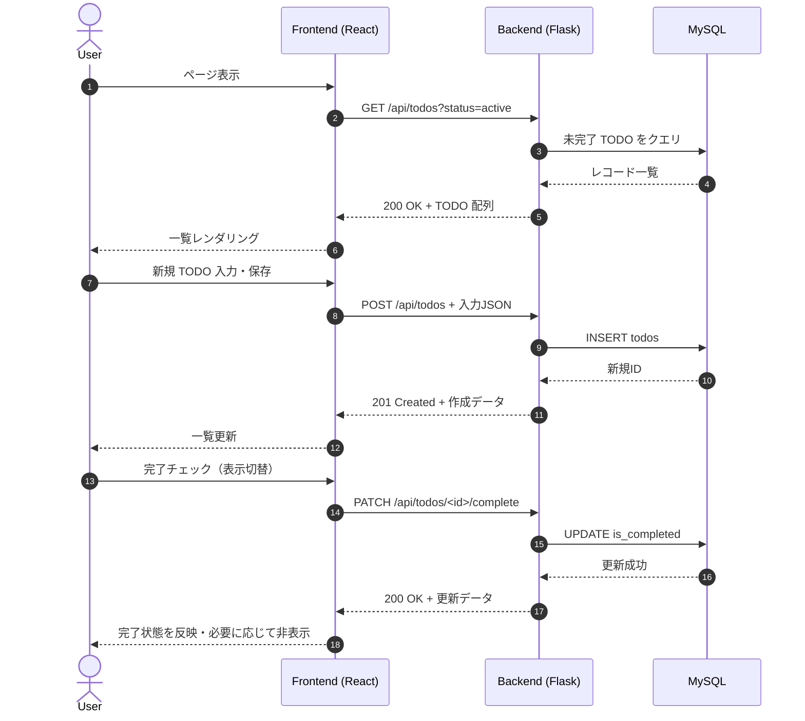

# TODOリスト機能の作成

## 概要
TODOリスト機能を作成する

### 目的
TODOリスト機能を作成し、単純なWebアプリとしての機能を備える

### 要件
- TODOリストを確認できる
- TODOを作成出来る(タイトル・詳細・期日)
- TODOを編集できる
- TODOを完了できる
- TODOを削除できる
- TODOの表示非表示を切り替えられる

### システム要件
- テーブルを作成し、TODOを保存できるようにする

---
## 実装仕様

### 対象ファイルと変更概要
- 更新予定ファイル
  - `backend/app/main.py`: SQLAlchemy エンジン・セッションファクトリの初期化、アプリ終了時のクリーンアップ、例外ハンドリングを追加し、サンプル用途のロジックを整理する。
  - `backend/app/routes/__init__.py`: サンプルの `/api/ping` を削除し、TODO 専用 Blueprint を `/api/todos` として委譲する。
  - `infra/mysql/init/001_init.sql`: サンプルの `users` テーブル定義を削除し、`todos` テーブル定義と初期インデックスを追記する。
  - `frontend/src/App.tsx`: サンプルのロゴ・カウンター UI を削除し、TODO 一覧ページのコンテナコンポーネントとして機能させる。
  - `frontend/src/main.tsx`: サンプルの単純なレンダリングを見直し、必要に応じて新規フックやコンテキストをラップする（例: Suspense やコンテキストプロバイダ）。
- 新規作成ファイル
  - `backend/app/models/todo.py`: `Todo` エンティティ（SQLAlchemy Declarative Base）を定義。
  - `backend/app/services/todo_service.py`: CRUD ロジックおよび完了状態トグルなどの業務処理を実装。
  - `backend/app/routes/todo_routes.py`: `/api/todos` 向け REST エンドポイント群を定義。
  - `backend/app/schemas/todo.py`: リクエスト／レスポンスのバリデーション・シリアライズルールを記述（dataclass + 型ヒントベース）。
  - `backend/tests/routes/test_todo_routes.py`: ルーティング層のユニットテストを追加。
  - `backend/tests/services/test_todo_service.py`: サービス層のユニットテストを追加。
  - `frontend/src/lib/api/todos.ts`: フロントエンドから TODO API を呼び出すためのフェッチラッパーを定義。
  - `frontend/src/hooks/useTodos.ts`: TODO 一覧とフィルタ状態を管理するカスタムフックを追加。
  - `frontend/src/components/TodoForm.tsx`: 新規作成／編集フォーム用コンポーネント。
  - `frontend/src/components/TodoList.tsx`: 一覧レンダリングと個別項目操作を担うコンポーネント。
  - `frontend/src/components/TodoFilterToggle.tsx`: 完了済み表示トグルおよび簡易ソート操作 UI。
  - `frontend/src/styles/todo.css`: TODO ページ専用のスタイルを定義。
  - `frontend/src/pages/TodoListPage.test.tsx`: UI の主要シナリオをカバーするテストを追加。
  - サンプルに由来する不要ファイル（例: `frontend/src/App.test.tsx` のカウンター検証、React ロゴ関連アセット）は削除する。

### バックエンド仕様
- 永続化
  - テーブル: `todos`
    - `id` BIGINT UNSIGNED AUTO_INCREMENT（PK）
    - `title` VARCHAR(120) NOT NULL
    - `detail` TEXT NULL（1000 文字程度まで想定しバリデーションで制限）
    - `due_date` DATE NULL（UTC で保存、UI はローカル日付として扱う）
    - `is_completed` TINYINT(1) NOT NULL DEFAULT 0
    - `created_at` / `updated_at` TIMESTAMP NOT NULL（自動更新）
    - インデックス: `idx_todos_due_date`（期限順ソート用）、`idx_todos_completed`（状態フィルタ用）
    - ユーザー ID などの外部キーは保持せず、全ユーザー共通の TODO として管理する。
  - SQLAlchemy Declarative Base を `backend/app/models/__init__.py` で拡張し、`Todo` モデルを登録する。
  - セッション管理は `scoped_session(sessionmaker())` を `main.py` で初期化し、リクエスト毎にセッションを発行・クローズする。
- バリデーション／制約
  - `title`: 1〜120 文字、前後空白はトリム後に検証。
  - `detail`: 最大 1000 文字、HTML タグは許容せずそのまま平文として保存。
  - `due_date`: 過去日付は保存不可（同日までは許可）、入力形式は `YYYY-MM-DD`（時刻情報は扱わない）。
  - 重複タイトルの制約は設けず、組み合わせでの識別は `id` を使用。
- API エンドポイント（すべて `/api/todos` 配下、`Content-Type: application/json`）
  - `GET /api/todos?status={all|active|completed}`: TODO 一覧取得。レスポンス例 `{"items":[{todoオブジェクト}], "meta":{"count":N}}`。初期状態は `status=active` として完了済みを除外する。
  - `POST /api/todos`: TODO 新規作成。必須フィールド `title`、任意フィールド `detail`, `due_date`。成功時は 201 で作成済みリソースを返却。
  - `PATCH /api/todos/<id>`: タイトル・詳細・期限の更新。部分更新を許可し、リクエストボディで送られたキーのみ反映。
  - `PATCH /api/todos/<id>/complete`: `{"is_completed": true|false}` に従って完了状態を更新。状態遷移日時は `updated_at` で把握。
  - `DELETE /api/todos/<id>`: レコードを論理削除ではなく物理削除。204 No Content を返却。
  - バリデーションエラーは 400、存在しない ID には 404、DB 例外には 500 とエラーレスポンス JSON `{"error":{"code":...,"message":...}}` を返す。
- 業務処理
  - サービス層でリポジトリメソッド（`list_todos`, `create_todo`, `update_todo`, `toggle_completed`, `delete_todo`）を提供。
  - 例外はサービス層で捕捉し、ルート層へ `HTTPException` 互換の独自例外をスローする。
  - 完了状態のトグル時、`is_completed` を更新し、レスポンスでは完了済みフラグの最新状態を返却する。

### フロントエンド仕様
- 画面構成
  - `App.tsx` は TODO 一覧ページを描画し、ページタイトル・操作ボタン・一覧・右側にフォームを持つ二列レイアウトを想定。
  - ヘッダー領域: TODO 件数、未完了件数、完了表示トグル、期限ソート（昇順／降順）ボタンを配置。
  - 一覧領域: `TodoList` が `TodoItem`（内部コンポーネント）を並べ、タイトル、期限、完了チェックボックス、編集ボタン、削除ボタンを持つ。
  - フォーム領域: `TodoForm` がタイトル・詳細・期限入力と保存／キャンセルを提供。編集時は対象 TODO をフォームに読み込み、保存後はフォームをリセット。
  - 既存の React/Vite ロゴやカウンター UI は削除し、TODO 関連 UI のみに置き換える。
- 状態管理
  - `useTodos` フックで API 通信、ロード状態、エラーメッセージ、`status` フィルタ、`sortOrder` を集中管理。
  - API 呼び出しは `frontend/src/lib/api/todos.ts` に集約し、`fetch` ベースで `getTodos`, `createTodo`, `updateTodo`, `toggleTodo`, `deleteTodo` を提供。
  - 操作後はローカル状態を即時更新しつつ、API 結果で再同期（楽観的更新→失敗時ロールバック）。
- 入力バリデーション／表示仕様
  - 必須項目未入力時はフォーム内にエラーメッセージを表示し、送信はキャンセル。
  - 期限はブラウザの日付入力を利用し、過去日選択時は送信前チェックで警告。タイムゾーンは考慮せず日付のみ扱う。
  - 完了済みタスクは初期状態で非表示（`status="active"`）。トグル操作で `status="all"` または `status="completed"` に切り替えて表示する。
  - API エラー時は上部にアラート領域を表示し、再試行ボタンを提供。
- テスト観点
  - `TodoListPage.test.tsx` で一覧取得・追加・完了トグル・削除の UI 振る舞いを Vitest + Testing Library で検証。
  - モックサーバーは `msw` 等を導入せず、`fetch` を jest.mock で差し替える想定。

### 処理フロー

### 実装タスクと確認方法
1. DB スキーマ整備
   - 作業: `infra/mysql/init/001_init.sql` からサンプルの `users` テーブル作成を削除し、`todos` テーブル定義を追加。既に DB を生成済みの場合は手順書に従い `DROP TABLE users;` を実行して整合性を取る。
   - 確認: `make up` でスタックを起動し、`docker compose exec db mysql -u user -ppassword -e "DESCRIBE todos;"` が成功し、`SHOW TABLES;` に `users` が存在しないこと。
2. SQLAlchemy 基盤整備
   - 作業: `backend/app/main.py` でエンジン・セッションを初期化し、`models/__init__.py` で Base を共有。
   - 確認: `poetry -C backend run pytest backend/tests/test_health.py` が通り、アプリ起動時に例外が出ないこと。
3. モデル・サービス実装
   - 作業: `Todo` モデル、`todo_service` を追加し、ビジネスロジックと例外整備。
   - 確認: `poetry -C backend run pytest backend/tests/services/test_todo_service.py` を新設し成功すること。
4. ルート実装
   - 作業: `todo_routes.py` を作成し、Blueprint 登録と API エンドポイントを定義。既存のサンプルルート（`/api/ping` 等）は削除。
   - 確認: `poetry -C backend run pytest backend/tests/routes/test_todo_routes.py` を実行し、HTTP ステータスとレスポンス形式を検証。
5. フロントエンド API ラッパー・フック実装
   - 作業: `frontend/src/lib/api/todos.ts`, `frontend/src/hooks/useTodos.ts` を作成し、HTTP 通信と状態管理を整備。
   - 確認: 単体テストがあれば `pnpm -C frontend run test -- useTodos` 相当で確認し、ESLint も `pnpm -C frontend run lint` で通ること。
6. UI コンポーネント実装
   - 作業: `TodoForm`, `TodoList`, `TodoFilterToggle` を作成し、`App.tsx` に組み込む。サンプルの React ロゴやカウンター関連コード・テスト・スタイルは削除。
   - 確認: `pnpm -C frontend run test TodoListPage.test.tsx` で UI の主要フローが通ること。
7. 結合確認
   - 作業: バックエンド・フロントエンドを同時起動（`poetry -C backend run flask --app app.main run --debug` と `pnpm -C frontend run dev --host 0.0.0.0 --port 5173`）。サンプル UI／API が残っていないことも合わせて確認。
   - 確認: ブラウザで TODO 作成・編集・完了・削除・表示トグルが期待通り動作すること。必要に応じて `curl` で API を叩きレスポンス形式を確認。
8. 最終チェック
   - 作業: `make lint` と `make test` を実行し、CI 同等の品質基準を満たす。
   - 確認: いずれのコマンドもエラーなく完了し、差分に不要ファイルが含まれていないこと。

### 最終達成要件
- TODO 一覧ページで未完了／完了の切替、ソート、CRUD 操作が可能。
- API が REST 形式で提供され、要求フォーマット・レスポンスフォーマットが仕様通り。
- 新規・編集時のバリデーションがフロント・バック双方で一致。
- 自動テスト（backend: service・routes、frontend: UI）がすべて成功。
- `make lint` と `make test` が成功し、CI での失敗要因が残っていない。
- DB に `todos` テーブルが作成され、サンプルの `users` テーブルは削除済み。
- 旧サンプル実装（React カウンター UI、`/api/ping` など）は削除済みで、TODO 機能に集約されている。
- アーキテクチャ構成や開発環境設定（Makefile、Docker、Poetry、pnpm など）は変更していない。

### 確認済み事項
- 完了済みタスクは基本的に非表示とし、ユーザー操作で表示／非表示を切り替える。
- `users` テーブルはサンプルのため削除し、TODO はユーザーと紐付けない。
- TODO の期限は日付のみで運用し、時刻やタイムゾーンは扱わない。
- 既存のアーキテクチャおよび開発環境設定（Makefile、Docker 構成、Poetry、pnpm 等）は維持する。
