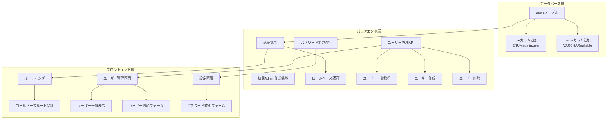
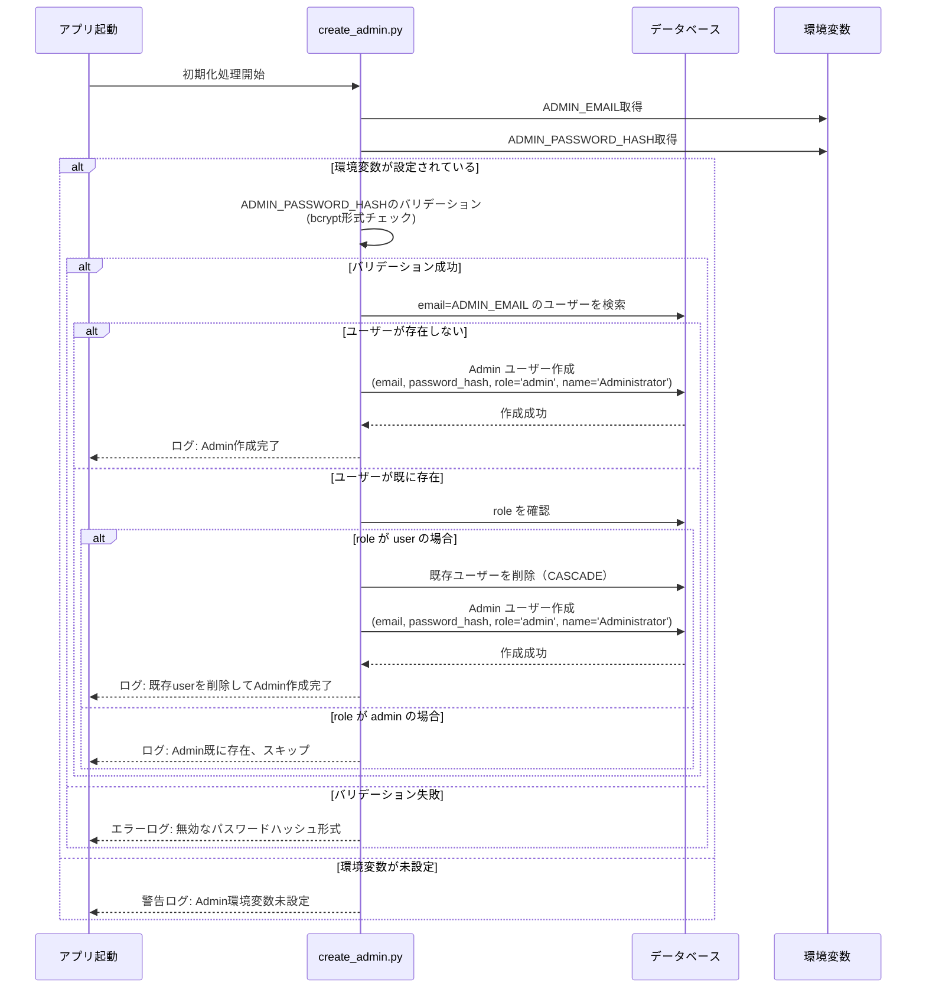
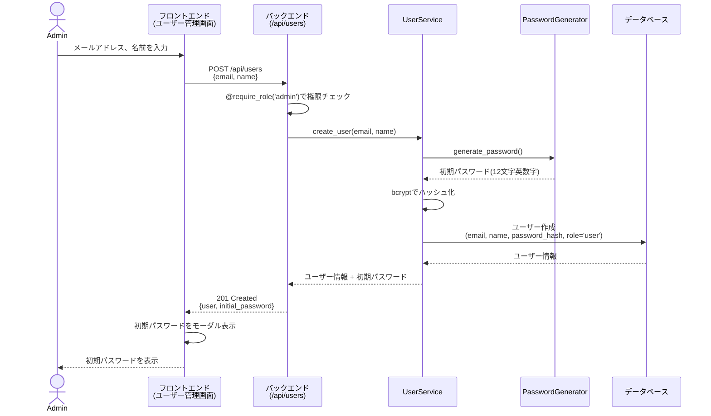
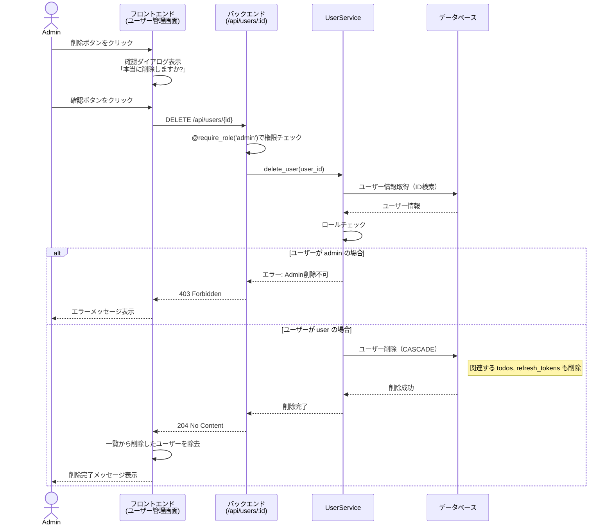
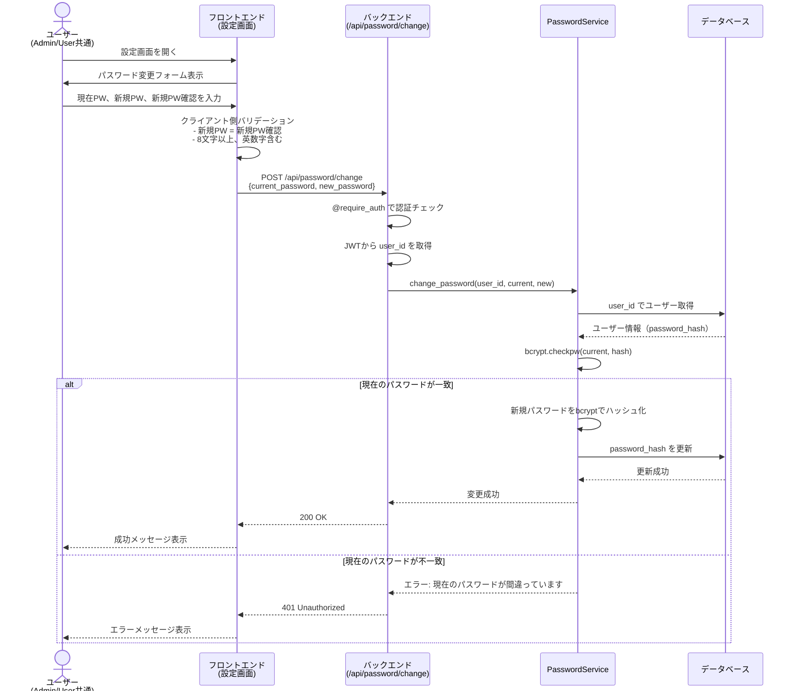
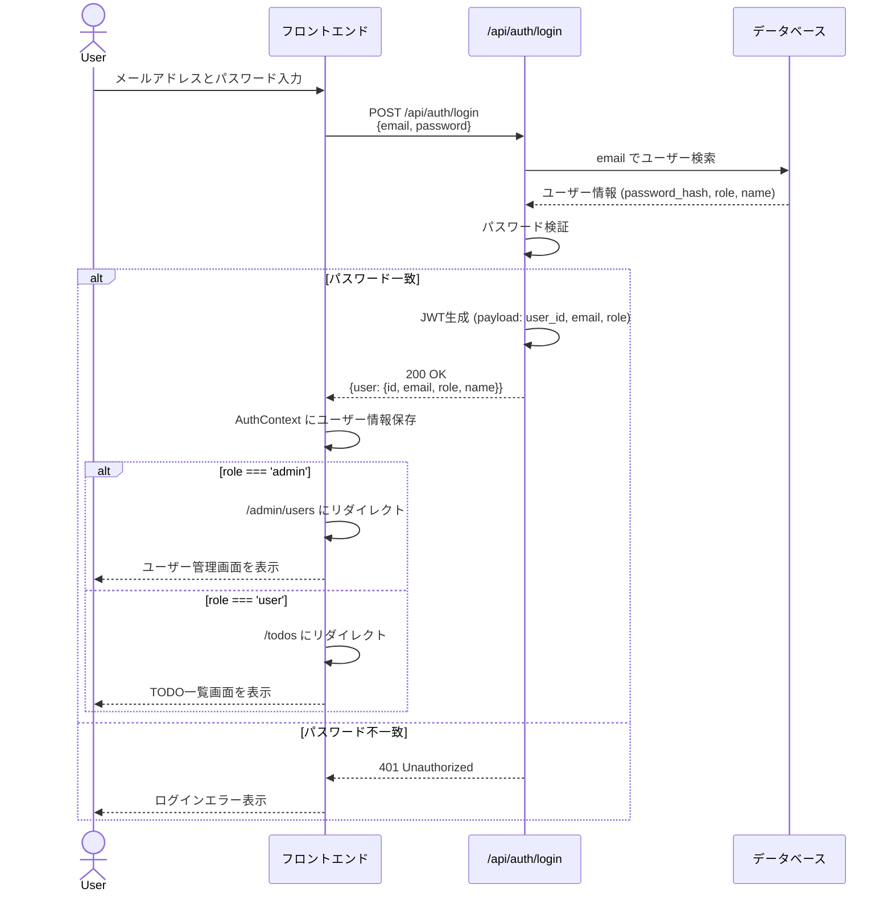
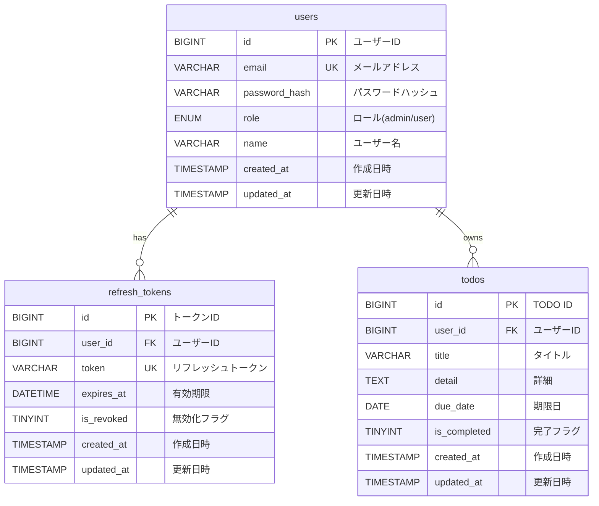
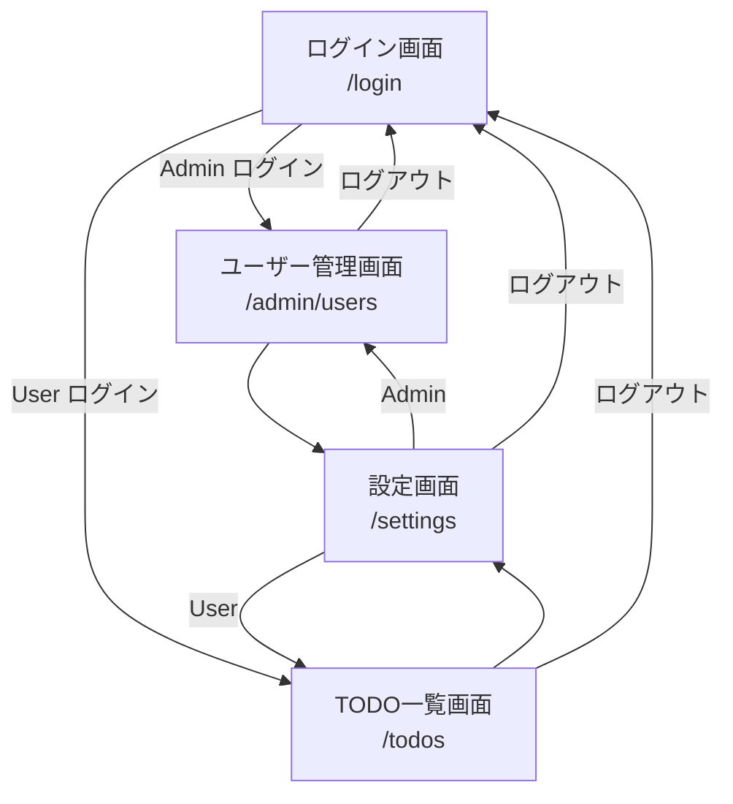

# Adminアカウントの追加

## 概要
Adminアカウントを追加し、ユーザーの追加・削除が行えるようにする

### 目的
現在アカウントの追加機能が無いため、Adminアカウントを追加して追加と削除ができるようにする。

### 要件
- Adminアカウントはアプリ作成時に一つだけ作成する←(作成の仕方やIDパスワードの設定方法は良い方法を提案してください)
- Adminアカウントは唯一のみで追加はできない
- ロールの機能を追加する
  - ロールの種別は2つ(Adminと普通のユーザー←適切な名前を提案してください)
- Adminユーザーはユーザー管理画面にのみアクセスできる(TODO機能は使えない)
- Adminユーザーはユーザーの追加と削除が行える
- 追加されたユーザーは初期パスワードがランダムで設定される
  - 初期パスワードはAdminが作成時に確認できる(Adminからユーザーに直接伝える設計)
- すべてのユーザーはパスワードの変更機能を使うことができる
  - 設定画面を追加する


---
## 実装仕様

### 1. システム概要

#### 1.1 要件決定事項

| 項目 | 決定内容 |
|------|---------|
| **Adminアカウント作成方法** | 環境変数（`ADMIN_EMAIL` / `ADMIN_PASSWORD_HASH`）で初期設定し、アプリ起動時に自動作成<br/>※ADMIN_PASSWORD_HASHはbcryptでハッシュ化された値を設定 |
| **ロール名** | `admin` (管理者) と `user` (一般ユーザー) |
| **初期パスワード生成方式** | 英数字のみ12文字のランダム文字列（例: aB3xY9mK2pL5） |
| **ユーザー管理画面の機能** | ユーザー一覧表示、ユーザー追加、ユーザー削除 |
| **ユーザー追加時の入力項目** | メールアドレス + 名前（表示用） |
| **パスワード変更機能** | 現在のパスワード + 新しいパスワードの入力（本人確認あり） |
| **設定画面の配置** | 独立した設定ページ（`/settings`）を作成 |
| **Adminログイン後の遷移先** | ユーザー管理画面（`/admin/users`） |
| **ユーザー削除時の確認** | 確認ダイアログを表示（誤削除防止） |
| **Adminのパスワード変更** | 可能（設定画面から変更できる） |

#### 1.2 システム全体の変更概要



---

### 2. データベース設計

#### 2.1 usersテーブルの変更

**変更内容:**
- `role` カラムを追加（ユーザーのロール種別）
- `name` カラムを追加（ユーザーの表示名）

**変更後のテーブル定義:**

| カラム名 | データ型 | 制約 | 説明 | 変更 |
|---------|---------|------|------|------|
| id | BIGINT UNSIGNED | PRIMARY KEY, AUTO_INC | ユーザーID | (既存) |
| email | VARCHAR(255) | NOT NULL, UNIQUE | メールアドレス | (既存) |
| password_hash | VARCHAR(255) | NOT NULL | パスワードハッシュ | (既存) |
| **role** | **ENUM('admin', 'user')** | **NOT NULL, DEFAULT 'user'** | **ユーザーロール** | **追加** |
| **name** | **VARCHAR(100)** | **NULL** | **ユーザー名（表示用）** | **追加** |
| created_at | TIMESTAMP | NOT NULL, DEFAULT NOW | 作成日時 | (既存) |
| updated_at | TIMESTAMP | NOT NULL, ON UPDATE NOW | 更新日時 | (既存) |

**インデックス:**
- `idx_users_email` on `email` (既存)
- **`idx_users_role` on `role`** (追加: ロール別検索の高速化)

**ビジネスルール:**
- `role` が `admin` のユーザーは1件のみ存在する
- `role` のデフォルト値は `user`
- `name` は NULL 許容（既存ユーザーとの互換性のため）
- 新規作成時は `name` の指定を推奨

#### 2.2 マイグレーション方針

**既存データへの影響:**
- 既存の `users` レコードには、`role='user'` がデフォルトで設定される
- 既存の `users` レコードの `name` は NULL のまま

**初期データ:**
- アプリ起動時に環境変数から Admin アカウントを自動作成（存在しない場合のみ）

---

### 3. バックエンド設計

#### 3.1 修正・新規作成するファイル

| ファイル | 種別 | 説明 |
|---------|------|------|
| `backend/app/models/user.py` | 修正 | User モデルに role と name カラムを追加 |
| `backend/app/schemas/user_schemas.py` | 新規 | ユーザー管理用の Pydantic スキーマ |
| `backend/app/schemas/auth.py` | 修正 | レスポンスに role と name を追加 |
| `backend/app/services/auth_service.py` | 修正 | ログイン時にロール情報を含める |
| `backend/app/services/user_service.py` | 新規 | ユーザー管理のビジネスロジック |
| `backend/app/services/password_service.py` | 新規 | パスワード変更のビジネスロジック |
| `backend/app/repositories/user_repository.py` | 修正 | ロールベースのクエリ追加 |
| `backend/app/routes/user_routes.py` | 新規 | ユーザー管理 API エンドポイント |
| `backend/app/routes/password_routes.py` | 新規 | パスワード変更 API エンドポイント |
| `backend/app/utils/auth_decorator.py` | 修正 | ロールベースの認可デコレータを追加 |
| `backend/app/utils/password_generator.py` | 新規 | 初期パスワード生成ユーティリティ |
| `backend/app/utils/password_hash_validator.py` | 新規 | bcryptハッシュ形式バリデータ |
| `backend/scripts/create_admin.py` | 新規 | 初期 Admin アカウント作成スクリプト |
| `backend/scripts/generate_admin_hash.py` | 新規 | Admin パスワードハッシュ生成ヘルパー |
| `backend/app/main.py` | 修正 | アプリ起動時に Admin アカウントを確認・作成 |
| `infra/mysql/init/001_init.sql` | 修正 | usersテーブル定義を更新 |

#### 3.2 処理フロー

##### 3.2.1 初期Admin作成フロー

アプリケーション起動時に以下の処理を実行します。



**処理内容の説明:**
1. アプリ起動時に `create_admin.py` スクリプトを実行
2. 環境変数 `ADMIN_EMAIL` と `ADMIN_PASSWORD_HASH` を読み込む
3. 環境変数が設定されている場合:
   - `ADMIN_PASSWORD_HASH` が正しいbcrypt形式かバリデーション
   - バリデーション成功:
     - 指定されたメールアドレスのユーザーがDBに存在するか確認
     - 存在しない場合: 新規にAdminアカウントを作成
     - 存在してrole=userの場合: 既存ユーザーを削除（CASCADE）してから新規にAdminを作成
     - 存在してrole=adminの場合: 何もせずスキップ
   - バリデーション失敗: エラーログを出力してスキップ
4. 環境変数が未設定の場合: 警告ログを出力してスキップ

##### 3.2.2 ユーザー作成フロー（Adminによる）



**処理内容の説明:**
1. Admin がユーザー管理画面でメールアドレスと名前を入力
2. フロントエンドが POST /api/users を呼び出し
3. バックエンドで Admin 権限をチェック（@require_role('admin') デコレータ）
4. UserService が以下を実行:
   - 12文字の英数字ランダムパスワードを生成
   - パスワードを bcrypt でハッシュ化
   - DB にユーザーレコードを作成（role='user'）
5. レスポンスにユーザー情報と初期パスワード（平文）を含める
6. フロントエンドがモーダルで初期パスワードを表示
7. Admin がユーザーに初期パスワードを伝える

**セキュリティ考慮事項:**
- 初期パスワードはレスポンスに1回だけ含まれ、DBには保存されない
- 初期パスワードはハッシュ化された状態でのみDBに保存される
- Admin のみがユーザー作成APIを呼び出せる

##### 3.2.3 ユーザー削除フロー



**処理内容の説明:**
1. Admin がユーザー一覧で削除ボタンをクリック
2. フロントエンドが確認ダイアログを表示
3. Admin が確認すると DELETE /api/users/{id} を呼び出し
4. バックエンドで Admin 権限をチェック
5. UserService が以下を実行:
   - 削除対象ユーザーの情報を取得
   - ロールが admin の場合はエラー（Admin は削除不可）
   - ロールが user の場合は削除を実行
6. DB の CASCADE により、関連する todos と refresh_tokens も削除
7. フロントエンドが一覧から該当ユーザーを除去
8. 削除完了メッセージを表示

**ビジネスルール:**
- Admin ユーザーは削除できない（唯一のAdminを保護）
- ユーザー削除時は関連データ（TODO、リフレッシュトークン）も削除される
- 削除前に確認ダイアログを表示して誤削除を防止

##### 3.2.4 パスワード変更フロー



**処理内容の説明:**
1. ユーザー（Admin または User）が設定画面を開く
2. パスワード変更フォームで以下を入力:
   - 現在のパスワード
   - 新しいパスワード
   - 新しいパスワード（確認用）
3. クライアント側で入力バリデーション:
   - 新しいパスワードと確認用が一致するか
   - パスワード要件（8文字以上、英数字含む）を満たすか
4. POST /api/password/change を呼び出し
5. バックエンドで認証チェック（JWT から user_id を取得）
6. PasswordService が以下を実行:
   - DB からユーザー情報を取得
   - 現在のパスワードを bcrypt で検証
   - 一致する場合: 新しいパスワードをハッシュ化して DB 更新
   - 不一致の場合: エラーレスポンス
7. フロントエンドが結果メッセージを表示

**セキュリティ考慮事項:**
- 現在のパスワードの入力を必須とし、本人確認を行う
- パスワードは bcrypt でハッシュ化して保存
- JWT 認証により、本人のみが自分のパスワードを変更できる

##### 3.2.5 ログインとロールベースルーティング



**処理内容の説明:**
1. ユーザーがログイン画面でメールアドレスとパスワードを入力
2. POST /api/auth/login を呼び出し
3. バックエンドが以下を実行:
   - email でユーザーを検索
   - パスワードを bcrypt で検証
   - JWT を生成（payload に user_id, email, role を含める）
   - レスポンスにユーザー情報（id, email, role, name）を含める
4. フロントエンドが AuthContext にユーザー情報を保存
5. role に応じてリダイレクト:
   - `role === 'admin'`: `/admin/users`（ユーザー管理画面）
   - `role === 'user'`: `/todos`（TODO一覧画面）

**変更点:**
- JWT の payload に `role` を追加
- レスポンスに `role` と `name` を追加
- ログイン後のリダイレクト先をロールに応じて切り替え

#### 3.3 API エンドポイント設計

##### 3.3.1 ユーザー管理 API

**ユーザー一覧取得**

```
GET /api/users
認証: 必須 (@require_auth)
認可: Admin のみ (@require_role('admin'))
```

**リクエスト:**
```http
GET /api/users
Cookie: access_token=...
```

**レスポンス:**
```json
{
  "users": [
    {
      "id": 1,
      "email": "admin@example.com",
      "name": "Administrator",
      "role": "admin",
      "created_at": "2025-10-01T10:00:00Z"
    },
    {
      "id": 2,
      "email": "user1@example.com",
      "name": "山田太郎",
      "role": "user",
      "created_at": "2025-10-15T14:30:00Z"
    }
  ]
}
```

**処理内容:**
- すべてのユーザーを取得（Admin と User 両方）
- 返却するフィールド: id, email, name, role, created_at
- password_hash は含めない（セキュリティ）

---

**ユーザー作成**

```
POST /api/users
認証: 必須 (@require_auth)
認可: Admin のみ (@require_role('admin'))
```

**リクエスト:**
```json
{
  "email": "newuser@example.com",
  "name": "新規ユーザー"
}
```

**レスポンス:**
```json
{
  "user": {
    "id": 3,
    "email": "newuser@example.com",
    "name": "新規ユーザー",
    "role": "user",
    "created_at": "2025-11-06T12:00:00Z"
  },
  "initial_password": "aB3xY9mK2pL5"
}
```

**処理内容:**
- 入力: email, name
- 初期パスワードを自動生成（12文字英数字ランダム）
- role は自動的に 'user' に設定
- レスポンスに初期パスワード（平文）を含める
- 初期パスワードは DB に保存されない（ハッシュ化された値のみ保存）

**バリデーション:**
- email: メール形式、一意性チェック
- name: 1文字以上100文字以下

**エラー:**
- 400: バリデーションエラー（email形式不正、name未入力）
- 409: メールアドレス重複

---

**ユーザー削除**

```
DELETE /api/users/{id}
認証: 必須 (@require_auth)
認可: Admin のみ (@require_role('admin'))
```

**リクエスト:**
```http
DELETE /api/users/3
Cookie: access_token=...
```

**レスポンス:**
```http
204 No Content
```

**処理内容:**
- 指定された ID のユーザーを削除
- role が 'admin' のユーザーは削除不可（エラー）
- CASCADE により関連データ（todos, refresh_tokens）も削除

**エラー:**
- 403: Admin ユーザーの削除を試みた
- 404: 指定されたユーザーが存在しない

---

##### 3.3.2 パスワード変更 API

**パスワード変更**

```
POST /api/password/change
認証: 必須 (@require_auth)
認可: すべてのユーザー（Admin/User共通）
```

**リクエスト:**
```json
{
  "current_password": "oldpassword123",
  "new_password": "newpassword123"
}
```

**レスポンス:**
```json
{
  "message": "パスワードを変更しました"
}
```

**処理内容:**
- JWT から user_id を取得
- current_password を検証（bcrypt.checkpw）
- 検証成功: new_password をハッシュ化して DB 更新
- 検証失敗: 401 エラー

**バリデーション:**
- current_password: 必須
- new_password: 8文字以上、英数字含む

**エラー:**
- 400: バリデーションエラー
- 401: 現在のパスワードが間違っている

---

##### 3.3.3 認証 API の変更

**ログイン API の変更**

既存の `POST /api/auth/login` のレスポンスに `role` と `name` を追加します。

**変更後のレスポンス:**
```json
{
  "user": {
    "id": 1,
    "email": "admin@example.com",
    "role": "admin",
    "name": "Administrator"
  }
}
```

**JWT ペイロードの変更:**
```json
{
  "user_id": 1,
  "email": "admin@example.com",
  "role": "admin",
  "exp": 1730901234
}
```

**トークンリフレッシュ API の変更**

`POST /api/auth/refresh` のレスポンスにも `role` と `name` を追加します。

#### 3.4 認可デコレータの追加

**新規デコレータ: `@require_role(role)`**

特定のロールを持つユーザーのみがアクセスできるようにするデコレータを追加します。

**使用例:**
```python
@user_bp.get("")
@require_role('admin')
def list_users():
    # Admin のみアクセス可能
    pass
```

**処理内容:**
1. JWT トークンを検証（@require_auth の機能）
2. JWT ペイロードから role を取得
3. 指定された role と一致するかチェック
4. 一致しない場合: 403 Forbidden エラー

#### 3.5 初期パスワード生成ロジック

**仕様:**
- 文字種: 英大文字（A-Z）、英小文字（a-z）、数字（0-9）
- 文字数: 12文字
- 必須条件:
  - 最低1文字の英大文字を含む
  - 最低1文字の英小文字を含む
  - 最低1文字の数字を含む
- ランダム生成: Python の `secrets` モジュールを使用（暗号学的に安全）

**生成例:**
- `aB3xY9mK2pL5`
- `Xy7kM4nP9qR2`
- `M5nT8vR3wX7k`

**実装場所:**
- `backend/app/utils/password_generator.py`

**関数シグネチャ:**
```python
def generate_initial_password(length: int = 12) -> str:
    """
    初期パスワードを生成します。

    Args:
        length: パスワードの長さ（デフォルト: 12）

    Returns:
        生成されたパスワード（英数字のみ12文字）
    """
```

---

### 4. フロントエンド設計

#### 4.1 修正・新規作成するファイル

| ファイル | 種別 | 説明 |
|---------|------|------|
| `frontend/src/contexts/AuthContext.tsx` | 修正 | ユーザー情報に role と name を追加 |
| `frontend/src/pages/admin/UserManagementPage.tsx` | 新規 | ユーザー管理画面 |
| `frontend/src/pages/SettingsPage.tsx` | 新規 | 設定画面（パスワード変更） |
| `frontend/src/components/admin/UserList.tsx` | 新規 | ユーザー一覧コンポーネント |
| `frontend/src/components/admin/UserCreateForm.tsx` | 新規 | ユーザー作成フォーム |
| `frontend/src/components/admin/InitialPasswordModal.tsx` | 新規 | 初期パスワード表示モーダル |
| `frontend/src/components/settings/PasswordChangeForm.tsx` | 新規 | パスワード変更フォーム |
| `frontend/src/components/ProtectedRoute.tsx` | 修正 | ロールベースのルート保護を追加 |
| `frontend/src/lib/api/users.ts` | 新規 | ユーザー管理 API クライアント |
| `frontend/src/lib/api/password.ts` | 新規 | パスワード変更 API クライアント |
| `frontend/src/App.tsx` | 修正 | ルート追加、ログイン後のリダイレクト先変更 |

#### 4.2 画面設計

##### 4.2.1 ユーザー管理画面 (`/admin/users`)

**アクセス権限:** Admin のみ

**画面構成:**
```
+--------------------------------------------------+
| ヘッダー                                          |
| [ユーザー管理] [設定] [ログアウト]                 |
+--------------------------------------------------+
| ユーザー管理                                       |
|                                                  |
| [+ 新規ユーザー追加]                              |
|                                                  |
| +----------------------------------------------+ |
| | ユーザー一覧                                   | |
| +----------------------------------------------+ |
| | メールアドレス        | 名前    | ロール | 操作 | |
| |---------------------|--------|-------|------| |
| | admin@example.com   | Admin  | admin |  -   | |
| | user1@example.com   | 山田太郎 | user  | 削除 | |
| | user2@example.com   | 佐藤花子 | user  | 削除 | |
| +----------------------------------------------+ |
+--------------------------------------------------+
```

**機能:**
1. ユーザー一覧表示（テーブル形式）
   - 列: メールアドレス、名前、ロール、操作
   - Admin ユーザーには削除ボタンを表示しない
   - User ユーザーには削除ボタンを表示
2. 新規ユーザー追加ボタン
   - クリックするとユーザー作成フォームを表示

**ユーザー作成フォーム（モーダルまたはインライン）:**
```
+-------------------------------------+
| 新規ユーザー追加                     |
+-------------------------------------+
| メールアドレス: [                 ] |
| 名前:          [                 ] |
|                                     |
| [キャンセル]           [作成]       |
+-------------------------------------+
```

**入力項目:**
- メールアドレス（必須、メール形式）
- 名前（必須、1-100文字）

**作成成功時:**
初期パスワード表示モーダルを表示

```
+-------------------------------------+
| ユーザーを作成しました                |
+-------------------------------------+
| 初期パスワード:                      |
|                                     |
|     aB3xY9mK2pL5                   |
|                                     |
| このパスワードをユーザーに伝えてください。|
| この画面を閉じると再表示できません。    |
|                                     |
| [コピー]                  [閉じる]   |
+-------------------------------------+
```

**削除確認ダイアログ:**
```
+-------------------------------------+
| ユーザーの削除                       |
+-------------------------------------+
| user1@example.com を削除しますか?   |
|                                     |
| この操作は取り消せません。            |
|                                     |
| [キャンセル]           [削除]       |
+-------------------------------------+
```

---

##### 4.2.2 設定画面 (`/settings`)

**アクセス権限:** すべてのユーザー（Admin/User共通）

**画面構成:**
```
+--------------------------------------------------+
| ヘッダー                                          |
| [TODO一覧] [設定] [ログアウト]  (User の場合)      |
| [ユーザー管理] [設定] [ログアウト] (Admin の場合)  |
+--------------------------------------------------+
| 設定                                              |
|                                                  |
| +----------------------------------------------+ |
| | パスワード変更                                 | |
| +----------------------------------------------+ |
| | 現在のパスワード:    [                      ] | |
| | 新しいパスワード:    [                      ] | |
| | 新しいパスワード(確認): [                   ] | |
| |                                              | |
| | [変更]                                       | |
| +----------------------------------------------+ |
+--------------------------------------------------+
```

**機能:**
1. パスワード変更フォーム
   - 現在のパスワード（必須）
   - 新しいパスワード（必須、8文字以上、英数字含む）
   - 新しいパスワード確認（必須、上記と一致）
2. 変更ボタン
   - クリックすると POST /api/password/change を呼び出し
   - 成功: 成功メッセージ表示
   - 失敗: エラーメッセージ表示

**バリデーション:**
- クライアント側:
  - 新しいパスワード = 新しいパスワード確認
  - 新しいパスワードが8文字以上
  - 新しいパスワードが英数字を含む
- サーバー側:
  - 現在のパスワードが正しいか検証

---

#### 4.3 ルーティング設計

**変更内容:**

| パス | コンポーネント | アクセス権限 | 説明 |
|------|-------------|------------|------|
| `/login` | LoginPage | 未認証のみ | ログイン画面 |
| `/todos` | TodoListPage | User のみ | TODO一覧（既存） |
| `/admin/users` | UserManagementPage | Admin のみ | ユーザー管理画面（新規） |
| `/settings` | SettingsPage | すべてのユーザー | 設定画面（新規） |
| `/` | - | リダイレクト | ログイン状態に応じてリダイレクト |

**リダイレクトロジック:**

```mermaid
graph TD
    A[/ にアクセス] --> B{ログイン済み?}
    B -->|No| C[/login にリダイレクト]
    B -->|Yes| D{role は?}
    D -->|admin| E[/admin/users にリダイレクト]
    D -->|user| F[/todos にリダイレクト]
```

**ログイン後のリダイレクト:**
- role === 'admin': `/admin/users`
- role === 'user': `/todos`

**ProtectedRoute の拡張:**

現在の `ProtectedRoute` は認証チェックのみですが、ロールベースのチェックを追加します。

```tsx
<Route
  path="/admin/users"
  element={
    <ProtectedRoute requiredRole="admin">
      <UserManagementPage />
    </ProtectedRoute>
  }
/>

<Route
  path="/todos"
  element={
    <ProtectedRoute requiredRole="user">
      <TodoListPage />
    </ProtectedRoute>
  }
/>

<Route
  path="/settings"
  element={
    <ProtectedRoute>
      <SettingsPage />
    </ProtectedRoute>
  }
/>
```

**処理内容:**
- `requiredRole` が指定されている場合、ユーザーのロールをチェック
- ロールが一致しない場合、適切なページにリダイレクト
  - admin が `/todos` にアクセス → `/admin/users` にリダイレクト
  - user が `/admin/users` にアクセス → `/todos` にリダイレクト

#### 4.4 ヘッダーナビゲーション

**User の場合:**
```
[TODO一覧] [設定] [ログアウト]
```

**Admin の場合:**
```
[ユーザー管理] [設定] [ログアウト]
```

**変更点:**
- role に応じてナビゲーションリンクを切り替え
- 設定リンクを追加

---

### 5. 実装手順とタスク

実装を段階的に進め、各ステップで動作確認を行います。

#### フェーズ1: データベースとバックエンド基盤（3タスク）

##### タスク1-1: データベーススキーマ更新

**作業内容:**
1. `infra/mysql/init/001_init.sql` を更新
   - users テーブルに `role` カラムを追加（ENUM('admin', 'user')）
   - users テーブルに `name` カラムを追加（VARCHAR(100) NULL）
   - `idx_users_role` インデックスを追加
2. `backend/app/models/user.py` を更新
   - role フィールドを追加（Enum 型）
   - name フィールドを追加（String 型、nullable=True）
3. データベースを再作成
   - `make db-reset` を実行

**動作確認:**
```bash
# データベースに接続してスキーマを確認
docker compose -f infra/docker-compose.yml exec db mysql -u app_user -p app_db

# SQL実行
DESCRIBE users;

# 確認項目:
# - role カラムが存在する（ENUM('admin', 'user'), NOT NULL, DEFAULT 'user'）
# - name カラムが存在する（VARCHAR(100), NULL）
# - idx_users_role インデックスが存在する

# インデックス確認
SHOW INDEXES FROM users;
```

**期待結果:**
- users テーブルに role と name カラムが追加されている
- role のデフォルト値が 'user' に設定されている
- idx_users_role インデックスが作成されている

---

##### タスク1-2: 初期Admin作成機能の実装

**作業内容:**
1. `backend/app/utils/password_generator.py` を作成
   - `generate_initial_password()` 関数を実装
2. `backend/app/utils/password_hash_validator.py` を作成
   - `validate_bcrypt_hash(hash_string)` 関数を実装（bcrypt形式チェック）
3. `backend/scripts/create_admin.py` を作成
   - 環境変数から ADMIN_EMAIL と ADMIN_PASSWORD_HASH を読み込む
   - ADMIN_PASSWORD_HASH のバリデーション（bcrypt形式チェック）
   - Admin ユーザーが存在しない場合は作成
   - 既存ユーザーの場合は role を admin に更新
4. `backend/scripts/generate_admin_hash.py` を作成（ヘルパースクリプト）
   - パスワードを入力するとbcryptハッシュを生成して出力
5. `backend/app/main.py` を修正
   - アプリ起動時に `create_admin.py` を実行
6. `backend/.env` に環境変数を追加
   ```env
   ADMIN_EMAIL=admin@example.com
   ADMIN_PASSWORD_HASH=$2b$12$...（bcryptハッシュ値）
   ```
   ※ハッシュの生成は `python backend/scripts/generate_admin_hash.py` で実行

**動作確認:**
```bash
# バックエンドコンテナを再起動
make down
make up

# ログを確認（Admin作成メッセージが表示されるか）
docker compose -f infra/docker-compose.yml logs backend | grep -i admin

# データベースで確認
docker compose -f infra/docker-compose.yml exec db mysql -u app_user -p -e "SELECT id, email, role, name FROM app_db.users WHERE role='admin';"
```

**期待結果:**
- ログに「Admin user created: admin@example.com」が表示される
- データベースに admin@example.com のユーザーが role='admin' で作成されている
- 2回目の起動では「Admin user already exists, skipping」が表示される
- ADMIN_EMAILのユーザーが既にrole=userで存在する場合、そのユーザーが削除され、新規にadminが作成される

---

##### タスク1-3: 認証APIの更新（ロール対応）

**作業内容:**
1. `backend/app/schemas/auth.py` を修正
   - UserResponse に role と name フィールドを追加
2. `backend/app/services/auth_service.py` を修正
   - JWT ペイロードに role を追加
   - login() のレスポンスに role と name を含める
   - refresh_access_token() のレスポンスに role と name を含める
3. 既存のテストを修正（role と name を追加）

**動作確認:**
```bash
# ログインAPIをテスト
curl -X POST http://localhost:5000/api/auth/login \
  -H "Content-Type: application/json" \
  -d '{"email":"admin@example.com","password":"admin123"}' \
  -c cookies.txt -v

# レスポンスのJSONを確認
# 期待: {"user": {"id": 1, "email": "admin@example.com", "role": "admin", "name": "Administrator"}}

# JWTペイロードをデコードして確認（jqを使用）
# access_token を取得してデコード
# 期待: {"user_id": 1, "email": "admin@example.com", "role": "admin", ...}
```

**期待結果:**
- ログインレスポンスに role と name が含まれる
- JWT ペイロードに role が含まれる

---

#### フェーズ2: ユーザー管理機能（バックエンド）（4タスク）

##### タスク2-1: ロールベース認可デコレータの実装

**作業内容:**
1. `backend/app/utils/auth_decorator.py` を修正
   - `@require_role(role)` デコレータを追加
   - JWT から role を取得して検証
   - role が一致しない場合は 403 エラー

**動作確認:**
```bash
# テストエンドポイントを一時的に作成
# routes/test_routes.py (一時的に作成)
"""
@test_bp.get("/admin-only")
@require_role('admin')
def admin_only():
    return {"message": "Admin only endpoint"}
"""

# Adminでアクセス
curl -X GET http://localhost:5000/api/test/admin-only \
  -b cookies.txt

# 期待: 200 OK, {"message": "Admin only endpoint"}

# Userでアクセス（別のUserアカウントでログイン後）
curl -X GET http://localhost:5000/api/test/admin-only \
  -b user_cookies.txt

# 期待: 403 Forbidden
```

**期待結果:**
- Admin ロールでアクセス成功
- User ロールでアクセス拒否（403）

---

##### タスク2-2: ユーザー管理API実装（一覧取得・作成）

**作業内容:**
1. `backend/app/schemas/user_schemas.py` を作成
   - UserCreateRequest, UserResponse スキーマを定義
2. `backend/app/services/user_service.py` を作成
   - `list_users()`: ユーザー一覧取得
   - `create_user(email, name)`: ユーザー作成、初期パスワード生成
3. `backend/app/repositories/user_repository.py` を修正
   - ロールベースのクエリを追加
4. `backend/app/routes/user_routes.py` を作成
   - GET /api/users (Admin のみ)
   - POST /api/users (Admin のみ)

**動作確認:**
```bash
# ユーザー一覧取得
curl -X GET http://localhost:5000/api/users \
  -b cookies.txt

# 期待: 200 OK, {"users": [{...}, {...}]}

# ユーザー作成
curl -X POST http://localhost:5000/api/users \
  -H "Content-Type: application/json" \
  -d '{"email":"testuser@example.com","name":"テストユーザー"}' \
  -b cookies.txt

# 期待: 201 Created, {"user": {...}, "initial_password": "aB3xY9mK2pL5"}

# データベースで確認
docker compose -f infra/docker-compose.yml exec db mysql -u app_user -p -e "SELECT email, name, role FROM app_db.users WHERE email='testuser@example.com';"
```

**期待結果:**
- ユーザー一覧が取得できる
- 新規ユーザーが作成され、初期パスワードがレスポンスに含まれる
- DB に role='user' でユーザーが保存される

---

##### タスク2-3: ユーザー削除API実装

**作業内容:**
1. `backend/app/services/user_service.py` に追加
   - `delete_user(user_id)`: ユーザー削除（Admin削除不可チェック）
2. `backend/app/routes/user_routes.py` に追加
   - DELETE /api/users/{id} (Admin のみ)

**動作確認:**
```bash
# テストユーザーを作成（タスク2-2で作成したユーザーを使用）
# ユーザーID を確認
curl -X GET http://localhost:5000/api/users -b cookies.txt | jq '.users[] | select(.email=="testuser@example.com") | .id'

# ユーザー削除
curl -X DELETE http://localhost:5000/api/users/3 \
  -b cookies.txt

# 期待: 204 No Content

# データベースで確認（削除されていること）
docker compose -f infra/docker-compose.yml exec db mysql -u app_user -p -e "SELECT * FROM app_db.users WHERE id=3;"

# Admin削除を試みる
curl -X DELETE http://localhost:5000/api/users/1 \
  -b cookies.txt

# 期待: 403 Forbidden, {"error": "Admin user cannot be deleted"}
```

**期待結果:**
- User ユーザーは削除できる
- Admin ユーザーは削除できない（403エラー）

---

##### タスク2-4: パスワード変更API実装

**作業内容:**
1. `backend/app/schemas/password_schemas.py` を作成
   - PasswordChangeRequest スキーマを定義
2. `backend/app/services/password_service.py` を作成
   - `change_password(user_id, current, new)`: パスワード変更
3. `backend/app/routes/password_routes.py` を作成
   - POST /api/password/change (認証必須、全ユーザー)

**動作確認:**
```bash
# パスワード変更（正しい現在のパスワード）
curl -X POST http://localhost:5000/api/password/change \
  -H "Content-Type: application/json" \
  -d '{"current_password":"admin123","new_password":"newpassword123"}' \
  -b cookies.txt

# 期待: 200 OK, {"message": "パスワードを変更しました"}

# 新しいパスワードでログイン
curl -X POST http://localhost:5000/api/auth/login \
  -H "Content-Type: application/json" \
  -d '{"email":"admin@example.com","password":"newpassword123"}'

# 期待: 200 OK, ログイン成功

# 誤った現在のパスワードでパスワード変更
curl -X POST http://localhost:5000/api/password/change \
  -H "Content-Type: application/json" \
  -d '{"current_password":"wrongpassword","new_password":"newpassword456"}' \
  -b cookies.txt

# 期待: 401 Unauthorized, {"error": "現在のパスワードが間違っています"}
```

**期待結果:**
- 正しい現在のパスワードでパスワード変更成功
- 新しいパスワードでログイン成功
- 誤った現在のパスワードで変更失敗（401）

---

#### フェーズ3: フロントエンド実装（5タスク）

##### タスク3-1: AuthContextとルーティングの更新

**作業内容:**
1. `frontend/src/contexts/AuthContext.tsx` を修正
   - User 型に role と name を追加
   - ログイン後、role に応じたリダイレクト処理
2. `frontend/src/App.tsx` を修正
   - `/admin/users` ルートを追加
   - `/settings` ルートを追加
   - ルート保護を更新
3. `frontend/src/components/ProtectedRoute.tsx` を修正
   - requiredRole プロパティを追加
   - ロールベースのアクセス制御

**動作確認:**
```bash
# フロントエンドを起動
make up

# ブラウザでアクセス
# 1. Admin でログイン（admin@example.com / newpassword123）
#    期待: /admin/users にリダイレクト

# 2. User でログイン（testuser@example.com / 初期パスワード）
#    期待: /todos にリダイレクト

# 3. User で /admin/users にアクセス
#    期待: /todos にリダイレクト

# 4. Admin で /todos にアクセス
#    期待: /admin/users にリダイレクト
```

**期待結果:**
- ロールに応じて正しいページにリダイレクトされる
- ロールに応じてルートが保護される

---

##### タスク3-2: ユーザー管理画面の実装（一覧表示）

**作業内容:**
1. `frontend/src/lib/api/users.ts` を作成
   - `fetchUsers()`: ユーザー一覧取得
2. `frontend/src/pages/admin/UserManagementPage.tsx` を作成
   - ページ全体のレイアウト
3. `frontend/src/components/admin/UserList.tsx` を作成
   - ユーザー一覧テーブルの表示
   - Admin には削除ボタンを表示しない

**動作確認:**
```bash
# ブラウザで確認
# 1. Admin でログイン
# 2. /admin/users にアクセス
# 3. ユーザー一覧が表示されることを確認
#    - Admin ユーザー（削除ボタンなし）
#    - User ユーザー（削除ボタンあり）

# 開発者ツールでネットワークタブを確認
# - GET /api/users のリクエストが成功していること
```

**期待結果:**
- ユーザー一覧がテーブル形式で表示される
- メールアドレス、名前、ロールが表示される
- Admin には削除ボタンが表示されない

---

##### タスク3-3: ユーザー作成機能の実装

**作業内容:**
1. `frontend/src/lib/api/users.ts` に追加
   - `createUser(email, name)`: ユーザー作成
2. `frontend/src/components/admin/UserCreateForm.tsx` を作成
   - メールアドレスと名前の入力フォーム
   - バリデーション
3. `frontend/src/components/admin/InitialPasswordModal.tsx` を作成
   - 初期パスワード表示モーダル
   - コピー機能
4. `frontend/src/pages/admin/UserManagementPage.tsx` を修正
   - ユーザー作成フォームを統合

**動作確認:**
```bash
# ブラウザで確認
# 1. Admin でログイン
# 2. /admin/users にアクセス
# 3. 「新規ユーザー追加」ボタンをクリック
# 4. メールアドレスと名前を入力して「作成」
# 5. 初期パスワードがモーダルで表示されることを確認
# 6. コピーボタンをクリックしてクリップボードにコピー
# 7. モーダルを閉じる
# 8. ユーザー一覧に新しいユーザーが追加されていることを確認

# バリデーションテスト
# - メールアドレス形式が不正な場合、エラーメッセージが表示される
# - 名前が空の場合、エラーメッセージが表示される
```

**期待結果:**
- ユーザー作成フォームが動作する
- 初期パスワードがモーダルで表示される
- コピー機能が動作する
- 作成後、一覧に新しいユーザーが追加される

---

##### タスク3-4: ユーザー削除機能の実装

**作業内容:**
1. `frontend/src/lib/api/users.ts` に追加
   - `deleteUser(userId)`: ユーザー削除
2. `frontend/src/components/admin/UserList.tsx` を修正
   - 削除ボタンのクリックハンドラを追加
   - 確認ダイアログを表示
   - 削除後、一覧を更新

**動作確認:**
```bash
# ブラウザで確認
# 1. Admin でログイン
# 2. /admin/users にアクセス
# 3. User ユーザーの「削除」ボタンをクリック
# 4. 確認ダイアログが表示されることを確認
#    「user@example.com を削除しますか?」
# 5. 「削除」ボタンをクリック
# 6. ユーザーが一覧から削除されることを確認

# キャンセルテスト
# - 確認ダイアログで「キャンセル」をクリック
# - ユーザーが削除されないことを確認
```

**期待結果:**
- 削除ボタンをクリックすると確認ダイアログが表示される
- 確認後、ユーザーが削除される
- 一覧から削除されたユーザーが除去される

---

##### タスク3-5: パスワード変更画面の実装

**作業内容:**
1. `frontend/src/lib/api/password.ts` を作成
   - `changePassword(current, newPassword)`: パスワード変更
2. `frontend/src/components/settings/PasswordChangeForm.tsx` を作成
   - パスワード変更フォーム
   - バリデーション
3. `frontend/src/pages/SettingsPage.tsx` を作成
   - 設定画面のレイアウト
4. ヘッダーナビゲーションに「設定」リンクを追加

**動作確認:**
```bash
# ブラウザで確認（Adminの場合）
# 1. Admin でログイン
# 2. ヘッダーの「設定」リンクをクリック
# 3. /settings にアクセスできることを確認
# 4. パスワード変更フォームが表示されることを確認
# 5. 現在のパスワード、新しいパスワード、新しいパスワード（確認）を入力
# 6. 「変更」ボタンをクリック
# 7. 成功メッセージが表示されることを確認
# 8. ログアウトして新しいパスワードでログイン成功を確認

# バリデーションテスト
# - 新しいパスワードと確認が一致しない場合、エラー表示
# - 新しいパスワードが8文字未満の場合、エラー表示
# - 現在のパスワードが間違っている場合、サーバーエラー表示

# Userでも同様に確認
```

**期待結果:**
- 設定画面が表示される
- パスワード変更フォームが動作する
- バリデーションが動作する
- 変更後、新しいパスワードでログインできる

---

#### フェーズ4: テストとドキュメント（2タスク）

##### タスク4-1: バックエンドテストの実装

**作業内容:**
1. `backend/tests/routes/test_user_routes.py` を作成
   - ユーザー一覧取得のテスト
   - ユーザー作成のテスト
   - ユーザー削除のテスト
   - 権限チェックのテスト
2. `backend/tests/routes/test_password_routes.py` を作成
   - パスワード変更のテスト
   - バリデーションテスト
3. `backend/tests/services/test_user_service.py` を作成
   - ユーザーサービスのユニットテスト
4. 既存のテストを修正（role と name の追加に対応）

**動作確認:**
```bash
# バックエンドテストを実行
poetry -C backend run pytest

# 期待: すべてのテストが成功
# PASSED backend/tests/routes/test_user_routes.py::test_list_users
# PASSED backend/tests/routes/test_user_routes.py::test_create_user
# PASSED backend/tests/routes/test_user_routes.py::test_delete_user
# PASSED backend/tests/routes/test_password_routes.py::test_change_password
# ...

# カバレッジレポートを確認
poetry -C backend run pytest --cov=app --cov-report=html
# backend/htmlcov/index.html を開いて確認
```

**期待結果:**
- すべてのテストが成功する
- カバレッジが適切（目標: 80%以上）

---

##### タスク4-2: フロントエンドテストとドキュメント更新

**作業内容:**
1. `frontend/src/lib/api/users.test.ts` を作成
   - API クライアントのテスト
2. `frontend/src/components/admin/UserList.test.tsx` を作成
   - ユーザー一覧コンポーネントのテスト
3. ドキュメント更新
   - `docs/02_authentication-authorization.md` を更新（ロール機能）
   - `docs/04_database-design.md` を更新（users テーブル）
   - `docs/03_feature-list.md` を更新（新機能）
4. README.md を更新（環境変数追加）

**動作確認:**
```bash
# フロントエンドテストを実行
pnpm --dir frontend run test

# 期待: すべてのテストが成功

# ドキュメントの確認
# - 各ドキュメントが正しく更新されているか確認
# - リンク切れがないか確認
```

**期待結果:**
- すべてのテストが成功する
- ドキュメントが最新の状態に更新される

---

### 6. 最終的な要件と検証項目

#### 6.1 機能要件チェックリスト

実装完了後、以下の項目がすべて満たされていることを確認します。

| # | 要件 | 検証方法 | 期待結果 |
|---|------|---------|---------|
| 1 | Admin アカウントが環境変数で作成される | 環境変数設定後、アプリ起動してDB確認 | admin@example.com が role='admin' で存在 |
| 2 | Admin は唯一のみ（追加不可） | ユーザー作成フォームで確認 | role は常に 'user' で作成される |
| 3 | ロール機能（admin/user）が動作 | ログイン後のリダイレクト確認 | Admin→ユーザー管理、User→TODO |
| 4 | Admin はユーザー管理画面のみアクセス可 | Admin で /todos にアクセス | /admin/users にリダイレクト |
| 5 | Admin はユーザーの追加ができる | ユーザー作成フォームでユーザー追加 | 新規ユーザーが作成され、初期PWが表示される |
| 6 | 初期パスワードは12文字英数字ランダム | ユーザー作成時の初期PW確認 | 12文字、英大文字・小文字・数字を含む |
| 7 | 初期パスワードは Admin が確認できる | ユーザー作成後のモーダル確認 | 初期PWがモーダルで表示される |
| 8 | Admin はユーザーの削除ができる | ユーザー削除ボタンクリック | 確認後、ユーザーが削除される |
| 9 | Admin 自身は削除できない | Admin の削除を試みる | 削除ボタンが表示されない |
| 10 | すべてのユーザーはパスワード変更可能 | 設定画面でパスワード変更 | 変更成功、新PWでログイン可能 |
| 11 | 設定画面が存在する | ヘッダーから設定画面にアクセス | /settings が表示される |
| 12 | Admin のパスワード変更も可能 | Admin で設定画面からPW変更 | 変更成功 |

#### 6.2 セキュリティ要件チェックリスト

| # | 要件 | 検証方法 | 期待結果 |
|---|------|---------|---------|
| 1 | パスワードは bcrypt でハッシュ化 | DB の password_hash を確認 | $2b$ で始まるハッシュが保存される |
| 2 | 初期パスワードは DB に保存されない | DB の password_hash を確認 | ハッシュのみ保存、平文なし |
| 3 | ロールベースのアクセス制御 | User で /admin/users にアクセス | 403 エラーまたはリダイレクト |
| 4 | JWT に role が含まれる | ログイン後の JWT デコード | payload に role フィールド存在 |
| 5 | パスワード変更時に現在PWを確認 | 誤った現在PWで変更試行 | 401 エラー |
| 6 | Admin のみがユーザー管理 API 呼び出し可 | User で POST /api/users 実行 | 403 エラー |

#### 6.3 ユーザビリティ要件チェックリスト

| # | 要件 | 検証方法 | 期待結果 |
|---|------|---------|---------|
| 1 | ログイン後、ロールに応じたページへ遷移 | Admin/User でログイン | 適切なページに自動遷移 |
| 2 | ユーザー削除時に確認ダイアログ表示 | 削除ボタンクリック | 確認ダイアログが表示される |
| 3 | 初期パスワードがコピーできる | コピーボタンクリック | クリップボードにコピーされる |
| 4 | バリデーションエラーが分かりやすい | 不正な入力で送信 | エラーメッセージが表示される |
| 5 | パスワード変更後に成功メッセージ表示 | PW変更実行 | 成功メッセージが表示される |

---

### 7. 環境変数設定

#### 7.1 バックエンド環境変数

`backend/.env` に以下を追加:

```env
# 既存の設定
DATABASE_URL=mysql+pymysql://app_user:password@db:3306/app_db
FLASK_ENV=development
JWT_SECRET_KEY=your-secret-key-here
ACCESS_TOKEN_EXPIRE_MINUTES=1440
REFRESH_TOKEN_EXPIRE_DAYS=7

# 新規追加: Admin アカウント設定
ADMIN_EMAIL=admin@example.com
ADMIN_PASSWORD_HASH=$2b$12$LQv3c1yqBWVHxkd0LHAkCOYz6TtxMQJqhN8/LewY5UpCCaa70.MYW
```

**パスワードハッシュの生成方法:**

平文のパスワードをbcryptでハッシュ化するには、以下のヘルパースクリプトを使用します：

```bash
# ハッシュ生成スクリプトを実行
poetry -C backend run python backend/scripts/generate_admin_hash.py

# パスワードを入力するとハッシュが表示される
# 例: admin123 → $2b$12$LQv3c1yqBWVHxkd0LHAkCOYz6TtxMQJqhN8/LewY5UpCCaa70.MYW
```

または Python で直接生成：

```python
import bcrypt
password = "your-secure-password"
hash = bcrypt.hashpw(password.encode('utf-8'), bcrypt.gensalt())
print(hash.decode('utf-8'))
```

**注意:**
- `ADMIN_PASSWORD_HASH` には必ずbcryptでハッシュ化された値を設定してください
- 平文のパスワードを設定するとバリデーションエラーになります
- bcryptハッシュは `$2b$` で始まる60文字程度の文字列です
- 本番環境では強固なパスワードを使用してください
- 環境変数が未設定の場合、Admin は作成されません（警告ログが出力されます）
- ハッシュ形式が不正な場合もエラーログが出力され、Admin は作成されません

#### 7.2 フロントエンド環境変数

変更なし（既存の設定を継続使用）。

---

### 8. データフロー図

全体のデータフローを以下の図で示します。

```mermaid
graph TB
    subgraph "初期化"
        ENV[環境変数<br/>ADMIN_EMAIL<br/>ADMIN_PASSWORD_HASH]
        INIT[アプリ起動時<br/>create_admin.py<br/>ハッシュバリデーション]
        ENV --> INIT
        INIT --> DB[(Database<br/>users)]
    end

    subgraph "Admin: ユーザー作成"
        A1[Admin<br/>ユーザー管理画面]
        A2[POST /api/users<br/>email, name]
        A3[UserService<br/>generate_password]
        A4[Database<br/>INSERT user]
        A5[初期PW表示<br/>モーダル]

        A1 --> A2
        A2 --> A3
        A3 --> A4
        A4 --> A5
    end

    subgraph "Admin: ユーザー削除"
        B1[Admin<br/>削除ボタン]
        B2[確認ダイアログ]
        B3[DELETE /api/users/:id]
        B4[Database<br/>DELETE user]

        B1 --> B2
        B2 --> B3
        B3 --> B4
    end

    subgraph "全ユーザー: パスワード変更"
        C1[設定画面<br/>PW変更フォーム]
        C2[POST /api/password/change<br/>current, new]
        C3[PasswordService<br/>verify & update]
        C4[Database<br/>UPDATE password_hash]

        C1 --> C2
        C2 --> C3
        C3 --> C4
    end

    subgraph "ログイン & ルーティング"
        D1[ログイン]
        D2[JWT発行<br/>payload: role]
        D3{role?}
        D4[/admin/users<br/>ユーザー管理]
        D5[/todos<br/>TODO一覧]

        D1 --> D2
        D2 --> D3
        D3 -->|admin| D4
        D3 -->|user| D5
    end
```

---

### 9. エラーハンドリング

#### 9.1 バックエンドエラーレスポンス

| エラーコード | 状況 | レスポンス例 |
|------------|------|------------|
| 400 | バリデーションエラー | `{"error": "email: Invalid email format"}` |
| 401 | 認証エラー | `{"error": "現在のパスワードが間違っています"}` |
| 403 | 認可エラー | `{"error": "Admin users cannot be deleted"}` |
| 404 | リソース不存在 | `{"error": "User not found"}` |
| 409 | データ重複 | `{"error": "Email already exists"}` |
| 500 | サーバーエラー | `{"error": "Internal server error"}` |

#### 9.2 フロントエンドエラー表示

- API エラーはトースト通知またはフォーム下部にエラーメッセージを表示
- ネットワークエラーは「通信エラーが発生しました」と表示
- バリデーションエラーは該当フィールドの下に赤字で表示

---

### 10. パフォーマンス考慮事項

1. **インデックス:**
   - `idx_users_role` により、ロール別のクエリが高速化

2. **初期パスワード生成:**
   - `secrets` モジュールを使用し、暗号学的に安全な乱数生成

3. **ユーザー一覧取得:**
   - ページネーションは現時点では実装しない（将来的に検討）
   - 小規模アプリケーションのため、全件取得で十分

---

### 11. 今後の拡張案

実装完了後、以下の機能拡張を検討できます:

1. **ユーザー編集機能:**
   - メールアドレスや名前の変更

2. **ユーザー検索・フィルタ:**
   - ロール別フィルタ
   - メールアドレス検索

3. **ページネーション:**
   - ユーザー一覧のページネーション

4. **パスワードリセット:**
   - メールによるパスワードリセット機能

5. **監査ログ:**
   - ユーザー作成・削除のログ記録

6. **複数の Admin:**
   - 複数の Admin ユーザーをサポート

---

## 補足資料

### A. データベースER図（更新版）



### B. API エンドポイント一覧

| メソッド | エンドポイント | 認証 | 認可 | 説明 |
|---------|--------------|------|------|------|
| GET | /api/users | 必須 | Admin | ユーザー一覧取得 |
| POST | /api/users | 必須 | Admin | ユーザー作成 |
| DELETE | /api/users/{id} | 必須 | Admin | ユーザー削除 |
| POST | /api/password/change | 必須 | 全員 | パスワード変更 |
| POST | /api/auth/login | 不要 | - | ログイン（role追加） |
| POST | /api/auth/refresh | 不要 | - | トークン更新（role追加） |
| POST | /api/auth/logout | 不要 | - | ログアウト |

### C. 画面遷移図



---

**END OF SPECIFICATION**
