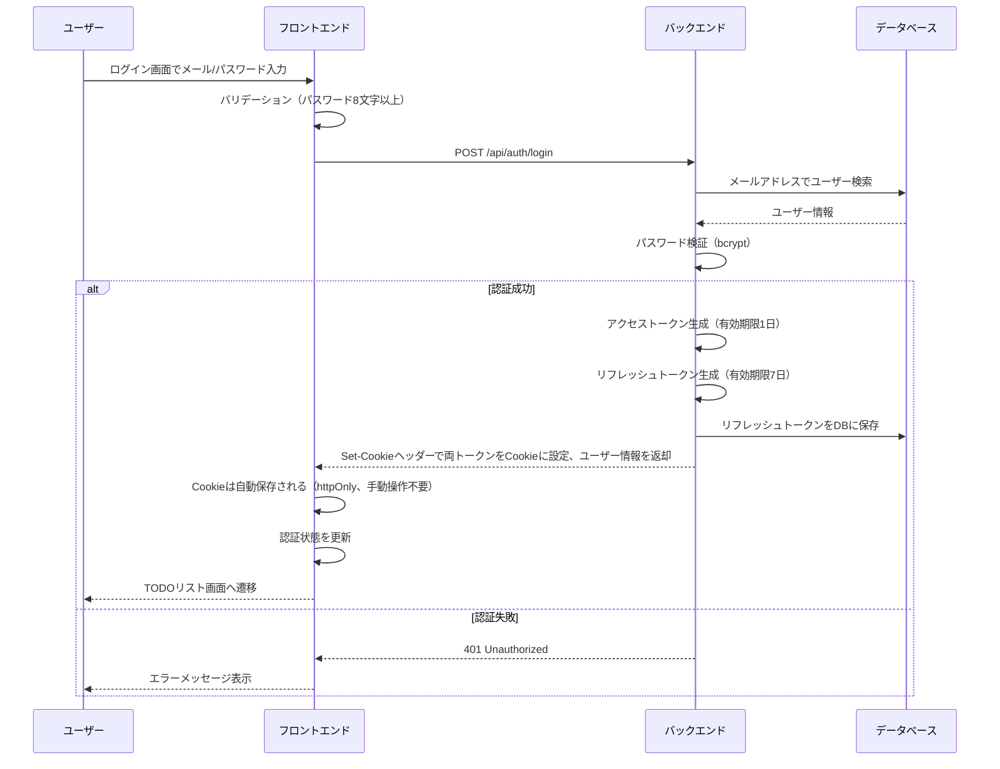
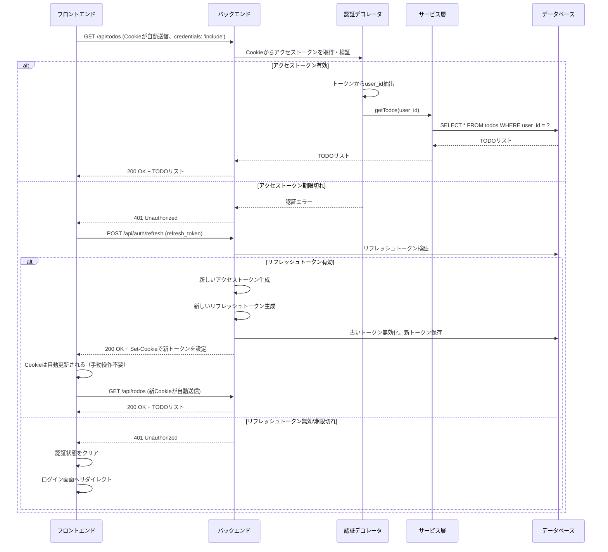
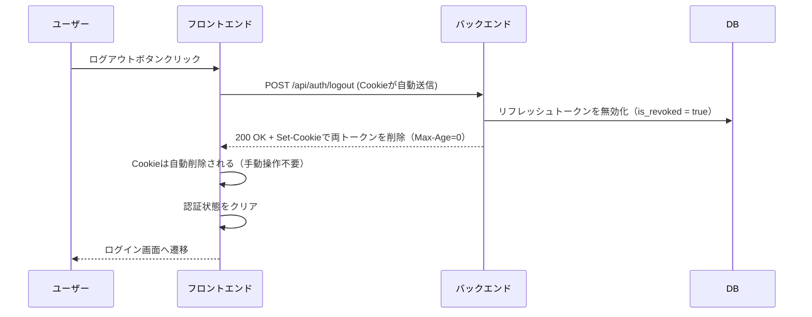

# ログイン機能の追加

## 概要
ログイン機能を追加する。
ユーザーごとにTODOリストは独立させたい。

### 目的
現在のアプリにはログイン機能が追加されていないので、追加したい。

### 要件
- ログイン機能を追加する
- ユーザー登録機能はなし(一旦直接SQLを叩いてユーザー登録する)
- メールアドレスとパスワードでログインする
- ログイン画面を追加
- 英数八文字以上をパスワードの条件とする

---
## 実装仕様

### システム構成

#### 認証方式
- **JWT（JSON Web Token）方式**を採用
- **2つのトークンを使用**（リフレッシュトークン方式）：
  - **アクセストークン**：有効期限1日（デフォルト）、API呼び出しに使用
  - **リフレッシュトークン**：有効期限7日間（デフォルト）、アクセストークン更新に使用
- **環境変数で有効期限を設定可能**：
  - `ACCESS_TOKEN_EXPIRE_MINUTES`：アクセストークンの有効期限（分単位、デフォルト：1440分=1日）
  - `REFRESH_TOKEN_EXPIRE_DAYS`：リフレッシュトークンの有効期限（日単位、デフォルト：7日）
- トークンの保存場所：
  - アクセストークン：httpOnly Cookie（JavaScriptからアクセス不可、XSS対策）
  - リフレッシュトークン：httpOnly Cookie + データベースで管理（無効化可能）
- Cookie設定：
  - httpOnly: true（XSS攻撃対策 - JavaScriptからアクセス不可）
  - Secure: true（HTTPS通信のみ、本番環境で必須）
  - SameSite: Lax（CSRF攻撃対策）
  - Path: /api（APIエンドポイントのみ）
  - Max-Age: アクセストークンは1日、リフレッシュトークンは7日
- 各API リクエストでCookieが自動的に送信される（ブラウザが自動管理）

#### トークン更新（リフレッシュ）機能
- アクセストークンの有効期限が切れた場合、自動的にリフレッシュ
- リフレッシュトークンを使用して新しいアクセストークン（と新しいリフレッシュトークン）を取得
- ユーザーが操作を続けている限り、ログイン状態が維持される
- 7日間操作がない場合、リフレッシュトークンが期限切れとなり再ログインが必要
- リフレッシュトークンはDBで管理し、ログアウト時に無効化（強制ログアウト可能）

#### アクセス制御
- 未ログイン状態でアプリにアクセスした場合、自動的にログイン画面へリダイレクト
- ログアウト機能を提供し、ユーザーが任意にログアウト可能
- ログアウト時はバックエンドでCookieを削除（Set-Cookie with Max-Age=0）し、ログイン画面へ遷移

### 変更・新規作成するファイル

#### バックエンド

##### 1. 新規作成するファイル

**Userモデル** (`backend/app/models/user.py`)
- ユーザー情報を管理するデータベースモデル
- メールアドレス、パスワードハッシュ、タイムスタンプを保持

**RefreshTokenモデル** (`backend/app/models/refresh_token.py`)
- リフレッシュトークンを管理するデータベースモデル
- トークン文字列、ユーザーID、有効期限、無効化フラグを保持

**Userリポジトリ** (`backend/app/repositories/user_repository.py`)
- ユーザーの検索、作成を行うデータアクセス層
- メールアドレスでユーザーを検索する機能を提供

**RefreshTokenリポジトリ** (`backend/app/repositories/refresh_token_repository.py`)
- リフレッシュトークンの作成、検索、無効化を行うデータアクセス層
- トークンによる検索、ユーザーの全トークン無効化機能を提供

**認証サービス** (`backend/app/services/auth_service.py`)
- ログイン処理のビジネスロジックを実装
- パスワード検証とJWTトークン（アクセス、リフレッシュ）生成を担当
- トークンリフレッシュ機能を実装

**認証ルート** (`backend/app/routes/auth_routes.py`)
- ログイン、ログアウト、トークンリフレッシュのAPIエンドポイントを提供
- POST /api/auth/login：ログイン
- POST /api/auth/logout：ログアウト（リフレッシュトークン無効化）
- POST /api/auth/refresh：トークンリフレッシュ

**認証スキーマ** (`backend/app/schemas/auth.py`)
- ログインリクエスト、レスポンスのデータ構造を定義
- リフレッシュトークンリクエスト、レスポンスのデータ構造を定義
- Pydanticによるバリデーションを実装

**認証デコレータ** (`backend/app/utils/auth_decorator.py`)
- JWTトークンの検証を行うデコレータ
- リクエストのCookieからアクセストークンを取得
- 各APIエンドポイントで認証チェックを実施

**パスワードハッシュユーティリティ** (`backend/app/utils/password.py`)
- パスワードのハッシュ化と検証を行う
- bcryptライブラリを使用

##### 2. 変更するファイル

**TODOモデル** (`backend/app/models/todo.py`)
- `user_id`カラムを追加し、ユーザーとのリレーションを設定
- ユーザーIDをForeign Keyとして設定

**TODOリポジトリ** (`backend/app/repositories/todo_repository.py`)
- すべてのメソッドにユーザーIDのフィルタリングを追加
- ユーザーは自分のTODOのみ取得・操作可能にする

**TODOサービス** (`backend/app/services/todo_service.py`)
- メソッドのシグネチャにuser_idを追加
- リポジトリ呼び出し時にuser_idを渡す

**TODOルート** (`backend/app/routes/todo_routes.py`)
- すべてのエンドポイントに認証デコレータを追加
- 認証されたユーザーのIDをサービス層に渡す

**アプリケーション初期化** (`backend/app/__init__.py`)
- 認証ルートをBlueprintとして登録

**依存関係** (`backend/pyproject.toml`)
- PyJWT（JWT生成・検証）
- bcrypt（パスワードハッシュ化）
- Flask-CORS（CORS設定、Cookieの送受信に必須）

**環境変数設定** (`backend/.env`)
- `ACCESS_TOKEN_EXPIRE_MINUTES`：アクセストークンの有効期限（分単位）
- `REFRESH_TOKEN_EXPIRE_DAYS`：リフレッシュトークンの有効期限（日単位）
- `JWT_SECRET_KEY`：JWT署名用のシークレットキー
- `JWT_ALGORITHM`：JWT署名アルゴリズム（デフォルト：HS256）
- `COOKIE_SECURE`：本番環境でtrue（HTTPS必須）、開発環境でfalse
- `COOKIE_DOMAIN`：Cookieのドメイン設定（本番環境で設定）

**CORS設定** (`backend/app/__init__.py` または専用の設定ファイル)
- フロントエンドからCookieを送受信するため、CORS設定が必須
- 設定内容：
  - `Access-Control-Allow-Credentials: true`（Cookieの送受信を許可）
  - `Access-Control-Allow-Origin`: 具体的なフロントエンドのURLを指定（ワイルドカード `*` は使用不可）
    - 開発環境: `http://localhost:3000`
    - 本番環境: 実際のフロントエンドドメイン
  - `Access-Control-Allow-Methods`: `GET, POST, PUT, DELETE, OPTIONS`
  - `Access-Control-Allow-Headers`: `Content-Type`
- Flask-CORSライブラリを使用する場合の設定例：
  ```python
  from flask_cors import CORS
  CORS(app,
       supports_credentials=True,
       origins=['http://localhost:3000'],  # 環境変数で管理推奨
       allow_headers=['Content-Type'],
       methods=['GET', 'POST', 'PUT', 'DELETE', 'OPTIONS'])
  ```

#### フロントエンド

##### 1. 新規作成するファイル

**ログイン画面** (`frontend/src/pages/LoginPage.tsx`)
- メールアドレスとパスワード入力フォームを表示
- ログイン処理を実行し、成功時はTODOリスト画面へ遷移

**認証コンテキスト** (`frontend/src/contexts/AuthContext.tsx`)
- アプリ全体で認証状態を管理
- ログイン、ログアウト、認証状態の取得機能を提供
- トークンはhttpOnly Cookieで自動管理されるため、手動での保存・取得は不要

**認証API** (`frontend/src/lib/api/auth.ts`)
- ログイン、ログアウト、トークンリフレッシュのAPI呼び出し
- すべてのリクエストで `credentials: 'include'` を設定（Cookieを自動送信）
- エラーハンドリングとログ出力
- トークンリフレッシュの自動リトライ機能

**認証型定義** (`frontend/src/types/auth.ts`)
- ログインリクエスト、レスポンス、ユーザー情報の型定義
- リフレッシュトークンリクエスト、レスポンスの型定義

**Protected Route コンポーネント** (`frontend/src/components/ProtectedRoute.tsx`)
- 認証が必要なルートを保護
- 未認証の場合はログイン画面にリダイレクト

##### 2. 変更するファイル

**ルーティング設定** (`frontend/src/main.tsx` または該当ファイル)
- ログイン画面のルートを追加（`/login`）
- TODOリスト画面をProtectedRouteでラップ
- ルートパス（`/`）は認証状態によって適切に遷移

**App コンポーネント** (`frontend/src/App.tsx`)
- AuthContextProviderでアプリ全体をラップ
- ログアウトボタンを追加（ヘッダーなど）

**API クライアント** (`frontend/src/lib/api/todos.ts`)
- すべてのリクエストで `credentials: 'include'` を設定（Cookieを自動送信）
- Cookieが自動的にリクエストに含まれる（手動でのヘッダー追加不要）
- 401エラー時に自動的にトークンリフレッシュを試行
- リフレッシュ成功後、元のリクエストを自動リトライ

### データベーススキーマ

#### Usersテーブル（新規作成）

| カラム名 | 型 | 制約 | 説明 |
|---------|-----|------|------|
| id | Integer/BigInteger | PRIMARY KEY, AUTO_INCREMENT | ユーザーID |
| email | String(255) | UNIQUE, NOT NULL | メールアドレス |
| password_hash | String(255) | NOT NULL | ハッシュ化されたパスワード |
| created_at | DateTime | NOT NULL, DEFAULT CURRENT_TIMESTAMP | 作成日時 |
| updated_at | DateTime | NOT NULL, DEFAULT CURRENT_TIMESTAMP ON UPDATE | 更新日時 |

**インデックス:**
- `idx_users_email`: emailカラムにユニークインデックス（高速検索）

#### RefreshTokensテーブル（新規作成）

| カラム名 | 型 | 制約 | 説明 |
|---------|-----|------|------|
| id | Integer/BigInteger | PRIMARY KEY, AUTO_INCREMENT | リフレッシュトークンID |
| token | String(500) | UNIQUE, NOT NULL | リフレッシュトークン文字列 |
| user_id | Integer/BigInteger | FOREIGN KEY (users.id), NOT NULL | 所有者のユーザーID |
| expires_at | DateTime | NOT NULL | トークンの有効期限 |
| is_revoked | Boolean | NOT NULL, DEFAULT FALSE | 無効化フラグ |
| created_at | DateTime | NOT NULL, DEFAULT CURRENT_TIMESTAMP | 作成日時 |
| updated_at | DateTime | NOT NULL, DEFAULT CURRENT_TIMESTAMP ON UPDATE | 更新日時 |

**インデックス:**
- `idx_refresh_tokens_token`: tokenカラムにユニークインデックス（高速検索）
- `idx_refresh_tokens_user_id`: user_idカラムにインデックス（ユーザー別検索）
- `idx_refresh_tokens_expires_at`: expires_atカラムにインデックス（期限切れトークンの削除用）

**外部キー制約:**
- `fk_refresh_tokens_user_id`: `user_id` → `users.id` (ON DELETE CASCADE)
  - ユーザー削除時、そのユーザーのリフレッシュトークンも自動削除

#### Todosテーブル（変更）

既存カラムに以下を追加:

| カラム名 | 型 | 制約 | 説明 |
|---------|-----|------|------|
| user_id | Integer/BigInteger | FOREIGN KEY (users.id), NOT NULL | 所有者のユーザーID |

**インデックス:**
- `idx_todos_user_id`: user_idカラムにインデックス（ユーザー別TODO取得の高速化）

**外部キー制約:**
- `fk_todos_user_id`: `user_id` → `users.id` (ON DELETE CASCADE)
  - ユーザー削除時、そのユーザーのTODOも自動削除

### 認証フロー



### API呼び出しフロー



### ログアウトフロー



### 実装する処理の詳細

#### 1. ログイン処理

**入力:**
- メールアドレス（必須、メール形式）
- パスワード（必須、英数8文字以上）

**処理フロー:**
1. フロントエンドでバリデーションを実施
   - メールアドレス形式チェック
   - パスワード長チェック（8文字以上）
   - パスワード文字種チェック（英数を含む）
2. バックエンドの `/api/auth/login` にPOSTリクエスト
3. バックエンドでメールアドレスからユーザーを検索
4. 存在しない場合は「メールアドレスまたはパスワードが間違っています」エラー
5. パスワードをbcryptで検証
6. 不一致の場合は「メールアドレスまたはパスワードが間違っています」エラー
7. 認証成功時、2つのJWTトークンを生成
   - アクセストークン:
     - ペイロード: `{ user_id, email, exp（有効期限） }`
     - 有効期限: 発行から1日後（環境変数 `ACCESS_TOKEN_EXPIRE_MINUTES` で設定可能）
   - リフレッシュトークン:
     - ペイロード: `{ user_id, token_id, exp（有効期限） }`
     - 有効期限: 発行から7日後（環境変数 `REFRESH_TOKEN_EXPIRE_DAYS` で設定可能）
8. リフレッシュトークンをDBに保存（token, user_id, expires_at, is_revoked=false）
9. レスポンスとして以下を設定:
   - Set-Cookieヘッダーでアクセストークンを設定（httpOnly, Secure, SameSite=Lax, Max-Age=1日）
   - Set-Cookieヘッダーでリフレッシュトークンを設定（httpOnly, Secure, SameSite=Lax, Max-Age=7日）
   - レスポンスボディにユーザー情報を返却
10. フロントエンドではCookieが自動保存される（手動操作不要）
11. 認証コンテキストを更新
12. TODOリスト画面（`/`）へリダイレクト

**出力:**
- **レスポンスヘッダー:**
  ```
  Set-Cookie: access_token=eyJhbGciOiJIUzI1NiIsInR5cCI6IkpXVCJ9...; HttpOnly; Secure; SameSite=Lax; Path=/api; Max-Age=86400
  Set-Cookie: refresh_token=eyJhbGciOiJIUzI1NiIsInR5cCI6IkpXVCJ9...; HttpOnly; Secure; SameSite=Lax; Path=/api; Max-Age=604800
  ```
- **レスポンスボディ:**
  ```json
  {
    "user": {
      "id": 1,
      "email": "user@example.com"
    }
  }
  ```

**エラーレスポンス:**
```json
{
  "error": "メールアドレスまたはパスワードが間違っています"
}
```

#### 2. ログアウト処理

**入力:**
- リフレッシュトークン（Cookieから自動取得）

**処理フロー:**
1. ユーザーがログアウトボタンをクリック
2. フロントエンドから `/api/auth/logout` にPOSTリクエスト（credentials: 'include'でCookieを送信）
3. バックエンドでCookieからリフレッシュトークンを取得・検証
4. DBでリフレッシュトークンを無効化（is_revoked = true）
5. バックエンドからSet-Cookieヘッダーで両トークンを削除（Max-Age=0）
6. フロントエンドでCookieは自動削除される
7. 認証コンテキストをクリア
8. ログイン画面（`/login`）へリダイレクト

**出力:**
```json
{
  "message": "ログアウトしました"
}
```

#### 3. 認証チェック処理

**処理フロー:**
1. 保護されたAPIエンドポイントへのリクエスト時
2. リクエストのCookieから `access_token` を取得
3. アクセストークンが存在しない場合は401エラー
4. トークンをJWTライブラリでデコード・検証
5. 署名が無効または期限切れの場合は401エラー
6. トークンからuser_idを抽出
7. リクエストコンテキストにuser_idを設定
8. エンドポイント処理を続行

**エラーレスポンス:**
```json
{
  "error": "認証が必要です"
}
```

#### 4. トークンリフレッシュ処理

**入力:**
- リフレッシュトークン（Cookieから自動取得）

**処理フロー:**
1. フロントエンドから `/api/auth/refresh` にPOSTリクエスト（credentials: 'include'）
2. リクエストのCookieからリフレッシュトークンを取得
3. トークンをJWTライブラリでデコード・検証
4. 署名が無効または期限切れの場合は401エラー
5. DBでリフレッシュトークンを検索
6. トークンが存在しない、または無効化されている（is_revoked = true）場合は401エラー
7. トークンの有効期限が切れている場合は401エラー
8. 新しいアクセストークンを生成（有効期限1日）
9. 新しいリフレッシュトークンを生成（有効期限7日）
10. 古いリフレッシュトークンを無効化（is_revoked = true）
11. 新しいリフレッシュトークンをDBに保存
12. Set-Cookieヘッダーで新しい両トークンをCookieに設定
13. フロントエンドでCookieは自動更新される（手動操作不要）

**出力:**
- **レスポンスヘッダー:**
  ```
  Set-Cookie: access_token=eyJhbGciOiJIUzI1NiIsInR5cCI6IkpXVCJ9...; HttpOnly; Secure; SameSite=Lax; Path=/api; Max-Age=86400
  Set-Cookie: refresh_token=eyJhbGciOiJIUzI1NiIsInR5cCI6IkpXVCJ9...; HttpOnly; Secure; SameSite=Lax; Path=/api; Max-Age=604800
  ```
- **レスポンスボディ:**
  ```json
  {
    "message": "トークンを更新しました"
  }
  ```

**エラーレスポンス:**
```json
{
  "error": "リフレッシュトークンが無効です"
}
```

**フロントエンドの自動リフレッシュ:**
- API呼び出しで401エラーが返った場合、自動的にトークンリフレッシュを試行
- リフレッシュ成功後、元のAPIリクエストを自動リトライ
- リフレッシュ失敗の場合、ログイン画面へリダイレクト
- 同時に複数の401エラーが発生しても、リフレッシュリクエストは1回のみ実行（デバウンス処理）

#### 5. TODO取得の変更

**処理フロー:**
1. `/api/todos` へのGETリクエスト
2. 認証デコレータでuser_idを取得
3. サービス層で `getTodos(user_id, status)` を呼び出し
4. リポジトリ層で `WHERE user_id = ? AND ...` でフィルタリング
5. 該当ユーザーのTODOのみを返却

**出力:** （既存のTODO APIと同じ形式、ただしuser_idでフィルタリング済み）
```json
[
  {
    "id": 1,
    "title": "TODOタイトル",
    "detail": "詳細",
    "due_date": "2025-11-01",
    "is_completed": false,
    "created_at": "2025-10-27T10:00:00",
    "updated_at": "2025-10-27T10:00:00"
  }
]
```

#### 6. TODO作成・更新・削除の変更

**処理フロー:**
- 既存の処理に認証チェックを追加
- 新規作成時は自動的にログイン中のuser_idを設定
- 更新・削除時はuser_idでフィルタリングし、他ユーザーのTODOは操作不可

#### 7. 初回ユーザー作成（手動）

ユーザー登録機能は実装しないため、以下のSQLを直接実行してユーザーを作成:

```sql
-- パスワードは事前にbcryptでハッシュ化する必要があります
-- 例: "password123" のハッシュ（実際の値は毎回異なる）
INSERT INTO users (email, password_hash, created_at, updated_at)
VALUES (
  'user@example.com',
  '$2b$12$xxxxxxxxxxxxxxxxxxxxxxxxxxxxxxxxxxxxxxxxxxxxxxxxxxx',
  NOW(),
  NOW()
);
```

### 実装手順とチェック方法

#### Phase 1: データベースとモデルの準備

**タスク1-1: Userモデルの作成**
- `backend/app/models/user.py` を作成
- email, password_hash, created_at, updated_at カラムを定義
- TODOモデルとのリレーションシップを設定

**チェック方法:**
- Pythonインタープリタでモデルをimportしてエラーが出ないことを確認
```bash
poetry -C backend run python -c "from app.models.user import User; print(User.__tablename__)"
```

**タスク1-2: RefreshTokenモデルの作成**
- `backend/app/models/refresh_token.py` を作成
- token, user_id, expires_at, is_revoked カラムを定義
- UserモデルとのForeign Key設定

**チェック方法:**
- Pythonインタープリタでモデルをimportしてエラーが出ないことを確認
```bash
poetry -C backend run python -c "from app.models.refresh_token import RefreshToken; print(RefreshToken.__tablename__)"
```

**タスク1-3: TODOモデルの変更**
- `backend/app/models/todo.py` にuser_idカラムを追加
- UserモデルとのForeign Key設定

**チェック方法:**
- モデルのimportが成功することを確認
```bash
poetry -C backend run python -c "from app.models.todo import Todo; print(Todo.__table__.columns.keys())"
```
- user_idがカラムリストに含まれることを確認

**タスク1-4: データベースマイグレーション**
- Alembicを使用してマイグレーションスクリプトを生成
- マイグレーションを実行してテーブルを作成・変更

**チェック方法:**
- データベースに接続してテーブル構造を確認
```bash
docker exec -it <container_name> mysql -u user -p -e "DESCRIBE app_db.users;"
docker exec -it <container_name> mysql -u user -p -e "DESCRIBE app_db.refresh_tokens;"
docker exec -it <container_name> mysql -u user -p -e "DESCRIBE app_db.todos;"
```
- usersテーブルとrefresh_tokensテーブルが存在し、todosテーブルにuser_idカラムが追加されていることを確認

**タスク1-5: テストユーザーの作成**
- bcryptでパスワードをハッシュ化
- SQLを実行してテストユーザーを作成

**チェック方法:**
```bash
docker exec -it <container_name> mysql -u user -p -e "SELECT id, email FROM app_db.users;"
```
- ユーザーが正常に作成されていることを確認

#### Phase 2: バックエンド認証機能の実装

**タスク2-1: パスワードユーティリティの作成**
- `backend/app/utils/password.py` を作成
- hash_password, verify_password 関数を実装

**チェック方法:**
- ユニットテストまたは手動テスト
```bash
poetry -C backend run python -c "from app.utils.password import hash_password, verify_password; h=hash_password('test123'); print(verify_password('test123', h))"
```
- Trueが返ることを確認

**タスク2-2: Userリポジトリの作成**
- `backend/app/repositories/user_repository.py` を作成
- find_by_email, create メソッドを実装

**チェック方法:**
- Pythonインタープリタで動作確認
```bash
poetry -C backend run python
>>> from app.repositories.user_repository import UserRepository
>>> from app.database import init_db, get_session
>>> init_db()
>>> session = get_session()
>>> repo = UserRepository(session)
>>> user = repo.find_by_email("user@example.com")
>>> print(user.email if user else "Not found")
```

**タスク2-3: RefreshTokenリポジトリの作成**
- `backend/app/repositories/refresh_token_repository.py` を作成
- create, find_by_token, revoke, revoke_all_for_user メソッドを実装

**チェック方法:**
- Pythonインタープリタで動作確認
```bash
poetry -C backend run python -c "from app.repositories.refresh_token_repository import RefreshTokenRepository; print('OK')"
```

**タスク2-4: 認証スキーマの作成**
- `backend/app/schemas/auth.py` を作成
- LoginRequest, LoginResponse, RefreshTokenRequest, RefreshTokenResponse スキーマを定義

**チェック方法:**
- Pydanticのバリデーションテスト
```bash
poetry -C backend run python -c "from app.schemas.auth import LoginRequest; LoginRequest(email='test@example.com', password='password123')"
```

**タスク2-5: 認証サービスの作成**
- `backend/app/services/auth_service.py` を作成
- login メソッドを実装（パスワード検証、アクセストークンとリフレッシュトークン生成）
- refresh_token メソッドを実装（トークンリフレッシュ機能）

**チェック方法:**
- Pythonインタープリタで動作確認
```bash
poetry -C backend run python
>>> from app.services.auth_service import AuthService
>>> service = AuthService()
>>> result = service.login("user@example.com", "correct_password")
>>> print(result)
```
- アクセストークンとリフレッシュトークンが生成されることを確認

**タスク2-6: 認証デコレータの作成**
- `backend/app/utils/auth_decorator.py` を作成
- require_auth デコレータを実装（アクセストークンの検証）

**チェック方法:**
- ダミーエンドポイントを作成してテスト
- 有効なトークンで200、無効なトークンで401が返ることを確認

**タスク2-7: 認証ルートの作成**
- `backend/app/routes/auth_routes.py` を作成
- POST /api/auth/login エンドポイントを実装
- POST /api/auth/refresh エンドポイントを実装（トークンリフレッシュ）
- POST /api/auth/logout エンドポイントを実装（リフレッシュトークン無効化）

**チェック方法:**
- curlまたはPostmanでAPIをテスト
```bash
# ログイン
curl -X POST http://localhost:5000/api/auth/login \
  -H "Content-Type: application/json" \
  -d '{"email":"user@example.com","password":"correct_password"}'
```
- アクセストークンとリフレッシュトークンが返却されることを確認

```bash
# トークンリフレッシュ
curl -X POST http://localhost:5000/api/auth/refresh \
  -H "Content-Type: application/json" \
  -d '{"refresh_token":"<取得したリフレッシュトークン>"}'
```
- 新しいアクセストークンとリフレッシュトークンが返却されることを確認

**タスク2-8: アプリケーションに認証ルートを登録**
- `backend/app/__init__.py` を変更
- auth_routes Blueprintを登録

**チェック方法:**
- アプリケーション起動後、ルートが登録されていることを確認
```bash
make up
curl http://localhost:5000/api/auth/login
```
- 405 Method Not Allowed（GETは許可されていない）が返ることを確認

#### Phase 3: TODO APIの認証対応

**タスク3-1: TODOリポジトリの変更**
- すべてのメソッドにuser_idパラメータを追加
- WHERE句にuser_idフィルタを追加

**チェック方法:**
- Pythonインタープリタでメソッドシグネチャを確認
```bash
poetry -C backend run python -c "from app.repositories.todo_repository import TodoRepository; import inspect; print(inspect.signature(TodoRepository.find_all))"
```

**タスク3-2: TODOサービスの変更**
- すべてのメソッドにuser_idパラメータを追加
- リポジトリ呼び出し時にuser_idを渡す

**チェック方法:**
- サービス層のメソッドシグネチャを確認

**タスク3-3: TODOルートの変更**
- すべてのエンドポイントに@require_authデコレータを追加
- デコレータから取得したuser_idをサービスに渡す

**チェック方法:**
- 認証なしでAPIを呼び出すと401が返ることを確認
```bash
curl http://localhost:5000/api/todos
```
- 認証ありで呼び出すと200が返ることを確認
```bash
TOKEN="<取得したトークン>"
curl http://localhost:5000/api/todos \
  -H "Authorization: Bearer $TOKEN"
```

**タスク3-4: 複数ユーザーでのデータ分離テスト**
- 2つのユーザーを作成
- それぞれのユーザーでログイン
- それぞれのユーザーでTODOを作成
- 各ユーザーが自分のTODOのみ取得できることを確認

**チェック方法:**
```bash
# ユーザー1でログイン
TOKEN1=$(curl -X POST http://localhost:5000/api/auth/login \
  -H "Content-Type: application/json" \
  -d '{"email":"user1@example.com","password":"password123"}' | jq -r '.access_token')

# ユーザー1でTODO作成
curl -X POST http://localhost:5000/api/todos \
  -H "Authorization: Bearer $TOKEN1" \
  -H "Content-Type: application/json" \
  -d '{"title":"User1のTODO"}'

# ユーザー2でログイン
TOKEN2=$(curl -X POST http://localhost:5000/api/auth/login \
  -H "Content-Type: application/json" \
  -d '{"email":"user2@example.com","password":"password123"}' | jq -r '.access_token')

# ユーザー2でTODO取得（User1のTODOは見えないはず）
curl http://localhost:5000/api/todos -H "Authorization: Bearer $TOKEN2"
```

#### Phase 4: フロントエンド認証機能の実装

**タスク4-1: 認証型定義の作成**
- `frontend/src/types/auth.ts` を作成
- LoginRequest, LoginResponse, User型を定義

**チェック方法:**
- TypeScriptのコンパイルが成功することを確認
```bash
pnpm --dir frontend exec tsc --noEmit
```

**タスク4-2: 認証APIクライアントの作成**
- `frontend/src/lib/api/auth.ts` を作成
- login, logout, verifyToken 関数を実装

**チェック方法:**
- ビルドが成功することを確認
```bash
pnpm --dir frontend run build
```

**タスク4-3: 認証コンテキストの作成**
- `frontend/src/contexts/AuthContext.tsx` を作成
- useAuth フックを実装
- localStorageからのトークン読み込み・保存

**チェック方法:**
- TypeScriptのコンパイルエラーがないことを確認
- ESLintのエラーがないことを確認
```bash
pnpm --dir frontend run lint
```

**タスク4-4: ログイン画面の作成**
- `frontend/src/pages/LoginPage.tsx` を作成
- メールアドレス、パスワード入力フォーム
- バリデーション実装（パスワード：英数8文字以上）
- ログインボタン
- エラーメッセージ表示

**チェック方法:**
- ブラウザでログイン画面にアクセス
- フォームが表示されることを確認
- バリデーションが動作することを確認
  - 7文字のパスワード → エラー
  - 8文字以上の英数パスワード → OK

**タスク4-5: ProtectedRouteコンポーネントの作成**
- `frontend/src/components/ProtectedRoute.tsx` を作成
- 認証状態をチェックし、未認証時はログイン画面へリダイレクト

**チェック方法:**
- TypeScriptのコンパイルが成功することを確認

**タスク4-6: ルーティングの設定**
- `frontend/src/main.tsx` またはルーティング設定ファイルを変更
- `/login` ルートを追加
- `/` をProtectedRouteでラップ

**チェック方法:**
- ブラウザで `http://localhost:3000/` にアクセス
- 未認証の場合、`/login` にリダイレクトされることを確認
- ログイン後、`/` にアクセスできることを確認

**タスク4-7: Appコンポーネントの変更**
- AuthContextProviderでラップ
- ログアウトボタンの追加（ヘッダー等）

**チェック方法:**
- ブラウザでアプリケーションを表示
- ログアウトボタンが表示されることを確認
- ログアウトボタンをクリックしてログイン画面に戻ることを確認

**タスク4-8: TODO APIクライアントの変更**
- `frontend/src/lib/api/todos.ts` を変更
- すべてのリクエストで `credentials: 'include'` を設定（Cookieを自動送信）

**チェック方法:**
- ブラウザの開発者ツールでNetworkタブを確認
- TODO APIリクエストのRequest Headersに `Cookie: access_token=...` が含まれていることを確認
- fetchのオプションに `credentials: 'include'` が設定されていることをコードで確認

#### Phase 5: エンドツーエンドテスト

**タスク5-1: ログインフローの確認**
1. ブラウザで `http://localhost:3000` にアクセス
2. ログイン画面が表示されることを確認
3. テストユーザーのメールアドレスとパスワードを入力
4. ログインボタンをクリック
5. TODOリスト画面に遷移することを確認
6. ブラウザの開発者ツール → Applicationタブ → Cookies → `http://localhost:3000` で以下を確認:
   - `access_token` Cookie が存在すること
   - `refresh_token` Cookie が存在すること
   - 両Cookieの属性を確認（HttpOnly: ✓、Secure: 環境による、SameSite: Lax、Path: /api）

**タスク5-2: TODO操作の確認**
1. ログイン状態でTODOを作成
2. TODOが正常に作成されることを確認
3. TODOを編集・削除
4. 操作が正常に完了することを確認

**タスク5-3: ログアウトフローの確認**
1. ログアウトボタンをクリック
2. ログイン画面にリダイレクトされることを確認
3. ブラウザの開発者ツール → Applicationタブ → Cookies で両トークンが削除されていることを確認
4. DBでリフレッシュトークンが無効化されていることを確認（is_revoked = true）
5. `/` にアクセスすると `/login` にリダイレクトされることを確認

**タスク5-4: トークン有効期限の確認**
1. ログイン
2. ブラウザの開発者ツール → Applicationタブ → Cookies からaccess_tokenの値をコピー
3. JWTデコーダー（jwt.io等）でデコード
4. expフィールドが1日後（1440分後）になっていることを確認
5. refresh_tokenの値も同様にコピーしてデコード
6. expフィールドが7日後になっていることを確認
7. または、Cookieタブで「Expires / Max-Age」の値を確認

**タスク5-5: トークンリフレッシュ機能の確認**
1. ログイン後、アクセストークンの有効期限を手動で短くする（例：1分）
2. 1分後にTODO操作を実行
3. 自動的にトークンがリフレッシュされることを確認（ブラウザの開発者ツールでNetworkタブを確認）
4. TODO操作が正常に完了することを確認
5. ブラウザの開発者ツール → Applicationタブ → Cookies で新しいトークンが設定されていることを確認
6. 古いリフレッシュトークンがDBで無効化されていることを確認

**タスク5-6: 複数ユーザーでのデータ分離確認**
1. ユーザー1でログインし、TODOを作成
2. ログアウト
3. ユーザー2でログイン
4. ユーザー1のTODOが表示されないことを確認
5. ユーザー2のTODOを作成
6. ログアウトして再度ユーザー1でログイン
7. ユーザー1のTODOのみが表示されることを確認

**タスク5-7: エラーケースの確認**
1. 存在しないメールアドレスでログイン試行 → エラーメッセージ表示
2. 間違ったパスワードでログイン試行 → エラーメッセージ表示
3. 無効なトークンでAPI呼び出し → 401エラー、トークンリフレッシュ試行
4. 無効なリフレッシュトークンでリフレッシュ試行 → 401エラー、ログイン画面にリダイレクト
5. パスワード7文字でログイン試行 → バリデーションエラー

### 最終的に満たすべき要件

#### 機能要件

1. **ログイン機能**
   - メールアドレスとパスワードでログインできる
   - ログイン成功時、アクセストークンとリフレッシュトークンが発行される
   - アクセストークンは1日有効（環境変数で設定可能）
   - リフレッシュトークンは7日間有効（環境変数で設定可能）
   - 両トークンはhttpOnly Cookieに保存される（XSS攻撃対策）
   - ログイン画面は `/login` パスで提供される

2. **パスワードバリデーション**
   - パスワードは英数8文字以上であることをチェック
   - フロントエンドとバックエンドの両方でバリデーション
   - 不正なパスワードの場合はエラーメッセージを表示

3. **ユーザー登録**
   - ユーザー登録機能は実装しない
   - 初期ユーザーはSQLを直接実行して作成
   - パスワードはbcryptでハッシュ化して保存

4. **ログアウト機能**
   - ログアウトボタンをクリックするとログアウトできる
   - ログアウト時、リフレッシュトークンがDBで無効化される
   - ログアウト時、バックエンドからSet-Cookieヘッダーで両トークンが削除される
   - ログアウト後、ログイン画面にリダイレクトされる

5. **ユーザーごとのTODOリスト分離**
   - 各ユーザーは自分のTODOのみ閲覧・操作できる
   - 他のユーザーのTODOは表示されない
   - TODO作成時、自動的にログイン中のユーザーIDが設定される

6. **トークンリフレッシュ機能**
   - アクセストークンの有効期限が切れた場合、自動的にトークンをリフレッシュ
   - リフレッシュトークンを使用して新しいアクセストークンとリフレッシュトークンを取得
   - リフレッシュ成功後、元のAPIリクエストを自動リトライ
   - ユーザーが操作を続けている限り、ログイン状態が維持される
   - 7日間操作がない場合のみ、再ログインが必要

7. **アクセス制御**
   - 未ログイン状態で `/` にアクセスすると `/login` にリダイレクト
   - すべてのTODO APIエンドポイントはCookieのアクセストークンによる認証が必須
   - アクセストークン無効時は自動的にトークンリフレッシュを試行
   - リフレッシュトークンも無効な場合は401エラー、ログイン画面にリダイレクト

#### 技術要件

1. **バックエンド**
   - JWT方式で認証を実装（アクセストークンとリフレッシュトークンの2種類）
   - アクセストークンの有効期限：1日（環境変数 `ACCESS_TOKEN_EXPIRE_MINUTES` で設定可能）
   - リフレッシュトークンの有効期限：7日（環境変数 `REFRESH_TOKEN_EXPIRE_DAYS` で設定可能）
   - パスワードはbcryptでハッシュ化
   - リフレッシュトークンはDBで管理し、無効化可能
   - 既存の3層アーキテクチャに従う（routes → services → repositories）
   - Pydanticでバリデーション
   - 適切なエラーハンドリングとログ出力

2. **フロントエンド**
   - React ContextでグローバルなAuth状態管理
   - ProtectedRouteコンポーネントでルート保護
   - すべてのAPI呼び出しで `credentials: 'include'` を設定（Cookieを自動送信）
   - トークンの手動管理は不要（ブラウザが自動的にCookieを管理）
   - 401エラー時の自動トークンリフレッシュ機能を実装
   - リフレッシュ成功後、元のリクエストを自動リトライ
   - 同時に複数の401エラーが発生してもリフレッシュは1回のみ実行（デバウンス処理）
   - TypeScriptで型安全性を確保
   - 適切なエラーハンドリングとユーザーフィードバック

3. **データベース**
   - Usersテーブルを新規作成
   - RefreshTokensテーブルを新規作成（トークン管理用）
   - Todosテーブルにuser_id外部キーを追加
   - 適切なインデックスを設定（email, token, user_id, expires_at）
   - ON DELETE CASCADEでデータ整合性を保証

4. **セキュリティ**
   - パスワードは平文で保存しない（bcryptハッシュ）
   - アクセストークンは短命（1日）、リフレッシュトークンは長命（7日）
   - トークンはhttpOnly Cookieで保存（XSS攻撃対策 - JavaScriptからアクセス不可）
   - Cookie設定でSecure属性を有効化（HTTPS通信のみ、本番環境）
   - Cookie設定でSameSite=Laxを設定（CSRF攻撃対策）
   - リフレッシュトークンはDBで管理し、強制無効化が可能
   - トークンリフレッシュ時、古いリフレッシュトークンを無効化（トークンローテーション）
   - CORS設定で`Access-Control-Allow-Credentials: true`を有効化、具体的なオリジンを指定
   - エラーメッセージで機密情報を漏らさない
   - SQLインジェクション対策（ORMのパラメータバインディング）
   - JWT署名用のシークレットキーは環境変数で管理

#### 非機能要件（参考）

1. **パフォーマンス**
   - データベースクエリは適切なインデックスを使用
   - 認証チェックは各リクエストで実施するが、パフォーマンスに影響しない程度

2. **保守性**
   - 既存のコード規約に従う
   - 適切なコメントとドキュメント
   - テストコードの追加（推奨）

3. **拡張性**
   - 将来的なユーザー登録機能追加を考慮した設計
   - 将来的なロール・権限管理追加を考慮した設計
