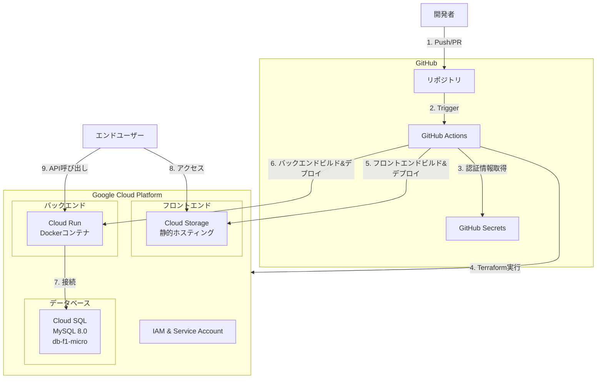
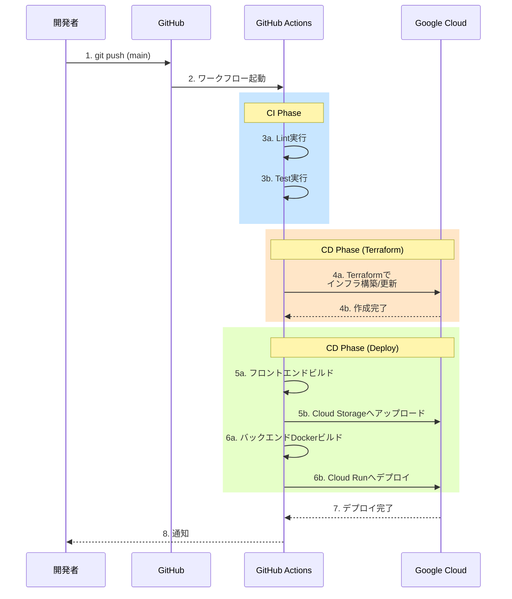

# CICD環境の構築

## 概要
CICD環境を構築する

### 目的
CICD環境を構築する

### 要件
- Terraform使用して環境を構築する
- デプロイ先はGoogle Cloud
- クレデンシャルな情報はGithub上の適切な機能を使って保存したい(envファイルをgitにコミットするとかではない)
- バックエンドはdockerを利用するが、フロントエンドやDBは適切なクラウドサービスを利用する
- クラウド費用はできる限り抑えたい(最小限)

---
## 実装仕様

### 1. アーキテクチャ設計

#### 1.1 全体構成図



#### 1.2 GCPリソース構成

| リソース種別 | サービス名 | 用途 | 無料枠 | 推定コスト |
|------------|-----------|------|--------|-----------|
| フロントエンド | Cloud Storage | 静的ファイルホスティング | 5GB/月 | $0 |
| バックエンド | Cloud Run | Dockerコンテナ実行 | 2M request/月 | $0-2/月 |
| データベース | Cloud SQL | MySQL 8.0 | なし | $7-10/月 |
| ネットワーク | VPC | プライベートネットワーク | 基本無料 | $0 |
| 認証 | IAM | サービスアカウント | 無料 | $0 |
| ドメイン | なし | GCPデフォルトURL使用 | - | $0 |
| **合計** | - | - | - | **$7-12/月** |

**注意:** Cloud SQLは最小構成でも月$7-10程度のコストが発生します。完全無料枠内に収めるには、開発時のみCloud SQLを起動し、使用しない時は停止する運用が必要です。

#### 1.3 デプロイフロー



---

### 2. 修正・新規作成する部分

#### 2.1 新規作成するファイル

**注記:** 既存の `infra/` ディレクトリ（ローカル開発環境用のdocker-composeとMySQL設定を含む）配下に、クラウド環境用の `terraform/` サブディレクトリを作成します。

1. **Terraformインフラ定義**
   - `infra/terraform/main.tf` - メインのTerraform設定
   - `infra/terraform/variables.tf` - 変数定義
   - `infra/terraform/outputs.tf` - 出力定義
   - `infra/terraform/backend.tf` - Terraform State管理
   - `infra/terraform/provider.tf` - GCPプロバイダー設定
   - `infra/terraform/cloud-run.tf` - Cloud Run設定
   - `infra/terraform/cloud-storage.tf` - Cloud Storage設定
   - `infra/terraform/cloud-sql.tf` - Cloud SQL設定
   - `infra/terraform/iam.tf` - IAM設定

2. **GitHub Actions ワークフローファイル**
   - `.github/workflows/deploy.yml` - デプロイワークフロー
   - `.github/workflows/terraform.yml` - Terraformワークフロー（オプション）

3. **Dockerファイル**
   - `backend/Dockerfile` - バックエンド本番用Dockerfile
   - `backend/.dockerignore` - Dockerビルド時の除外ファイル

4. **設定ファイル**
   - `backend/.env.production.example` - 本番環境変数テンプレート
   - `frontend/.env.production.example` - 本番環境変数テンプレート

5. **ドキュメント**
   - `docs/09_deployment-guide.md` - デプロイガイド

#### 2.2 修正する既存ファイル

1. **GitHub Actions CI ワークフロー**
   - `.github/workflows/ci.yml` - CD処理との統合

2. **Make タスクランナー**
   - `Makefile` - デプロイ関連コマンドの追加

3. **README**
   - `README.md` - デプロイ手順の追記

---

### 3. 実装する処理の詳細

#### 3.1 Terraformによるインフラ構築処理

**目的:** Google Cloud上にアプリケーション実行環境を構築する

**処理内容:**

1. **GCPプロジェクトの初期化**
   - プロジェクトIDの指定
   - APIの有効化（Cloud Run、Cloud SQL、Cloud Storage、IAM）
   - サービスアカウントの作成と権限付与

2. **Cloud Storage（フロントエンド）の構築**
   - バケット作成（グローバルユニーク名）
   - 静的ウェブサイトホスティング設定
   - 公開アクセス設定（allUsers に Storage Object Viewer権限）
   - CORS設定（バックエンドAPIとの通信許可）
   - デフォルトページ設定（index.html）

3. **Cloud Run（バックエンド）の構築**
   - サービス作成
   - コンテナイメージの指定（Artifact Registry）
   - 環境変数の設定（DATABASE_URL等）
   - 最小/最大インスタンス数の設定（0/1）
   - CPU/メモリ割り当て（最小: 1CPU, 512MB）
   - タイムアウト設定（300秒）
   - 認証なしの公開アクセス許可
   - VPCコネクタの設定（Cloud SQL接続用）

4. **Cloud SQL（データベース）の構築**
   - インスタンス作成（MySQL 8.0、db-f1-micro）
   - データベース作成（app_db）
   - ユーザー作成と権限付与
   - プライベートIP設定（VPC経由でCloud Runから接続）
   - バックアップ設定（無効）
   - 自動ストレージ増加（無効）
   - フラグ設定（文字セット: utf8mb4）

5. **IAM設定**
   - GitHub Actions用サービスアカウント作成
   - 必要な権限の付与:
     - Cloud Run Admin
     - Cloud SQL Admin
     - Storage Admin
     - Service Account User
   - ワークロードアイデンティティ連携の設定

6. **Terraform State管理**
   - Cloud Storageバケットでstateファイルを管理
   - State Lockingの有効化

**出力:**
- Cloud Run サービスURL: `https://<service-name>-<hash>-<region>.a.run.app`
- Cloud Storage バケットURL: `https://storage.googleapis.com/<bucket-name>/index.html`
- Cloud SQL 接続名: `<project-id>:<region>:<instance-name>`

#### 3.2 GitHub Actionsによる自動デプロイ処理

**トリガー条件:**
- `main` ブランチへのpush
- 手動実行（workflow_dispatch）

**処理フロー:**

**Job 1: CI（既存の拡張）**
1. リポジトリのチェックアウト
2. Node.js 20とPython 3.12のセットアップ
3. 依存関係のインストール（pnpm, Poetry）
4. Lintの実行（make lint）
5. テストの実行（make test）

**Job 2: Terraform Apply（新規）**
1. リポジトリのチェックアウト
2. Terraformのセットアップ（v1.6以上）
3. GCP認証（Workload Identity連携）
4. Terraform初期化（terraform init）
5. Terraform計画（terraform plan）
6. Terraform適用（terraform apply -auto-approve）
7. 出力値の保存（Cloud RunURL、DB接続情報）

**Job 3: フロントエンドデプロイ（新規）**
1. リポジトリのチェックアウト
2. Node.js 20のセットアップ
3. 依存関係のインストール（pnpm）
4. 環境変数の設定
   - `VITE_API_URL`: Cloud Run URLをTerraform出力から取得
5. ビルド実行（pnpm run build）
   - 出力先: `frontend/dist/`
6. GCP認証
7. Cloud Storageへアップロード
   - `gsutil rsync -R frontend/dist/ gs://<bucket-name>/`
8. キャッシュのクリア

**Job 4: バックエンドデプロイ（新規）**
1. リポジトリのチェックアウト
2. GCP認証
3. Dockerイメージビルド
   - ベースイメージ: `python:3.12-slim`
   - Poetryで依存関係インストール
   - アプリケーションコードのコピー
   - タグ: `gcr.io/<project-id>/backend:latest` と `gcr.io/<project-id>/backend:<commit-sha>`
4. Artifact Registryへプッシュ
5. Cloud Runへデプロイ
   - イメージ: `gcr.io/<project-id>/backend:<commit-sha>`
   - 環境変数の設定（DATABASE_URL、FLASK_ENV等）
6. デプロイ完了待機
7. ヘルスチェック（`/api/health`）

**環境変数（GitHub Secrets）:**
- `GCP_PROJECT_ID`: GCPプロジェクトID
- `GCP_REGION`: デプロイ先リージョン（例: us-central1）
- `GCP_WORKLOAD_IDENTITY_PROVIDER`: Workload Identity連携プロバイダー
- `GCP_SERVICE_ACCOUNT`: サービスアカウントメール
- `DATABASE_PASSWORD`: Cloud SQLパスワード
- `FLASK_SECRET_KEY`: Flask Secret Key

#### 3.3 バックエンドDockerイメージビルド処理

**ベースイメージ:** `python:3.12-slim`

**ビルド手順:**
1. 作業ディレクトリ作成（/app）
2. システムパッケージの更新とインストール
   - `default-libmysqlclient-dev`
   - `build-essential`
3. Poetryのインストール
4. 依存関係ファイルのコピー（pyproject.toml, poetry.lock）
5. 依存関係のインストール（`poetry install --no-dev --no-interaction`）
6. アプリケーションコードのコピー（backend/app/）
7. ポート5000の公開
8. 起動コマンドの設定（`poetry run gunicorn app.main:app`）

**最適化:**
- マルチステージビルド（ビルド用と実行用の分離）
- レイヤーキャッシュの活用
- 不要なファイルの除外（.dockerignore）

#### 3.4 データベースマイグレーション処理

**実行タイミング:** バックエンドデプロイ前

**処理内容:**
1. Cloud SQLインスタンスへの接続確認
2. Cloud SQL ProxyまたはVPC経由で接続
3. テーブル作成スクリプトの実行
   - 現在は `scripts/init_db.py` を使用
   - 将来的にはAlembicでマイグレーション管理を推奨
4. 初期データの投入（必要に応じて）

**接続方法:**
- 開発環境: Cloud SQL Proxy経由
- 本番環境: Cloud RunからVPC Connector経由

---

### 4. 実装手順とタスク

#### 4.1 事前準備タスク

**Task 1: GCPプロジェクトのセットアップ**

**作業内容:**
1. GCPコンソールで新規プロジェクト作成
2. プロジェクトIDをメモ
3. 課金アカウントの設定（無料トライアルまたは既存アカウント）
4. 必要なAPIの有効化:
   - Cloud Run API
   - Cloud SQL Admin API
   - Cloud Storage API
   - IAM API
   - Artifact Registry API
   - Compute Engine API（VPC用）

**動作確認:**
```bash
# GCP CLIでプロジェクト確認
gcloud projects describe <project-id>

# APIの有効化確認
gcloud services list --enabled
```

**Task 2: Workload Identity連携の設定**

**作業内容:**
1. GCPでWorkload Identity Poolの作成
2. GitHubプロバイダーの設定
3. サービスアカウントの作成
4. 権限の付与（Cloud Run Admin、Storage Admin等）
5. GitHub SecretsへのプロバイダーURL等の登録

**動作確認:**
```bash
# Workload Identity連携の確認
gcloud iam workload-identity-pools describe <pool-name> \
  --location=global
```

**Task 3: Terraform State用バケットの作成**

**作業内容:**
1. Cloud Storageバケットの作成（terraform-state-<project-id>）
2. バージョニングの有効化
3. バケットへのアクセス権限設定

**動作確認:**
```bash
# バケット確認
gsutil ls gs://terraform-state-<project-id>
```

#### 4.2 Terraform実装タスク

**Task 4: Terraformディレクトリ構造の作成**

**作業内容:**
1. `infra/terraform/` ディレクトリの作成
2. 各種`.tf`ファイルの作成（空ファイル）
3. `.gitignore` の設定（`.terraform/`, `*.tfstate`）

**動作確認:**
```bash
# ディレクトリ構造確認
tree infra/terraform/
```

**Task 5: Terraformプロバイダー設定**

**作業内容:**
1. `infra/terraform/provider.tf` の作成
   - GCPプロバイダーの設定
   - バージョン指定（~> 5.0）
   - プロジェクトID、リージョンの指定
2. `infra/terraform/backend.tf` の作成
   - GCS backendの設定
   - State Lockingの有効化
3. `infra/terraform/variables.tf` の作成
   - プロジェクトID、リージョン等の変数定義

**動作確認:**
```bash
# Terraform初期化
cd infra/terraform
terraform init

# 設定の検証
terraform validate
```

**Task 6: Cloud Storage（フロントエンド）のTerraform定義**

**作業内容:**
1. `infra/terraform/cloud-storage.tf` の作成
   - バケットリソース定義
   - 静的ウェブサイトホスティング設定
   - IAMバインディング（公開アクセス）
   - CORS設定

**動作確認:**
```bash
# 計画の確認
terraform plan -target=google_storage_bucket.frontend

# 適用
terraform apply -target=google_storage_bucket.frontend

# バケット確認
gsutil ls -L gs://<bucket-name>
```

**Task 7: Cloud SQL（データベース）のTerraform定義**

**作業内容:**
1. `infra/terraform/cloud-sql.tf` の作成
   - Cloud SQLインスタンス定義（db-f1-micro）
   - データベース定義（app_db）
   - ユーザー定義
   - プライベートIP設定
   - VPCコネクタ定義

**動作確認:**
```bash
# 計画の確認
terraform plan -target=google_sql_database_instance.main

# 適用（5-10分かかる）
terraform apply -target=google_sql_database_instance.main

# インスタンス確認
gcloud sql instances describe <instance-name>
```

**Task 8: Cloud Run（バックエンド）のTerraform定義**

**作業内容:**
1. `infra/terraform/cloud-run.tf` の作成
   - Cloud Runサービス定義
   - 環境変数設定
   - リソース制限設定
   - VPCコネクタ接続設定
   - IAMバインディング（公開アクセス）

**動作確認:**
```bash
# 計画の確認（初回はダミーイメージが必要）
terraform plan -target=google_cloud_run_service.backend

# 適用
terraform apply -target=google_cloud_run_service.backend

# サービス確認
gcloud run services describe backend --region=<region>
```

**Task 9: IAM設定のTerraform定義**

**作業内容:**
1. `infra/terraform/iam.tf` の作成
   - サービスアカウント定義
   - IAMロールバインディング
   - Workload Identity連携設定

**動作確認:**
```bash
# 計画と適用
terraform plan
terraform apply

# サービスアカウント確認
gcloud iam service-accounts list
```

**Task 10: Terraform出力定義**

**作業内容:**
1. `infra/terraform/outputs.tf` の作成
   - Cloud Run URL
   - Cloud Storage バケット名
   - Cloud SQL 接続名

**動作確認:**
```bash
# 出力確認
terraform output

# JSON形式で出力
terraform output -json
```

#### 4.3 Dockerイメージ実装タスク

**Task 11: バックエンドDockerfileの作成**

**作業内容:**
1. `backend/Dockerfile` の作成
   - マルチステージビルド構成
   - Poetryで依存関係インストール
   - Gunicornでアプリケーション起動
2. `backend/.dockerignore` の作成
   - 不要なファイルの除外（tests/, logs/, __pycache__等）

**動作確認:**
```bash
# ローカルビルド
cd backend
docker build -t backend-test .

# コンテナ起動
docker run -p 5000:5000 \
  -e DATABASE_URL=sqlite:///test.db \
  -e FLASK_ENV=production \
  backend-test

# ヘルスチェック
curl http://localhost:5000/api/health
```

**Task 12: ヘルスチェックエンドポイントの追加**

**作業内容:**
1. `backend/app/routes/health.py` の作成
   - `/api/health` エンドポイント
   - データベース接続確認
   - レスポンス: `{"status": "healthy"}`

**動作確認:**
```bash
# エンドポイント確認
curl http://localhost:5000/api/health

# 期待されるレスポンス
# {"status": "healthy", "database": "connected"}
```

#### 4.4 GitHub Actions実装タスク

**Task 13: GitHub Secretsの設定**

**作業内容:**
1. GitHubリポジトリのSettings > Secrets and variablesへ移動
2. 以下のSecretsを登録:
   - `GCP_PROJECT_ID`
   - `GCP_REGION`
   - `GCP_WORKLOAD_IDENTITY_PROVIDER`
   - `GCP_SERVICE_ACCOUNT`
   - `DATABASE_PASSWORD`
   - `FLASK_SECRET_KEY`

**動作確認:**
```bash
# GitHub CLIで確認
gh secret list
```

**Task 14: Terraform実行ワークフローの作成**

**作業内容:**
1. `.github/workflows/terraform.yml` の作成
   - Terraform初期化
   - Terraform計画
   - Terraform適用（mainブランチのみ）
   - PRではPlanのみ実行

**動作確認:**
1. ワークフローファイルをコミット
2. PRを作成してTerraform Planが実行されることを確認
3. mainブランチにマージしてTerraform Applyが実行されることを確認
4. GCPコンソールでリソースが作成されていることを確認

**Task 15: デプロイワークフローの作成**

**作業内容:**
1. `.github/workflows/deploy.yml` の作成
   - CI Job（lint + test）
   - Terraform Job
   - フロントエンドデプロイJob
   - バックエンドデプロイJob
2. Job間の依存関係設定（needs）
3. mainブランチのみ実行する条件設定

**動作確認:**
1. ワークフローファイルをコミット
2. mainブランチにマージ
3. ワークフローが正常に完了することを確認
4. デプロイされたアプリケーションにアクセスして動作確認

**Task 16: 既存CIワークフローの統合**

**作業内容:**
1. `.github/workflows/ci.yml` の修正
   - デプロイワークフローとの統合
   - またはCI部分を共通化してdeployワークフローから呼び出す

**動作確認:**
1. PRを作成してCIが実行されることを確認
2. mainブランチへのマージでCIとCDが実行されることを確認

#### 4.5 環境変数設定タスク

**Task 17: 本番環境変数テンプレートの作成**

**作業内容:**
1. `backend/.env.production.example` の作成
   - 必要な環境変数のリスト
   - 説明コメント
2. `frontend/.env.production.example` の作成
   - VITE_API_URL等

**動作確認:**
ファイルの内容を確認し、必要な変数が全て含まれているかチェック

**Task 18: Cloud Runへの環境変数設定**

**作業内容:**
1. Terraformで環境変数を設定
   - DATABASE_URL（Cloud SQL接続文字列）
   - FLASK_ENV=production
   - FLASK_SECRET_KEY（GitHub Secretsから）
2. または、GitHub Actionsのデプロイ時に`--set-env-vars`で設定

**動作確認:**
```bash
# Cloud Runの環境変数確認
gcloud run services describe backend \
  --region=<region> \
  --format="value(spec.template.spec.containers[0].env)"
```

#### 4.6 動作確認とドキュメント整備タスク

**Task 19: E2Eデプロイテスト**

**作業内容:**
1. ローカルで全ファイルをコミット
2. mainブランチにマージ
3. GitHub Actionsの実行を監視
4. デプロイ完了後、以下を確認:
   - フロントエンドURL（Cloud Storage）へアクセス
   - ログイン機能の動作確認
   - TODO作成/更新/削除の動作確認
   - バックエンドAPI（Cloud Run）へのリクエスト確認

**動作確認チェックリスト:**
- [ ] Cloud Storageのindex.htmlにアクセスできる
- [ ] フロントエンドからバックエンドAPIを呼び出せる
- [ ] ユーザー登録ができる
- [ ] ログインができる
- [ ] TODOの作成ができる
- [ ] TODOの一覧表示ができる
- [ ] TODOの更新ができる
- [ ] TODOの削除ができる
- [ ] ログアウトができる
- [ ] CORS設定が正しく動作している

**Task 20: デプロイガイドの作成**

**作業内容:**
1. `docs/09_deployment-guide.md` の作成
   - 初回デプロイ手順
   - 環境変数の設定方法
   - トラブルシューティング
   - ロールバック手順
   - コスト監視方法

**動作確認:**
ドキュメントに従って第三者がデプロイできるかレビュー

**Task 21: READMEの更新**

**作業内容:**
1. `README.md` の更新
   - デプロイ方法の追記
   - 本番環境URLの記載場所の追加
   - デプロイメントバッジの追加

**動作確認:**
READMEの内容が最新の状態を反映しているか確認

**Task 22: Makefileタスクの追加**

**作業内容:**
1. `Makefile` に以下を追加:
   - `make terraform-init`: Terraform初期化（`infra/terraform/`で実行）
   - `make terraform-plan`: Terraform計画（`infra/terraform/`で実行）
   - `make terraform-apply`: Terraform適用（`infra/terraform/`で実行）
   - `make deploy-frontend`: フロントエンドのみデプロイ
   - `make deploy-backend`: バックエンドのみデプロイ

**動作確認:**
```bash
# 各コマンドの実行確認
make terraform-init
make terraform-plan
```

---

### 5. 最終的に満たすべき要件

#### 5.1 機能要件

**必須要件:**
- [ ] mainブランチへのpush/マージで自動的に本番環境へデプロイされる
- [ ] Terraformでインフラがコード化されている
- [ ] GitHub Secretsでクレデンシャル情報を安全に管理している
- [ ] バックエンドがDockerコンテナとしてCloud Runにデプロイされる
- [ ] フロントエンドがCloud Storageに静的ファイルとしてデプロイされる
- [ ] データベースがCloud SQL（MySQL）で動作している
- [ ] デプロイ後にアプリケーションが正常に動作する

**推奨要件:**
- [ ] デプロイの各ステップでエラーハンドリングが適切に行われる
- [ ] デプロイ失敗時に通知が送られる
- [ ] ロールバック手順が文書化されている
- [ ] ヘルスチェックエンドポイントが実装されている

#### 5.2 非機能要件

**パフォーマンス:**
- [ ] フロントエンドの初期ロード時間が5秒以内
- [ ] バックエンドAPIのレスポンスタイムが2秒以内（簡単なクエリ）
- [ ] Cloud Runのコールドスタート時間が10秒以内

**セキュリティ:**
- [ ] GitHub SecretsでクレデンシャルをGitリポジトリにコミットしていない
- [ ] IAM権限が最小権限の原則に従っている
- [ ] Cloud SQLへのアクセスがプライベートIP経由のみ
- [ ] HTTPS通信が強制されている（Cloud Run、Cloud Storageともに）

**コスト:**
- [ ] 月間コストが$0-5の範囲内（Cloud SQL除く）
- [ ] Cloud Runの最小インスタンス数が0に設定されている
- [ ] Cloud SQLがdb-f1-micro（最小構成）で動作している
- [ ] 不要なリソースが作成されていない

**運用性:**
- [ ] インフラの変更がTerraformで管理されている
- [ ] デプロイログがGitHub Actionsで確認できる
- [ ] エラー発生時のトラブルシューティング手順が文書化されている
- [ ] リソースの削除手順が文書化されている

**可用性:**
- [ ] Cloud Runが自動的にスケールする設定になっている
- [ ] データベース接続エラー時のリトライ処理が実装されている

#### 5.3 検証基準

**デプロイ成功の判定基準:**
1. GitHub Actionsのワークフローが全てのジョブで成功する
2. Cloud Runサービスが起動し、ヘルスチェックが成功する
3. フロントエンドURLにアクセスしてページが表示される
4. E2Eテストシナリオ（ユーザー登録 → ログイン → TODO作成 → 削除）が完了する

**コスト最適化の判定基準:**
1. GCPコンソールで月間推定コストが$12以下と表示される
2. Cloud Runの平均インスタンス数が0.1以下
3. Cloud Storageの使用量が1GB以下

**セキュリティの判定基準:**
1. GitHubリポジトリに `.env` ファイルや認証情報が含まれていない
2. Cloud SQLがパブリックIPを持たない
3. 全てのHTTPSエンドポイントでSSL証明書が有効

---

### 6. 補足情報

#### 6.1 コスト削減のベストプラクティス

**開発時のコスト削減:**
- Cloud SQLインスタンスを使用しない時は停止する
  ```bash
  # インスタンス停止
  gcloud sql instances patch <instance-name> --activation-policy=NEVER

  # インスタンス起動
  gcloud sql instances patch <instance-name> --activation-policy=ALWAYS
  ```
- Cloud Runの最小インスタンス数を0に維持
- 不要なログを削減（Cloud Loggingの無料枠: 50GB/月）

**長期的なコスト最適化:**
- Committed Use Discounts（CUD）の検討（安定稼働後）
- Cloud SQLのストレージサイズを定期的に確認
- Cloud Storageのライフサイクルポリシー設定

#### 6.2 将来的な拡張案

**機能拡張:**
- [ ] ステージング環境の追加（develop ブランチ用）
- [ ] PRプレビュー環境の自動作成
- [ ] Blue-Greenデプロイメントの導入
- [ ] カナリアリリースの導入

**技術的改善:**
- [ ] Alembicによるデータベースマイグレーション管理
- [ ] Cloud Monitoringによる監視とアラート設定
- [ ] Cloud CDNの導入（トラフィック増加時）
- [ ] カスタムドメインとSSL証明書の設定
- [ ] Cloud Armorによるセキュリティ強化

**CI/CD改善:**
- [ ] E2Eテストの自動実行（Playwright on CI）
- [ ] パフォーマンステストの自動実行
- [ ] セキュリティスキャンの追加（Trivy、Snyk等）
- [ ] デプロイ承認フローの追加

---

**次のステップ:** 上記の仕様に基づいて、Task 1から順番に実装を進めてください。各タスクの完了後は必ず動作確認を行い、問題がないことを確認してから次のタスクに進むことを推奨します。
