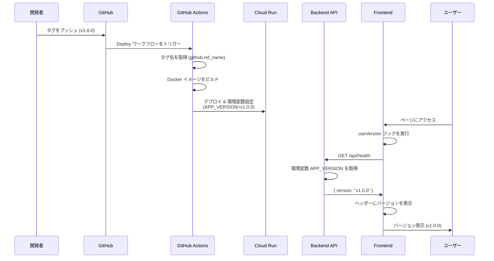
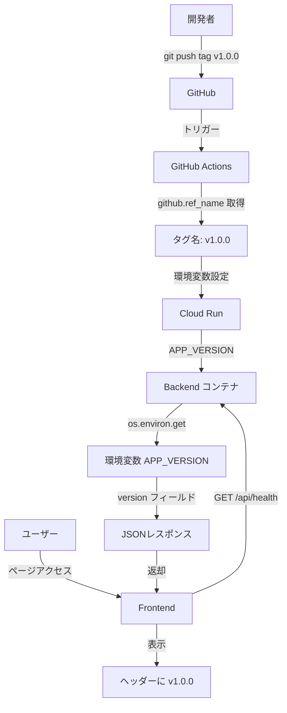

# デプロイのトリガーをmainへのPushからタグPushに変更する

## 概要
デプロイのトリガーをmainへのPushからタグPushに変更する

### 目的
現在のデプロイトリガーはメインブランチへのプッシュですが、これではデプロイのタイミングを制御できず、バージョン管理も難しくなります。タグ（例: V1.0.0）をプッシュしたときにデプロイされるようにしたいです。

### 要件
要件は以下の通りです。

1. 現在のデプロイトリガーを削除する。
2. デプロイトリガーをタグのプッシュに変更する。
3. デプロイ時に環境変数にバージョンを追加し、画面から確認できるようにする。
4. 環境変数に追加したバージョンは、画面読み込み時に自動的に取得する。

---
## 実装仕様

このセクションでは、要件を実現するための具体的な実装方針と手順を説明します。

### 1. 修正対象ファイル

以下のファイルを修正または新規作成します。

#### 1.1 GitHub Actions ワークフロー
- **ファイル**: `.github/workflows/deploy.yml`
- **修正内容**: デプロイトリガーをタグプッシュに変更
- **理由**: 現在は `main` ブランチへの `push` でトリガーされているが、これを `tags: v*` パターンのプッシュに変更する

#### 1.2 バックエンド API
- **ファイル**: `backend/app/routes/health.py`
- **修正内容**: `/api/health` エンドポイントのレスポンスにバージョン情報を追加
- **理由**: フロントエンドがバージョン情報を取得するためのAPIを提供する

#### 1.3 フロントエンド コンポーネント
- **ファイル**: `frontend/src/components/PageHeader.tsx`
- **修正内容**: ヘッダーにバージョン情報を表示
- **理由**: 全ページ共通のヘッダーにバージョンを表示する

- **ファイル**: `frontend/src/hooks/useVersion.ts` (新規作成)
- **修正内容**: バージョン情報取得用のカスタムフック
- **理由**: APIからバージョン情報を取得するロジックを再利用可能にする

#### 1.4 テストファイル
- **ファイル**: `backend/app/routes/test_health.py` (新規作成)
- **修正内容**: health エンドポイントのテスト
- **理由**: バージョン情報のレスポンスが正しいことを確認する

- **ファイル**: `frontend/src/components/PageHeader.test.tsx`
- **修正内容**: PageHeader のバージョン表示テスト
- **理由**: バージョンが正しく表示されることを確認する

---

### 2. 実装内容の詳細

#### 2.1 GitHub Actions ワークフロー修正

**現在の設定**:
```yaml
on:
  push:
    branches:
      - main
    paths-ignore:
      - 'infra/terraform/**'
      - '.github/workflows/terraform.yml'
      - '**.md'
      - 'docs/**'
  workflow_dispatch:
```

**変更後の設定**:
```yaml
on:
  push:
    tags:
      - 'v*'
  workflow_dispatch:
```

**変更内容の説明**:
- `push.branches` トリガーを削除し、`push.tags` トリガーに変更する
- タグパターンは `v*` とし、`v1.0.0`, `v2.1.3` などのバージョンタグのみをデプロイ対象とする
- `workflow_dispatch` は維持し、手動実行も可能にする
- `paths-ignore` は削除する(タグプッシュ時にはパス除外は不要)

**環境変数の追加**:

デプロイジョブで、GitHubのタグ名を環境変数として Cloud Run に設定する:

```yaml
env:
  APP_VERSION: ${{ github.ref_name }}  # タグ名を取得 (例: v1.0.0)
```

**Cloud Run へのデプロイステップ修正**:

Cloud Run の環境変数に `APP_VERSION` を追加する:

```yaml
- name: Deploy to Cloud Run
  env:
    ADMIN_EMAIL: ${{ secrets.ADMIN_EMAIL }}
    ADMIN_PASSWORD_HASH: ${{ secrets.ADMIN_PASSWORD_HASH }}
    APP_VERSION: ${{ github.ref_name }}
  run: |
    gcloud run deploy ... \
      --update-env-vars "ADMIN_EMAIL=${ADMIN_EMAIL},ADMIN_PASSWORD_HASH=${ADMIN_PASSWORD_HASH},COOKIE_SECURE=true,APP_VERSION=${APP_VERSION}"
```

---

#### 2.2 バックエンド API の修正

**現在の `/api/health` エンドポイント**:

```json
{
  "status": "healthy",
  "database": "connected"
}
```

**変更後のレスポンス**:

```json
{
  "status": "healthy",
  "database": "connected",
  "version": "v1.0.0"
}
```

**実装内容**:

1. `backend/app/routes/health.py` に以下の処理を追加:
   - 環境変数 `APP_VERSION` からバージョン情報を取得する
   - 環境変数が設定されていない場合は `"unknown"` を返す
   - レスポンスに `version` フィールドを追加する

2. 処理フロー:
   ```
   1. リクエスト受信
   2. データベース接続チェック (既存処理)
   3. 環境変数 APP_VERSION を取得
      - 設定されている場合: その値を使用
      - 設定されていない場合: "unknown" を使用
   4. レスポンスに version フィールドを含めて返す
   ```

**擬似コード**:
```python
import os

@health_bp.get("/health")
def health_check():
    try:
        # データベース接続チェック (既存)
        with get_session() as session:
            session.execute(text("SELECT 1"))

        # バージョン情報を環境変数から取得
        version = os.environ.get("APP_VERSION", "unknown")

        return jsonify({
            "status": "healthy",
            "database": "connected",
            "version": version
        }), 200
    except Exception as e:
        logger.error(f"Health check failed: {str(e)}")
        return jsonify({
            "status": "unhealthy",
            "database": "disconnected",
            "version": os.environ.get("APP_VERSION", "unknown"),
            "error": str(e)
        }), 503
```

---

#### 2.3 フロントエンド実装

##### 2.3.1 カスタムフック: `useVersion.ts`

**目的**: `/api/health` エンドポイントからバージョン情報を取得する

**処理フロー**:
```
1. コンポーネントマウント時に useEffect を実行
2. /api/health エンドポイントにGETリクエスト
3. レスポンスから version フィールドを抽出
4. state にバージョン情報を保存
5. エラー時は "unknown" を設定
```

**返り値**:
- `version`: string型のバージョン情報 (例: "v1.0.0", "unknown")
- `isLoading`: boolean型のローディング状態

**擬似コード**:
```typescript
export function useVersion() {
  const [version, setVersion] = useState<string>('unknown')
  const [isLoading, setIsLoading] = useState<boolean>(true)

  useEffect(() => {
    const fetchVersion = async () => {
      try {
        const response = await fetch('/api/health')
        const data = await response.json()
        setVersion(data.version || 'unknown')
      } catch (error) {
        logger.error('Failed to fetch version', error)
        setVersion('unknown')
      } finally {
        setIsLoading(false)
      }
    }

    fetchVersion()
  }, [])

  return { version, isLoading }
}
```

##### 2.3.2 PageHeader コンポーネント修正

**変更内容**:
- `useVersion` フックを使ってバージョン情報を取得
- ヘッダーの右上にバージョン情報を小さく表示
- ローディング中は表示しない

**表示位置**:
```
┌──────────────────────────────────────────────┐
│ ページタイトル        v1.0.0  user@example.com │
│                      設定  ログアウト          │
└──────────────────────────────────────────────┘
```

**擬似コード**:
```typescript
import { useVersion } from '@/hooks/useVersion'

export function PageHeader({ ... }: PageHeaderProps) {
  const navigate = useNavigate()
  const { handleLogout } = useLogout()
  const { version, isLoading } = useVersion()

  return (
    <div className="page-header">
      {/* 既存の戻るボタン */}
      {onBack && <button ...>← 戻る</button>}

      {/* タイトル */}
      <h1 className="page-header__title">{title}</h1>

      <div className="page-header__actions">
        {/* バージョン情報を表示 */}
        {!isLoading && version && (
          <span className="page-header__version">{version}</span>
        )}

        {/* 既存のユーザーメールなど */}
        {userEmail && <span ...>{userEmail}</span>}
        {showSettings && <button ...>設定</button>}
        {showLogout && <button ...>ログアウト</button>}
      </div>
    </div>
  )
}
```

**スタイリング**:
- フォントサイズ: 小さめ (12px程度)
- 色: グレー系 (目立たないように)
- 配置: ヘッダー右上、ユーザーメールの左側

---

### 3. 実装手順とチェック方法

実装は以下の順序で行い、各ステップで動作確認を行います。

#### Step 1: バックエンド API の修正

**実施内容**:
1. `backend/app/routes/health.py` を修正してバージョン情報を返すようにする
2. ローカル環境で動作確認する

**動作確認方法**:
```bash
# 1. ローカル環境でバックエンドを起動
make up

# 2. 環境変数を設定してテスト
export APP_VERSION=v1.0.0-test
poetry -C backend run flask --app app.main run

# 3. health エンドポイントにアクセス
curl http://localhost:5000/api/health

# 期待される結果:
# {
#   "status": "healthy",
#   "database": "connected",
#   "version": "v1.0.0-test"
# }

# 4. 環境変数なしでもエラーにならないことを確認
unset APP_VERSION
# 再度 curl でアクセスし、version が "unknown" になることを確認
```

**確認項目**:
- [ ] 環境変数 `APP_VERSION` が設定されている場合、その値が返ること
- [ ] 環境変数が設定されていない場合、`"unknown"` が返ること
- [ ] データベース接続に失敗した場合でも、バージョン情報が含まれること
- [ ] レスポンスが正しい JSON 形式であること

---

#### Step 2: バックエンドのテスト追加

**実施内容**:
1. `backend/tests/routes/test_health.py` にテストケースを追加
2. テストを実行して成功することを確認

**テストケース**:
1. 正常系: 環境変数ありでバージョンが返る
2. 正常系: 環境変数なしで "unknown" が返る
3. 異常系: データベースエラー時でもバージョンが返る

**動作確認方法**:
```bash
# テストの実行
poetry -C backend run pytest backend/tests/routes/test_health.py -v

# 期待される結果:
# test_health.py::test_health_check_success_with_version PASSED
# test_health.py::test_health_check_success_without_version PASSED
# test_health.py::test_health_check_db_error_with_version PASSED
```

**確認項目**:
- [ ] すべてのテストが成功すること
- [ ] カバレッジが維持されること

---

#### Step 3: フロントエンド実装

**実施内容**:
1. `frontend/src/hooks/useVersion.ts` を新規作成
2. `frontend/src/components/PageHeader.tsx` を修正してバージョン表示を追加
3. ローカル環境で動作確認する

**動作確認方法**:
```bash
# 1. バックエンドで環境変数を設定
export APP_VERSION=v1.0.0-test
make up

# 2. フロントエンドにアクセス
# ブラウザで http://localhost:5173 を開く

# 3. ログイン後、ヘッダーにバージョン情報が表示されることを確認
# 期待される結果: ヘッダー右上に "v1.0.0-test" と表示される
```

**確認項目**:
- [ ] ページ読み込み時にバージョン情報が自動取得されること
- [ ] ヘッダーの適切な位置にバージョンが表示されること
- [ ] バージョン取得中はバージョン情報が表示されないこと
- [ ] バージョン取得失敗時は "unknown" と表示されること
- [ ] 全ページで共通してバージョンが表示されること

---

#### Step 4: フロントエンドのテスト追加

**実施内容**:
1. `frontend/src/hooks/useVersion.test.ts` を新規作成してフックのテストを追加
2. `frontend/src/components/PageHeader.test.tsx` にバージョン表示のテストを追加
3. テストを実行して成功することを確認

**テストケース**:
1. useVersion: API呼び出しが成功した場合
2. useVersion: API呼び出しが失敗した場合
3. PageHeader: バージョンが正しく表示される
4. PageHeader: ローディング中はバージョンが表示されない

**動作確認方法**:
```bash
# テストの実行
pnpm --dir frontend run test

# 期待される結果:
# useVersion.test.ts のテストが全て PASS
# PageHeader.test.tsx のテストが全て PASS
```

**確認項目**:
- [ ] すべてのテストが成功すること
- [ ] カバレッジが維持されること

---

#### Step 5: GitHub Actions ワークフロー修正

**実施内容**:
1. `.github/workflows/deploy.yml` を修正
2. ローカルで YAML の構文チェック
3. 修正内容をコミット

**動作確認方法**:
```bash
# YAML 構文チェック (yamllint がインストールされている場合)
yamllint .github/workflows/deploy.yml

# または、GitHub の act ツールでローカルテスト (オプション)
# act push -W .github/workflows/deploy.yml --dry-run
```

**確認項目**:
- [ ] YAML の構文が正しいこと
- [ ] トリガーが `push.tags: v*` になっていること
- [ ] `push.branches: main` が削除されていること
- [ ] 環境変数 `APP_VERSION` が設定されていること
- [ ] Cloud Run のデプロイコマンドに `APP_VERSION` が含まれていること

---

#### Step 6: 統合テスト (タグなしでの動作確認)

**実施内容**:
1. すべての修正をコミット
2. main ブランチにマージ
3. デプロイワークフローが実行されないことを確認

**動作確認方法**:
```bash
# 1. ブランチ作成
git checkout -b feature/deploy-on-tag-push

# 2. すべての変更をコミット
git add .
git commit -m "feat(deploy): Change deploy trigger from main push to tag push"

# 3. main にマージ (または PR を作成してマージ)
git checkout main
git merge feature/deploy-on-tag-push
git push origin main

# 4. GitHub Actions を確認
# https://github.com/<username>/<repo>/actions
# Deploy ワークフローが実行されていないことを確認
```

**確認項目**:
- [ ] main ブランチへの push で Deploy ワークフローが実行されないこと
- [ ] CI ワークフローは引き続き実行されること (別ファイル)

---

#### Step 7: 統合テスト (タグプッシュでの動作確認)

**実施内容**:
1. バージョンタグを作成してプッシュ
2. デプロイワークフローが実行されることを確認
3. デプロイされたアプリケーションでバージョン情報を確認

**動作確認方法**:
```bash
# 1. タグを作成
git tag v1.0.0

# 2. タグをプッシュ
git push origin v1.0.0

# 3. GitHub Actions を確認
# https://github.com/<username>/<repo>/actions
# Deploy ワークフローが実行されることを確認

# 4. デプロイ完了後、アプリケーションにアクセス
# Cloud Run の URL にアクセス (例: https://xxx.run.app)

# 5. health エンドポイントを確認
curl https://xxx.run.app/api/health

# 期待される結果:
# {
#   "status": "healthy",
#   "database": "connected",
#   "version": "v1.0.0"
# }

# 6. ブラウザでアプリケーションを開き、ヘッダーに "v1.0.0" が表示されることを確認
```

**確認項目**:
- [ ] タグプッシュで Deploy ワークフローが実行されること
- [ ] CI ジョブが成功すること
- [ ] デプロイが成功すること
- [ ] health エンドポイントがタグ名を返すこと
- [ ] フロントエンドのヘッダーにバージョンが表示されること
- [ ] 表示されるバージョンがプッシュしたタグと一致すること

---

#### Step 8: タグパターンのテスト

**実施内容**:
1. 異なるパターンのタグをプッシュして動作を確認

**動作確認方法**:
```bash
# 1. v接頭辞ありのタグ (デプロイされるべき)
git tag v1.0.1
git push origin v1.0.1
# → Deploy ワークフローが実行されることを確認

# 2. v接頭辞なしのタグ (デプロイされないべき)
git tag 1.0.2
git push origin 1.0.2
# → Deploy ワークフローが実行されないことを確認

# 3. 別のプレフィックスのタグ (デプロイされないべき)
git tag release-1.0.3
git push origin release-1.0.3
# → Deploy ワークフローが実行されないことを確認
```

**確認項目**:
- [ ] `v*` パターンのタグのみでデプロイされること
- [ ] その他のパターンのタグではデプロイされないこと

---

### 4. アーキテクチャ図

以下の図は、バージョン情報の流れを示しています。



**フロー説明**:
1. 開発者がバージョンタグ (例: `v1.0.0`) をプッシュ
2. GitHub が Deploy ワークフローをトリガー
3. GitHub Actions がタグ名を取得
4. Docker イメージをビルドし、Cloud Run にデプロイ
5. デプロイ時に環境変数 `APP_VERSION=v1.0.0` を設定
6. ユーザーがフロントエンドにアクセス
7. フロントエンドが `useVersion` フックで `/api/health` を呼び出し
8. バックエンドが環境変数 `APP_VERSION` を取得してレスポンス
9. フロントエンドがヘッダーにバージョンを表示

---

### 5. データフロー図



---

### 6. エラーハンドリング

以下のエラーケースに対応します。

#### 6.1 環境変数が設定されていない場合

**シナリオ**: ローカル開発環境など、`APP_VERSION` が設定されていない環境

**対応**:
- バックエンド: `"unknown"` を返す
- フロントエンド: `"unknown"` を表示

**影響**: 機能には影響なし。バージョンが特定できないだけ

---

#### 6.2 health エンドポイントへのアクセス失敗

**シナリオ**: ネットワークエラーやバックエンドダウンなど

**対応**:
- フロントエンド: エラーをキャッチし、`"unknown"` を表示
- ログにエラーを記録

**影響**: バージョン情報が表示されないが、アプリケーションの主要機能は動作する

---

#### 6.3 無効なタグフォーマット

**シナリオ**: `v` で始まらないタグをプッシュ

**対応**:
- GitHub Actions: ワークフローがトリガーされない

**影響**: デプロイされない (意図した動作)

---

### 7. セキュリティ考慮事項

#### 7.1 バージョン情報の公開

**リスク**: バージョン情報が公開されることで、既知の脆弱性を持つバージョンかどうかが判明する可能性がある

**対策**:
- バージョン情報は一般的な慣行であり、通常は問題ない
- 重要なのは、常に最新のセキュリティパッチを適用すること
- 脆弱性が発見された場合は、速やかに新しいバージョンをデプロイする

#### 7.2 環境変数の取り扱い

**リスク**: 環境変数に機密情報が含まれる可能性

**対策**:
- `APP_VERSION` には機密情報は含まれない (タグ名のみ)
- 他の環境変数 (パスワードなど) は引き続き Secrets で管理

---

### 8. 最終要件チェックリスト

実装完了後、以下の要件がすべて満たされていることを確認します。

#### 8.1 デプロイトリガー
- [ ] main ブランチへの push でデプロイが実行されないこと
- [ ] `v*` パターンのタグプッシュでデプロイが実行されること
- [ ] その他のパターンのタグではデプロイされないこと
- [ ] `workflow_dispatch` による手動実行が可能なこと

#### 8.2 バージョン情報の設定
- [ ] GitHub Actions でタグ名が環境変数 `APP_VERSION` に設定されること
- [ ] Cloud Run のコンテナに環境変数が正しく渡されること

#### 8.3 バックエンド API
- [ ] `/api/health` エンドポイントが `version` フィールドを返すこと
- [ ] 環境変数が設定されている場合、タグ名が返されること
- [ ] 環境変数が設定されていない場合、`"unknown"` が返されること
- [ ] データベースエラー時でもバージョン情報が含まれること

#### 8.4 フロントエンド表示
- [ ] ページ読み込み時に自動的にバージョン情報が取得されること
- [ ] ヘッダーの適切な位置にバージョンが表示されること
- [ ] 全ページで共通してバージョンが表示されること
- [ ] バージョン取得失敗時に `"unknown"` と表示されること
- [ ] 表示されるバージョンがデプロイしたタグと一致すること

#### 8.5 テスト
- [ ] バックエンドのテストがすべて成功すること
- [ ] フロントエンドのテストがすべて成功すること
- [ ] カバレッジが維持されること
- [ ] CI/CD パイプラインが正常に動作すること

#### 8.6 ドキュメント
- [ ] 本仕様書が最新の実装を反映していること
- [ ] 必要に応じて関連ドキュメント (README, CI/CD ガイド) を更新すること

---

### 9. 補足事項

#### 9.1 タグの命名規則

推奨されるタグの命名規則:
- **メジャーバージョン**: `v1.0.0`, `v2.0.0` (破壊的変更)
- **マイナーバージョン**: `v1.1.0`, `v1.2.0` (新機能追加)
- **パッチバージョン**: `v1.0.1`, `v1.0.2` (バグ修正)
- **プレリリース**: `v1.0.0-rc.1`, `v1.0.0-beta.1` (リリース候補)

**注意**: プレリリース版もデプロイ対象になります。本番環境のみにデプロイしたい場合は、ワークフローでさらにフィルタリングが必要です。

#### 9.2 タグの削除と再作成

**注意**: 一度プッシュしたタグは削除・再作成しないことを推奨します。

理由:
- Git のベストプラクティスに反する
- デプロイ履歴が混乱する
- 他の開発者が古いタグを参照している可能性がある

間違ってタグを作成した場合:
- 新しいパッチバージョンを作成する (例: `v1.0.1`)
- または、タグを削除後に別のバージョン番号を使用する

#### 9.3 ロールバック

古いバージョンにロールバックする方法:
1. **Cloud Run から直接ロールバック** (推奨)
   - GCP Console で以前のリビジョンに戻す
   - 即座に反映される

2. **タグを再プッシュ**
   - 既存のタグを削除してプッシュ (非推奨)
   - 新しいパッチバージョンとしてプッシュ (推奨)

---

### 10. GitHub Release 自動作成機能

タグプッシュ時に、GitHub Releases を自動作成し、マージされた Pull Request の情報からリリースノートを自動生成します。

#### 10.1 概要

デプロイ成功後、以下の処理を自動的に実行します:

1. 前回リリースタグから現在タグまでの期間を特定
2. その期間にマージされた Pull Request を取得
3. PR のタイトルとラベルに基づいてカテゴリ分類
4. Markdown 形式でリリースノートを生成
5. GitHub Release を作成

#### 10.2 リリースノートの構成

リリースノートは以下のカテゴリに分類されます:

| カテゴリ | アイコン | 判定条件 |
|---------|---------|---------|
| 新機能 | 🚀 | タイトルまたはラベルに `feat`, `feature` を含む |
| バグ修正 | 🐛 | タイトルまたはラベルに `fix`, `bugfix`, `bug` を含む |
| パフォーマンス改善 | ⚡ | タイトルまたはラベルに `perf`, `performance` を含む |
| リファクタリング | ♻️ | タイトルまたはラベルに `refactor`, `refactoring` を含む |
| ドキュメント | 📝 | タイトルまたはラベルに `doc`, `documentation` を含む |
| その他の変更 | 🔧 | 上記のいずれにも該当しない PR |

**リリースノートの例**:

```markdown
## What's Changed

### 🚀 New Features

- Add user authentication feature (#123)
- Implement dark mode toggle (#124)

### 🐛 Bug Fixes

- Fix login form validation error (#125)
- Resolve database connection timeout (#126)

### 📝 Documentation

- Update API documentation (#127)

---

**Full Changelog**: https://github.com/user/repo/compare/v1.0.0...v1.1.0
```

#### 10.3 実装ファイル

##### 10.3.1 リリースノート生成スクリプト

**ファイル**: `.github/scripts/generate-release-notes.sh`

**機能**:
- 前回リリースタグの自動取得
- GitHub CLI を使用した PR 情報の取得
- PR のタイトルとラベルに基づくカテゴリ分類
- Markdown 形式でのリリースノート生成

**使用方法**:
```bash
.github/scripts/generate-release-notes.sh <current_tag> [previous_tag]
```

**処理フロー**:
```
1. 現在のタグと前回のタグを受け取る
2. 前回タグが指定されていない場合は自動的に取得
3. GitHub CLI で PR 一覧を取得 (マージ済みのみ)
4. 各 PR のタイトルとラベルを解析
5. カテゴリごとに PR を分類
6. Markdown 形式でリリースノートを生成
7. Full Changelog リンクを追加
```

##### 10.3.2 GitHub Actions ワークフロー

**ファイル**: `.github/workflows/deploy.yml`

**追加ジョブ**: `create-release`

**実行条件**:
- `deploy-backend` ジョブが成功した後に実行
- タグプッシュ時のみ実行 (`workflow_dispatch` では実行しない)

**権限**:
- `contents: write` - GitHub Release の作成に必要
- `pull-requests: read` - PR 情報の取得に必要

**ステップ**:
1. リポジトリのチェックアウト (全履歴を取得)
2. リリースノート生成スクリプトの実行
3. GitHub Release の作成

**プレリリース判定**:
- タグ名にハイフン (`-`) が含まれる場合、プレリリースとしてマーク
- 例: `v1.0.0-rc.1`, `v1.0.0-beta.1`

#### 10.4 動作確認方法

##### ローカルでのテスト

```bash
# 1. GitHub CLI がインストールされていることを確認
gh --version

# 2. GitHub にログイン
gh auth login

# 3. スクリプトに実行権限を付与
chmod +x .github/scripts/generate-release-notes.sh

# 4. スクリプトを実行してリリースノートを生成
.github/scripts/generate-release-notes.sh v1.0.0 v0.9.0

# 期待される結果: カテゴリ別に整理された PR リストが表示される
```

##### GitHub Actions での確認

```bash
# 1. タグを作成してプッシュ
git tag v1.0.0
git push origin v1.0.0

# 2. GitHub Actions を確認
# https://github.com/<username>/<repo>/actions
# Deploy ワークフローが実行され、create-release ジョブが成功することを確認

# 3. GitHub Releases を確認
# https://github.com/<username>/<repo>/releases
# 新しいリリースが作成され、リリースノートが表示されることを確認
```

#### 10.5 確認項目

- [ ] タグプッシュ時に GitHub Release が自動作成されること
- [ ] リリースノートに PR がカテゴリ別に表示されること
- [ ] 各 PR にリンクが含まれていること
- [ ] Full Changelog リンクが正しいこと
- [ ] プレリリースタグ (例: v1.0.0-rc.1) が正しくプレリリースとしてマークされること
- [ ] デプロイ失敗時はリリースが作成されないこと
- [ ] 手動実行 (`workflow_dispatch`) 時はリリースが作成されないこと

#### 10.6 トラブルシューティング

##### ケース1: PR が取得されない

**症状**: リリースノートが空、または「What's Changed」のみ表示される

**原因**:
- 前回タグが正しく取得できていない
- PR のマージ日時が範囲外

**対処法**:
1. GitHub Actions のログで前回タグが正しいか確認
2. ローカルで手動実行して PR 一覧を確認
   ```bash
   gh pr list --state merged --json number,title,mergedAt
   ```

##### ケース2: カテゴリ分類が正しくない

**症状**: 期待したカテゴリに PR が表示されない

**原因**: PR のタイトルやラベルがパターンにマッチしていない

**対処法**:
1. PR のタイトルに適切なプレフィックスを付ける
   - `feat:`, `fix:`, `docs:` など (Conventional Commits 形式)
2. または、PR にラベルを付ける
   - `feature`, `bug`, `documentation` など

##### ケース3: Release 作成時に権限エラー

**症状**: `create-release` ジョブが権限エラーで失敗

**原因**: GitHub Actions のトークン権限が不足

**対処法**:
1. リポジトリの Settings > Actions > General を確認
2. "Workflow permissions" を "Read and write permissions" に変更
3. または、ワークフローの `permissions` セクションを確認

#### 10.7 カスタマイズ

##### カテゴリの追加・変更

`.github/scripts/generate-release-notes.sh` を編集してカテゴリを追加:

```bash
# 新しいカテゴリを追加
if echo "$TITLE $LABELS" | grep -qiE '(style|styling)'; then
  CATEGORY="style"
fi

# リリースノートに追加
if [ -n "$STYLE" ]; then
  RELEASE_NOTES="${RELEASE_NOTES}### 💄 Styling\n\n${STYLE}\n"
fi
```

##### PR のフィルタリング

特定のラベルを持つ PR のみを含める:

```bash
# ラベルでフィルタリング
PRS=$(gh pr list \
  --state merged \
  --label "release-notes" \
  --search "merged:>=$(git log -1 --format=%cI $PREVIOUS_TAG)" \
  --json number,title,labels,mergedAt)
```

##### リリースノートのテンプレート変更

リリースノートの冒頭にメッセージを追加:

```bash
RELEASE_NOTES="## 🎉 Release $CURRENT_TAG\n\n"
RELEASE_NOTES="${RELEASE_NOTES}Thank you for using our application!\n\n"
RELEASE_NOTES="${RELEASE_NOTES}## What's Changed\n\n"
```

#### 10.8 ベストプラクティス

##### PR のタイトル命名規則

Conventional Commits 形式を推奨:

- `feat: Add user profile page` → 新機能
- `fix: Resolve login timeout issue` → バグ修正
- `docs: Update API documentation` → ドキュメント
- `perf: Optimize database queries` → パフォーマンス改善
- `refactor: Simplify authentication logic` → リファクタリング

##### ラベルの活用

PR に適切なラベルを付けることで、カテゴリ分類が正確になります:

- `feature`, `enhancement` → 新機能
- `bug`, `bugfix` → バグ修正
- `documentation` → ドキュメント
- `performance` → パフォーマンス改善

##### リリース前の確認

1. マージされた PR のタイトルが適切か確認
2. 重要な変更がリリースノートに含まれるか確認
3. 必要に応じて PR のタイトルやラベルを修正
4. タグをプッシュしてリリースを作成

---

**以上で実装仕様の定義は完了です。**
